本文将介绍三种方法，一种是本地计算机已经下载安装了Tomcat，需要将项目的war包放在Tomcat容器中，第二种使用Tomcat的Maven插件嵌入到Maven项目中，该方式不需要本地拥有Tomcat环境，第三种，直接将Tomcat以依赖的方式嵌入进Web项目中。

# 第一种：容器式

## 0.准备

本文主要解决在IDEA上开发Maven-webapp项目关联Tomcat的问题。

首先，确保本地计算机下载解压了Tomcat压缩包，以及配置好了Java环境。

## 1.新建Mavne项目

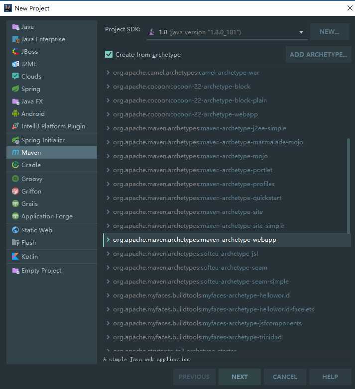

## 2.IDEA关联Tomcat

打开项目，点击右上角Edit Configurations...

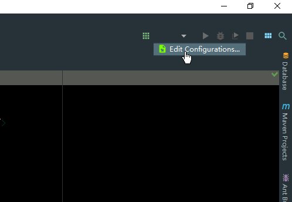

点开Defaults

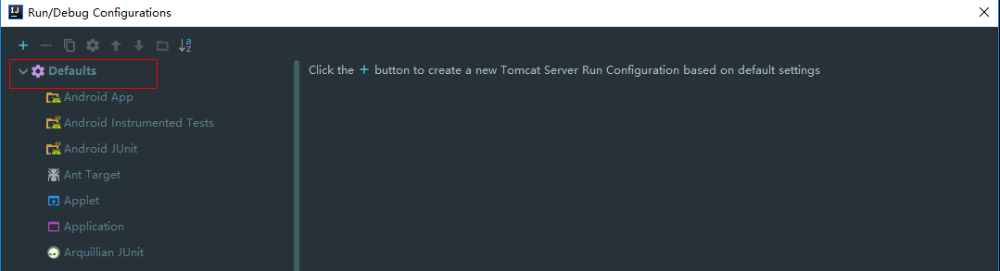

配置Tomcat路径

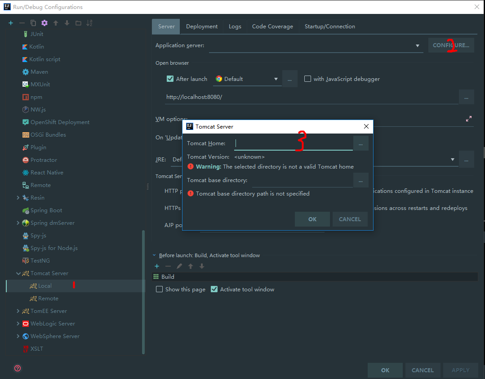

点击 OK，继续点击 APPLY。 

## 3.项目关联Tomcat

参考前面的步骤打开该页面

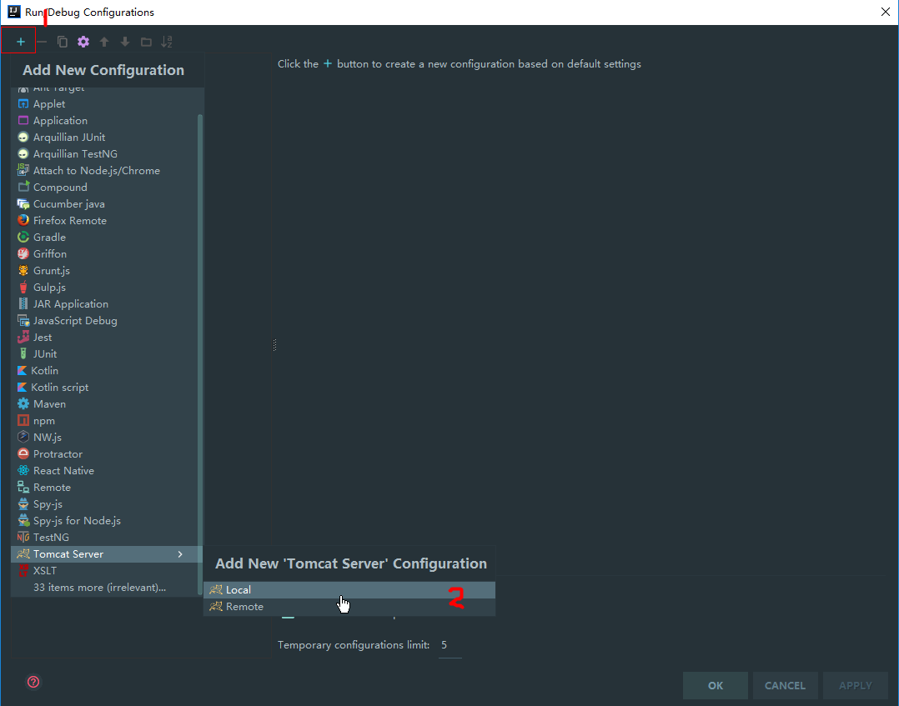


点击之后，弹出下图，一般来说啥都不需要干。

这里有必要说一下，下面这张图圈出来的路径是IDEA默认在浏览器打开的网址。


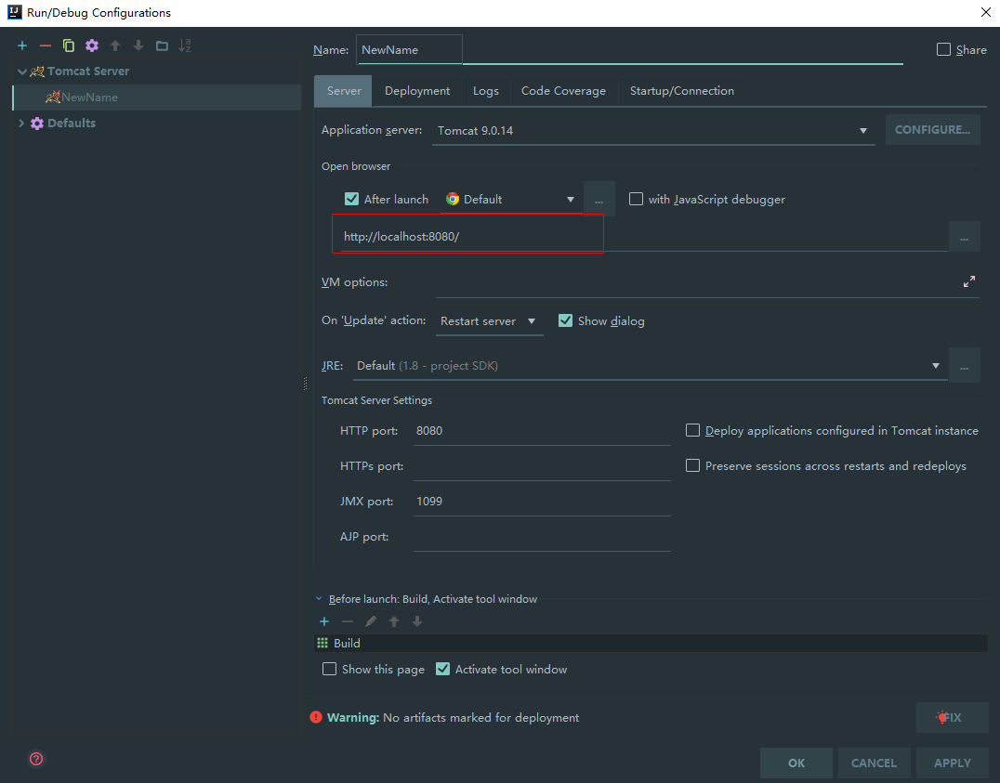

点击Deployment，点击右边的+号，这一步是把该项目构建所得的war包与Tomcat进行关联，不进行这一步，那只能404了。

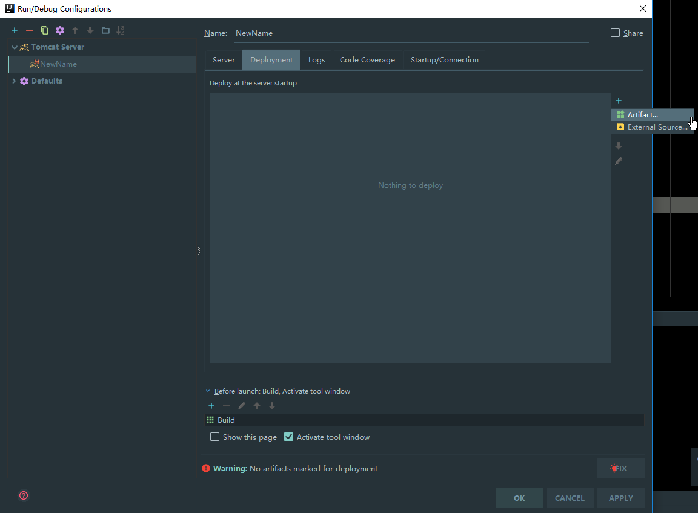


点击OK即可。需要说明的是，因为是Maven web项目，所以默认已经存在弹出的demo:war，如果没有，一定要手动生成！


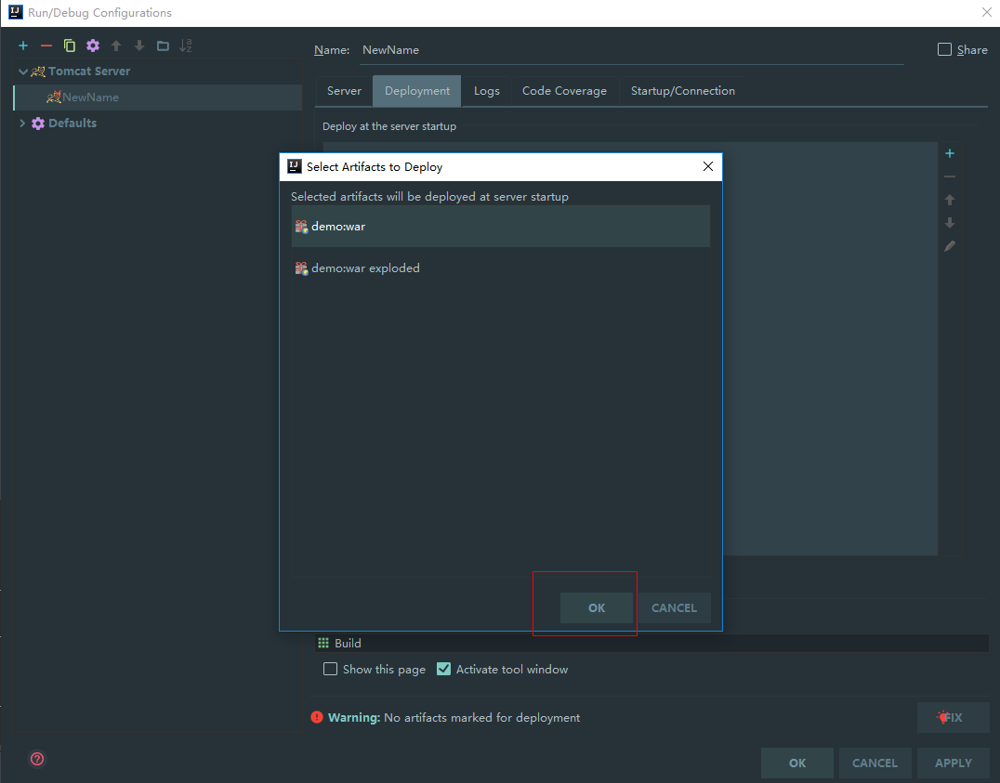

然后，Ok。

看到下图圈出的路径的吗？这就是配置项目路径的地方，默认/，也就是根目录。你也可以配置为/demo。


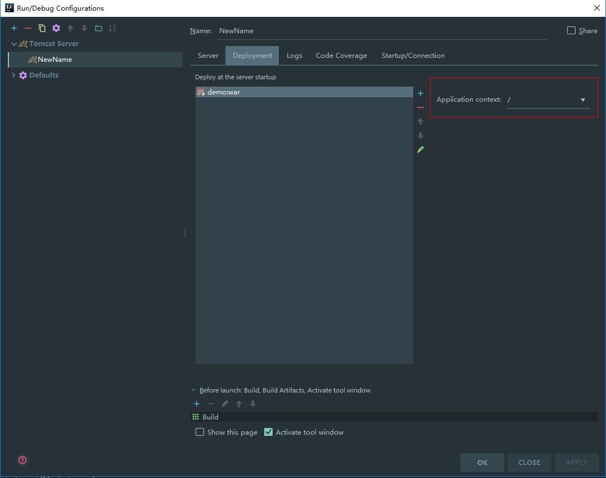

回到主页面，点击运行即可。

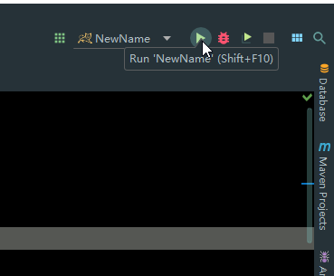


如果遇到404，检查上面我说的两个路径。

## 4.如何手动生成Artifact？

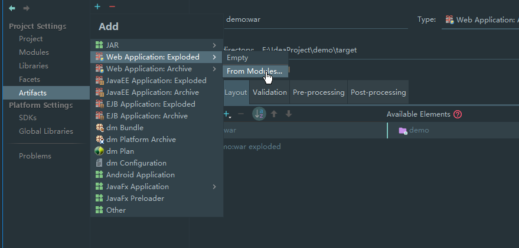

# 第二种：插件式

Maven项目引入依赖Servlet、Jsp等依赖：

```xml
       <!--Servlet web相关依赖 -->
        <dependency>
            <groupId>javax.servlet</groupId>
            <artifactId>javax.servlet-api</artifactId>
            <version>3.1.0</version>
            <scope>provided</scope>
        </dependency>
        <dependency>
            <groupId>javax.servlet.jsp</groupId>
            <artifactId>jsp-api</artifactId>
            <version>2.2</version>
            <scope>provided</scope>
        </dependency>
        <!--可选的-->
        <dependency>
            <groupId>taglibs</groupId>
            <artifactId>standard</artifactId>
            <version>1.1.2</version>
        </dependency>
        <dependency>
            <groupId>jstl</groupId>
            <artifactId>jstl</artifactId>
            <version>1.2</version>
        </dependency>
```

引入Tomcat插件：

```xml
    <build>
        <plugins>
            <plugin>
                <groupId>org.apache.tomcat.maven</groupId>
                <artifactId>tomcat7-maven-plugin</artifactId>
                <version>2.2</version>
                <configuration>
                    <hostName>localhost</hostName>
                    <uriEncoding>UTF-8</uriEncoding>
                    <path>/</path>
                    <port>8080</port>
                </configuration>
            </plugin>
        </plugins>
    </build>
```

运行当前项目，执行命令：`mvn tomcat7:run`

这种方式，打包依旧是war包，只是简化了Tomcat环境的搭建，如果想实现类似 Spring Boot 的  main 方法启动内嵌 Tomcat，使 Tomcat 作为 Web 项目的一部分，需要第三种方式。

# 第三种：内嵌式

Tomcat 官方提供了嵌入包，点击 Download，下载：

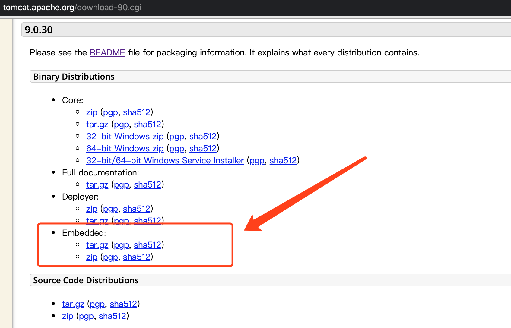


解压后导入即可，不过我喜欢用 maven 管理包依赖，所以可以全部替换成如下即可：

```xml
<dependency>
    <groupId>org.apache.tomcat.embed</groupId>
    <artifactId>tomcat-embed-core</artifactId>
    <version>9.0.0.M6</version>
</dependency>
<dependency>
    <groupId>org.apache.tomcat.embed</groupId>
    <artifactId>tomcat-embed-jasper</artifactId>
    <version>9.0.0.M6</version>
</dependency>
<dependency>
    <groupId>org.apache.tomcat.embed</groupId>
    <artifactId>tomcat-embed-el</artifactId>
    <version>9.0.0.M6</version>
</dependency>
<dependency>
    <groupId>org.apache.tomcat.embed</groupId>
    <artifactId>tomcat-embed-websocket</artifactId>
    <version>9.0.0.M6</version>
</dependency>
<dependency>
    <groupId>org.apache.tomcat</groupId>
    <artifactId>tomcat-dbcp</artifactId>
    <version>9.0.0.M6</version>
</dependency>
<dependency>
    <groupId>org.apache.tomcat.embed</groupId>
    <artifactId>tomcat-embed-logging-juli</artifactId>
    <version>9.0.0.M6</version>
</dependency>
<dependency>
    <groupId>org.apache.tomcat</groupId>
    <artifactId>annotations-api</artifactId>
    <version>6.0.53</version>
</dependency>
<dependency>
<groupId>org.eclipse.jdt.core.compiler</groupId>
    <artifactId>ecj</artifactId>
    <version>4.6.1</version>
</dependency>
<dependency>
    <groupId>org.apache.logging.log4j</groupId>
    <artifactId>log4j-core</artifactId>
    <version>2.12.1</version>
</dependency>
```

>  笔者后来发现版本也是个坑，读者注意。

新建一个 BootStrap 类并提供一个 Main 方法入口：

```java
public class BootStrap {
  
    public static void main(String[] args) throws LifecycleException, ServletException {
        Tomcat tomcat = new Tomcat();
        // 设置端口
        tomcat.setPort(8080);

        // 设置webapp目录，在IDEA运行没问题，打包为jar这一步会错
        tomcat.addWebapp("/", BootStrap.class.getResource("/").getPath());

        // 设置Tomcat工作目录
        tomcat.setBaseDir(".");

        // 启动Tomcat
        tomcat.start();
        tomcat.getServer().await();
    }

}
```

启动这一步应该是没有问题的，但是打包为 jar 包还需要两步，一是打包为 jar 时添加其余依赖，二是指定 jar 包启动时的入口类，可以使用一个 maven 插件解决这个问题：

```xml
<plugin>
    <groupId>org.apache.maven.plugins</groupId>
    <artifactId>maven-assembly-plugin</artifactId>
    <version>2.4.1</version>
    <configuration>
        <archive>
            <manifest>
                <mainClass>com.github.yueshutong.BootStrap</mainClass>
            </manifest>
        </archive>
        <descriptorRefs>
            <descriptorRef>jar-with-dependencies</descriptorRef>
        </descriptorRefs>
    </configuration>
    <!--下面是为了使用 mvn package命令，如果不加则使用mvn assembly-->
    <executions>
        <execution>
            <id>make-assemble</id>
            <phase>package</phase>
            <goals>
                <goal>single</goal>
            </goals>
        </execution>
    </executions>
</plugin>
```

如果webapp目录和resource目录分开，并且没有一同打包，可以手动指定：

```xaml
<resources>
    <resource>
        <directory>src/main/resources</directory>
        <includes>
            <!--包含文件夹以及子文件夹下所有资源-->
            <include>**/*.*</include>
        </includes>
    </resource>
    <resource>
        <directory>src/main/webapp</directory>
        <includes>
            <!--包含文件夹以及子文件夹下所有资源-->
            <include>**/*.*</include>
        </includes>
    </resource>
</resources>
```

最后当你启动 jar 包，你会发现该应用启动失败，会提示你Webapp目录设置失败，因为你的webapp目录下的 jsp、html 等资源都被打包进了 jar 包内。

对此，我能想到的办法就是设定程序去解压 jar 包，感兴趣的小伙伴可以尝试下。

### 参考

https://geek-docs.com/servlet/servlet-tutorial/embeddedtomcat.html

