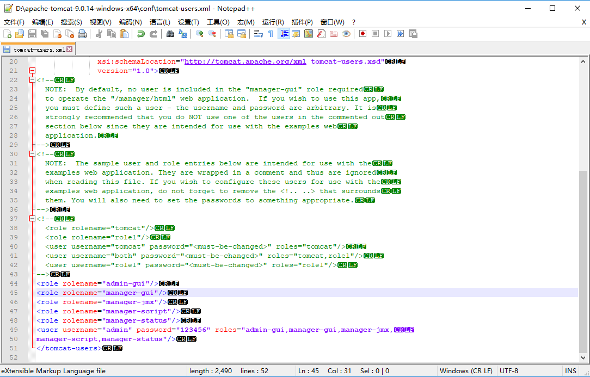

# 如何进入Tomcat的manager页面

一张图解决！




找到conf目录下的tomcat-users.xml文件，打开。

```
<role rolename="admin-gui"/>
<role rolename="manager-gui"/>
<role rolename="manager-jmx"/>
<role rolename="manager-script"/>
<role rolename="manager-status"/>
<user username="admin" password="123456" roles="admin-gui,manager-gui,manager-jmx,
manager-script,manager-status"/>
```

复制上述配置到相应位置即可。

再次访问 [http://localhost:8080/manager/html](http://localhost:8080/manager/html) 输入admin 和 123456 即可进入。

