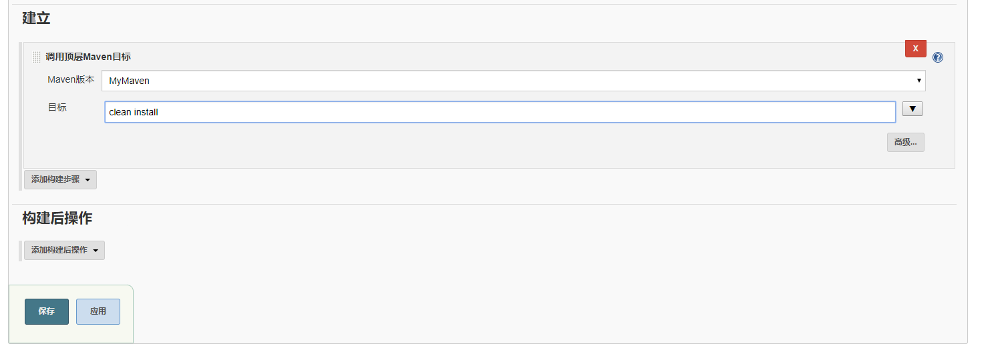

## Jenkins工作流程

程序员提交代码到Git/SVN仓库，触发**钩子程序**向 JenKins 进行通知，Jenkins 调用Git/SVN插件获取源码，调用Maven打包为war包，调用Deploy to web container插件部署到Tomcat服务器。

## 独立还是Servlet

Jenkins可以使用自己的内置Web服务器（Jetty）在自己的进程中独立运行。它也可以作为现有框架中的一个servlet运行，如Tomcat或Glassfish应用程序服务器。本节专门针对独立的安装和执行。

## Windows安装

下载 [jenkins.war](http://mirrors.jenkins.io/windows/latest) 包

其它方式百度。

在下载目录中打开终端并运行 java -jar jenkins.war --httpPort=8080

浏览http://localhost:8080并按照说明完成安装。

## 登录

默认用户名admin，密码位于.jenkins/secrets下的 initialAdminPassword文件

## 全局安全配置

1. 允许用户注册
2. 任何用户都可以做任何事

## 全局工具配置

1. Maven的设置配置成本地路径（强烈建议把setting文件拷贝到workspace文件夹下，输入../settings.xml）
2. 添加JDK，取消自动安装

3. 配置MAVEN_HOME

## 插件安装

Ctrl + F 搜索 Deploy to container ，勾选安装。

安装成功

安装GitLab插件

# 上传项目代码到GitLab

参考链接

[https://jingyan.baidu.com/article/9c69d48fe68cce13c9024e9c.html](https://jingyan.baidu.com/article/9c69d48fe68cce13c9024e9c.html)

## 创建任务

## Git源配置

注意该URL目录下有pom.xml文件，也就是位于根目录。

点击Add之后，注意下方填入GitLab用户名和密码

一定别忘了选择自己生成的证书！

## 构建触发器

远程触发器的作用，当你访问这个URL网址时，会自动构建项目。

例如;

http://127.0.0.1:8080/job/Demo/build?token=123456789

## 构建

这里你使用 Execute shell 形式 即 shell 脚本语言进行构建操作。

不过我们是Java项目，使用的是Mavne构建，所以选择最后的调用顶层 Maven 目标。

## 立即构建

点开工作区，出现target文件夹

Jenkins 使用天气图标代表执行结果

## 构建后操作

### 发布到Tomcat

必须要有Deploy to container 插件

点击之后，设置构建后的war包相对路径，context path 是访问的域名xxx.cn/demo

然后是 Tomcat manager 的用户名和密码（配置参考：[https://www.cnblogs.com/yueshutong/p/10184022.html](https://www.cnblogs.com/yueshutong/p/10184022.html)）

最后是Tomcat的路径。

保存，回来再次构建。回到Tomcat所在的服务器，访问 [http://127.0.0.1:8888/demo/](http://localhost:8888/demo/) 即可。

## 触发钩子程序

我们试着修改index.jsp，然后提交到Gitlab。

还记得前面配置的触发器吗？

访问配置的触发网址 http://127.0.0.1:8080/job/Demo/build?token=123456789

当我访问了触发器URL后，Jenkins 工作区就开始构建。

然后，再次访问 http://127.0.0.1:8888/demo/ 网址，发现已经成功更新。

## 参考文章

[https://blog.csdn.net/m1126m/article/details/78556359](https://blog.csdn.net/m1126m/article/details/78556359)
