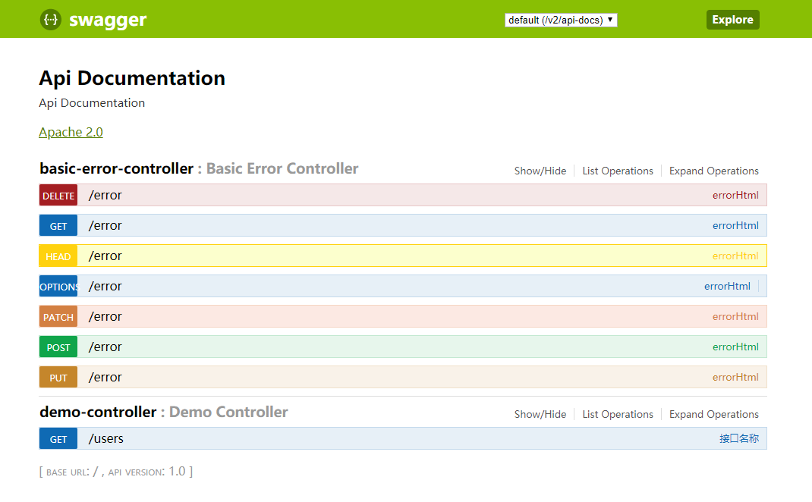

Swagger，中文“拽”的意思，它是一个功能强大的在线API在线文档，目前它的版本为2.x，所以称为Swagger2。Swagger2提供了在线文档的查阅和测试功能。利用Swagger2很容易构建RESTful风格的API，在SpringBoot中集成Swagger2，步骤如下。

## 1.引入依赖

```xml
<!--Swagger2-->
<dependency>
    <groupId>io.springfox</groupId>
    <artifactId>springfox-swagger2</artifactId>
    <version>2.7.0</version>
</dependency>
<dependency>
    <groupId>io.springfox</groupId>
    <artifactId>springfox-swagger-ui</artifactId>
    <version>2.7.0</version>
</dependency>
```

## 2.配置Swagger2

```java
@Configuration
@EnableSwagger2
public class Swagger2Config {

    @Bean
    public Docket createRestApi(){
        return new Docket(DocumentationType.SWAGGER_2)
                .apiInfo(apiInfo())
                .select()
                .apis(RequestHandlerSelectors.basePackage("cn.yuehsutong.swagger2.controller"))
                .paths(PathSelectors.any())
                .build();
    }

    private ApiInfo apiInfo(){
        return new ApiInfoBuilder()
                .title("SpringBoot利用Swagger构建API文档")
                .description("描述内容")
                .termsOfServiceUrl("服务url")
                .version("版本")
                .build();
    }

}
```

## 3.写Swagger注解

```java
@RestController
public class DemoController {

    @RequestMapping(value = "/users",method = RequestMethod.GET)
    @ApiOperation(value = "接口名称", notes = "接口的详细说明")
    public Object users(){
        Map<String,String> map = new HashMap<>();
        map.put("one","zhansan");
        return map;
    }
}
```

## 4.浏览Swagger-UI在线文档

默认访问路径：[http://localhost:8080/swagger-ui.html](http://localhost:8080/swagger-ui.html)



## 5.常用Swagger注解

- @Api()用于类，表示标识这个类是swagger的资源 
- @ApiOperation()用于方法，表示一个http请求的操作 
- @ApiParam()用于方法，参数，字段说明；表示对参数的添加元数据（说明或是否必填等） 
- @ApiModel()用于类，表示对类进行说明，用于参数用实体类接收 
- @ApiModelProperty()用于方法，字段，表示对model属性的说明或者数据操作更改 
- @ApiIgnore()用于类，方法，方法参数，表示这个方法或者类被忽略 
- @ApiImplicitParam() 用于方法，表示单独的请求参数 
- @ApiImplicitParams() 用于方法，包含多个 @ApiImplicitParam

### 学习资源

[Swagger-Core Annotations](https://github.com/swagger-api/swagger-core/wiki/Annotations-1.5.X)