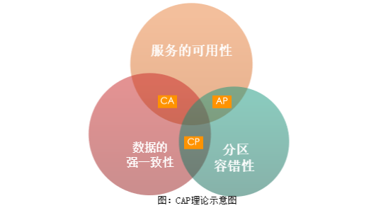
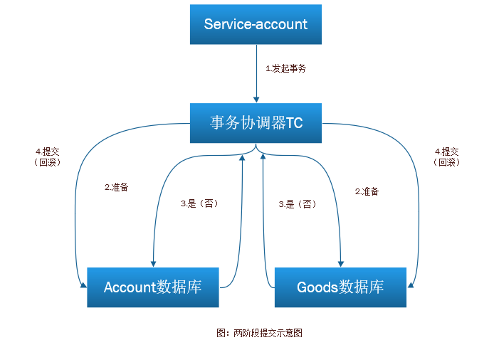
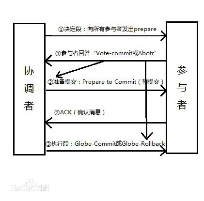

微服务系统所设计的系统是分布式系统。分布式系统有一个著名的CAP理论，即同时满足“一致性”“可用性”和“分区容错”是一件不可能的事。CAP理论是由Eric Brewer在2000年PODC会议上提出的，该理论在两年后被证明成立。CAP理论告诉架构师不要妄想设计出同时满足三者的系统，应该有所取舍，设计出适合业务的系统。CAP理论示意图




- Consistency：指数据的强一致性。每次的读操作，都是读取的最新数据。即如果写入某个数据成功，之后读取，读到的都是新写入的数据；如果写入失败，之后读取的都不是写入失败的数据。
- Availability：指服务的可用性。即每个请求都能在合理的时间内获得符合预期的响应。
- Partition-tolerance：指分区容错性。当节点之间的网络出现问题之后，系统依然能正常提供服务。

在分布式系统中，P是基本要求，而单体服务是CA系统。微服务系统通常是一个AP系统，即同时满足了可用性和分区容错。这就有了一个难题：在分布式系统中如何保证数据的一致性？这就是大家经常讨论的分布式事务。

在微服务系统中，每个服务都是独立的进程单元，每个服务都有自己的数据库。通常情况下，只有关系型数据库在特定的数据引擎下才支持事务，而大多数非关系型数据库是不支持事务的，例如 MongDB 是不支持事务的，而 Redis 是支持事务的。在微服务架构中，分布式事务一直都是一个难以解决的问题，业界给出的解决办法通常是两阶段提交。

网上购物在日常生活中是一个非常普通的场景，假设我在淘宝上购买了一部手机，需要从我的账户中扣除1000元钱，同时手机的库存数量需要减1。当然需要在卖方的账户中加1000元钱，为了使案例简化，暂时不用考虑。

如果这是一个单体应用，并且使用支持事务的MySQL数据库（InnoDB数据库引擎才支持事务），我们可能这样写代码：

```java
@Transactional
public void updata() throws RuntimeException{
    updateAccountTable(); //更新账户表
    updateGoodsTable(); //更新商品表
}
```

## 两阶段提交

如果是微服务架构，账户是一个服务，而商品是一个服务，这时不能用数据库自带的事务，因为这两个数据表不在一个数据库中。因此常常用到两阶段提交，两阶段提交的过程如图所示




第一阶段，service-account 发起一个分布式事务，交给事务协调器TC处理，事务协调器TC向所有参与的事务的节点发送处理事务操作的准备操作。所有的参与节点执行准备操作，将 Undo 和 Redo 信息写进日志，并向事务管理器返回准备操作是否成功。

第二阶段，事务管理器收集所有节点的准备操作是否成功，如果都成功，则通知所有的节点执行提交操作；如果有一个失败，则执行回滚操作。

两阶段提交，将事务分成两部分能够大大提高分布式事务成功的概率。如果在第一阶段都成功了，而执行第二阶段的某一节点失败，仍然导致数据的不准确，这时一般需要人工去处理，这就是当初在第一步记录日志的原因。另外，如果分布式事务涉及的节点很多，某一个节点的网络出现异常会导致整个事务处于阻塞状态，大大降低数据库的性能。所以一般情况下，尽量少用分布式事务。

## 三阶段提交

三阶段提交在两阶段提交的步骤中间加了一层预提交事务阶段，具体来说，包括以下三个阶段
    1.CanCommit阶段
    这个阶段和光彦说的两阶段提交的准备阶段类似，不同的地方就是并没有进行诸如将 Undo 和 Redo 信息写进事务日志的其它操作。
    2.PreCommit阶段
    这个阶段是一个缓冲，目的是推迟commit决定，只有保证所有参与者都知道了commit决定后，才真正发出commit决定。所有的参与者都会在这个阶段记录Undo和Redo信息，并且当协调者发生故障后，所有的参与者还能互相通信确定事务是提交还是终止。
    3.DoCommit阶段
    这个阶段就是事务的真正提交。如果所有的参与者都向协调者发送了ACK响应，那么协调者就会完成事务，否则中断事务。



三阶段提交的方案引入对参与者的超时机制，相比两阶段提交只有协调者拥有超时机制，三阶段提交解决了协调者突然挂掉引起的参与者一直阻塞的问题。

本质上来说，三阶段提交避免了状态停滞！在两阶段提交中有可能因为各种原因，产生状态停滞。最明显的就像元太所说，协调者突然宕机。但在三阶段提交中会让状态继续下去，就算协调者宕机，参与者们也会互相通信确定事务是提交还是终止，从而使状态继续下去，哪怕，这是错的！

