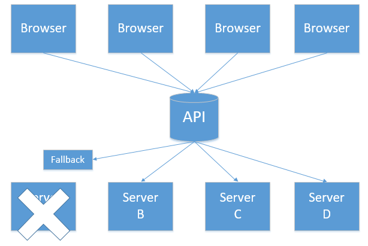

在微服务架构中，根据业务来拆分成一个个的服务，服务与服务之间可以相互调用（RPC），在Spring Cloud可以用RestTemplate+Ribbon和Feign来调用。为了保证其高可用，单个服务通常会集群部署。由于网络原因或者自身的原因，服务并不能保证100%可用，如果单个服务出现问题，调用这个服务就会出现线程阻塞，此时若有大量的请求涌入，Servlet容器的线程资源会被消耗完毕，导致服务瘫痪。服务与服务之间的依赖性，故障会传播，会对整个微服务系统造成灾难性的严重后果，这就是服务故障的“雪崩”效应。

## 1.简介

Netflix开源了Hystrix组件，实现了熔断器模式，Spring Cloud 对这一组件进行了整合。 在微服务架构中，一个请求需要调用多个服务是非常常见的，如下图： 


较底层的服务如果出现故障，会导致连锁故障。当对特定的服务的调用的不可用达到一个阀值（Hystric 是5秒20次） 断路器将会被打开。 




断路打开后，可用避免连锁故障，fallback方法可以直接返回一个固定值。 

## 2.在Ribbon上使用熔断器

1.导入hystrix依赖

```xml
<dependency>
   <groupId>org.springframework.cloud</groupId>
   <artifactId>spring-cloud-starter-hystrix</artifactId>
</dependency>
```

2.注解@EnableHystrix 开启熔断器

```java
@SpringBootApplication
@EnableDiscoveryClient
@EnableHystrix //开启断路器功能
public class ServiceRibbonApplication {

    public static void main(String[] args) {
       SpringApplication.run(ServiceRibbonApplication.class, args);
    }

    @Bean
    @LoadBalanced
    RestTemplate restTemplate() {
        return new RestTemplate();
    }

}
```

3.使用断路器

```java
@Service
public class HelloService {
    @Autowired
    RestTemplate restTemplate;

    //使用断路器
    @HystrixCommand(fallbackMethod = "ErrorMethod")
    public String hi(String name){
        return restTemplate.getForObject("http://SERVICE-HI/hi?name="+name,String.class);
    }

    //当服务不可用时会调用此方法并返回
    public String ErrorMethod(String name){
        return name + ",This is a error.";
    }

}
```

## 3.在Feign上使用熔断器

1.Feign是自带断路器的，不过需要在配置文件打开，加以下代码.

```properties
feign.hystrix.enabled=true	#这里IDEA不提示的
```
或者
```yaml
feign:
  hystrix:
    enabled: true	#这里IDEA不提示的
```

2.Hystrix支持回退的概念，当电路断开或出现错误时执行的默认代码路径。要为给定的 @FeignClient 启用回退，请将 fallback 属性设置为实现回退的类名.

```java
@FeignClient(value = "service-hi",fallback = SchedualServiceHiImpl.class)
public interface SchedualServiceHi {
    
    @RequestMapping(value = "/hi",method = RequestMethod.GET)
    String sayHiFromClientOne(@RequestParam(value = "name") String name);
    
}
```
然后实现该接口方法即可.
```java
@Service
public class SchedualServiceHiImpl implements SchedualServiceHi {

    @Override
    public String sayHiFromClientOne(String name) {
        return name + ",This is a error.";
    }

}
```

3.如果需要访问导致回退触发的原因，可以使用 @FeignClient 内的 fallbackFactory 属性，注意此时不要再使用 fallback 属性。

```java
@FeignClient(value = "service-hi",fallbackFactory = HystrixClientFallbackFactory.class)
public interface SchedualServiceHi {

    @RequestMapping(value = "/hi",method = RequestMethod.GET)
    String sayHiFromClientOne(@RequestParam(value = "name") String name);

}
```

然后实现FallbackFactory接口即可.

```java
@Component
public class HystrixClientFallbackFactory implements FallbackFactory<SchedualServiceHi> {
    @Override
    public SchedualServiceHi create(Throwable throwable) {
        return new SchedualServiceHi() {
            @Override
            public String sayHiFromClientOne(String name) {
                return name +"！"+ throwable.getMessage();
            }
        };
    }
}
```

## 4.使用 Hystrix Dashboard 监控熔断器的状态

Hystrix Dashboard 是监控熔断器状况的一个组件，提供了数据监控和友好的图形化展示界面。

### 1.在Ribbon中使用 Hystrix Dashboard

在加入spring-cloud-starter-hystrix依赖的基础上，加入下面2个必需的依赖.

```xml
<!--断路器仪表盘-->
<dependency>
    <groupId>org.springframework.boot</groupId>
    <artifactId>spring-boot-starter-actuator</artifactId>
</dependency>
<dependency>
    <groupId>org.springframework.cloud</groupId>
    <artifactId>spring-cloud-starter-hystrix-dashboard</artifactId>
</dependency>
```

在主程序启动类已经加上 @EnableHystrix 的基础上加入@EnableHystrixDashboard 注解。完整代码如下.

```java
@@SpringBootApplication
@EnableDiscoveryClient
@EnableHystrix
@EnableHystrixDashboard
public class ServiceRibbonApplication {
    
```
启动程序，访问 http://localhost:8765/hystrix.stream 浏览器上会显示熔断器的数据指标，访问 http://localhost:8765/hystrix 浏览器会显示 Hystrix Dashboard 的界面。如下图。在界面上依次填写图示数据，点击"Monitor Stream"，进入页面。


[Hystrix Dashboard 官方文档](https://github.com/Netflix/Hystrix/wiki)

### 2.在Feign中使用 Hystrix Dashboard

加入下面3个起步依赖。虽然Feign自带hystrix，但自带的不是起步依赖，所以还是要加.

```xml
<dependency>
   <groupId>org.springframework.cloud</groupId>
   <artifactId>spring-cloud-starter-hystrix</artifactId>
</dependency>
<dependency>
    <groupId>org.springframework.boot</groupId>
    <artifactId>spring-boot-starter-actuator</artifactId>
</dependency>
<dependency>
    <groupId>org.springframework.cloud</groupId>
    <artifactId>spring-cloud-starter-hystrix-dashboard</artifactId>
</dependency>
```

在启动程序上加 @EnableHystrixDashboard 注解开启Hystrix Dashboard，完整代码.

```java
@SpringBootApplication
@EnableDiscoveryClient
@EnableFeignClients
@EnableHystrixDashboard
@EnableHystrix
public class ServiceFeignApplication {

    public static void main(String[] args) {
        SpringApplication.run(ServiceFeignApplication.class, args);
    }
}
```

只需要上面两步即可开启 Hystrix Dashboard 功能。

> *参考方志朋《深入理解Spring Cloud与微服务构建》*