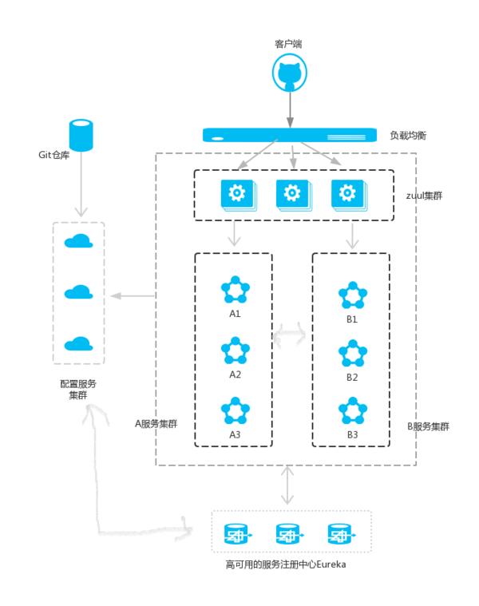

一个简单的微服务系统如下图:




## 1.为什么需要Zuul

Zuul很容易实现 负载均衡、智能路由 和 熔断器，可以做身份认证和权限认证，可以实现监控，在高流量状态下，对服务进行降级。

## 2.路由网关

继续前面文章的搭建，新建一个Spring Boot工程模块。取名为service-zuul.

1.导入依赖

```xml
<?xml version="1.0" encoding="UTF-8"?>
<project xmlns="http://maven.apache.org/POM/4.0.0" xmlns:xsi="http://www.w3.org/2001/XMLSchema-instance"
         xsi:schemaLocation="http://maven.apache.org/POM/4.0.0 http://maven.apache.org/xsd/maven-4.0.0.xsd">
    <modelVersion>4.0.0</modelVersion>

    <parent>
        <groupId>org.springframework.boot</groupId>
        <artifactId>spring-boot-starter-parent</artifactId>
        <version>1.5.3.RELEASE</version>
        <relativePath/> <!-- lookup parent from repository -->
    </parent>

    <groupId>com.example</groupId>
    <artifactId>service-zuul</artifactId>
    <version>0.0.1-SNAPSHOT</version>

    <name>service-zuul</name>
    <description>Demo project for Spring Boot</description>

    <properties>
        <java.version>1.8</java.version>
        <spring-cloud.version>Dalston.SR1</spring-cloud.version>
    </properties>

    <dependencies>
        <dependency>
            <groupId>org.springframework.cloud</groupId>
            <artifactId>spring-cloud-starter-eureka</artifactId>
        </dependency>
        <dependency>
            <groupId>org.springframework.cloud</groupId>
            <artifactId>spring-cloud-starter-zuul</artifactId>
        </dependency>
        <dependency>
            <groupId>org.springframework.boot</groupId>
            <artifactId>spring-boot-starter-web</artifactId>
        </dependency>

        <dependency>
            <groupId>org.springframework.boot</groupId>
            <artifactId>spring-boot-starter-test</artifactId>
            <scope>test</scope>
        </dependency>
    </dependencies>

    <dependencyManagement>
        <dependencies>
            <dependency>
                <groupId>org.springframework.cloud</groupId>
                <artifactId>spring-cloud-dependencies</artifactId>
                <version>${spring-cloud.version}</version>
                <type>pom</type>
                <scope>import</scope>
            </dependency>
        </dependencies>
    </dependencyManagement>

    <build>
        <plugins>
            <plugin>
                <groupId>org.springframework.boot</groupId>
                <artifactId>spring-boot-maven-plugin</artifactId>
            </plugin>
        </plugins>
    </build>

</project>

```

2.注解 @EnableZuulProxy 开启路由网关

```java
@EnableZuulProxy //开启路由网关
@EnableEurekaClient
@SpringBootApplication
public class ServiceZuulApplication {

    public static void main(String[] args) {
        SpringApplication.run(ServiceZuulApplication.class, args);
    }
}
```

3.配置 application.yml

```yaml
server:
  port: 8769
spring:
  application:
    name: service-zuul
  client:
    service-url:
      defaultZone: http://localhost:8761/eureka/
zuul:
  routes:
    api-a:
      path: /api-a/**
      serviceId: service-feign
    api-b:
      path: /api-b/**
      serviceId: service-ribbon
```

首先指定服务注册中心的地址为 http://localhost:8761/eureka/，服务的端口为8769，服务名为 service-zuul，以 /api-a/ 开头的请求都转发给 service-feign 服务，以 /api-b/ 开头的请求都转发给 service-ribbon 服务。

依次运行eureka-server、service-hi、service-ribbon、service-feign、service-zuul工程，其中service-hi以8762端口和8763端口启动两个实例。

打开浏览器访问 http://localhost:8769/api-a/hi?name=mark 两次，浏览器显示.

> hi mark,i am from port:8763 
>
> hi mark,i am from port:8762

这说明zuul起到了路由的作用。如果某服务存在多个实例，Zuul会结合 Ribbon 做负载均衡，将请求均分的部分路由到不同的服务实例。

## 3.配置过滤器

Zuul不仅只是路由，并且还能过滤，做一些安全验证。继续改造工程，增加一个Filter Bean.

```java
@Component
public class MyFilter extends ZuulFilter {
    Logger log = LoggerFactory.getLogger(getClass());

    /**
     * 过滤器的类型
     * pre：路由之前
     * routing：路由之时
     * post： 路由之后
     * error：发送错误调用
     */
    @Override
    public String filterType() {
        return "pre";
    }

    /**
     * 过滤的顺序
     */
    @Override
    public int filterOrder() {
        return 0;
    }

    /**
     * 写逻辑判断，是否要过滤
     * true:永远过滤
     */
    @Override
    public boolean shouldFilter() {
        return true;
    }

    /**
     * 过滤器的具体逻辑。可用很复杂，包括查sql，nosql去判断该请求到底有没有权限访问
     */
    @Override
    public Object run() {
        RequestContext ctx = RequestContext.getCurrentContext();
        HttpServletRequest request = ctx.getRequest();
        log.info(String.format("%s >>> %s", request.getMethod(), request.getRequestURL().toString()));
        Object accessToken = request.getParameter("token");
        if (accessToken == null) {
            log.warn("token is empty");
            ctx.setSendZuulResponse(false);
            ctx.setResponseStatusCode(401);
            try {
                ctx.getResponse().getWriter().write("token is empty");
            } catch (Exception e) {
                e.printStackTrace();
            }
            return null;
        }
        log.info("ok");
        return null;
    }
}
```

​	访问http://localhost:8769/api-b/hi?name=mark

> ​	token is empty

​	访问http://localhost:8769/api-b/hi?name=mark&token=123 两次

> hi mark,i am from port:8763 
>
> hi mark,i am from port:8762

## 4.配置API前戳版本号

在上面 Zuul 工程 application.yml 的基础上增加一条配置 `zuul.prefix: /v1`，然后重启 Zuul 工程，访问 http://localhost:8769/v1/api-b/hi?name=mark&token=123 即可。

## 5.配置熔断器

在 Zuul 实现熔断功能很简单，类似实现过滤器的步骤，只需要实现 ZuulFallbackProvider 接口即可。完整代码.

```java
@Component
public class MyFallbackProvider implements ZuulFallbackProvider {
    /**
     * 指定熔断器用于哪些服务
     */
    @Override
    public String getRoute() {
        return "service-feign";
    }

    /**
     * 熔断时的逻执行代码
     * @return
     */
    @Override
    public ClientHttpResponse fallbackResponse() {
        return new ClientHttpResponse() {
            @Override
            public HttpStatus getStatusCode() throws IOException {
                return HttpStatus.OK;
            }

            @Override
            public int getRawStatusCode() throws IOException {
                return 200;
            }

            @Override
            public String getStatusText() throws IOException {
                return "OK";
            }

            @Override
            public void close() {

            }

            @Override
            public InputStream getBody() throws IOException {
                return new ByteArrayInputStream("oooops!error,I'm the fallback.".getBytes());
            }

            @Override
            public HttpHeaders getHeaders() {
                HttpHeaders httpHeaders = new HttpHeaders();
                httpHeaders.setContentType(MediaType.APPLICATION_JSON);
                return httpHeaders;
            }
        };
    }
}
```

重新启动 service-zuul 工程，并关闭 service-hi 的所有实例，在浏览器上访问 http://localhost:8769/v1/api-a/hi?name=mark&token=123 显示:

> oooops!error,I'm the fallback.

如果需要所有的路由服务都加熔断功能，只需要在 getRoute 方法上返回 “*” 的匹配符即可.

```java
    @Override
    public String getRoute() {
        return "*";
    }
```

## 6.Zuul的常见使用方式

Zuul 采用的是异步阻塞模型，性能比 Nginx 差，由于 Zuul 和其他 Netflix 组件相互配合、无缝集成，Zuul 很容易就能实现负载均衡、智能路由和熔断器等功能。在大多数情况下，Zuul 都是以集群的形式存在。

一种常见的使用方式是对不同的渠道使用不同的Zuul来进行路由，例如移动端共用一个 Zuul 网关实例，Web端用另一个 Zuul 网关实例，其他的客户端用另一个Zuul实例进行路由。

另外一种就是常见的集群是通过 Nginx 和 Zuul 相互结合来做负载均衡。

> *参考方志朋《深入理解Spring Cloud与微服务构建》*

