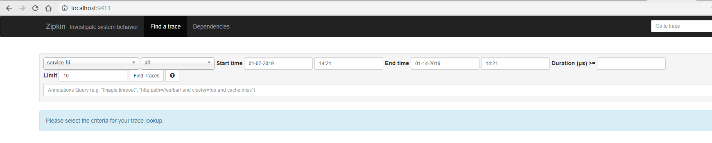
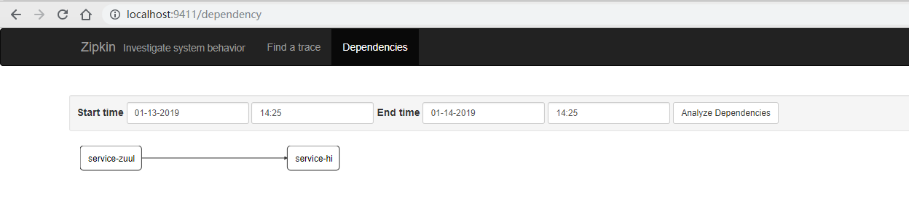

## 1.简介

Spring Cloud Sleuth 主要功能就是在分布式系统中提供追踪解决方案，并且兼容支持了 zipkin，你只需要在pom文件中引入相应的依赖即可。本文主要讲述服务追踪组件zipkin，Spring Cloud Sleuth集成了zipkin组件。

## 2.术语

- Span：基本工作单元，例如，在一个新建的span中发送一个RPC等同于发送一个回应请求给RPC，span通过一个64位ID唯一标识，trace以另一个64位ID表示，span还有其他数据信息，比如摘要、时间戳事件、关键值注释(tags)、span的ID、以及进度ID(通常是IP地址) 
  span在不断的启动和停止，同时记录了时间信息，当你创建了一个span，你必须在未来的某个时刻停止它。
- Trace：一系列spans组成的一个树状结构，例如，如果你正在跑一个分布式大数据工程，你可能需要创建一个trace。
- Annotation：用来及时记录一个事件的存在，一些核心annotations用来定义一个请求的开始和结束 .
  - cs - Client Sent -客户端发起一个请求，这个annotion描述了这个span的开始.
  - sr - Server Received -服务端获得请求并准备开始处理它，如果将其sr减去cs时间戳便可得到网络延迟.
  - ss - Server Sent -注解表明请求处理的完成(当请求返回客户端)，如果ss减去sr时间戳便可得到服务端需要的处理请求时间.
  - cr - Client Received -表明span的结束，客户端成功接收到服务端的回复，如果cr减去cs时间戳便可得到整个请求所消耗的时间.


## 3.项目架构

本文案例主要由四个工程组成：

- eureka-server：作为服务注册中心。
- zipkin-server：作为链路追踪服务中心，负责存储链路数据。
- service-hi：对外暴露hi接口，同时作为产生链路数据，负责产生链路数据 。
- service-zuul：路由网关，负责请求转发，同时作为链路追踪客户端，产生链路数据，并上传至 zipkin-server 。

在8761端口开启eureka-server注册服务中心，参考前面的文章即可，这里不再演示创建。

## 4.构建zipkin-server

新建一个spring-boot工程取名为 zipkin-server，其 pom.xml 完整依赖.

```xml
<?xml version="1.0" encoding="UTF-8"?>
<project xmlns="http://maven.apache.org/POM/4.0.0" xmlns:xsi="http://www.w3.org/2001/XMLSchema-instance"
         xsi:schemaLocation="http://maven.apache.org/POM/4.0.0 http://maven.apache.org/xsd/maven-4.0.0.xsd">
    <modelVersion>4.0.0</modelVersion>
    <parent>
        <groupId>org.springframework.boot</groupId>
        <artifactId>spring-boot-starter-parent</artifactId>
        <version>1.5.3.RELEASE</version>
        <relativePath/> <!-- lookup parent from repository -->
    </parent>

    <groupId>com.example</groupId>
    <artifactId>zipkin-server</artifactId>
    <version>0.0.1-SNAPSHOT</version>

    <name>zipkin-server</name>
    <description>Demo project for Spring Boot</description>

    <properties>
        <java.version>1.8</java.version>
        <spring-cloud.version>Dalston.RELEASE</spring-cloud.version>
    </properties>

    <dependencies>
        <dependency>
            <groupId>org.springframework.cloud</groupId>
            <artifactId>spring-cloud-starter-eureka</artifactId>
        </dependency>
        <dependency>
            <groupId>io.zipkin.java</groupId>
            <artifactId>zipkin-server</artifactId>
        </dependency>
        <dependency>
            <groupId>io.zipkin.java</groupId>
            <artifactId>zipkin-autoconfigure-ui</artifactId>
        </dependency>

        <dependency>
            <groupId>org.springframework.boot</groupId>
            <artifactId>spring-boot-starter-test</artifactId>
            <scope>test</scope>
        </dependency>
    </dependencies>

    <dependencyManagement>
        <dependencies>
            <dependency>
                <groupId>org.springframework.cloud</groupId>
                <artifactId>spring-cloud-dependencies</artifactId>
                <version>${spring-cloud.version}</version>
                <type>pom</type>
                <scope>import</scope>
            </dependency>
        </dependencies>
    </dependencyManagement>

    <build>
        <plugins>
            <plugin>
                <groupId>org.springframework.boot</groupId>
                <artifactId>spring-boot-maven-plugin</artifactId>
            </plugin>
        </plugins>
    </build>

</project>
```

在其程序入口类, 加上注解@EnableZipkinServer，开启ZipkinServer的功能.

```java
@EnableZipkinServer
@EnableEurekaClient
@SpringBootApplication
public class ZipkinServerApplication {

    public static void main(String[] args) {
        SpringApplication.run(ZipkinServerApplication.class, args);
    }

}
```

在配置文件application.yml指定服务端口为9411，并向Eureka注册中心注册.

```yaml
eureka:
  client:
    service-url:
      defaultZone: http://localhost:8761/eureka/
server:
  port: 9411
spring:
  application:
    name: zipkin-server
```

## 5.构建service-hi

新建一个SpringBoot工程，取名 service-hi，在其pom引入起步依赖 spring-cloud-starter-zipkin，完整依赖如下.

```xml
<?xml version="1.0" encoding="UTF-8"?>
<project xmlns="http://maven.apache.org/POM/4.0.0" xmlns:xsi="http://www.w3.org/2001/XMLSchema-instance"
         xsi:schemaLocation="http://maven.apache.org/POM/4.0.0 http://maven.apache.org/xsd/maven-4.0.0.xsd">
    <modelVersion>4.0.0</modelVersion>
    <parent>
        <groupId>org.springframework.boot</groupId>
        <artifactId>spring-boot-starter-parent</artifactId>
        <version>1.5.3.RELEASE</version>
        <relativePath/> <!-- lookup parent from repository -->
    </parent>
    <groupId>com.example</groupId>
    <artifactId>service-hi</artifactId>
    <version>0.0.1-SNAPSHOT</version>
    <name>eureka-client</name>
    <description>Demo project for Spring Boot</description>

    <properties>
        <java.version>1.8</java.version>
        <spring-cloud.version>Dalston.SR1</spring-cloud.version>
    </properties>

    <dependencies>
        <dependency>
            <groupId>org.springframework.cloud</groupId>
            <artifactId>spring-cloud-starter-eureka</artifactId>
        </dependency>
        <dependency>
            <groupId>org.springframework.cloud</groupId>
            <artifactId>spring-cloud-starter-zipkin</artifactId>
        </dependency>
        <dependency>
            <groupId>org.springframework.boot</groupId>
            <artifactId>spring-boot-starter-web</artifactId>
        </dependency>

        <dependency>
            <groupId>org.springframework.boot</groupId>
            <artifactId>spring-boot-starter-test</artifactId>
            <scope>test</scope>
        </dependency>
    </dependencies>

    <dependencyManagement>
        <dependencies>
            <dependency>
                <groupId>org.springframework.cloud</groupId>
                <artifactId>spring-cloud-dependencies</artifactId>
                <version>${spring-cloud.version}</version>
                <type>pom</type>
                <scope>import</scope>
            </dependency>
        </dependencies>
    </dependencyManagement>

    <build>
        <plugins>
            <plugin>
                <groupId>org.springframework.boot</groupId>
                <artifactId>spring-boot-maven-plugin</artifactId>
            </plugin>
        </plugins>
    </build>

</project>
```

在其配置文件application.yml通过配置“spring.zipkin.base-url”指定zipkin server的地址.

```yaml
eureka:
  client:
    serviceUrl:
      defaultZone: http://localhost:8761/eureka/
server:
  port: 8763
spring:
  application:
    name: service-hi
  zipkin:
#    base-url: http://localhost:9411/
# 若在同一个注册中心的话可以启用自动发现，省略base-url
    locator:
      discovery:
        enabled: true #自动发现
  sleuth:
    sampler:
      percentage: 1.0
```

到这里已经整合ZipKin客户端完毕，最后对外暴露一个API接口方便测试.

```java
@SpringBootApplication
@EnableEurekaClient
@RestController
public class ServiceHiApplication {

    public static void main(String[] args) {
        SpringApplication.run(ServiceHiApplication.class, args);
    }

    @Value("${server.port}")
    String port;
    @RequestMapping("/hi")
    public String home(@RequestParam String name) {
        return "hi "+name+",i am from port:" +port;
    }

}
```


## 6.构建service-zuul

新建一个Spring Boot工程，取名为 service-zuul，引入依赖 spring-cloud-starter-zipkin，完整 pom.xml 依赖如下.

```xml
<?xml version="1.0" encoding="UTF-8"?>
<project xmlns="http://maven.apache.org/POM/4.0.0" xmlns:xsi="http://www.w3.org/2001/XMLSchema-instance"
         xsi:schemaLocation="http://maven.apache.org/POM/4.0.0 http://maven.apache.org/xsd/maven-4.0.0.xsd">
    <modelVersion>4.0.0</modelVersion>

    <parent>
        <groupId>org.springframework.boot</groupId>
        <artifactId>spring-boot-starter-parent</artifactId>
        <version>1.5.3.RELEASE</version>
        <relativePath/> <!-- lookup parent from repository -->
    </parent>

    <groupId>com.example</groupId>
    <artifactId>service-zuul</artifactId>
    <version>0.0.1-SNAPSHOT</version>

    <name>service-zuul</name>
    <description>Demo project for Spring Boot</description>

    <properties>
        <java.version>1.8</java.version>
        <spring-cloud.version>Dalston.SR1</spring-cloud.version>
    </properties>

    <dependencies>
        <dependency>
            <groupId>org.springframework.cloud</groupId>
            <artifactId>spring-cloud-starter-eureka</artifactId>
        </dependency>
        <dependency>
            <groupId>org.springframework.cloud</groupId>
            <artifactId>spring-cloud-starter-zuul</artifactId>
        </dependency>
        <dependency>
            <groupId>org.springframework.boot</groupId>
            <artifactId>spring-boot-starter-web</artifactId>
        </dependency>

        <dependency>
            <groupId>org.springframework.cloud</groupId>
            <artifactId>spring-cloud-starter-zipkin</artifactId>
        </dependency>

        <dependency>
            <groupId>org.springframework.boot</groupId>
            <artifactId>spring-boot-starter-test</artifactId>
            <scope>test</scope>
        </dependency>
    </dependencies>

    <dependencyManagement>
        <dependencies>
            <dependency>
                <groupId>org.springframework.cloud</groupId>
                <artifactId>spring-cloud-dependencies</artifactId>
                <version>${spring-cloud.version}</version>
                <type>pom</type>
                <scope>import</scope>
            </dependency>
        </dependencies>
    </dependencyManagement>

    <build>
        <plugins>
            <plugin>
                <groupId>org.springframework.boot</groupId>
                <artifactId>spring-boot-maven-plugin</artifactId>
            </plugin>
        </plugins>
    </build>

</project>
```

配置工程 application.yml 文件，主要配置ZipKin Server的地址.

```yaml
server:
  port: 8769
spring:
  application:
    name: service-zuul
  client:
    service-url:
      defaultZone: http://localhost:8761/eureka/
  sleuth:
    sampler:
      percentage: 1.0
  zipkin:
#    base-url: http://localhost:9411/
# 若在同一个注册中心的话可以启用自动发现，省略base-url
    locator:
      discovery:
        enabled: true #自动发现
zuul:
  routes:
    api-hi:
      path: /api-hi/**
      serviceId: service-hi
```

到这里，你也许已经发现，引入ZipKin服务只需要导包、配置两步即可。

在工程的启动类注解开启Zuul.

```java
@EnableZuulProxy //开启路由网关
@EnableEurekaClient
@SpringBootApplication
public class ServiceZuulApplication {

    public static void main(String[] args) {
        SpringApplication.run(ServiceZuulApplication.class, args);
    }
}
```

## 7.启动工程,演示追踪

完整项目搭建完毕，总结一下，第一搭建 zipkin server 作为链路服务中心，第二步就是给各个工程引入 zipkin 依赖，配置zipkin server地址即可。

下面依次启动 eureka-server、service-zipkin、service-hi 和 service-zuul。打开浏览器，访问 http://localhost:8769/api-hi/hi?name=mark，显示

> hi mark,i am from port:8763

然后访问 http://localhost:9411，即访问 ZipKin 的展示界面.




这个界面用于展示 ZipKin Server收集的链路数据，可以根据服务名、开始时间、结束时间、请求消耗的时间等条件来查找。单击“Find Tracks”按钮，可以查看请求的调用时间、消耗时间，以及请求的链路情况。

单击顶部的“Dependencies”按钮，可以查看服务的依赖关系。




## 8.在链路数据中添加自定义数据

现在需要实现这样一个功能：在链路数据中加上请求的操作人。本案例在gateway-service服务中实现。在gateway-service 工程里新建一个ZuulFilter 过滤器，它的类型为post 类型， order为900 ，开启拦截。在过滤器的拦截逻辑方法里， 通过Tracer 的add Tag 方法力n 上门定义的数据，在本案例中加上了链路的操作人。另外也可以在这个过滤器中获取当前链路的traceld 信息， traceld 作为链路数据的唯一标识，可以存储在log 日志中，方便后续查找，本案例只是将traceld 信息简单地打印在控制台上。代码如下：

```java
@Component
public class LoggerFileter extends ZuulFilter {
    @Autowired
    Tracer tracer;

    @Override
    public String filterType() {
        return FilterConstants.POST_TYPE;
    }

    @Override
    public int filterOrder() {
        return 900;
    }

    @Override
    public boolean shouldFilter() {
        return true;
    }

    @Override
    public Object run() {
        tracer.addTag("operator","forezp");
        System.out.println(tracer.getCurrentSpan().traceIdString());
        return null;
    }
}
```

## 9.使用 RabbitMQ 传输链路数据

首先改造 zipkin-server 工程， 在其 pom 文件中将 zipkin-server 的依赖去掉，加上
spring-cloud-sleuth-zipkin-stream 和 spring-cloud-starter-stream-rabbit 的依赖，代码如下：

```xml
<dependency>
       <groupId>org.springframework.cloud</groupId>
       <artifactId>spring-cloud-sleuth-zipkin-stream</artifactId>
</dependency>
<dependency>
       <groupId>org.springframework.cloud</groupId>
       <artifactId>spring-cloud-starter-stream-rabbit</artifactId>
</dependency>
```

在工程的配置文件 application.yml 加上RabbitMQ 的配置，包括host 、端口、用户名、密码，代码如下：

```yaml
spring:
  rabbitmq:
    host: localhost
    port: 5672
    username: guest
    password: guest
```

在程序的启动类 ZipkinServerApplication 中加上 ＠EnableZipkinStreamServer 注解，开启 ZipkinStreamServer，代码如下：

```java
@EnableEurekaClient
@SpringBootApplication
@EnableZipkinStreamServer
public class ZipkinServerApplication {

    public static void main(String[] args) {
        SpringApplication.run(ZipkinServerApplication.class, args);
    }

}
```

现在来改造Zipkin Client（包括 service-zuul 工程和 service-hi 工程），在它们的pom文件中将 spring-cloud-starter-zipkin 依赖改为 spring-cloud-sleuth-zipkin-strearn 和spring-cloud-starter-stream-rabbit，代码如下：

```xml
<dependency>
       <groupId>org.springframework.cloud</groupId>
       <artifactId>spring-cloud-sleuth-zipkin-stream</artifactId>
</dependency>
<dependency>
       <groupId>org.springframework.cloud</groupId>
       <artifactId>spring-cloud-starter-stream-rabbit</artifactId>
</dependency>
```

同时在配置文件 applicayion.yml 加上RabbitMQ 的配置，同zipkin-server 工程。这样， 就将链路的上传数据从 Http 改为用消息代组件RabbitMQ 。

## 10.在MySQL数据库中存储链路数据

在上面的例子中， Zipkin Server 将数据存储在内存中， 一旦程序重启，之前的链路数据全部丢失，那么怎么将链路数据存储起来呢？ Zipkin 支持将链路数据存储在MySQL 、Elasticsearch 和 Cassandra 数据库中。本节讲解使用MySQL存储。

Zipkin Client 有两种方式将链路数据传输到Zipkin Server中， 一种是使用Http ，另一种是使用RabbitMQ 。Zipkin Server 通过这两种方式来收集链路数据，并存储在MySQL中。

### 10.1使用Http 传输链路数据，并存储在MySQL 数据库中

本节是在没有使用RabbitMQ传输数据的基础上进行改造的，只需要改造zipkin-serv er 工程。在zipkin-server 工程的porn 文件加上Zipkin Server的依赖zipkin-server 、Zipkin 的MySQL存储依赖zipkin-storage-mysql （这两个依赖的版本都为1.19.0 ）、Zipkin Server 的UI界面依赖zipkin-autoconfigure-ui 、MySQL 的连接器依赖mysql-connector-java 和JDBC的起步依赖spring-boot-starter-jdbc 。代码如下：

```xml
        <dependency>
            <groupId>io.zipkin.java</groupId>
            <artifactId>zipkin-server</artifactId>
            <version>1.19.0</version>
        </dependency>
        <dependency>
            <groupId>io.zipkin.java</groupId>
            <artifactId>zipkin-storage-mysql</artifactId>
            <version>1.19.0</version>
        </dependency>
        <dependency>
            <groupId>io.zipkin.java</groupId>
            <artifactId>zipkin-autoconfigure-ui</artifactId>
        </dependency>
        <dependency>
            <groupId>mysql</groupId>
            <artifactId>mysql-connector-java</artifactId>
        </dependency>
        <dependency>
            <groupId>org.springframework.boot</groupId>
            <artifactId>spring-boot-starter-jdbc</artifactId>
        </dependency>
```

在 zipkin-server 工程的配置文件 application.yml 中加上数据源的配置，包括数据库的Url 、用户名、密码和连接驱动， 并且需要配置zipkin.storage.type 为mysql ， 代码如下：

```yaml
spring:
  datasource:
    driver-class-name: com.mysql.jdbc.Driver
    url: jdbc:mysql://localhost:3306/spring-cloud-zipkin?useUnicode=true&characterEncoding=utf8&useSSL=false
    username: root
    password: 123456
zipkin:
  storage:
    type: mysql
```

另外需要在MySQL 数据库中初始化数据库脚本，数据库脚本地址为 https://github.com/openzipkin/zipkin/b lob/master/zipkinstorage/mysql/src/main/resources/mysqI.sqI（已经404）复制下面的即可：

```sql
CREATE TABLE IF NOT EXISTS zipkin_spans (
  `trace_id_high` BIGINT NOT NULL DEFAULT 0 COMMENT 'If non zero, this means the trace uses 128 bit traceIds instead of 64 bit',
  `trace_id` BIGINT NOT NULL,
  `id` BIGINT NOT NULL,
  `name` VARCHAR(255) NOT NULL,
  `parent_id` BIGINT,
  `debug` BIT(1),
  `start_ts` BIGINT COMMENT 'Span.timestamp(): epoch micros used for endTs query and to implement TTL',
  `duration` BIGINT COMMENT 'Span.duration(): micros used for minDuration and maxDuration query'
) ENGINE=InnoDB ROW_FORMAT=COMPRESSED CHARACTER SET=utf8 COLLATE utf8_general_ci;

ALTER TABLE zipkin_spans ADD UNIQUE KEY(`trace_id_high`, `trace_id`, `id`) COMMENT 'ignore insert on duplicate';
ALTER TABLE zipkin_spans ADD INDEX(`trace_id_high`, `trace_id`, `id`) COMMENT 'for joining with zipkin_annotations';
ALTER TABLE zipkin_spans ADD INDEX(`trace_id_high`, `trace_id`) COMMENT 'for getTracesByIds';
ALTER TABLE zipkin_spans ADD INDEX(`name`) COMMENT 'for getTraces and getSpanNames';
ALTER TABLE zipkin_spans ADD INDEX(`start_ts`) COMMENT 'for getTraces ordering and range';

CREATE TABLE IF NOT EXISTS zipkin_annotations (
  `trace_id_high` BIGINT NOT NULL DEFAULT 0 COMMENT 'If non zero, this means the trace uses 128 bit traceIds instead of 64 bit',
  `trace_id` BIGINT NOT NULL COMMENT 'coincides with zipkin_spans.trace_id',
  `span_id` BIGINT NOT NULL COMMENT 'coincides with zipkin_spans.id',
  `a_key` VARCHAR(255) NOT NULL COMMENT 'BinaryAnnotation.key or Annotation.value if type == -1',
  `a_value` BLOB COMMENT 'BinaryAnnotation.value(), which must be smaller than 64KB',
  `a_type` INT NOT NULL COMMENT 'BinaryAnnotation.type() or -1 if Annotation',
  `a_timestamp` BIGINT COMMENT 'Used to implement TTL; Annotation.timestamp or zipkin_spans.timestamp',
  `endpoint_ipv4` INT COMMENT 'Null when Binary/Annotation.endpoint is null',
  `endpoint_ipv6` BINARY(16) COMMENT 'Null when Binary/Annotation.endpoint is null, or no IPv6 address',
  `endpoint_port` SMALLINT COMMENT 'Null when Binary/Annotation.endpoint is null',
  `endpoint_service_name` VARCHAR(255) COMMENT 'Null when Binary/Annotation.endpoint is null'
) ENGINE=InnoDB ROW_FORMAT=COMPRESSED CHARACTER SET=utf8 COLLATE utf8_general_ci;

ALTER TABLE zipkin_annotations ADD UNIQUE KEY(`trace_id_high`, `trace_id`, `span_id`, `a_key`, `a_timestamp`) COMMENT 'Ignore insert on duplicate';
ALTER TABLE zipkin_annotations ADD INDEX(`trace_id_high`, `trace_id`, `span_id`) COMMENT 'for joining with zipkin_spans';
ALTER TABLE zipkin_annotations ADD INDEX(`trace_id_high`, `trace_id`) COMMENT 'for getTraces/ByIds';
ALTER TABLE zipkin_annotations ADD INDEX(`endpoint_service_name`) COMMENT 'for getTraces and getServiceNames';
ALTER TABLE zipkin_annotations ADD INDEX(`a_type`) COMMENT 'for getTraces';
ALTER TABLE zipkin_annotations ADD INDEX(`a_key`) COMMENT 'for getTraces';
ALTER TABLE zipkin_annotations ADD INDEX(`trace_id`, `span_id`, `a_key`) COMMENT 'for dependencies job';

CREATE TABLE IF NOT EXISTS zipkin_dependencies (
  `day` DATE NOT NULL,
  `parent` VARCHAR(255) NOT NULL,
  `child` VARCHAR(255) NOT NULL,
  `call_count` BIGINT,
  `error_count` BIGINT
) ENGINE=InnoDB ROW_FORMAT=COMPRESSED CHARACTER SET=utf8 COLLATE utf8_general_ci;

ALTER TABLE zipkin_dependencies ADD UNIQUE KEY(`day`, `parent`, `child`);
```

最后需要在程序的启动类ZipkinServerApplication 中注入MySQLStorage 的Bean ，代码如下：

```java
@Bean
public MySQLStorage mySQLStorage(DataSource datasource) {
	return MySQLStorage.builder().datasource(datasource).executor(Runnable::run).build();
}
```

只需要上述步骤，即可将使用Http传输的链路数据存储在 MySQL 数据库中。

### 10.2使用RabbitMQ传输链路数据，并存储在MySQL数据库中

本节的案例是在使用RabbitMQ传输数据基础上进行改造的，只需要改造 zipkin-server 的工程。在 zipkin-server 工程的pom 文件中加上 MySQL 的连接器依赖 mysql-connector-java, JDBC 的起步依赖spring-boot-starter-jdbc ，代码如下：

```xml
		<dependency>
			<groupId>mysql</groupId>
			<artifactId>mysql-connector-java</artifactId>
		</dependency>
		<dependency>
			<groupId>org.springframework.boot</groupId>
			<artifactId>spring-boot-starter-jdbc</artifactId>
		</dependency>
```

在zipkin-server 工程的配置文件application.yml 中加上数据源的配置，包括数据库的Uri 、用户名、密码、连接驱动，另外需要配置 zipkin.storage.type 为mysql ，代码如下：

```yaml
spring:
  datasource:
    url: jdbc:mysql://localhost:3306/spring-cloud-zipkin?useUnicode=true&characterEncoding=utf8&useSSL=false
    username: root
    password: 123456
    driver-class-name: com.mysql.jdbc.Driver
zipkin:
  storage:
    type: mysql
```

另外需要在MySQL数据库中初始化数据库脚本， 具体同上一节。

## 11.在ElasticSearch中存储链路数据

在并发高的情况下，使用MySQL存储链路数据显然不合理，这时可以选择使用ElasticSearch存储。读者需要自行安装ElasticSearch 和Kibana （ 下一节中使用） ，下载地址为 https://www.elastic.co/products/elasticsearch 。安装完成后启动， 其中ElasticSearch 的默认端口号为9200，Kibana的默认端口号为5601 。

本节是在第9节的基础上进行改造。首先在porn文件中加上zipkin的依赖和zipkin-autoconfigure-storage-elasticsearch-http的依赖，代码如下：

```xml
<dependency>
		<groupId>io.zipkin.java</groupId>
		<artifactId>zipkin</artifactId>
		<version>1.28.1</version>
</dependency>
<dependency>
		<groupId>io.zipkin.java</groupId>
		<artifactId>zipkin-autoconfigure-storage-elasticsearch-http</artifactId>
		<version>1.28.1</version>
</dependency>
```

在程序的配置文件 application. yml 中加上 Zipkin 的配置，配置了 zipkin 的存储类型（ type ) 为 elasticsearch ，使用的存储组件（ StorageComponent ） 为 elasticsearch ， 然后需要配置 elasticsearch ，包括hosts （ 可以配置多个，用“” 隔开） 和index 等。具体配置代码如下：

```yaml
zipkin:
  storage:
    type: elasticsearch
    StorageComponent: elasticsearch
    elasticsearch:
      cluster: elasticsearch
      max-requests: 30
      index: zipkin
      index-shards: 3
      index-replicas: 1
      hosts: localhost:9200
```

只需要这些配置， Zipkin Server 的链路数据就存储在 ElasticSearch 中了。

## 12.用Kibana展示链路数据

上一节讲述了如何将链路数据存储在ElasticSearch 中， ElasticSearch 可以和Kibana 结合，将链路数据展示在Kibana 上。安装完成Kibana 后启动， Kibana 默认会向本地端口为 9200 的 ElasticSearch 读取数据。Kibana 默认的端口为5601 ，访问 Kibana 的主页 http://localhost:5601, 单击 “Management” 按钮，然后单击“Add New”， 添加一个index 。我们将在上节 ElasticSearch 中写入链路数据的 index 配置为“ zipkin ”，那么在界面填写为 ”zipkin-*“ ， 单击“ C reate ”按钮，创建完成 index 后，单击 “Discover ”，就可以在界面上展示链路数据了。

> *参考方志朋《深入理解Spring Cloud与微服务构建》*


