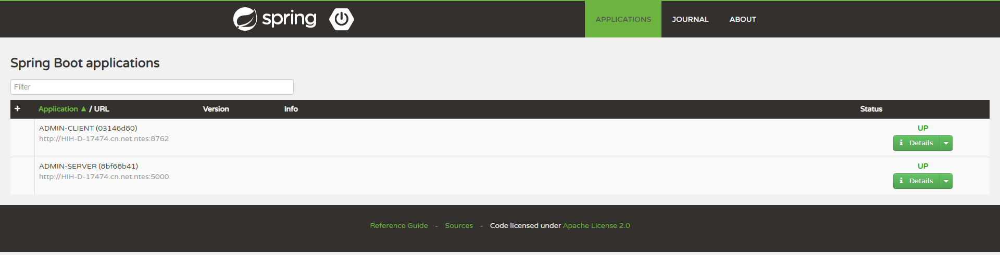

## 1.简介

Spring Boot Admin 是一个管理和监控Spring Boot 应用程序的开源软件。Spring Boot Admin 分为 Server 端和 Client 端，Spring Boot Admin UI部分使用AngularJs将数据展示在前端。

## 2.工程架构

- Eureka Server：服务注册中心，端口为8761。
- Admin Server：用于对微服务系统进行统一的监控和管理。
- Admin Clinet：客户端集成Admin。

## 3.构建Admin Server

新建Spring Boot工程，取名为 admin-server 其完整依赖为:

```xml
<?xml version="1.0" encoding="UTF-8"?>
<project xmlns="http://maven.apache.org/POM/4.0.0" xmlns:xsi="http://www.w3.org/2001/XMLSchema-instance"
         xsi:schemaLocation="http://maven.apache.org/POM/4.0.0 http://maven.apache.org/xsd/maven-4.0.0.xsd">
    <modelVersion>4.0.0</modelVersion>
    <parent>
        <groupId>org.springframework.boot</groupId>
        <artifactId>spring-boot-starter-parent</artifactId>
        <version>1.5.3.RELEASE</version>
        <relativePath/> <!-- lookup parent from repository -->
    </parent>

    <groupId>com.example</groupId>
    <artifactId>admin-server</artifactId>
    <version>0.0.1-SNAPSHOT</version>

    <name>admin-server</name>
    <description>Demo project for Spring Boot</description>

    <properties>
        <java.version>1.8</java.version>
        <spring-cloud.version>Dalston.RELEASE</spring-cloud.version>
    </properties>

    <dependencies>
        <dependency>
            <groupId>de.codecentric</groupId>
            <artifactId>spring-boot-admin-server-ui</artifactId>
            <version>1.5.1</version>
        </dependency>
        <dependency>
            <groupId>de.codecentric</groupId>
            <artifactId>spring-boot-admin-server</artifactId>
            <version>1.5.1</version>
        </dependency>
        <dependency>
            <groupId>org.springframework.boot</groupId>
            <artifactId>spring-boot-starter-actuator</artifactId>
        </dependency>
        <dependency>
            <groupId>org.springframework.cloud</groupId>
            <artifactId>spring-cloud-starter-eureka</artifactId>
        </dependency>
        <!-- 管理界面与JMX-Beans交互 -->
        <dependency>
            <groupId>org.jolokia</groupId>
            <artifactId>jolokia-core</artifactId>
        </dependency>

        <dependency>
            <groupId>org.springframework.boot</groupId>
            <artifactId>spring-boot-starter-test</artifactId>
            <scope>test</scope>
        </dependency>
    </dependencies>

    <dependencyManagement>
        <dependencies>
            <dependency>
                <groupId>org.springframework.cloud</groupId>
                <artifactId>spring-cloud-dependencies</artifactId>
                <version>${spring-cloud.version}</version>
                <type>pom</type>
                <scope>import</scope>
            </dependency>
        </dependencies>
    </dependencyManagement>

    <build>
        <plugins>
            <plugin>
                <groupId>org.springframework.boot</groupId>
                <artifactId>spring-boot-maven-plugin</artifactId>
            </plugin>
        </plugins>
    </build>

</project>
```

配置application.yml，设置 management.security.enabled=false 关闭安全验证，设置Spring Boot Admin默认开启的节点.

```yaml
eureka:
  client:
    service-url:
      defaultZone: http://localhost:8761/eureka/
server:
  port: 5000
spring:
  application:
    name: admin-server
  boot:
    admin:
      routes:
        endpoints: env,metrics,dump,jolokia,info,configprops,trace,logfile,refresh,flyway,liquibase,heapdump,loggers,auditevents,hystrix.stream
management:
  security:
    enabled: false
logging:
  file: "logs/boot-admin-sample.log"
```

在 resources 目录下建一个 logback-spring.xml文件

```xml
<?xml version="1.0" encoding="UTF-8"?>
<configuration>
    <include resource="org/springframework/boot/logging/logback/base.xml"/>
    <jmxConfigurator/>
</configuration>
```

注解 @EnableAdminServer 开启Admin Server的功能.

```java
@EnableEurekaClient
@EnableAdminServer
@SpringBootApplication
public class AdminServerApplication {

    public static void main(String[] args) {
        SpringApplication.run(AdminServerApplication.class, args);
    }

}
```

这样Spring Boot Admin工程创建完毕！

## 4.构建Admin Client

新建Spring Boot工程，取名为 admin-client，其完整依赖为:

```xml
<?xml version="1.0" encoding="UTF-8"?>
<project xmlns="http://maven.apache.org/POM/4.0.0" xmlns:xsi="http://www.w3.org/2001/XMLSchema-instance"
         xsi:schemaLocation="http://maven.apache.org/POM/4.0.0 http://maven.apache.org/xsd/maven-4.0.0.xsd">
    <modelVersion>4.0.0</modelVersion>
    <parent>
        <groupId>org.springframework.boot</groupId>
        <artifactId>spring-boot-starter-parent</artifactId>
        <version>1.5.3.RELEASE</version>
        <relativePath/> <!-- lookup parent from repository -->
    </parent>

    <groupId>com.example</groupId>
    <artifactId>admin-client</artifactId>
    <version>0.0.1-SNAPSHOT</version>

    <name>admin-server</name>
    <description>Demo project for Spring Boot</description>

    <properties>
        <java.version>1.8</java.version>
        <spring-cloud.version>Dalston.RELEASE</spring-cloud.version>
    </properties>

    <dependencies>
        <dependency>
            <groupId>org.springframework.boot</groupId>
            <artifactId>spring-boot-starter-web</artifactId>
        </dependency>
        <dependency>
            <groupId>org.springframework.boot</groupId>
            <artifactId>spring-boot-starter-actuator</artifactId>
        </dependency>
        <dependency>
            <groupId>org.springframework.cloud</groupId>
            <artifactId>spring-cloud-starter-eureka</artifactId>
        </dependency>
        <dependency>
            <groupId>org.jolokia</groupId>
            <artifactId>jolokia-core</artifactId>
        </dependency>

        <dependency>
            <groupId>org.springframework.boot</groupId>
            <artifactId>spring-boot-starter-test</artifactId>
            <scope>test</scope>
        </dependency>
    </dependencies>

    <dependencyManagement>
        <dependencies>
            <dependency>
                <groupId>org.springframework.cloud</groupId>
                <artifactId>spring-cloud-dependencies</artifactId>
                <version>${spring-cloud.version}</version>
                <type>pom</type>
                <scope>import</scope>
            </dependency>
        </dependencies>
    </dependencyManagement>

    <build>
        <plugins>
            <plugin>
                <groupId>org.springframework.boot</groupId>
                <artifactId>spring-boot-maven-plugin</artifactId>
            </plugin>
        </plugins>
    </build>

</project>
```

配置 application.yml 文件，设置日志输出路径，并关闭 Actuator 模块的安全验证。

```yaml
eureka:
  client:
    service-url:
      defaultZone: http://localhost:8761/eureka/
server:
  port: 8762
spring:
  application:
    name: admin-client
management:
  security:
    enabled: false
logging:
  file: "logs/boot-admin-client.log"
```

在程序的启动类上加上 @EnableEurekaClient 注解，开启EurekaClient功能.

```java
@SpringBootApplication
@EnableEurekaClient
public class AdminClientApplication {

    public static void main(String[] args) {
        SpringApplication.run(AdminClientApplication.class, args);
    }

}
```

## 5.启动程序

依次启动 eureka-server、admin-server 和 admin-client 工程，在浏览器访问 admin-server 的主页 http://localhost:5000/，浏览器显示界面如图:




"JOURNAL"选项为服务注册、下线、剔除的时间线。

## 6.添加安全登录界面

Spring Boot Admin 提供了登录界面的组件，并且和 Spring Boot Security 相结合，需要用户登录才能访问。

引入依赖

```xml
<dependency>
    <groupId>de.codecentric</groupId>
    <artifactId>spring-boot-admin-server-ui-login</artifactId>
    <version>1.5.0</version>
</dependency>
<dependency>
     <groupId>org.springframework.boot</groupId>
     <artifactId>spring-boot-starter-security</artifactId>
</dependency>
```

在工程的application.yml中做以下配置，创建一个 security 的 user 用户，它的用户名为 admin ，密码为 123456,。通过 eureka.instance.metadate-map 配置带上该 security 的 user 用户信息。

```yaml
security:
  user:
    name: admin
    password: 123456
eureka:
  instance:
    metadata-map:
      user.name: admin
      user.password: 123456
```

然后，在程序中配置 Spring Boot Security，写 SecurityConfig 的配置类，给静态资源加上 permitAll() 方法，除上述以外的资源访问需要权限认证，另外这些资源不支持 CSFR（跨站请求伪造），所以禁用掉 CSFR，最后需要开启 Http 的额基本认证，即 httpBasic() 方法。

```java
@Configuration
public class SecurityConfig extends WebSecurityConfigurerAdapter {

    @Override
    protected void configure(HttpSecurity http) throws Exception {
        // Page with login form is served as /login.html and does a POST on /login
        http.formLogin().loginPage("/login.html").loginProcessingUrl("/login").permitAll();
        // The UI does a POST on /logout on logout
        http.logout().logoutUrl("/logout");
        // The ui currently doesn't support csrf
        http.csrf().disable();

        // Requests for the login page and the static assets are allowed
        http.authorizeRequests()
                .antMatchers("/login.html", "/**/*.css", "/img/**", "/third-party/**")
                .permitAll();
        // ... and any other request needs to be authorized
        http.authorizeRequests().antMatchers("/**").authenticated();

        // Enable so that the clients can authenticate via HTTP basic for registering
        http.httpBasic();
    }
    
}
```

重新启动 admin-server 工程，在浏览器中访问 http://localhost:5000/，输入用户名admin，密码为123456，登录即可。

> *参考方志朋《深入理解Spring Cloud与微服务构建》*


