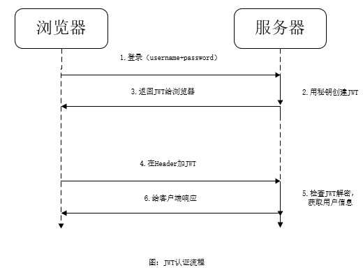
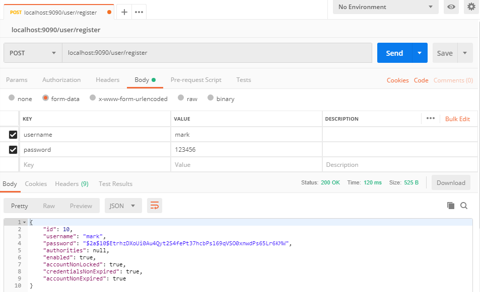
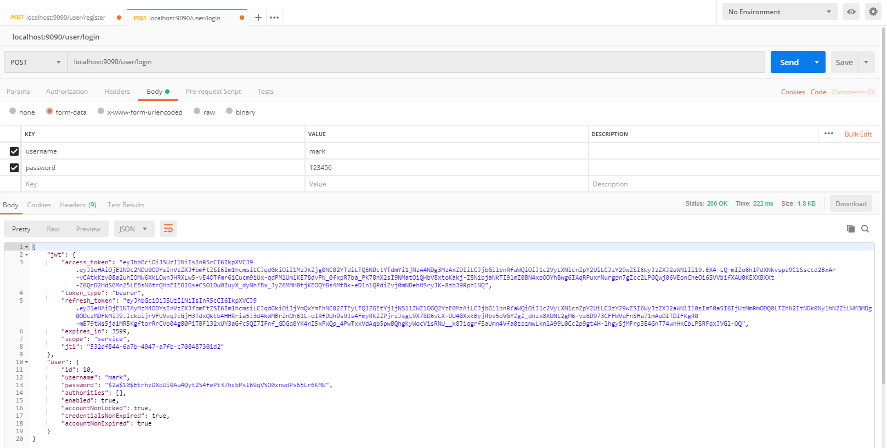

采用Spring Security AOuth2 和 JWT 的方式，避免每次请求都需要远程调度 Uaa 服务。采用Spring Security OAuth2 和 JWT 的方式，Uaa 服务只验证一次，返回JWT。返回的 JWT 包含了用户的所有信息，包括权限信息。

## 1.什么是JWT？

JSON Web Token（JWT）是一种开放的标准（RFC 7519），JWT定义了一种紧凑且自包含的标准，该标准旨在将各个主体的信息包装为 JSON 对象。主体信息是通过数字签名进行加密和验证的。常使用 HMAC 算法或 RSA（公钥/私钥的非对称性加密）算法对JWT进行签名，安全性很高。

JWT 特点：

- 紧凑型：数据体积小，可通过 POST 请求参数或 HTTP 请求头发送。
- 自包含：JWT包含了主体的所有信息，避免了每个请求都需要向Uaa服务验证身份，降低了服务器的负载。

## 2.JWT的结构

JWT结构：

- Header（头）
- Payload（有效载荷）
- Signature（签名）

因此，JWT的通常格式是：xxxxx.yyyyy.zzzzz

（1）Header

Header 通常是由两部分组成：令牌的类型（即JWT）和使用的算法类型，如 HMAC、SHA256和RSA。例如:

```json
{
    "typ": "JWT",
    "alg": "HS256"
}
```

将 Header 用 Base64 编码作为 JWT 的第一部分。

（2）Payload

这是 JWT 的第二部分，包含了用户的一些信息和Claim（声明、权利）。有3类型的 Claim：保留、公开和私人。

```json
{
    "sub": "123456789",
    "name": "John Doe",
    "admin": true
}
```

将 Payload 用 Base64 编码作为 JWT 的第一部分。

（3）Signature

要创建签名部分，需要将 Base64 编码后的 Header、Payload 和秘钥进行签名，一个典型的格式如下:

```java
HMACSHA256(
    base64UrlEncode(header) + '.' +
    base64UrlEncode(payload),
    secret
)
```

## 3.如何使用JWT

认证流程图如下，客户端获取JWT后，以后每次请求都不需要再通过Uaa服务来判断该请求的用户以及该用户的权限。在微服务中，可以利用JWT实现单点登录。




## 4.案例工程架构

三个工程：

- eureka-server：注册服务中心，端口8761。这里不再演示搭建。
- auth-service：负责授权，授权需要用户提供客户端的 clientId 和 password，以及授权用户的username和password。这些信息准备无误之后，auth-service 返回JWT，该 JWT 包含了用户的基本信息和权限点信息，并通过 RSA 加密。
- user-service：作为资源服务，它的资源以及被保护起来了，需要相应的权限才能访问。user-service 服务得到用户请求的 JWT 后，先通过公钥解密JWT，得到该JWT对应的用户的信息和用户的权限信息，再判断该用户是否有权限访问该资源。

工程架构图:


## 5.构建auth-service工程

1.新建Spring Boot工程，取名为 auth-service，其完整pom.xml文件为.

```xml
<?xml version="1.0" encoding="UTF-8"?>
<project xmlns="http://maven.apache.org/POM/4.0.0" xmlns:xsi="http://www.w3.org/2001/XMLSchema-instance"
         xsi:schemaLocation="http://maven.apache.org/POM/4.0.0 http://maven.apache.org/xsd/maven-4.0.0.xsd">
    <modelVersion>4.0.0</modelVersion>

    <parent>
        <groupId>org.springframework.boot</groupId>
        <artifactId>spring-boot-starter-parent</artifactId>
        <version>1.5.3.RELEASE</version>
        <relativePath/> <!-- lookup parent from repository -->
    </parent>

    <groupId>com.example</groupId>
    <artifactId>auth-service</artifactId>
    <version>0.0.1-SNAPSHOT</version>

    <name>auth-service</name>
    <description>Demo project for Spring Boot</description>

    <properties>
        <java.version>1.8</java.version>
        <spring-cloud.version>Dalston.SR1</spring-cloud.version>
    </properties>

    <dependencies>
        <dependency>
            <groupId>org.springframework.cloud</groupId>
            <artifactId>spring-cloud-starter-eureka</artifactId>
        </dependency>
        <dependency>
            <groupId>org.springframework.boot</groupId>
            <artifactId>spring-boot-starter-web</artifactId>
        </dependency>
        <dependency>
            <groupId>org.springframework.security</groupId>
            <artifactId>spring-security-jwt</artifactId>
        </dependency>
        <dependency>
            <groupId>org.springframework.security.oauth</groupId>
            <artifactId>spring-security-oauth2</artifactId>
        </dependency>
        <dependency>
            <groupId>org.springframework.boot</groupId>
            <artifactId>spring-boot-starter-data-jpa</artifactId>
        </dependency>
        <dependency>
            <groupId>mysql</groupId>
            <artifactId>mysql-connector-java</artifactId>
        </dependency>

        <dependency>
            <groupId>org.springframework.boot</groupId>
            <artifactId>spring-boot-starter-test</artifactId>
            <scope>test</scope>
        </dependency>
    </dependencies>

    <dependencyManagement>
        <dependencies>
            <dependency>
                <groupId>org.springframework.cloud</groupId>
                <artifactId>spring-cloud-dependencies</artifactId>
                <version>${spring-cloud.version}</version>
                <type>pom</type>
                <scope>import</scope>
            </dependency>
        </dependencies>
    </dependencyManagement>

    <build>
        <plugins>
            <plugin>
                <groupId>org.springframework.boot</groupId>
                <artifactId>spring-boot-maven-plugin</artifactId>
            </plugin>
            <!--防止jks文件被mavne编译导致不可用-->
            <plugin>
                <groupId>org.apache.maven.plugins</groupId>
                <artifactId>maven-resources-plugin</artifactId>
                <configuration>
                    <nonFilteredFileExtensions>
                        <nonFilteredFileExtension>cert</nonFilteredFileExtension>
                        <nonFilteredFileExtension>jks</nonFilteredFileExtension>
                    </nonFilteredFileExtensions>
                </configuration>
            </plugin>
        </plugins>
    </build>

</project>
```

2.配置application.yml文件

```yaml
spring:
  application:
    name: auth-service
  datasource:
    driver-class-name: com.mysql.jdbc.Driver
    url: jdbc:mysql://localhost:3306/spring-cloud-auth?useUnicode=true&characterEncoding=utf8&characterSetResults=utf8
    username: root
    password: 123456
  jpa:
    hibernate:
      ddl-auto: update
    show-sql: true
server:
  port: 9999
eureka:
  client:
    serviceUrl:
      defaultZone: http://localhost:8761/eureka/
```

3.配置Spring Security

```java
@Configuration
@EnableWebSecurity
public class WebSecurityConfig extends WebSecurityConfigurerAdapter {

    @Override
    @Bean
    public AuthenticationManager authenticationManagerBean() throws Exception {
        return super.authenticationManagerBean();
    }

    @Override
    protected void configure(HttpSecurity http) throws Exception {
        http
            .csrf().disable() //关闭CSRF
                .exceptionHandling()
                .authenticationEntryPoint((request, response, authException) -> response.sendError(HttpServletResponse.SC_UNAUTHORIZED))
            .and()
                .authorizeRequests()
                .antMatchers("/**").authenticated()
            .and()
                .httpBasic();
    }

    @Autowired
    UserServiceDetail userServiceDetail;

    @Override
    protected void configure(AuthenticationManagerBuilder auth) throws Exception {
        auth.userDetailsService(userServiceDetail)
                .passwordEncoder(new BCryptPasswordEncoder()); //密码加密
    }
}
```

UserServiceDetail.java

```java
@Service
public class UserServiceDetail implements UserDetailsService {
    @Autowired
    private UserDao userRepository;

    @Override
    public UserDetails loadUserByUsername(String username) throws UsernameNotFoundException {
        return userRepository.findByUsername(username);
    }
}
```

UserDao.java

```java
@Repository
public interface UserDao extends JpaRepository<User, Long> {

	User findByUsername(String username);
}
```

User对象和上一篇文章的内容一样，需要实现UserDetails接口，Role对象需要实现GrantedAuthority接口.

```java
@Entity
public class User implements UserDetails, Serializable {
	@Id
	@GeneratedValue(strategy = GenerationType.IDENTITY)
	private Long id;

	@Column(nullable = false,  unique = true)
	private String username;

	@Column
	private String password;

	@ManyToMany(cascade = CascadeType.ALL, fetch = FetchType.EAGER)
	@JoinTable(name = "user_role", joinColumns = @JoinColumn(name = "user_id", referencedColumnName = "id"),
			inverseJoinColumns = @JoinColumn(name = "role_id", referencedColumnName = "id"))
	private List<Role> authorities;


	public User() {
	}

	public Long getId() {
		return id;
	}
	public void setId(Long id) {
		this.id = id;
	}

	@Override
	public Collection<? extends GrantedAuthority> getAuthorities() {
		return authorities;
	}

	public void setAuthorities(List<Role> authorities) {
		this.authorities = authorities;
	}

	@Override
	public String getUsername() {
		return username;
	}

	public void setUsername(String username) {
		this.username = username;
	}

	@Override
	public String getPassword() {
		return password;
	}

	public void setPassword(String password) {
		this.password = password;
	}

	@Override
	public boolean isAccountNonExpired() {
		return true;
	}

	@Override
	public boolean isAccountNonLocked() {
		return true;
	}

	@Override
	public boolean isCredentialsNonExpired() {
		return true;
	}

	@Override
	public boolean isEnabled() {
		return true;
	}

}
```

```java
@Entity
public class Role implements GrantedAuthority {

	@Id
	@GeneratedValue(strategy = GenerationType.IDENTITY)
	private Long id;

	@Column(nullable = false)
	private String name;

	public Long getId() {
		return id;
	}

	public void setId(Long id) {
		this.id = id;
	}

	@Override
	public String getAuthority() {
		return name;
	}

	public void setName(String name) {
		this.name = name;
	}

	@Override
	public String toString() {
		return name;
	}
}
```

4.配置 Authorization Server

在 OAuth2Config 这个类中配置 AuthorizationServer，其代码如下:

```java
@Configuration
@EnableAuthorizationServer
public class OAuth2Config extends AuthorizationServerConfigurerAdapter {
    @Override
    public void configure(ClientDetailsServiceConfigurer clients) throws Exception {
        clients.inMemory() //将客户端的信息存储在内存中
                .withClient("user-service") //创建了一个Client为"user-service"的客户端
                .secret("123456")
                .scopes("service") //客户端的域
                .authorizedGrantTypes("refresh_token", "password") //配置类验证类型为 refresh_token和password
                .accessTokenValiditySeconds(12*300); //5min过期
    }

    @Override
    public void configure(AuthorizationServerEndpointsConfigurer endpoints) throws Exception {
        endpoints.tokenStore(tokenStore()).tokenEnhancer(jwtTokenEnhancer()).authenticationManager(authenticationManager);
    }

    @Autowired
    @Qualifier("authenticationManagerBean")
    private AuthenticationManager authenticationManager;

    @Bean
    public TokenStore tokenStore() {
        return new JwtTokenStore(jwtTokenEnhancer());
    }

    @Bean
    protected JwtAccessTokenConverter jwtTokenEnhancer() {
        //注意此处需要相应的jks文件
        KeyStoreKeyFactory keyStoreKeyFactory = new KeyStoreKeyFactory(new ClassPathResource("fzp-jwt.jks"), "fzp123".toCharArray());
        JwtAccessTokenConverter converter = new JwtAccessTokenConverter();
        converter.setKeyPair(keyStoreKeyFactory.getKeyPair("fzp-jwt"));
        return converter;
    }
}
```

5.生成 jks 文件

配置 JwtTokenStore 时需要使用 jks 文件作为 Token 加密的秘钥。

jks 文件需要Java keytool工具，保证Java环境变量没问题，打开计算机终端，输入命令:

> keytool -genkeypair -alias fzp-jwt -validity 3650 -keyalg RSA -dname "CN=jwt,OU=jtw,O=jwt,L=zurich,S=zurich,C=CH" -keypass fzp123 -keystore fzp-jwt.jks -storepass fzp123

解释，-alias 选项为别名，-keypass 和 -storepass 为密码选项，-validity 为配置jks文件过期时间（单位：天）。

获取的 jks 文件作为私钥，只允许 Uaa 服务持有，并用作加密 JWT。也就是把生成的 jks 文件放到 auth-service 工程的resource目录下。那么 user-service 这样的资源服务，是如何解密 JWT 的呢？这时就需要使用 jks 文件的公钥。获取 jks 文件的公钥命令如下：

> keytool -list -rfc --keystore fzp-jwt.jks | openssl x509 -inform pem -pubkey 

这个命令要求你的计算机上安装了openSSL（[下载地址](http://slproweb.com/products/Win32OpenSSL.html)），然后手动把安装的openssl.exe所在目录配置到环境变量。

输入密码fzp123后，显示的信息很多，我们只提取 PUBLIC KEY，即如下所示：

> -----BEGIN PUBLIC KEY-----
> MIIBIjANBgkqhkiG9w0BAQEFAAOCAQ8AMIIBCgKCAQEAlCFiWbZXIb5kwEaHjW+/
> 7J4b+KzXZffRl5RJ9rAMgfRXHqGG8RM2Dlf95JwTXzerY6igUq7FVgFjnPbexVt3
> vKKyjdy2gBuOaXqaYJEZSfuKCNN/WbOF8e7ny4fLMFilbhpzoqkSHiR+nAHLkYct
> OnOKMPK1SwmvkNMn3aTEJHhxGh1RlWbMAAQ+QLI2D7zCzQ7Uh3F+Kw0pd2gBYd8W
> +DKTn1Tprugdykirr6u0p66yK5f1T9O+LEaJa8FjtLF66siBdGRaNYMExNi21lJk
> i5dD3ViVBIVKi9ZaTsK9Sxa3dOX1aE5Zd5A9cPsBIZ12spYgemfj6DjOw6lk7jkG
> 9QIDAQAB
> -----END PUBLIC KEY-----

新建一个 public.cert 文件，将上面的公钥信息复制到 public.cert 文件中并保存。并将文件放到 user-service 等资源服务的resources目录下。到目前为止，Uaa 服务已经搭建完毕。

需要注意的是，Maven 在项目编译时，可能会将 jks 文件编译，导致 jks 文件乱码，最后不可用。需要在工程的 pom 文件中添加以下内容:

```xml
<!--防止jks文件被mavne编译导致不可用-->
<plugin>
       <groupId>org.apache.maven.plugins</groupId>
       <artifactId>maven-resources-plugin</artifactId>
       <configuration>
             <nonFilteredFileExtensions>
                 <nonFilteredFileExtension>cert</nonFilteredFileExtension>
                 <nonFilteredFileExtension>jks</nonFilteredFileExtension>
              </nonFilteredFileExtensions>
        </configuration>
</plugin>
```

最后，别忘了在启动类注解@EnableEurekaClient开启服务注册.

```java
@SpringBootApplication
@EnableEurekaClient
public class AuthServiceApplication {
    public static void main(String[] args) {
        SpringApplication.run(AuthServiceApplication.class, args);
    }
}
```


## 6.构建user-service资源服务

1.新建Spring Boot工程，取名为user-service，其完整pom.xml文件:

```xml
<?xml version="1.0" encoding="UTF-8"?>
<project xmlns="http://maven.apache.org/POM/4.0.0" xmlns:xsi="http://www.w3.org/2001/XMLSchema-instance"
         xsi:schemaLocation="http://maven.apache.org/POM/4.0.0 http://maven.apache.org/xsd/maven-4.0.0.xsd">
    <modelVersion>4.0.0</modelVersion>
    <parent>
        <groupId>org.springframework.boot</groupId>
        <artifactId>spring-boot-starter-parent</artifactId>
        <version>1.5.3.RELEASE</version>
        <relativePath/> <!-- lookup parent from repository -->
    </parent>

    <groupId>com.example</groupId>
    <artifactId>user-service</artifactId>
    <version>0.0.1-SNAPSHOT</version>

    <name>user-service</name>
    <description>Demo project for Spring Boot</description>

    <properties>
        <java.version>1.8</java.version>
        <spring-cloud.version>Dalston.SR1</spring-cloud.version>
    </properties>

    <dependencies>
        <dependency>
            <groupId>org.springframework.cloud</groupId>
            <artifactId>spring-cloud-starter-eureka</artifactId>
        </dependency>
        <dependency>
            <groupId>org.springframework.boot</groupId>
            <artifactId>spring-boot-starter-web</artifactId>
        </dependency>
        <dependency>
            <groupId>org.springframework.security.oauth</groupId>
            <artifactId>spring-security-oauth2</artifactId>
        </dependency>
        <dependency>
            <groupId>org.springframework.boot</groupId>
            <artifactId>spring-boot-starter-data-jpa</artifactId>
        </dependency>
        <dependency>
            <groupId>mysql</groupId>
            <artifactId>mysql-connector-java</artifactId>
        </dependency>
        <dependency>
            <groupId>org.springframework.cloud</groupId>
            <artifactId>spring-cloud-starter-hystrix</artifactId>
        </dependency>
        <dependency>
            <groupId>org.springframework.cloud</groupId>
            <artifactId>spring-cloud-starter-feign</artifactId>
        </dependency>

        <dependency>
            <groupId>org.springframework.boot</groupId>
            <artifactId>spring-boot-starter-test</artifactId>
            <scope>test</scope>
        </dependency>
    </dependencies>

    <dependencyManagement>
        <dependencies>
            <dependency>
                <groupId>org.springframework.cloud</groupId>
                <artifactId>spring-cloud-dependencies</artifactId>
                <version>${spring-cloud.version}</version>
                <type>pom</type>
                <scope>import</scope>
            </dependency>
        </dependencies>
    </dependencyManagement>

    <build>
        <plugins>
            <plugin>
                <groupId>org.springframework.boot</groupId>
                <artifactId>spring-boot-maven-plugin</artifactId>
            </plugin>
        </plugins>
    </build>

</project>
```

2.配置文件application.yml

在工程的配置文件application.yml中，配置程序名为 user-service，端口号为 9090，另外，需要配置 feign.hystrix.enable 为true，即开启 Feign 的 Hystrix 功能。完整的配置代码如下:

```yaml
server:
  port: 9090
eureka:
  client:
    service-url:
      defaultZone: http://localhost:8761/eureka/
spring:
  application:
    name: user-service
  datasource:
    driver-class-name: com.mysql.jdbc.Driver
    url: jdbc:mysql://localhost:3306/spring-cloud-auth?useUnicode=true&characterEncoding=utf8&characterSetResults=utf8
    username: root
    password: 123456
  jpa:
    hibernate:
      ddl-auto: update
    show-sql: true
feign:
  hystrix:
    enabled: true
```

3.配置Resource Server

在配置Resource Server之前，需要注入 JwtTokenStore 类型的 Bean。

```java
@Configuration
public class JwtConfig {
    @Autowired 
    JwtAccessTokenConverter jwtAccessTokenConverter;

    @Bean
    @Qualifier("tokenStore")
    public TokenStore tokenStore() {
        return new JwtTokenStore(jwtAccessTokenConverter);
    }
    
    @Bean
    protected JwtAccessTokenConverter jwtTokenEnhancer() {
        //用作 JWT 转换器
        JwtAccessTokenConverter converter =  new JwtAccessTokenConverter();
        Resource resource = new ClassPathResource("public.cert");
        String publicKey ;
        try {
            publicKey = new String(FileCopyUtils.copyToByteArray(resource.getInputStream()));
        } catch (IOException e) {
            throw new RuntimeException(e);
        }
        converter.setVerifierKey(publicKey); //设置公钥
        return converter;
    }
}
```

然后配置 Resource Server

```java
@Configuration
@EnableResourceServer //开启Resource Server功能
public class ResourceServerConfig extends ResourceServerConfigurerAdapter{
    @Autowired
    TokenStore tokenStore;

    @Override
    public void configure(HttpSecurity http) throws Exception {
        http
                .csrf().disable()
                .authorizeRequests()
                .antMatchers("/user/login","/user/register").permitAll()
                .antMatchers("/**").authenticated();

    }
    
    @Override
    public void configure(ResourceServerSecurityConfigurer resources) throws Exception {
        resources.tokenStore(tokenStore);
    }
    
}
```

4.新建一个配置类 GlobalMethodSecurityConfig，在此类中通过 @EnableGlobalMethodSecurity(prePostEnabled = true)注解开启方法级别的安全验证。

```java
@Configuration
@EnableGlobalMethodSecurity(prePostEnabled = true)
public class GlobalMethodSecurityConfig {

}
```

5.编写用户注册接口

拷贝auth-service工程的User.java、Role.java 和 UserDao.java 到本工程。

在 Service 层的 UserService 写一个插入用户的方法，代码如下

```java
@Service
public class UserServiceDetail {

    @Autowired
    private UserDao userRepository;

    public User insertUser(String username,String  password){
        User user=new User();
        user.setUsername(username);
        user.setPassword(BPwdEncoderUtil.BCryptPassword(password));
        return userRepository.save(user);
    }

}
```

BPwdEncoderUtil工具类

```java
public class BPwdEncoderUtil {

    private static final BCryptPasswordEncoder encoder = new BCryptPasswordEncoder();

    public static String  BCryptPassword(String password){
        return encoder.encode(password);
    }

    public static boolean matches(CharSequence rawPassword, String encodedPassword){
        return encoder.matches(rawPassword,encodedPassword);
    }

}
```

在 Web 层，在 Controller 中写一个注册的 API 接口 “/user/register”,代码如下

```java
@RestController
@RequestMapping("/user")
public class UserController {
    @Autowired
    UserServiceDetail userServiceDetail;

    @PostMapping("/register")
    public User postUser(@RequestParam("username") String username , @RequestParam("password") String password){
        //参数判断，省略
       return userServiceDetail.insertUser(username,password);
    }

}
```

6.编写用户登录接口

在Service层，在 UserServiceDetail 中添加一个 login（登录）方法，代码如下：

```java
@Service
public class UserServiceDetail {

    @Autowired
    private AuthServiceClient client;

    public UserLoginDTO login(String username, String password){
        User user=userRepository.findByUsername(username);
        if (null == user) {
            throw new UserLoginException("error username");
        }
        if(!BPwdEncoderUtil.matches(password,user.getPassword())){
            throw new UserLoginException("error password");
        }
        // 获取token
        JWT jwt=client.getToken("Basic dXNlci1zZXJ2aWNlOjEyMzQ1Ng==","password",username,password);
        // 获得用户菜单
        if(jwt==null){
            throw new UserLoginException("error internal");
        }
        UserLoginDTO userLoginDTO=new UserLoginDTO();
        userLoginDTO.setJwt(jwt);
        userLoginDTO.setUser(user);
        return userLoginDTO;

    }

}
```

AuthServiceClient 通过向 auth-service 服务远程调用“/oauth/token” API接口，获取 JWT。在 "/oauth/token" API 接口，获取JWT。在“/oauth/token”API接口中需要在请求头传入 Authorization 信息，并需要传请求参数认证类型 grant_type、用户名 username 和密码 password，代码如下：

```java
@FeignClient(value = "auth-service",fallback =AuthServiceHystrix.class )
public interface AuthServiceClient {

    @PostMapping(value = "/oauth/token")
    JWT getToken(@RequestHeader(value = "Authorization") String authorization, @RequestParam("grant_type") String type,
                 @RequestParam("username") String username, @RequestParam("password") String password);

}
```

其中，AuthServiceHystrix 为AuthServiceClient 的熔断器，代码如下：

```java
@Component
public class AuthServiceHystrix implements AuthServiceClient {
    @Override
    public JWT getToken(String authorization, String type, String username, String password) {
        return null;
    }
}
```

JWT 为一个 JavaBean，它包含了 access_token、token_type 和 refresh_token 等信息，代码如下：

```java
public class JWT {
    private String access_token;
    private String token_type;
    private String refresh_token;
    private int expires_in;
    private String scope;
    private String jti;
    //getter setter
```

UserLoginDTO 包含了一个 User 和一个 JWT 对象，用于返回数据的实体：

```java
public class UserLoginDTO {
    private JWT jwt;
    private User user;
    //setter getter
}
```

登录异常类 UserLoginException

```java
public class UserLoginException extends RuntimeException{
    public UserLoginException(String message) {
        super(message);
    }
}
```

统一异常处理

```java
@ControllerAdvice
@ResponseBody
public class ExceptionHandle {
    @ExceptionHandler(UserLoginException.class)
    public ResponseEntity<String> handleException(Exception e) {

        return new ResponseEntity(e.getMessage(), HttpStatus.OK);
    }
}
```

在web层的 UserController 类补充一个登录的API接口“/user/login”.

```java
@PostMapping("/login")
public UserLoginDTO login(@RequestParam("username") String username , @RequestParam("password") String password){
    //参数判断，省略
    return userServiceDetail.login(username,password);
}
```

为了测试权限，再补充一个"/foo"接口，该接口需要“ROLE_ADMIN”权限.

```java
@RequestMapping(value = "/foo", method = RequestMethod.GET)
@PreAuthorize("hasAuthority('ROLE_ADMIN')")
public String getFoo() {
    return "i'm foo, " + UUID.randomUUID().toString();
}
```

最后，在启动类注解开启Feign：

```java
@SpringBootApplication
@EnableFeignClients
@EnableEurekaClient
public class UserServiceApplication {
    public static void main(String[] args) {
        SpringApplication.run(UserServiceApplication.class, args);
    }
}
```


## 7.启动工程,开始测试

经过千辛万苦，终于搭建了一个Demo工程，现在开始依次启动 eureka-server、auth-service 和 user-service工程。这里我们使用PostMan测试编写的接口。

1.注册用户




2.登录获取Token




3.访问/user/foo

复制 access_token到 Header头部，发起GET请求。

```json
"Authorization":"Bearer {access_token}"
```


因为没有权限，访问被拒绝，我们手动在数据库添加"ROLE_ADMIN"权限，并与该用户关联。重新登录并获取Token，重新请求“/user/foo”接口


## 总结

在本案例中，用户通过登录接口来获取授权服务的Token 。用户获取Token 成功后，在以后每次访问资源服务的请求中都需要携带该Token 。资源服务通过公钥解密Token ，解密成功后可以获取用户信息和权限信息，从而判断该Token 所对应的用户是谁， 具有什么权限。
这个架构的优点在于，一次获取Token ， 多次使用，不再每次询问Uaa 服务该Token 所对应的用户信息和用户的权限信息。这个架构也有缺点，例如一旦用户的权限发生了改变， 该Token 中存储的权限信息并没有改变， 需要重新登录获取新的Token 。就算重新获取了Token,如果原来的Token 没有过期，仍然是可以使用的，所以需要根据具体的业务场景来设置Token的过期时间。一种改进方式是将登录成功后获取的Token 缓存在网关上，如果用户的权限更改，将网关上缓存的Token 删除。当请求经过网关，判断请求的Token 在缓存中是否存在，如果缓存中不存在该Token ，则提示用户重新登录。

>*参考：《深入理解Spring Cloud与微服务构建》方志朋*
