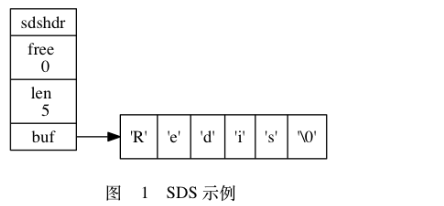

Redis的底层数据结构非常多，其中包括SDS、ZipList、SkipList、LinkedList、HashTable、Intset等。如果你对Redis的理解还只停留在get、set的水平的话，是远远不足以应对面试提问的。本文简单介绍了Redis底层最重要的数据结构 - 简单动态字符串（SDS）

Redis使用C语言开发，但并没有使用C语言传统的字符串表示（以空字符结尾的字节数组，以下简称C字符串），而是自己构建了一种名为简单动态字符串的（simple dynamic string，SDS）的抽象类型，并将SDS用作Redis的默认字符串表示。

在Redis里面，C字符串只会作为字符串字面量（static literal）用在一些无须对字符串值进行修改的地方。当Redis需要的不仅仅是一个字符串字面量，而是一个可以被修改的字符串值时，Redis就会使用SDS来表示字符串值，比如在Redis的数据库里面，包含字符串的键值对在底层都是由SDS实现的。

咱们来举个例子，如果在客户端执行命令：

```
redis> SET msg "hello world"
ok
```

那么Redis将在数据库中创建一个新的键值对，其中：

- 键值对的键是一个字符串对象，对象的底层实现是一个保存着字符串“msg”的SDS。
- 键值对的值也是一个字符串对象，对象的底层实现是一个保存着字符串“hello world”的SDS。

除了用来保存数据库中的字符串值之外，SDS还被用作缓冲区：AOF模块中的AOF缓冲区，以及客户端状态中的输入缓冲区，都是由SDS实现的。总之，SDS是Redis的最基础也是最重要的数据结构。

## 1.SDS的定义

每个 sds.h/sdshdr 结构表示一个SDS值：

```c
struct sdshdr{
    // 记录buf数组中已使用字节的数量
    // 等于SDS所保存字符串的长度
    int len;
    
    // 记录buf数组中未使用字节的数量
    int free;
    //字节数组，用于保存字符串
    char buf[];
}
```

用一张图来表示：




SDS 遵循 C 字符串以空字符结尾的惯例， 保存空字符的 1字节空间不计算在 SDS 的 len 属性里面， 并且为空字符分配额外的 1 字节空间， 以及添加空字符到字符串末尾等操作都是由 SDS 函数自动完成的， 所以这个空字符对于 SDS 的使用者来说是完全透明的。

## 2.SDS与C字符串的区别

现在来说，C语言使用长度为N+1的字符数组来表示长度为N的字符串，并且字符数组的最后一个元素总是空字符“\0”。

C的这种简单的字符串表达方式，并不能满足Redis对字符串在安全性、效率以及功能方面的要求。具体有以下几个方面。

### 2.1 常数复杂度获取字符串长度

因为C字符串并不记录字符串的长度信息，所以为了获取一个C字符串的长度，程序必须遍历整个字符串，对遇到的每个字符进行计数，直到遇到空字符为止，这个操作的复杂度为O(n)。而在Redis的SDS中，这个时间复杂度只有O(1)。

### 2.2 杜绝缓冲区溢出

除了获取字符串长度的复杂度高之外，C字符不记录自身长度带来的另一个问题就是缓冲区溢出。举个例子，C语言的 strcat 函数可以将字符串中的内容拼接到 dest 字符串的末尾，但是当字符串的容量不够就会产生缓存区溢出，因为字符串也是基于数组实现的，也是有大小限制的。

Redis的SDS已经杜绝了这个问题，那它是如何解决的呢？

当API要对SDS进行修改时，API会先检查SDS的空间是否满足修改所需的空间，如果不够的话，API会自动将SDS的空间进行扩容，然后才执行实际的修改操作。这就避免了缓冲区内存溢出。

### 2.3 减少修改字符串时带来的内存重分配次数

上面说到了API会在修改SDS字符串时自动扩容，如果每次修改都伴随着对字符串内的数组的内存重分配，那效率可想而知。所以Redis实现了空间预分配和惰性空间释放两种优化策略。

**空间预分配**

空间预分配用于优化SDS的字符串增长操作：当SDS的API对一个SDS进行修改，并且需要对SDS进行空间扩展的时候，程序不仅会为SDS分配修改所需要的空间，还会为SDS分配额外的未使用空间。

总的来说，额外分配的未使用空间数量大小有两种可能：

1. 如果对SDS修改之后，SDS的长度将小于1MB，那么程序分配和len 属性同样大小的未使用空间，这时候SDS的 free 属性的值将和 len 属性的值相同。也就是说，该SDS字符串修改完后还有近一半的容量。
2. 如果对SDS修改之后，SDS的长度大于等于1MB，那么程序会分配1MB的未使用空间。这个是固定的。

通过空间预分配，Redis可以减少连续执行字符串操作所需的内存重分配次数。

**惰性空间释放**

惰性空间释放用于优化SDS的字符串缩短操作：当SDS的API需要缩短SDS保存的字符串时，程序并不立即使用内存重分配来回收缩短后多出来的字节，而是使用 free 属性将这些字节的数量记录起来，并等待将来使用。

### 2.4 二进制安全

在C语言中，字符串的存储必须符合某种编码（ASCII），并且字符串不能包含空字符，否则会被认为是字符串结尾。这些限制使得C字符串只能保存文本数据，而不能保存像图片、音频、视频、压缩文件这样的二进制数据。

所以，为了解决C字符串的不足，Redis的 buf 数组保存的是二进制数据，这也就是把SDS的 buf 数组称为字节数组的原因。

### 2.5 兼容部分C字符串函数

虽然 Redis 的API都是二进制安全的，但它们一样遵循C字符串以空字符串结尾的惯例，这些API总会将SDS保存的数据的末尾设置为空字符，并且总会在为 buf 数组分配空间时多分配一个字节来容纳这个空字符，这是为了让那些保存文本数据的SDS可以重用一部分C的函数。

举个例子， 如果我们有一个 SDS 的指针 s ， 那么我们可以直接使用 stdio.h/printf 函数， 通过执行以下语句：

```c
printf("%s", s->buf);
```

来打印出 SDS 保存的字符串值 `"Redis"` ， 而无须为 SDS 编写专门的打印函数。

最后，临近春节，祝大家新年快乐！