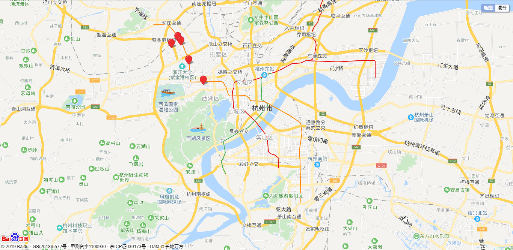
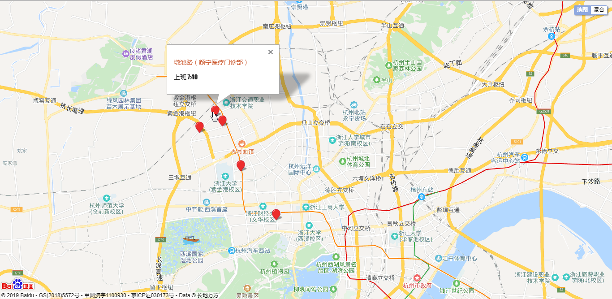
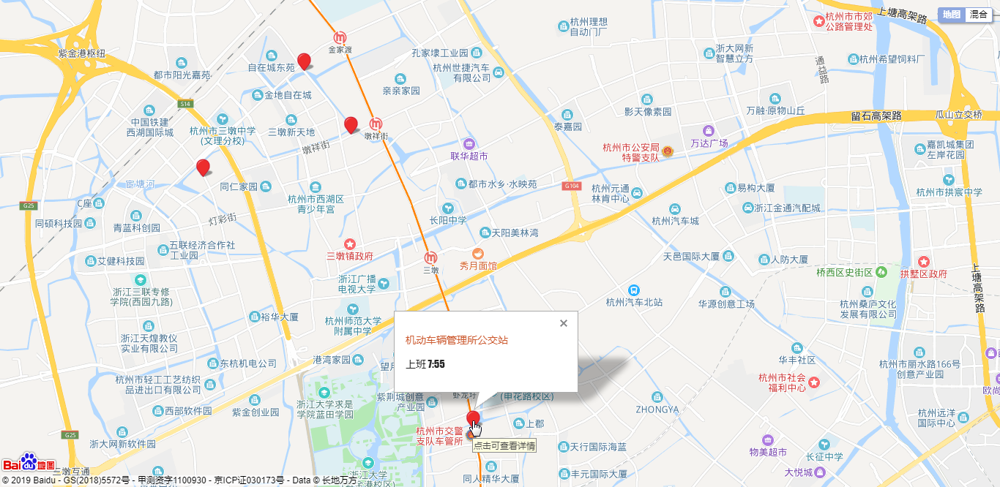

来到网易已经不知不觉一两个月了，最近把原来租的房子出租后，打算重新租一套房子。找到一个好房子不容易，首先考虑交通问题，上下班时间不能耗费太长，网易提供了遍布全城的班车系统，不过说实话，貌似只有文字说明（http://crystalpot.cn/menus/bus），看到这些地名，对于我一个外乡人来说内心是懵X的，想到如果有一个如高德地图版的班车导航就好了，在哪个小区租房，附近的班车信息一目了然，想到便去做，翻了翻百度地图官方文档，写了几行代码，大致实现了需求。

### 预览








如图所示，只有寥寥几个站点，因为没过多久，有个租房平台就帮我在公司附近找到了房源，剩下的班车数据我也就搁浅。这里晒出自己的代码，记录一下。

### 代码

```java
<!DOCTYPE html>
<html>
<head>
    <meta http-equiv="Content-Type" content="text/html; charset=utf-8"/>
    <meta name="viewport" content="initial-scale=1.0, user-scalable=no"/>
    <style type="text/css">
        body, html, #allmap {
            width: 100%;
            height: 100%;
            overflow: hidden;
            margin: 0;
            font-family: fantasy;
        }
        .title{
            color: #cc5a2f;
            font-size: 14px;
        }
        .content{
            color: #222;
            font-size: 14px;
        }
    </style>
    <script type="text/javascript"
            src="http://api.map.baidu.com/api?v=2.0&ak=你的AK"></script>
    <title>网易班车地图展示</title>
</head>
<body>
<div id="allmap"></div>
</body>
</html>
<script type="text/javascript">
    //标注点经纬度集合
    var points = [
        ['120.077218', '30.333151', '新竹桥公交站','上班 7:35'],
        ['120.087068', '30.342169', '墩池路（颜宁医疗门诊部）','上班 7:40'],
        ['120.091712','30.336725','北港桥公交站','上班 7:45'],
        ['120.103673','30.311658','机动车辆管理所公交站','上班 7:55'],
        ['120.126191','30.284389','古翠路华星路口','上班 8:07'],
        //等待爱心人士继续完善，参考文档http://crystalpot.cn/menus/bus
    ];
    // 百度地图API功能
    var map = new BMap.Map("allmap", {minZoom: 12, maxZoom: 19});    // 创建Map实例
    map.centerAndZoom(new BMap.Point(120.1972695145, 30.1933909541), 12);  // 初始化地图,设置中心点坐标和地图级别
    //添加地图类型控件
    map.addControl(new BMap.MapTypeControl({
        mapTypes: [
            BMAP_NORMAL_MAP,
            BMAP_HYBRID_MAP
        ]
    }));
    map.setCurrentCity("杭州");          // 设置地图显示的城市,此项是必须设置的
    map.enableScrollWheelZoom(true);     //开启鼠标滚轮缩放
    //循环添加标注点
    for (var i = 0; i < points.length; i++) {
        var point = new BMap.Point(points[i][0], points[i][1]); //新建一个点
        var marker = new BMap.Marker(point);  // 创建标注
        // marker.setAnimation(BMAP_ANIMATION_BOUNCE); //跳动的动画
        marker.setTitle(i); //设置标注信息
        marker.addEventListener("mouseover",  //添加鼠标移入移除事件
            function () {
                var opts = {
                    width: 0,     // 信息窗口宽度
                    height: 0,     // 信息窗口高度
                    title: "<span style='display: none'></span>",  // 信息窗口标题
                };
                var infoWindow = new BMap.InfoWindow(infoStyle(points[this.getTitle()]), opts);  // 创建信息窗口对象
                this.openInfoWindow(infoWindow, this.getPosition());      // 打开信息窗口
            });
        marker.addEventListener("mouseout", function () {
            map.closeInfoWindow();
        });
        map.addOverlay(marker);   // 将标注添加到地图中
    }
    function infoStyle(point) {
        var dom = "<p class='title'>"+point[2]+"</p>";
        dom += "<p class='content'>"+point[3]+"</p>";
        return dom;
    }
</script>
```

### 工具

[百度地图JavaScript API ](http://lbsyun.baidu.com/index.php?title=jspopular)

[百度地图拾取坐标系统](http://api.map.baidu.com/lbsapi/getpoint/index.html)