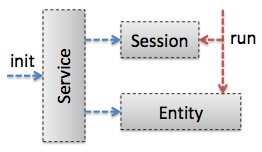
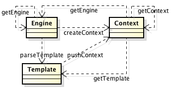
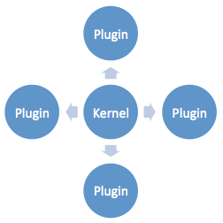
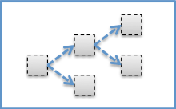
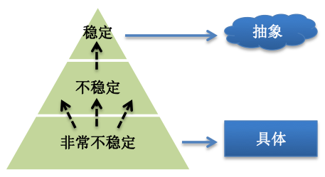
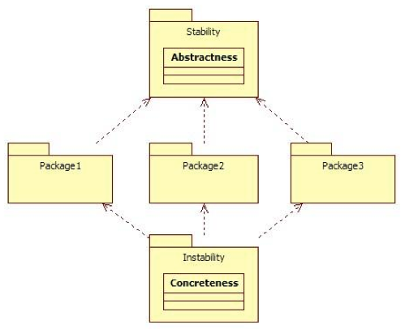
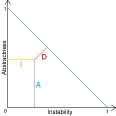

[HTTL](http://httl.github.io/) (Hyper-Text Template Language) 是一个高性能的开源[JAVA](http://www.oracle.com/technetwork/java/index.html)模板引擎， 适用于动态[HTML](http://zh.wikipedia.org/zh-cn/HTML)页面输出， 可替代[JSP](http://zh.wikipedia.org/wiki/JSP)页面， 指令和[Velocity](http://velocity.apache.org/)相似。作者是阿里巴巴工程师[梁飞](https://javatar.iteye.com/?utm_source=hacpai.com)，本文是在拜读了HTTL的设计原则之后提炼出的部分通用设计原则。

### 模型划分原则

按实体域，服务域，会话域划分。

不管你做一个什么产品，都一定有一个被操作的主体，比如：服务框架管理的Service，任务框架管理的Task，Spring管理的Bean等，这就是实体域。

即然有被操作者，就一定有操作者，它管理被操作者的生命周期，发起动作，比如：服务框架的ServiceInvoker,，任务框架的TaskScheduler，Spring的BeanFactory等，这就是服务域。

服务域发起动作，在执行过程中，会有一些临时状态需要存储交换，比如：Invacation，Execution，Request等，这就是会话域。

相应的，在HTTL中：

- Engine 为服务域
  - 它是API的入口，并负责实体域Template的生命周期管理，它是Singleton单一实例的，加载后不可变，所以是线程安全的，它的初始化过程较重，请复用单例。
- Template 为实体域
  - 代表着被操作者，它是Prototype原型实例的，即每个模板产生一个实例，加载后不可变，同样也是线程安全的，模板变化后，将产生不同的实例，而不改变原实例。
- Context 为会话域
  - 持有操作过程中的所有可变状态，它是ThreadLocal线程内实例的，即不和其它线程竞争使用，所以也是线程安全的，请不要跨线程传递，它的初始化过程很轻量，每次模板执行前都新建实例，执行完即销毁。

这样划分的好处是，职责清晰，可变状态集中，每个域都是无锁线程安全的，保证在大并发下，不会降低系统的活性。

这些核心领域模型也就是HTTL的API(Application Programming Interface)，它是HTTL暴露给用户的最少概念，也就是上面类图中的第一列。

### 扩展点组装原则

按“微核+插件”体系组装。

但凡有生命力的产品，都是在扩展性方面设计的比较好的，因为没有哪个产品可以覆盖所有需求，对于开源软件尤其如此。

所以，产品只有具有良好的扩展性，允许用户或第三方参与进来，进行二次开发，才能保持生命力。

怎么样的扩展性才是最好的？通常来讲，就是没有任何功能是硬编码的，所有的功能都可被用户替换。

那要如何才能做到这样？一个重要的原则就是：平等对待第三方。

也就是凡是原作者能实现的功能，第三方也要能够在不改变源代码的前提下实现。

换言之，原作者应把自己也当作扩展者，自己添加功能时，也要用第三方扩展者同样的方式进行，而不要有特权。

要做到这一点，就需要一个良好的框架支撑，“微核+插件”是一个不错的选择，Eclipse, Maven等知名软件都采用该体系。

什么是“微核+插件”？微核，即最小化核心，内核只负责插件的组装，不带任何功能逻辑，所有功能都由可替换的插件实现，

并且，组装过程应基于统一的规则，比如基于setter注入，而不能对不同插件硬编码组装，这样可以确保没有任何功能在内核中硬编码。

比如：Spring, OSGI, JMX, ServiceLoader等都是常见的微核容器，它们负责基于统一规则的组装，但不带功能逻辑。

当然，如果你不想带这么重的框架，也可以自行实现，HTTL就采用自行实现的httl.util.BeanFactory作为组装微核。

在Engine.getEngine()中调用了BeanFatory.createBean(Engine.class, properties)，

其中，properties即为httl.properties配置，BeanFatory基于setter方法，递归注入所有对象的属性。

比如：httl.properties中配置了parser=httl.spi.parsers.CommentParser，

而DefaultEngine中有setParser(Parser parser)方法，就会被注入，并且Parser本身的属性也会递归注入。

如果你需要扩展或替换HTTL的实现，请参见：[扩展集成](http://httl.github.io/zh/integration.html#%E6%89%A9%E5%B1%95%E9%9B%86%E6%88%90)

既然非功能性的插件组装过程，可以由微核框架来完成，那功能性的组装怎么办呢？

我们应该把功能性的组装过程也封装成插件，即让大插件组装小插件，形成级联组装关系。

比如，HTTL的入口类Engine的实例也是一个插件，它负责模板的缓存，加载，解析的总调度，即你可以替换DefaultEngine实现。

只需在httl.properties中配置：engine=com.your.YourEngine，可以将现有Parser等SPI注入你的Engine。

这些插件的接口，也就是HTTL的SPI(Service Provider Interface)，它是HTTL暴露给扩展者的最小粒度的替换单元，也就是上面类图中的第二列。

### 整体分包原则

按复用度，抽象度，稳定度分包。

- 复用度：
  - 每种用户所需用到的类，就是同一复用粒度的，比如：使用者和扩展者，这样可以减少代码干扰，以及最大化复用。
- 稳定度：
  - 被依赖包和依赖包的占比，如果一个包依赖很多包，那别的包变化都会引起它跟随变化，所以它就不稳定，反之即稳定， 保持被依赖者总是比依赖者的稳定度高，形成金子塔关系，这样可以防止不稳定性传染，比如a包只依赖3个包，而b包依赖10个包，那就不要让a包去依赖b包。
- 抽象度：
  - 包中抽象类个数占比，比如包中有10个类，其中3个为抽象类(包括接口)，则抽象度为3/10， 保持包的稳定度和抽象度成正比，即把抽象类(包括接口)放到稳定的包中，把具体实现类放到不稳定的包中，这样可以保持每层都有足够的扩展性。

稳定度与抽象度关系如下图：

也就是分包应该如下：

其中上面那个包不依赖其它包。所以它很稳定，应尽量把抽象类或接口放在这一层，

而下面那个包依赖了三个包，三个包变化都会引起它跟随变化，所以它是不稳定的，应尽量把具体实现类放在这一层。

因稳定度与抽象度成正比，所以不稳定度与抽象度成反比，用反比方便画图，计算方式如下：

- (1) I = Ce / (Ca + Ce)
  - I: Instability (不稳定度)
  - Ca: Afferent Coupling (传入依赖，也就是被其它包依赖的个数)
  - Ce: Efferent Coupling (输出依赖，也就是依赖其它包的个数)
- (2) A = Na / Nc
  - A: Abstractness (抽象度)
  - Na: Number of abstract classes (抽象类的个数)
  - Nc: Number of classes (类的个数，包括抽象类)
- (3) D = abs(1 - I - A) * sin(45)
  - D: Distance (偏差)
  - I: Instability (不稳定度)
  - A: Abstractness (抽象度)

应该保持偏差越小越好，即下图所示交点都落在绿色反比线左右：

基于上面的原则，HTTL的包结构整体上划分为三层：(对应上面类图中的三列)

- API (Application Programming Interface)
  - 模板引擎的使用者依赖的接口类，也是核心领域模型所在，保持最少概念，并隐藏实现细节，其中Engine类相当于微内核，只管理非功能性的扩展点的加载，不硬编码模板加载解析渲染的任何部分。
- SPI (Service Provider Interface)
  - 模板引擎的扩展者依赖的接口类，它依赖于API的领域模型，它是模板引擎功能正交分解的抽象层，以保证用户可以最小粒度替换需要改写的地方，方便二次开发。
- BUILT-IN (Built-in Implementation)
  - 内置扩展实现，它是SPI标准实现，也是可被用户替换的类，它包含引擎所有做的事，包括扩展点之间的组装过程(可替换DefaultEngine)，以确保没有功能换不掉，即平等对待扩展者。

采用子包依赖父包风格，所以将API放在根目录，SPI接口独立子包，各种实现放在SPI的下一级子包中。

- 使用者API导入：import httl.*;
- 扩展者SPI导入：import httl.spi.*;

下图是HTTL所有包的不稳定度与抽象度的比值距阵：(下图为JDepend绘制)

HTTL所有核心包都是靠近反比线的，即上图中用绿色标识的点，表示分包是合理的。

注：图中黑色的点为util相关包，它们不抽象，却被很多包依赖，只是内部复用代码，不影响整体设计，用户请不要依赖HTTL的util类。
