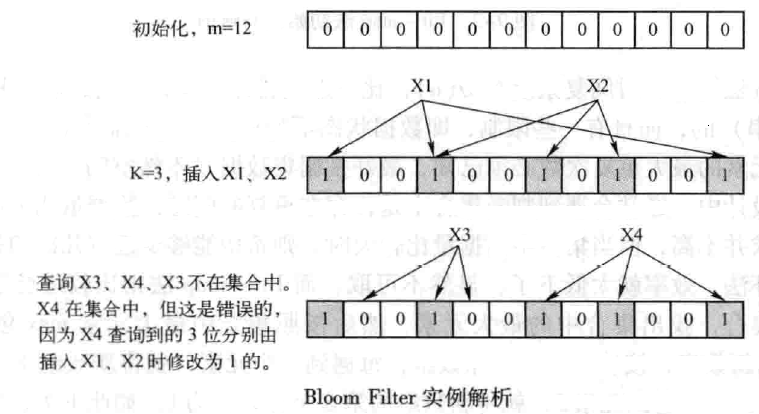

#### 缓存穿透是什么？

关于缓存穿透，简单来说就是系统处理了大量不存在的数据查询。正常的使用缓存流程大致是，数据查询先进行缓存查询，如果key不存在或者key已经过期，再对数据库进行查询，并把查询到的对象，放进缓存。如果数据库查询对象为空，则不放进缓存。现在系统接收了大量不存在的key，缓存层形同虚设，大量请求引向数据库，数据库承受不了压力，宕机。

#### 布隆过滤器是什么？

Bloom Filter适用于判断数据是否在一个集合中。

Bloom Filter的基本原理是位数组与Hash函数的联合使用。

首先，Bloom Filter是一个包含了m位的位数组，数组的每一位都初始化为；其次，定义k个不同的Hash函数，每个函数都可以将集合中的元素映射到位数组的某一位。
当向集合中插入元素时，根据K个Hash函数可以得到位数组中的k个位，如果有的位为0，则元素肯定不在集合中，如果全部为1，则元素可能在集合中，因为在插入其它元素时，可能会将这些位置设为1。

所以，使用Bloom Filter法的难点是如何根据输入元素个数n，来确定位数组m的大小以及Hash函数。

Bloom Filter的优点是具有很好的空间效率和时间效率。它的插入和查询时间都是常数，另外，它不保存元素本身，具有良好的安全性。然而，这些优点都是以牺牲正确率为代价的。当插入的元素越多，错判的概率越大。另外，Bloom Filter只能插入元素，不能删除元素，原因是多个元素可能共用了位数组中的同一个位。