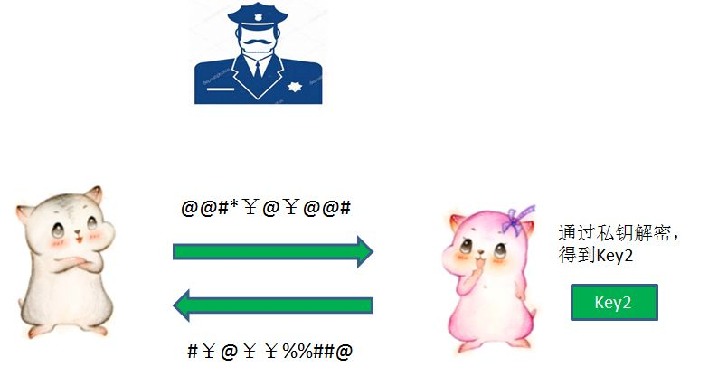
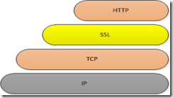

### 1.什么是HTTP协议？

**HTTP**协议是Hyper Text Transfer Protocol（超文本传输协议），位于TCP/IP模型当中的应用层。HTTP协议通过请求/响应的方式，在客户端和服务端之间进行通信。HTTP协议的信息传输完全以明文的方式，不做任何加密，相当于在网络上“裸奔”，所以容易遭受中间人的恶意截获甚至篡改（中间人攻击）。

### 2.什么是HTTPS协议？

**HTTPS**（全称：Hyper Text Transfer Protocol over Secure Socket Layer），是以安全为目标的HTTP通道，简单讲是HTTP的安全版。即HTTP下加入SSL层，HTTPS的安全基础是SSL，因此加密的详细内容就需要SSL。

### 3.对称加密和非对称加密

**对称加密**

对称加密采用了对称密码编码技术，它的特点是文件加密和解密都是使用相同的密钥。

这种方法在密码学中叫做对称加密算法，对称加密算法使用起来简单快捷，密钥较短，且破译困难，除了数据加密标准（DES），另一个对称密钥加密系统是国际数据加密算法（IDEA），它比DES的加密性好，而且对计算机功能要求也没有那么高。

**非对称加密**

与对称加密算法不同，非对称加密算法需要两个密钥：公开密钥（publickey）和私有密钥（privatekey）。

公开密钥与私有密钥是一对，如果用公开密钥对数据进行加密，只有用对应的私有密钥才能解密；如果用私有密钥对数据进行加密，那么只有用对应的公开密钥才能解密。

因为加密和解密使用的是两个不同的密钥，所以这种算法叫作非对称加密算法。

### 4.HTTPS流程

1.服务端首先把自己的公钥（Key1）发给证书颁发机构，向证书颁发机构申请证书。

2.证书颁发机构自己也有一对公钥私钥。机构利用自己的私钥来加密Key1，并且通过服务端网址等信息生成一个证书签名，证书签名同样经过机构的私钥加密。证书制作完成后，机构把证书发送给了服务端。

3.当客户端向服务端请求通信的时候，服务端不再直接返回自己的公钥（Key1），而是把自己申请的证书返回给客户端。

4.客户端收到证书以后，要做的第一件事情是验证证书的真伪。需要说明的是，各大浏览器和操作系统已经维护了所有权威证书机构的名称和公钥。所以客户端只需要知道是哪个机构颁布的证书，就可以从本地找到对应的机构公钥，解密出证书签名。

客户端对证书验证成功后，就可以放心地再次利用证书机构公钥，解密出服务端的公钥Key1。

> 扩展：
> 
> 现在有一些银行网站在进行支付上还会要求用户在电脑上下载安装该银行网站的数字证书，原因就是银行网站使用的是私有的证书颁发机构，用户电脑并没有内置该证书颁发机构的数字证书（含该证书机构的公钥等），所以需要用户自行下载安装。

5.客户端生成自己的对称加密密钥Key2，并且用服务端公钥Key1加密Key2，发送给服务端。

6.服务端用自己的私钥解开加密，得到对称加密密钥Key2。于是客户端与服务端开始用Key2进行对称加密的通信。

你还有什么不理解的呢？欢迎下方评论。

<em style="
    color: #757575;
">本文参考资料及图片来源：</em>

<em><a href="https://www.cnblogs.com/labimeilexin/p/7350448.html" class="uri" style="
    color: #757575;
">https://www.cnblogs.com/labimeilexin/p/7350448.html</a></em>

<em><a href="https://blog.csdn.net/bjweimengshu/article/details/87706654" class="uri" style="
    color: #757575;
">https://blog.csdn.net/bjweimengshu/article/details/87706654</a></em>

<em><a href="https://blog.csdn.net/luweicheng24/article/details/80579731" class="uri" style="
    color: #757575;
">https://blog.csdn.net/luweicheng24/article/details/80579731</a></em>

<em><a href="https://www.jianshu.com/p/14cd2c9d2cd2" class="uri" style="
    color: #757575;
">https://www.jianshu.com/p/14cd2c9d2cd2</a></em>

<em><a href="https://blog.csdn.net/love_hot_girl/article/details/81164279" class="uri" style="
    color: #757575;
">https://blog.csdn.net/love_hot_girl/article/details/81164279</a></em>

<!--
*本文参考资料及图片来源：*

*https://www.cnblogs.com/labimeilexin/p/7350448.html*

*https://blog.csdn.net/bjweimengshu/article/details/87706654*

*https://blog.csdn.net/luweicheng24/article/details/80579731*

*https://www.jianshu.com/p/14cd2c9d2cd2*

*https://blog.csdn.net/love_hot_girl/article/details/81164279*
*-->

