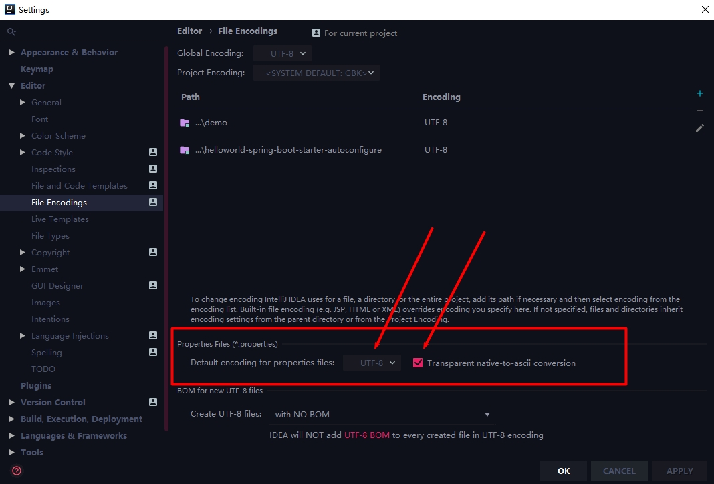

解决方案

在IDEA环境下：

File -> Settings -> Editor -> File Encodings

将Properties Files (*.properties)下的Default encoding for properties files设置为UTF-8，将Transparent native-to-ascii conversion前的勾选上。如图所示：

> 注意：做了上面操作后，一定要重新创建 application.properties 才有效！

*原文：https://www.cnblogs.com/diffx/p/9866717.html*