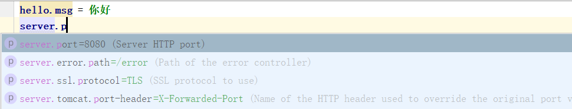

## 1.文章前言

我们都知道可以使用 SpringBoot 快速的开发基于 Spring 框架的项目。由于围绕 SpringBoot 存在很多开箱即用的 Starter 依赖，使得我们在开发业务代码时能够非常方便的、不需要过多关注框架的配置，而只需要关注业务即可。 

例如我想要在 SpringBoot 项目中集成 Redis，那么我只需要加入 spring-data-redis-starter 的依赖，并简单配置一下连接信息以及 Jedis 连接池配置就可以。这为我们省去了之前很多的配置操作。甚至有些功能的开启只需要在启动类或配置类上增加一个注解即可完成。

那么如果我们想要自己实现自己的 Starter 需要做些什么呢？下面就开始介绍如何实现自己的 spring-boot-starter-xxx。

## 2.原理浅谈

从总体上来看，无非就是将Jar包作为项目的依赖引入工程。而现在之所以增加了难度，是因为我们引入的是Spring Boot Starter，所以我们需要去了解Spring Boot对Spring Boot Starter的Jar包是如何加载的？下面我简单说一下。

SpringBoot 在启动时会去依赖的 starter 包中寻找 /META-INF/spring.factories 文件，然后根据文件中配置的路径去扫描项目所依赖的 Jar 包，这类似于 Java 的 SPI 机制。  

细节上可以使用@Conditional 系列注解实现更加精确的配置加载Bean的条件。

> **JavaSPI 实际上是“基于接口的编程＋策略模式＋配置文件”组合实现的动态加载机制。** 

## 3.实现自动配置

接下来我会实现一个普通的Spring Boot Web工程，该工程有一个Service类，类的sayHello方法会返回一个字符串，字符串可以通过application配置文件进行配置。

1.新建一个Spring Boot工程，命名为spring-boot-starter-hello，pom.xml依赖：

```xml
<dependency>
     <groupId>org.springframework.boot</groupId>
     <artifactId>spring-boot-starter-web</artifactId>
</dependency>
```

**工程命名规范**

官方命名格式为： spring-boot-starter-{name} 

非官方建议命名格式：{name}-spring-boot-starter

这里只是为了演示，个人项目建议跟随官方命名规范。

2.新建HelloProperties类，定义一个hello.msg参数（默认值World！）。

```java
@ConfigurationProperties(prefix = "hello")
public class HelloProperties {
    /**
     * 打招呼的内容，默认为“World!”
     */
    private String msg = "World!";

    public String getMsg() {
        return msg;
    }

    public void setMsg(String msg) {
        this.msg = msg;
    }
}
```

3.新建HelloService类，使用HelloProperties类的属性。

```java
@Service
public class HelloService {
    @Autowired
    private HelloProperties helloProperties;

    /**
     * 打招呼方法
     *
     * @param name 人名，向谁打招呼使用
     * @return
     */
    public String sayHello(String name) {
        return "Hello " + name + " " + helloProperties.getMsg();
    }
}
```

4.自动配置类，可以理解为实现自动配置功能的一个入口。

```java
//定义为配置类
@Configuration
//在web工程条件下成立
@ConditionalOnWebApplication
//启用HelloProperties配置功能，并加入到IOC容器中
@EnableConfigurationProperties({HelloProperties.class})
//导入HelloService组件
@Import(HelloService.class)
//@ComponentScan
public class HelloAutoConfiguration {
}
```

5.在resources目录下新建META-INF目录，并在META-INF下新建spring.factories文件，写入：

```factories
org.springframework.boot.autoconfigure.EnableAutoConfiguration=\
  com.example.springbootstarterhello.HelloAutoConfiguration
```

6.项目到这里就差不多了，不过作为依赖，最好还是再做一下收尾工作。

1. 删除自动生成的启动类SpringBootStarterHelloApplication。
2. 删除resources下的除META-INF目录之外的所有文件目录。
3. 删除spring-boot-starter-test依赖并且删除test目录。

7.执行mvn install将spring-boot-starter-hello安装到本地。

当你直接执行时应该会报错，因为我们还需要在pom.xml去掉spring-boot-maven-plugin，也就是下面这段代码。

```xml
    <build>
        <plugins>
            <plugin>
                <groupId>org.springframework.boot</groupId>
                <artifactId>spring-boot-maven-plugin</artifactId>
            </plugin>
        </plugins>
    </build>
```

8.随便新建一个Spring Boot工程，引入spring-boot-starter-hello依赖。

```xml
<dependency>
      <groupId>com.example</groupId>
      <artifactId>spring-boot-starter-hello</artifactId>
      <version>0.0.1-SNAPSHOT</version>
</dependency>
```

9.在新工程中使用spring-boot-starter-hello的sayHello功能。

```java
@SpringBootApplication
@Controller
public class DemoApplication {

    public static void main(String[] args) {
        SpringApplication.run(DemoApplication.class, args);
    }

    @Autowired
    private HelloService helloService;

    @RequestMapping(value = "/sayHello")
    @ResponseBody
    public String sayHello(String name){
        System.out.println(helloService.sayHello(name));
        return helloService.sayHello(name);
    }
}
```

访问http://localhost:8080/sayHello?name=Mark

浏览器打印：Hello Mark World! 

在application.properties文件中配置属性：hello.msg = 你好！

重启项目，再次刷新访问，浏览器响应：Hello Mark 你好！

> 如果你遇到中文乱码，可以参考 [Spring boot读取application.properties中文乱码](/) 

## 4.元数据的配置

到目前为止，spring-boot-starter-hello的自动配置功能已实现，并且正确使用了，但还有一点不够完美，如果你也按上面步骤实现了自己的spring-boot-starter-hello自动配置，在application.properties中配置hello.msg属性时，你会发现并没有提示你有关该配置的信息，但是如果你想配置tomcat端口时，输入server.port是有提示的： 




这种功能如何做呢？在Spring Boot官方文档中就已经给出了方法，新建META-INF/spring-configuration-metadata.json文件，进行配置。


那如何对spring-boot-starter-hello项目配置元数据呢？代码如下：

```json
{
  "hints":[{
    "name":"hello.msg",
    "values":[{
      "value":"你好",
      "description":"中文方式打招呼"
    },{
      "value":"Hi",
      "description":"英文方式打招呼"
    }]
  }],
  "groups":[
    {
      "sourceType": "com.example.springbootstarterhello.HelloProperties",
      "name": "hello",
      "type": "com.example.springbootstarterhello.HelloProperties"
    }],
  "properties":[
    {
      "sourceType": "com.example.springbootstarterhello.HelloProperties",
      "name": "hello.msg",
      "type": "java.lang.String",
      "description": "打招呼的内容",
      "defaultValue": "Worlds"
    }]
}
```

然后我们将spring-boot-starter-hello项目重新打包使用，如下图所示，就有了属性的提示： 


下面我们就列出有关groups、properties、hints具体使用，不过我建议你可以先跳过这部分枯燥的内容。


### 4.1 Group属性

“groups”中包含的JSON对象可以包含下表中显示的属性：

| **名称**     | **类型** | **用途**                                                     |
| ------------ | -------- | ------------------------------------------------------------ |
| name         | String   | “groups”的全名。这个属性是强制性的                           |
| type         | String   | group数据类型的类名。例如，如果group是基于一个被@ConfigurationProperties注解的类，该属性将包含该类的全限定名。如果基于一个@Bean方法，它将是该方法的返回类型。如果该类型未知，则该属性将被忽略 |
| description  | String   | 一个简短的group描述，用于展示给用户。如果没有可用描述，该属性将被忽略。推荐使用一个简短的段落描述，第一行提供一个简洁的总结，最后一行以句号结尾 |
| sourceType   | String   | 贡献该组的来源类名。例如，如果组基于一个被@ConfigurationProperties注解的@Bean方法，该属性将包含@Configuration类的全限定名，该类包含此方法。如果来源类型未知，则该属性将被忽略 |
| sourceMethod | String   | 贡献该组的方法的全名（包含括号及参数类型）。例如，被@ConfigurationProperties注解的@Bean方法名。如果源方法未知，该属性将被忽略 |

### 4.2 Property属性

properties数组中包含的JSON对象可由以下属性构成：

| **名称**     | **类型**   | **用途**                                                     |
| ------------ | ---------- | ------------------------------------------------------------ |
| name         | String     | property的全名，格式为小写虚线分割的形式（比如server.servlet-path）。该属性是强制性的 |
| type         | String     | property数据类型的类名。例如java.lang.String。该属性可以用来指导用户他们可以输入值的类型。为了保持一致，原生类型使用它们的包装类代替，比如boolean变成了java.lang.Boolean。注意，这个类可能是个从一个字符串转换而来的复杂类型。如果类型未知则该属性会被忽略 |
| description  | String     | 一个简短的组的描述，用于展示给用户。如果没有描述可用则该属性会被忽略。推荐使用一个简短的段落描述，开头提供一个简洁的总结，最后一行以句号结束 |
| sourceType   | String     | 贡献property的来源类名。例如，如果property来自一个被@ConfigurationProperties注解的类，该属性将包括该类的全限定名。如果来源类型未知则该属性会被忽略 |
| defaultValue | Object     | 当property没有定义时使用的默认值。如果property类型是个数组则该属性也可以是个数组。如果默认值未知则该属性会被忽略 |
| deprecated   | Deprecated | 指定该property是否过期。如果该字段没有过期或该信息未知则该属性会被忽略 |
| level        | String     | 弃用级别，可以是警告(默认)或错误。当属性具有警告弃用级别时，它仍然应该在环境中绑定。然而，当它具有错误弃用级别时，该属性不再受管理，也不受约束 |
| reason       | String     | 对属性被弃用的原因的简短描述。如果没有理由，可以省略。建议描述应是简短的段落，第一行提供简明的摘要。描述中的最后一行应该以句点(.)结束 |
| replacement  | String     | 替换这个废弃属性的属性的全名。如果该属性没有替换，则可以省略该属性。 |

### 4.3 hints属性

hints数组中包含的JSON对象可以包含以下属性：

| **名称**  | **类型**        | **用途**                                                     |
| --------- | --------------- | ------------------------------------------------------------ |
| name      | String          | 该提示引用的属性的全名。名称以小写虚构形式（例如server.servlet-path）。果属性是指地图（例如 system.contexts），则提示可以应用于map（）或values（）的键。此属性是强制性的system.context.keyssystem.context.values |
| values    | ValueHint[]     | 由ValueHint对象定义的有效值的列表（见下文）。每个条目定义该值并且可以具有描述 |
| providers | ValueProvider[] | 由ValueProvider对象定义的提供者列表（见下文）。每个条目定义提供者的名称及其参数（如果有）。 |

每个"hints"元素的values属性中包含的JSON对象可以包含下表中描述的属性：

| **名称**    | **类型** | **用途**                                                     |
| ----------- | -------- | ------------------------------------------------------------ |
| value       | Object   | 提示所指的元素的有效值。如果属性的类型是一个数组，那么它也可以是一个值数组。这个属性是强制性的 |
| description | String   | 可以显示给用户的值的简短描述。如果没有可用的描述，可以省略。建议描述应是简短的段落，第一行提供简明的摘要。描述中的最后一行应该以句点(.)结束。 |

每个"hints"元素的providers属性中的JSON对象可以包含下表中描述的属性:

| **名称**   | **类型**    | **用途**                                                   |
| ---------- | ----------- | ---------------------------------------------------------- |
| name       | String      | 用于为提示所指的元素提供额外内容帮助的提供者的名称。       |
| parameters | JSON object | 提供程序支持的任何其他参数(详细信息请参阅提供程序的文档)。 |

## 5.spring-boot-configuration-processor

配置上述数据是挺麻烦的，如果可以提供一种自动生成spring-configuration-metadata.json的依赖就好了。别说，还真有。spring-boot-configuration-processor依赖就可以做到，它的基本原理是在编译期使用注解处理器自动生成spring-configuration-metadata.json文件。文件中的数据来源于你是如何在类中定义hello.msg这个属性的，它会自动采集hello.msg的默认值和注释信息。不过我在测试时发现了中文乱码问题，而且网上有关spring-boot-configuration-processor的学习文档略少。

下面我贴出使用spring-boot-configuration-processor自动生成的spring-configuration-metadata.json文件内容：

```json
{
  "groups": [
    {
      "name": "hello",
      "type": "com.example.springbootstarterhello.HelloProperties",
      "sourceType": "com.example.springbootstarterhello.HelloProperties"
    }
  ],
  "properties": [
    {
      "name": "hello.msg",
      "type": "java.lang.String",
      "description": "打招呼的内容，默认为“World!”",
      "sourceType": "com.example.springbootstarterhello.HelloProperties",
      "defaultValue": "World!"
    }
  ],
  "hints": []
}
```

可以看到properties里的description属性值来源于注释信息，defaultValue值来源于代码中书写的默认值。

> 这一步需要在idea设置中搜索Annotation Processors，勾住Enable annonation processing。 

## 6.@Conditional 注解及作用

之前提到了在细节上可以使用@Conditional 系列注解实现更加精确的配置加载Bean的条件。下面列举 SpringBoot 中的所有 @Conditional 注解及作用

| 注解                            | 作用                                                         |
| ------------------------------- | ------------------------------------------------------------ |
| @ConditionalOnBean              | 当容器中有指定的Bean的条件下                                 |
| @ConditionalOnClass             | 当类路径下有指定的类的条件下                                 |
| @ConditionalOnExpression        | 基于SpEL表达式作为判断条件                                   |
| @ConditionalOnJava              | 基于JVM版本作为判断条件                                      |
| @ConditionalOnJndi              | 在JNDI存在的条件下查找指定的位                               |
| @ConditionalOnMissingBean       | 当容器中没有指定Bean的情况下                                 |
| @ConditionalOnMissingClass      | 当类路径下没有指定的类的条件下                               |
| @ConditionalOnNotWebApplication | 当前项目不是Web项目的条件下                                  |
| @ConditionalOnProperty          | 指定的属性是否有指定的值                                     |
| @ConditionalOnResource          | 类路径下是否有指定的资源                                     |
| @ConditionalOnSingleCandidate   | 当指定的Bean在容器中只有一个，或者在有多个Bean的情况下，用来指定首选的Bean |
| @ConditionalOnWebApplication    | 当前项目是Web项目的条件下                                    |

比如，注解`@ConditionalOnProperty(prefix = "example.service",name= "enabled",havingValue = "true",matchIfMissing = false)`的意思是当配置文件中`example.service.enabled=true`时，条件才成立。

当这些注解不再满足我们的需求之后，还可以通过实现 Condition 接口，自定义条件判断：

```java
public class RedisExistsCondition implements Condition {
    @Override
    public boolean matches(ConditionContext context, AnnotatedTypeMetadata metadata) {
        StringRedisTemplate redisTemplate = null;
        try {
            redisTemplate = context.getBeanFactory().getBean(StringRedisTemplate.class);
        } catch (BeansException e) {
//            e.printStackTrace();
        }
        if (redisTemplate == null){
            return false;
        }
        return true;
    }
}

 //使用示例
@Conditional(RedisExistsCondition.class) 
```

***本文鸣谢：***

*[编写自己的SpringBoot-starter](https://mp.weixin.qq.com/s/a--34E6iFTopUVC6orW7Jw)*

*[SpringBoot自定义Starter](https://shimo.im/docs/ywxu41XEYxYXYy3U/read)*


