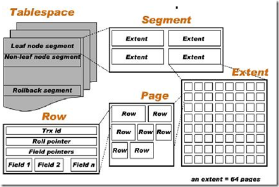

MyIsam与InnoDB主要有以下4点大的区别，缓存机制，事务支持，锁定实现，数据物理存储方式（包括索引和数据）。

### 1.缓存机制

myisam 仅仅缓存索引，不会缓存实际数据信息，他会将这一工作交给OS级别的文件系统缓存。所以mysiam缓存优化工作集中在索引缓存优化上。

InnoDB 有自己的缓存(buffer pool)，不仅仅缓存索引，还缓存表数据。

（由于myisam不会缓存表数据文件（.MYD）,每次读取数据文件都需要调用文件系统的相关指令从磁盘上读取物理文件。所以每次读取数据文件所需的内存缓冲区的设置就对数据文件的访问性能非常重要。mysql提供了以下两种读取数据文件缓冲区，Sequential Scan方式（如全表扫描）Random Scan（如通过索引扫描），这两个缓冲区不是某个存储引擎特有的，都是线程独享，每个线程在需要的时候都会创建一个（或者两个）系统中设置设置大小的缓冲区。）

### 2.事务支持

myisam 不支持事务。

InnoDB 支持事务，也支持主外键。

### 3.锁定实现

myisam 锁定是由mysql服务控制，只支持表级锁。

innoDB 锁定交由InnoDB存储引擎，支持行级锁，页级锁等粒度更小的锁定级别。由于锁定级别的差异，在更新并行度上InnoDB会比myisam好很多

### 4.数据物理存储方式（包括索引和数据）

**1、文件存放方式**

myisam 每个表有三个文件，.frm 存放表结构数据.MYI 存放索引信息.MYD存放表数据

innodb 存储数据有.FRM存放表定义，.ibd(独享表空间)，.ibdata(共享表空间).innodb存储数据分独立表空间和共享表空间(具体使用哪个由innodb_file_per_table变量确定)，独享表空间存储方式使用&ldquo;.ibd&rdquo;文件来存放数据，且每个表一个&ldquo;.ibd&rdquo;文件，文件存放在和MyISAM 数据相同的位置，由datadir确定。如果选用共享存储表空间来存放数据，则会使用ibdata 文件来存放，所有表共同使用一个（或者多个，可自行配置）ibdata 文件。ibdata 文件可以通过innodb_data_home_dir 和innodb_data_file_path
两个参数共同配置组成， innodb_data_home_dir 配置数据存放的总目录。

**2、表数据物理存放方式**

myisam 表数据存放在.MYD文件里，没有使用页来存储数据，也没有表空间的概念。myisam没有聚集索引。myisam有三种存储格式：静态格式，动态格式，压缩格式。

InnoDB 将所有数据存放在数据页中（page）,一般情况下非压缩页大小16K。InnoDB的数据文件本身要按主键聚集，所以InnoDB要求表必须有主键（MyISAM可以没有），如果没有显式指定，则MySQL系统会自动选择一个可以唯一标识数据记录的列作为主键，如果不存在这种列，则MySQL自动为InnoDB表生成一个隐含字段作为主键，这个字段长度为6个字节，类型为长整形。innod有共享表空间和独享表空间之分，由innodb_file_per_table参数控制。以下为InnoDB的表空间结构图：

InnoDB 行，页，集合，段，表空间之间的关系

**3、索引数据存储方式**

MyIsam 索引文件和数据文件是分离的，索引文件仅保存数据记录的地址。主索引和辅助索引没有区别都是非聚集索引。索引页正常大小为1024字节，索引页存放在.MYI 文件中。MyISAM引擎使用B+Tree作为索引结构，叶节点的data域存放的是数据记录的地址。下图是MyISAM索引的原理图：（借图）

InnoDB 也使用B+Tree作为索引结构，索引页大小16，和表数据页共同存放在表空间中。从InnoDB表数据存放方式可看出InnoDB表数据文件本身就是按B+Tree组织的一个索引结构，这棵树的叶节点data域保存了完整的数据记录。这个索引的key是数据表的主键，因此InnoDB表数据文件本身就是主索引。下图是主索引也就是表数据本身的结构图（借的blog.codinglabs.org）也可以称为聚集索引

下图是辅助索引结构图：

[

以上参考mysql 核心内幕总结的，有不对的地方欢迎拍砖。

*本文转载自：[https://www.cnblogs.com/ijia/p/3826990.html](https://www.cnblogs.com/ijia/p/3826990.html#4233076)*