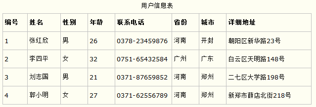
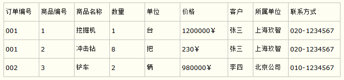

> 什么是范式：简言之就是，数据库设计对数据的存储性能，还有开发人员对数据的操作都有莫大的关系。所以建立科学的，规范的的数据库是需要满足一些规范的来优化数据数据存储方式。在关系型数据库中这些规范就可以称为范式。

三大范式的定义：

1. 第一范式：每个属性值都必须是原子值，即仅仅是一个简单值而不含内部结构。

2. 第二范式：满足第一范式条件，而且每个非关键字属性都由整个关键字决定（而不是由关键字的一部分来决定）。

3. 第三范式：符合第二范式的条件，每个非关键字属性都仅由关键字决定，而且一个非关键字属性不能仅仅是对另一个非关键字属性的进一步描述（即一个非关键字属性值不依赖于另一个非关键字属性值）。

> 以下仅供参考！

#### 第一范式：当关系模式R的所有属性都不能在分解为更基本的数据单位时，称R是满足第一范式的，简记为1NF。

第一范式是最基本的范式。如果数据库表中的**所有字段值都是不可分解的原子值**，就说明该数据库满足第一范式。

第一范式的合理遵循需要根据系统给的实际需求来确定。比如某些数据库系统中需要用到“地址”这个属性，本来直接将“地址”属性设计成为一个数据库表的字段就行，但是如果系统经常访问“地址”属性中的“城市”部分，那么一定要把“地址”这个属性重新拆分为省份、城市、详细地址等多个部分来进行存储，这样对地址中某一个部分操作的时候将非常方便，这样设计才算满足数据库的第一范式。如下图。

#### 第二范式：如果关系模式R满足第一范式，并且R得所有非主属性都完全依赖于R的每一个候选关键属性，称R满足第二范式，简记为2NF。

第二范式在第一范式的基础上更进一层，**第二范式需要确保数据库表中每一列都和主键相关，而不能只与主键的某一部分相关（主要针对联合主键而言）**。也就是说在一个数据库表中，一个表中只能保存一种数据，不可以把多种数据保存在同一张数据库表中。

比如要设计一个订单信息表，因为订单中可能会有多种商品，所以要将订单编号和商品编号作为数据库表的联合主键，如下图。

这里产生一个问题：这个表中是以订单编号和商品编号作为联合主键，这样在该表中商品名称、单位、商品价格等信息不与该表的主键相关，而仅仅是与商品的编号相关，所以在这里违反了第二范式的设计原则。

而如果把这个订单信息表进行拆分，把商品信息分离到另一个表中，把订单项目表也分离到另一个表中，就非常完美了，如下图。

这里这样设计，在很大程度上减小了数据库的冗余，如果要获取订单的商品信息，使用商品编号到商品信息表中查询即可。

#### 第三范式：设R是一个满足第一范式条件的关系模式，X是R的任意属性集，如果X非传递依赖于R的任意一个候选关键字，称R满足第三范式，简记为3NF.

第三范式需要确保数据表中的**每一列数据都和主键直接相关，而不能间接相关。**

比如在设计一个订单数据表的时候，可以将客户编号作为一个外键和订单表建立相应的关系，而不可以在订单表中添加关于客户其他信息（比如姓名、所属公司）的字段，如下面这两个表所示的设计就是一个满足第三范式的数据库表。

这样在查询订单信息的时候，就可以使用客户编号来引用客户信息表中的记录，也不必在订单信息表中多次输入客户信息的内容，减小了数据冗余。

本文参考：https://www.cnblogs.com/1906859953Lucas/p/8299959.html

