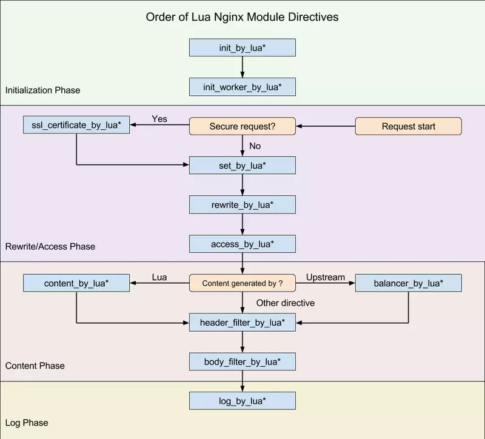

> 记住一点：nginx配置文件很多坑来源自你的空格少了或多了。

## OpenResty

OpenResty® 是一个基于 Nginx 与 Lua 的高性能 Web 平台，其内部集成了大量精良的 Lua 库、第三方模块以及大多数的依赖项。用于方便地搭建能够处理超高并发、扩展性极高的动态 Web 应用、Web 服务和动态网关。

OpenResty® 通过汇聚各种设计精良的 Nginx 模块（主要由 OpenResty 团队自主开发），从而将 Nginx 有效地变成一个强大的通用 Web 应用平台。这样，Web 开发人员和系统工程师可以使用 Lua 脚本语言调动 Nginx 支持的各种 C 以及 Lua 模块，快速构造出足以胜任 10K 乃至 1000K 以上单机并发连接的高性能 Web 应用系统。

OpenResty® 的目标是让你的Web服务直接跑在 Nginx 服务内部，充分利用 Nginx 的非阻塞 I/O 模型，不仅仅对 HTTP 客户端请求,甚至于对远程后端诸如 MySQL、PostgreSQL、Memcached 以及 Redis 等都进行一致的高性能响应。

## 1.Centos下载安装

如果你的系统是 Centos 或 RedHat 可以使用以下命令：

```shell
yum install readline-devel pcre-devel openssl-devel
```

接下我们可以在官方（<https://openresty.org/cn/>）下载最新的 OpenResty 源码包并解压编译安装:

```shell
wget https://openresty.org/download/ngx_openresty-1.9.7.1.tar.gz   # 下载
tar xzvf ngx_openresty-1.9.7.1.tar.gz       # 解压
cd ngx_openresty-1.9.7.1/ 
./configure
make 
make install
```

默认情况下程序会被安装到 /usr/local/openresty 目录，你可以使用 ./configure --help 查看更多的配置选项。

## 2.HelloWorld实例

安装成功后，我们就可以使用 openresty 直接输出 html 页面。

首先我们可以创建一个工作目录：

```shell
mkdir /home/www
cd /home/www/
mkdir logs/ conf/
```

其中 logs 目录用于存放日志，conf 用于存放配置文件。

接着，我们在 conf 目录下创建一个 nginx.conf 文件 代码如下：

```nginx
worker_processes  1;
error_log logs/error.log;
events {
    worker_connections 1024;
}
http {
    server {
        listen 9000;
        location / {
            default_type text/html;
            content_by_lua '
                ngx.say("<p>Hello, World!</p>")
            ';
        }
    }
}
```

如果你熟悉 nginx 的配置，应该对以上代码就很熟悉。这里我们将 html 代码直接写在了配置文件中。

### 启动 openresty

默认情况下 openresty 安装在 /usr/local/openresty 目录中，启动命令为:

```shell
/usr/local/openresty/nginx/sbin/nginx -p /home/www/ -c conf/nginx.conf
```

如果没有任何输出，说明启动成功，-p 指定我们的项目目录，-c 指定配置文件。

接下来我们可以使用 curl 来测试是否能够正常范围：

```java
curl http://localhost:9000/
```

输出结果为：

```java
<p>Hello, World!</p>
```

## 3.调用Lua脚本文件

在 HelloWorld 实例中，我们直接在 nginx.conf 中写Lua脚本，很多时候，Lua脚本是一个文件。下面演示使用 content_by_lua_file 指令调用Lua脚本文件。

在conf文件夹下创建helloworld.lua：

```lua
ngx.say("<p>Hello, World!</p>")
```

修改你的 nginx.conf 文件内容为：

```nginx
worker_processes  1;
error_log logs/error.log;
events {
    worker_connections 1024;
}
http {
    server {
        listen 9000;
        location / {
            default_type text/html;
            content_by_lua_file 'conf/helloworld.lua';
        }
    }
}
```

停止已启动的nginx进程：

```shell
killall -9 nginx
```

启动nginx进程：

```shell
/usr/local/openresty/nginx/sbin/nginx -p /home/www/ -c conf/nginx.conf
```

接下来我们可以使用 curl 来测试是否能够正常范围：

```shell
curl 'localhost:9000'
```

输出结果为：

```java
<p>Hello, World!</p>
```

## 4.set_by_lua指令

使用 set_by_lua 指定可以用类似调用函数的形式去调用Lua脚本。语法：

```java
set_by_lua $res <lua-script-str> [$arg1 $arg2 ...]
```

修改你的conf/nginx.conf文件：

```nginx
worker_processes  1;
error_log logs/error.log;
events {
    worker_connections 1024;
}
http {
    server {
        listen 9000;
        location / {
            default_type text/html;
            set_by_lua $res '
                local a = tonumber(ngx.arg[1])
                local b = tonumber(ngx.arg[2])
                return a+b' $arg_a $arg_b;
            echo $res;
        }
    }
}
```

停止已启动的nginx进程，命令：

```shell
killall -9 nginx
```

启动nginx进程：

```shell
/usr/local/openresty/nginx/sbin/nginx -p /home/www/ -c conf/nginx.conf
```

接下来我们可以使用 curl 来测试是否能够正常范围：

```shell
curl 'localhost:9000/?a=2&b=5'
```

输出结果为：

```java
7
```

## 5.set_by_lua_file指令

set_by_lua_file可以调用本地Lua脚本文件。语法与set_by_lua相同：

```java
set_by_lua_file $res <lua-script-str> [$arg1 $arg2 ...]
```

在conf文件夹下创建hello.lua文件：

```lua
local a = tonumber(ngx.arg[1])
local b = tonumber(ngx.arg[2])
return a+b
```

在conf文件夹下创建nginx_lua.conf文件：

```nginx
worker_processes  1;
error_log logs/error.log;
events {
    worker_connections 1024;
}
http {
    server {
        listen 9000;
        location = / {
            default_type text/html;
            set_by_lua_file $res "conf/hello.lua" $arg_a $arg_b;
            echo $res;
        }
    }
}
```

启动nginx进程：

```shell
/usr/local/openresty/nginx/sbin/nginx -p /home/www/ -c conf/nginx_lua.conf
```

接下来我们可以使用 curl 来测试是否能够正常范围：

```shell
curl 'localhost:9000/?a=2&b=5'
```

输出结果为：

```java
7
```

## 6.设置nginx变量

在conf文件夹下创建nginx.conf文件：

```nginx
worker_processes  1;
error_log logs/error.log;
events {
    worker_connections 1024;
}
http {
    server {
        listen 9000;
        location / {
        	set $a $host;
        	set $b 'hello world';
            default_type text/html;
            content_by_lua_file 'conf/hello.lua';
        }
    }
}
```

在conf文件夹下创建hello.lua：

```lua
local var = ngx.var
ngx.say("ngx.var.a : ", var.a, "<br/>")
ngx.say("ngx.var.b : ", var.b, "<br/>")
ngx.say("<br/>")
```

启动nginx进程：

```shell
/usr/local/openresty/nginx/sbin/nginx -p /home/www/ -c conf/nginx_lua.conf
```

接下来我们可以使用 curl 来测试是否能够正常范围：

```shell
curl 'localhost:9000'
```

输出结果为：

```shell
ngx.var.a : localhost<br/>
ngx.var.b : hello world<br/>
```
## 7.运行周期

现在已经学会了content_by_lua 与 set_by_lua 指令，其它类似的指令还有很多，那么这些指令都是有什么区别呢？主要区别是指令的运行周期不同，如图所示。（图片来源于网络）



## 8.其它指令

|                        指令                         |     所处处理阶段     |               使用范围                | 解释                                                         |
| :-------------------------------------------------: | :------------------: | :-----------------------------------: | :----------------------------------------------------------- |
|          init_by_lua<br />init_by_lua_file          |    loading-config    |                 http                  | nginx Master进程加载配置时执行；通常用于初始化全局配置/预加载Lua模块 |
|   init_worker_by_lua<br />init_worker_by_lua_file   |   starting-worker    |                 http                  | 每个Nginx Worker进程启动时调用的计时器，如果Master进程不允许则只会在init_by_lua之后调用；通常用于定时拉取配置/数据，或者后端服务的健康检查 |
|           set_by_lua<br />set_by_lua_file           |       rewrite        | server,server if,location,location if | 设置nginx变量，可以实现复杂的赋值逻辑；此处是阻塞的，Lua代码要做到非常快； |
|       rewrite_by_lua<br />rewrite_by_lua_file       |     rewrite tail     |   http,server,location,location if    | rrewrite阶段处理，可以实现复杂的转发/重定向逻辑；            |
|        access_by_lua<br />access_by_lua_file        |     access tail      |   http,server,location,location if    | 请求访问阶段处理，用于访问控制                               |
|       content_by_lua<br />content_by_lua_file       |       content        |         location，location if         | 内容处理器，接收请求处理并输出响应                           |
| header_filter_by_lua<br />header_filter_by_lua_file | output-header-filter |  http，server，location，location if  | 设置header和cookie                                           |
|   body_filter_by_lua<br />body_filter_by_lua_file   |  output-body-filter  |  http，server，location，location if  | 对响应数据进行过滤，比如截断、替换。                         |
|           log_by_lua<br />log_by_lua_file           |         log          |  http，server，location，location if  | log阶段处理，比如记录访问量/统计平均响应时间                 |

## 9.Nginx API

将下面的lua脚本复制到你的content_by_lua_file指定的lua文件中即可。

```lua
--请求头
local headers = ngx.req.get_headers()
ngx.say("headers begin", "<br/>")
ngx.say("Host : ", headers["Host"], "<br/>")
ngx.say("user-agent : ", headers["user-agent"], "<br/>")
ngx.say("user-agent : ", headers.user_agent, "<br/>")
for k, v in pairs(headers) do
    if type(v) == "table" then
        ngx.say(k, " : ", table.concat(v, ","), "<br/>")
    else
        ngx.say(k, " : ", v, "<br/>")
    end
end
ngx.say("headers end", "<br/>")
ngx.say("<br/>")

--get请求uri参数
ngx.say("uri args begin", "<br/>")
local uri_args = ngx.req.get_uri_args()
for k, v in pairs(uri_args) do
    if type(v) == "table" then
        ngx.say(k, " : ", table.concat(v, ", "), "<br/>")
    else
        ngx.say(k, ": ", v, "<br/>")
    end
end
ngx.say("uri args end", "<br/>")
ngx.say("<br/>")

--post请求参数
ngx.req.read_body()
ngx.say("post args begin", "<br/>")
local post_args = ngx.req.get_post_args()
for k, v in pairs(post_args) do
    if type(v) == "table" then
        ngx.say(k, " : ", table.concat(v, ", "), "<br/>")
    else
        ngx.say(k, ": ", v, "<br/>")
    end
end
ngx.say("post args end", "<br/>")
ngx.say("<br/>")

--请求的http协议版本
ngx.say("ngx.req.http_version : ", ngx.req.http_version(), "<br/>")
--请求方法
ngx.say("ngx.req.get_method : ", ngx.req.get_method(), "<br/>")
--原始的请求头内容
ngx.say("ngx.req.raw_header : ", ngx.req.raw_header(), "<br/>")
--请求的body内容体
ngx.say("ngx.req.get_body_data() : ", ngx.req.get_body_data(), "<br/>")
ngx.say("<br/>")

local request_uri = ngx.var.request_uri;
ngx.say("request_uri : ", request_uri, "<br/>");
--解码
ngx.say("decode request_uri : ", ngx.unescape_uri(request_uri), "<br/>");
--MD5
ngx.say("ngx.md5 : ", ngx.md5("123"), "<br/>")
--http time
ngx.say("ngx.http_time : ", ngx.http_time(ngx.time()), "<br/>")

--当前时间
ngx.update_time()
local now = ngx.now()
ngx.say("nowTime : ", now, "<br/>")
```

访问 http://127.0.0.1:9000/?a=8&b=55 ，手动输入两个Cookie，输出结果：

```java
headers begin
Host : 127.0.0.1:9000
user-agent : Mozilla/5.0 (Windows NT 10.0; Win64; x64) AppleWebKit/537.36 (KHTML, like Gecko) Chrome/73.0.3683.86 Safari/537.36
user-agent : Mozilla/5.0 (Windows NT 10.0; Win64; x64) AppleWebKit/537.36 (KHTML, like Gecko) Chrome/73.0.3683.86 Safari/537.36
accept-language : zh-CN,zh;q=0.9
connection : keep-alive
accept : text/html,application/xhtml+xml,application/xml;q=0.9,image/webp,image/apng,*/*;q=0.8,application/signed-exchange;v=b3
cache-control : max-age=0
host : 127.0.0.1:9000
cookie : hello=world; Heelo=Sdd
accept-encoding : gzip, deflate
upgrade-insecure-requests : 1
user-agent : Mozilla/5.0 (Windows NT 10.0; Win64; x64) AppleWebKit/537.36 (KHTML, like Gecko) Chrome/73.0.3683.86 Safari/537.36
headers end

uri args begin
b: 55
a: 8
uri args end

post args begin
post args end

ngx.req.http_version : 1.1
ngx.req.get_method : GET
ngx.req.raw_header : GET /?a=8&b=55 HTTP/1.1 Host: 127.0.0.1:9000 Connection: keep-alive Cache-Control: max-age=0 Upgrade-Insecure-Requests: 1 User-Agent: Mozilla/5.0 (Windows NT 10.0; Win64; x64) AppleWebKit/537.36 (KHTML, like Gecko) Chrome/73.0.3683.86 Safari/537.36 Accept: text/html,application/xhtml+xml,application/xml;q=0.9,image/webp,image/apng,*/*;q=0.8,application/signed-exchange;v=b3 Accept-Encoding: gzip, deflate Accept-Language: zh-CN,zh;q=0.9 Cookie: hello=world; Heelo=Sdd 
ngx.req.get_body_data() : nil

request_uri : /?a=8&b=55
decode request_uri : /?a=8&b=55
ngx.md5 : 202cb962ac59075b964b07152d234b70
ngx.http_time : Mon, 29 Apr 2019 14:53:17 GMT
```

Lua如何调用系统shell呢？

```lua
--调用系统命令
local t = io.popen('cat /home/www/conf/hello.lua')
local a = t:read("*all")
t:close()
ngx.say(a)
```

## 10.Lua发起Http请求

Lua发送Http请求，默认是不支持的，需要引入第三方库。也就是下方这个Github地址的两个文件：[http.lua](https://github.com/ledgetech/lua-resty-http/blob/master/lib/resty/http.lua) 和 [http_headers.lua](https://github.com/ledgetech/lua-resty-http/blob/master/lib/resty/http_headers.lua) 。

Github：<https://github.com/ledgetech/lua-resty-http/tree/master/lib/resty> 

流程和上方的Demo类似，不同的是，需要在你的 lua 文件中写入一行代码：

```lua
local http = require "resty.http"
```

启动你的 nginx ，命令同上。使用 curl 命令测试访问，查看 logs 目录下的 error.log 文件：

```log
2019/04/30 14:23:21 [error] 7093#0: *1 lua entry thread aborted: runtime error: /home/www/conf/helloworld.lua:95: module 'resty.http' not found:
	no field package.preload['resty.http']
	no file '/usr/local/openresty/lualib/resty/http.lua'
	no file '/usr/local/openresty/lualib/resty/http/init.lua'
	no file './resty/http.lua'
	no file '/usr/local/openresty/luajit/share/luajit-2.1.0-beta1/resty/http.lua'
	no file '/usr/local/share/lua/5.1/resty/http.lua'
	no file '/usr/local/share/lua/5.1/resty/http/init.lua'
	no file '/usr/local/openresty/luajit/share/lua/5.1/resty/http.lua'
	no file '/usr/local/openresty/luajit/share/lua/5.1/resty/http/init.lua'
	no file '/usr/local/openresty/lualib/resty/http.so'
	no file './resty/http.so'
	no file '/usr/local/lib/lua/5.1/resty/http.so'
	no file '/usr/local/openresty/luajit/lib/lua/5.1/resty/http.so'
	no file '/usr/local/lib/lua/5.1/loadall.so'
	no file '/usr/local/openresty/lualib/resty.so'
	no file './resty.so'
	no file '/usr/local/lib/lua/5.1/resty.so'
	no file '/usr/local/openresty/luajit/lib/lua/5.1/resty.so'
	no file '/usr/local/lib/lua/5.1/loadall.so'
```

我们只需要在错误日志的第一个目录下添加上面两个http模块的lua文件即可。目录：

```java
/usr/local/openresty/lualib/resty/
```

接下来就是重启你的nginx，再次访问，发现不报错了。

### GET请求

```lua
local http = require "resty.http"
local function http_post_client(url, timeout)
        local httpc = http.new()
 
        timeout = timeout or 30000
        httpc:set_timeout(timeout)
 
        local res, err_ = httpc:request_uri(url, {
                method = "GET",
                headers = {
                    ["Content-Type"] = "application/x-www-form-urlencoded",
                }
        })
        httpc:set_keepalive(5000, 100)
        --httpc:close()
        return res, err_
end
```

### POST请求

```lua
local http = require "resty.http"
local function http_post_client(url,body,timeout)
        local httpc = http.new()
 
        timeout = timeout or 30000
        httpc:set_timeout(timeout)
 
        local res, err_ = httpc:request_uri(url, {
                method = "POST",
                body = body,
                headers = {
                    ["Content-Type"] = "application/x-www-form-urlencoded",
                }
        })
        httpc:set_keepalive(5000, 100)
         httpc:close()
        if not res then 
            return nil, err_ 
         else if res.status == 200 then 
             return res.body, err_ 
         else 
             return nil, err_ end 
         end
 
end
```

### Demo

```lua
--get
local resp, err = http_post_client("http://127.0.0.1/index.html?name=test",3000)
--post
local body = {"name" = "test"}
local resp, err = http_post_client("http://127.0.0.1/index.html?name=test",body,3000)
```


## 参考

> <https://blog.csdn.net/qq_21860077/article/details/83623888> 
>
> Nginx API for Lua：<https://www.cnblogs.com/wangxusummer/p/4309007.html>