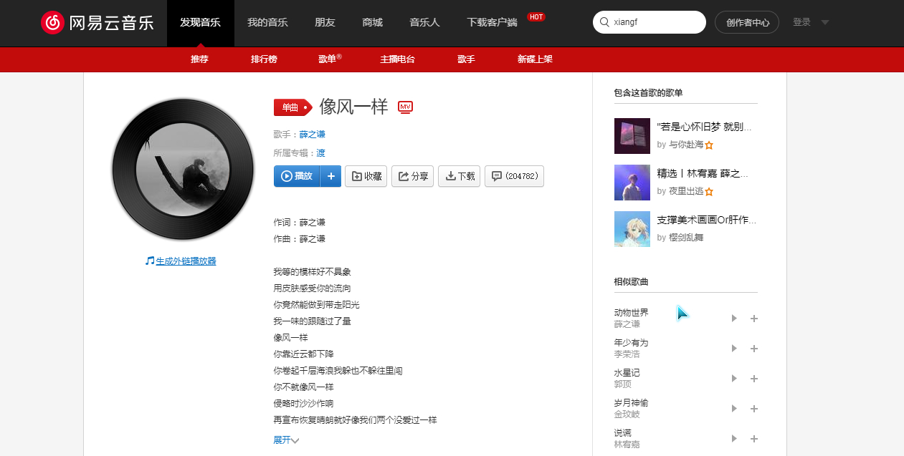
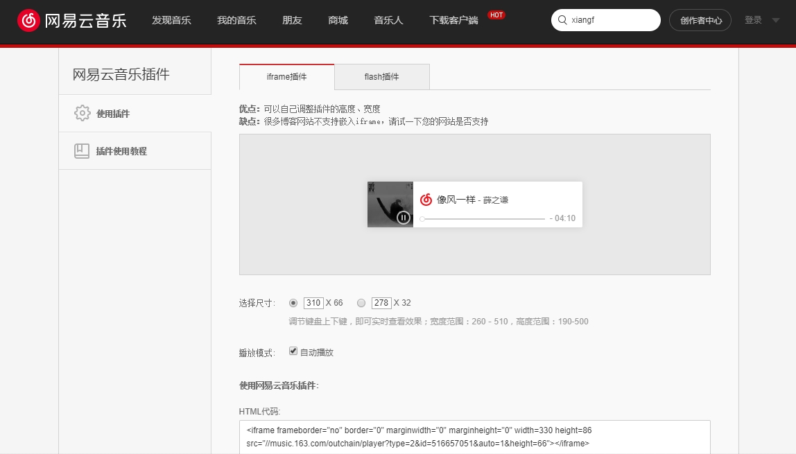

今天突然想在自己的博客上插入一首背景音乐，各大音乐厂商都有外链提供，比如网易云音乐，在歌曲的网页版就可以找到外链生成的按钮，如图所示：



点击生成外链，跳转到下面的页面



当你兴冲冲复制html代码到你的博客园，发现是不生效的，因为博客园是不支持 iframe 标签的。所以，你需要动动你的小脑筋。

我的思路是，对iframe关键字进行Unicode加密，然后使用Js的unescape方法进行解密，字符串拼接一下即可。完整代码如下：

```html
<script type="text/javascript">
var s = unescape("\u0069\u0066\u0072\u0061\u006d\u0065");
var f = '<'+s+' frameborder="no" border="0" marginwidth="0" marginheight="0" width="280" height="52" src="//music.163.com/outchain/player?type=2&amp;id=516657051&amp;auto=1&amp;height=32" class="music" style="z-index: 0;right: 0PX;display: block;bottom: 60px;position: fixed;"></'+s+'>';
$("body").append(f); //网易云音乐
</script>
```

至于效果，看我的博客就好了。

