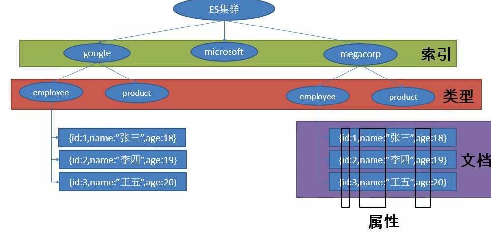
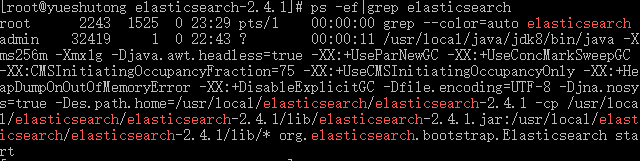
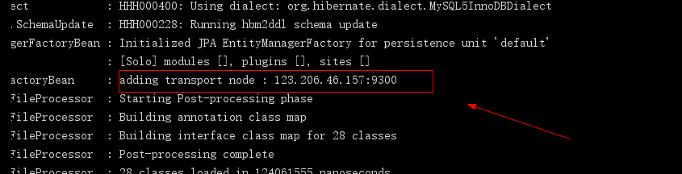

-  Create by yster@foxmail.com  2018-7-1 侵权必究
-  官方文档：https://www.elastic.co/guide/cn/elasticsearch/guide/current/index.html
-  23个很有用的查询示例：https://www.coyee.com/article/10764-23-useful-elasticsearch-example-queries/
-  ES配置详解：https://www.cnblogs.com/hanyouchun/p/5163183.html

## 前言

### ES是什么

elasticsearch简写es，es是一个高扩展、开源的全文检索和分析引擎，它可以准实时地快速存储、搜索、分析海量的数据。

### 什么是全文检索

全文检索是指计算机索引程序通过扫描文章中的每一个词，对每一个词建立一个索引，指明该词在文章中出现的次数和位置，当用户查询时，检索程序就根据事先建立的索引进行查找，并将查找的结果反馈给用户的检索方式。这个过程类似于通过字典中的检索字表查字的过程。全文搜索搜索引擎数据库中的数据。

### ES的应用场景

- 一个线上商城系统，用户需要搜索商城上的商品。 
  在这里你可以用es存储所有的商品信息和库存信息，用户只需要输入”空调”就可以搜索到他需要搜索到的商品。
- 一个运行的系统需要收集日志，用这些日志来分析、挖掘从而获取系统业务未来的趋势。 
  你可以用logstash（elk中的一个产品，elasticsearch/logstash/kibana）收集、转换你的日志，并将他们存储到es中。一旦数据到达es中，就你可以在里面搜索、运行聚合函数等操作来挖掘任何你感兴趣的信息。
- 如果你有想基于大量数据（数百万甚至数十亿的数据）快速调查、分析并且要将分析结果可视化的需求。 
  你可以用es来存储你的数据，用kibana构建自定义的可视化图形、报表，为业务决策提供科学的数据依据。

直白点讲，es是一个企业级海量数据的搜索引擎，可以理解为是一个企业级的百度搜索，除了搜索之外，es还可以快速的实现聚合运算。

### ES的存储结构



ES存储结构可以与MYSQL进行类比，关系如下：

| ES   | MYSQL        |
| ---- | ------------ |
| 索引 | 数据库       |
| 类型 | 数据表       |
| 文档 | 数据表的一行 |
| 属性 | 数据表的一列 |

 

## 第一章：安装

环境：

Centos7.4系统

Putty远程连接

### 1.下载

下载地址去官网啥的复制下来

```
wget https://download.elastic.co/elasticsearch/release/org/elasticsearch/distribution/tar/elasticsearch/2.4.1/elasticsearch-2.4.1.tar.gz
```

### 2.解压

新手注意下执行目录不要错

```
tar -zxvf elasticsearch-2.4.1.tar.gz
```

### 3.配置

找到解压后的config文件夹打开elasticsearch.yml

下面贴出我的设置

关键是要打开`network.host: 0.0.0.0`和`http.port: 9200`注释，提供web访问

```yaml
# ======================== Elasticsearch Configuration =========================
#
# NOTE: Elasticsearch comes with reasonable defaults for most settings.
#       Before you set out to tweak and tune the configuration, make sure you
#       understand what are you trying to accomplish and the consequences.
#
# The primary way of configuring a node is via this file. This template lists
# the most important settings you may want to configure for a production cluster.
#
# Please see the documentation for further information on configuration options:
# 
#
# ---------------------------------- Cluster -----------------------------------
#
# Use a descriptive name for your cluster:
# 集群名称，默认为elasticsearch
cluster.name: my-application
#
# ------------------------------------ Node ------------------------------------
#
# Use a descriptive name for the node:
# 节点名称，es启动时会自动创建节点名称，但你也可进行配置
node.name: node-1
#
# Add custom attributes to the node:
#
# 是否作为主节点，每个节点都可以被配置成为主节点，默认值为true：
# node.master: true
#
# node.rack: r1
#
# ----------------------------------- Paths ------------------------------------
#
# Path to directory where to store the data (separate multiple locations by comma):
# 分配给当前节点的索引数据所在的位置
# path.data: /path/to/data
#
# Path to log files:
# 日志文件所在位置
# path.logs: /path/to/logs
#
# ----------------------------------- Memory -----------------------------------
#
# Lock the memory on startup:
#
# bootstrap.memory_lock: true
#
# Make sure that the `ES_HEAP_SIZE` environment variable is set to about half the memory
# available on the system and that the owner of the process is allowed to use this limit.
#
# Elasticsearch performs poorly when the system is swapping the memory.
#
# ---------------------------------- Network -----------------------------------
#
# Set the bind address to a specific IP (IPv4 or IPv6):
#
network.host: 0.0.0.0
#
# Set a custom port for HTTP:
#
http.port: 9200
#
# For more information, see the documentation at:
# 
#
# --------------------------------- Discovery ----------------------------------
#
# Pass an initial list of hosts to perform discovery when new node is started:
# The default list of hosts is ["127.0.0.1", "[::1]"]
#
# discovery.zen.ping.unicast.hosts: ["host1", "host2"]
#
# Prevent the "split brain" by configuring the majority of nodes (total number of nodes / 2 + 1):
#
# discovery.zen.minimum_master_nodes: 3
#
# For more information, see the documentation at:
# 
#
# ---------------------------------- Gateway -----------------------------------
#
# Block initial recovery after a full cluster restart until N nodes are started:
#
# gateway.recover_after_nodes: 3
#
# For more information, see the documentation at:
# 
#
# ---------------------------------- Various -----------------------------------
#
# Disable starting multiple nodes on a single system:
#
# node.max_local_storage_nodes: 1
#
# Require explicit names when deleting indices:
#
# action.destructive_requires_name: true

```

ES配置详解参考：https://www.cnblogs.com/hanyouchun/p/5163183.html

### 4.启动

在bin目录下执行命令

1.规范的方式

```
 ./elasticsearch -d
```

2.通用的方式（注意&的语法是为了让程序后台执行，当你`Ctrl`+`C`退出时程序依旧运行）

```
 ./elasticsearch &
```

这里应该会报错，提示不能使用root用户启动该服务。

然后你可以新建一个用户admin，并设置elasticsearch解压后的所有文件权限为777，命令行：

```
useradd admin
```

```
chmod -R 777 elasticsearch
```

```
su admin
```

```
./elasticsearch -d
```

### 5.查看内存

执行命令

```
 ps -ef|grep elasticsearch
```



可以看到在内存为2G的主机上，Elasticsearch的运行内存为 `-Xms256m -Xmx1g`

### 7.内存优化

1.最简单的一个方法就是指定ES_HEAP_SIZE环境变量。服务进程在启动时候会读取这个变量，并相应的设置堆的大小。设置命令如下： 

```
export ES_HEAP_SIZE=1g
```
2.我们可以在启动程序时限制内存大小，不过这个方法并不是每个情况都可以成功的，命令行如下

```
 ./elasticsearch -Xms256m -Xmx256m -d
```
*备注:* 确保Xmx和Xms的大小是相同的，其目的是为了能够在java垃圾回收机制清理完堆区后不需要重新分隔计算堆区的大小而浪费资源，可以减轻伸缩堆大小带来的压力。 一般来说设置ES_HEAP_SIZE环境变量，比直接写-Xmx10g  -Xms10g更好一点。 

### 6.访问网页

因为开启了http访问，并设置可以远程连接，所以我们直接请求网址即可：

```
http://你的服务器IP:9200
```

网页响应内容

```json
{
    "name": "node-1",
    "cluster_name": "my-application",
    "cluster_uuid": "zrghL-WiQzeVE4rlX0WUAg",
    "version": {
        "number": "2.4.1",
        "build_hash": "c67dc32e24162035d18d6fe1e952c4cbcbe79d16",
        "build_timestamp": "2016-09-27T18:57:55Z",
        "build_snapshot": false,
        "lucene_version": "5.5.2"
    },
    "tagline": "You Know, for Search"
}
```

安装成功！

### 7.可视化插件

利用在bin目录下提供的plugin插件安装head，实现web可视化

注意目录：

```
./bin/plugin install mobz/elasticsearch-head
```

安装完后访问

```
http://你的服务器IP:9200/_plugin/head/
```

出现


### 8.数据迁移

Elasticsearch的数据迁移相当简单，把原项目目录下 的所有文件打包，迁移到另一台服务器解压，正常执行即可。

## 第二章：查询

### 1.多索引

Elasticsearch允许我们搜索存在于所有索引或一些特定索引中的文档。 例如，如果我们需要搜索名称包含`central`的所有文档。**注意此时的URL无索引**

```
GET http://localhost:9200/_search?q = name:central
```

**响应**

```json
{
    "took": 78,
    "timed_out": false,
    "_shards": {
        "total": 10,
        "successful": 10,
        "failed": 0
    },
    "hits": {
        "total": 1,
        "max_score": 0.19178301,
        "hits": [
            {
                "_index": "schools",
                "_type": "school",
                "_id": "1",
                "_score": 0.19178301,
                "_source": {
                    "name": "Central School",
                    "description": "CBSE Affiliation",
                    "street": "Nagan",
                    "city": "paprola",
                    "state": "HP",
                    "zip": "176115",
                    "location": [
                        31.8955385,
                        76.8380405
                    ],
                    "fees": 2000,
                    "tags": [
                        "Senior Secondary",
                        "beautiful campus"
                    ],
                    "rating": "3.5"
                }
            }
        ]
    }
}
```

或者，同样地我们可以在`schools`，`schools_gov`索引中搜索 -

### 2.多类型

还可以在所有类型或某种指定类型的索引中搜索所有文档。 例如，**注意此时的URL无类型**

```
Get http://localhost:9200/schools/_search?q = tags:sports
```

**响应**

```json
{
    "took": 16,
    "timed_out": false,
    "_shards": {
        "total": 5,
        "successful": 5,
        "failed": 0
    },
    "hits": {
        "total": 1,
        "max_score": 0.5,
        "hits": [
            {
                "_index": "schools",
                "_type": "school",
                "_id": "2",
                "_score": 0.5,
                "_source": {
                    "name": "Saint Paul School",
                    "description": "ICSE Afiliation",
                    "street": "Dawarka",
                    "city": "Delhi",
                    "state": "Delhi",
                    "zip": "110075",
                    "location": [
                        28.5733056,
                        77.0122136
                    ],
                    "fees": 5000,
                    "tags": [
                        "Good Faculty",
                        "Great Sports"
                    ],
                    "rating": "4.5"
                }
            }
        ]
    }
}
```

### 3.URI搜索

如下这些参数可以使用统一资源标识符在搜索操作中传递 -

| 编号 | 参数            | 说明                                                         |
| ---- | --------------- | ------------------------------------------------------------ |
| 1    | Q               | 此参数用于指定查询字符串。                                   |
| 2    | lenient         | 基于格式的错误可以通过将此参数设置为`true`来忽略。默认情况下为`false`。 |
| 3    | fields          | 此参数用于在响应中选择返回字段。                             |
| 4    | sort            | 可以通过使用这个参数获得排序结果，这个参数的可能值是`fieldName`，`fieldName:asc`和`fieldname:desc` |
| 5    | timeout         | 使用此参数限定搜索时间，响应只包含指定时间内的匹配。默认情况下，无超时。 |
| 6    | terminate_after | 可以将响应限制为每个分片的指定数量的文档，当到达这个数量以后，查询将提前终止。 默认情况下不设置`terminate_after`。 |
| 7    |                 | 从命中的索引开始返回。默认值为`0`。                          |
| 8    | size            | 它表示要返回的命中数。默认值为`10`。                         |

### 4.请求正文搜索

还可以在请求正文中使用查询`DSL`来指定查询，并且在前面的章节中已经给出了很多示例，

```
POST http://localhost:9200/schools/_search
```

**请求正文**

```json
{
   "query":{
      "query_string":{
         "query":"up"
      }
   }
}

JSON
```

**响应**

```json
{
   "_source":{
      "name":"City School", "description":"ICSE", "street":"West End",
      "city":"Meerut", "state":"UP", "zip":"250002", "location":[28.9926174, 77.692485],
      "fees":3500, "tags":["Well equipped labs"],"rating":"4.5"
   }
}
```

## 第三章：搜索

### 1.短语匹配

短语匹配用来解决准确匹配问题，例如匹配“头痛”不会出现“头晕”等近似词。

```json
GET /my_index/my_type/_search
{
    "query": {
        "match_phrase": {
            "title": "quick brown fox"
        }
    }
}
```

或者

```json
"match": {
    "title": {
        "query": "quick brown fox",
        "type":  "phrase"
    }
}
```

### 2.提高精度

使用`"operator": "and"`提高精度或者 `"minimum_should_match": "90%"` 控制精度

`symptom`：属性，`query`：查询词语

```json
{
    "query": {
        "match": {
            "symptom": {   
                "query":    "Love You",  
                //"operator": "and",
                 "minimum_should_match": "90%" 
            }
        }
    }
}
```

### 3.组合查询

使用**组合查询**短语匹配含有symptom属性为“头痛”，“恶心”这两个词语的文档。`match_phrase`短语匹配

```json
{
  "query": {
    "bool": {
      "must": { "match_phrase": { "symptom": "头痛" }},
      "must": { "match_phrase": { "symptom": "恶心"  }}
    }
  }
}
```

### 4.提高权重

`boost` 参数被用来提升一个语句的相对权重（ `boost` 值大于 `1` ）或降低相对权重（ `boost`值处于 `0` 到 `1` 之间），但是这种提升或降低并不是线性的，换句话说，如果一个 `boost` 值为 `2` ，并不能获得两倍的评分 `_score` 。

相反，新的评分 `_score` 会在应用权重提升之后被 *归一化* ，每种类型的查询都有自己的归一算法，细节超出了本书的范围，所以不作介绍。简单的说，更高的 `boost` 值为我们带来更高的评分 `_score` 。

```json
{
    "query": {
        "bool": {
            "should": {
                "match": {
                    "symptom": {
                        "query": "头痛",
                        "type": "phrase",
                        "boost": 3
                    }
                }
            },
           "should": {
                "match": {
                    "symptom": {
                        "query": "恶心",
                        "type": "phrase",
                        "boost": 2
                    }
                }
            }
        }
    }
}
```

### 5.分页

`size`

显示应该返回的结果数量，默认是 `10`

`from`

显示应该跳过的初始结果数量，默认是 `0`

```
如果每页展示 5 条结果，可以用下面方式请求得到 1 到 3 页的结果：

GET /_search?size=5
GET /_search?size=5&from=5
GET /_search?size=5&from=10
```

### 6.指定返回属性

只返回查询文档的name和sysptom属性。

```json
{
    "query": {
		...
    },
    "_source": [
        "name",
        "symptom"
    ],
}
```

### 7.高亮搜索

```json
{
    "query": {
        "bool": {
            "must": {
                "match": {
                    "symptom": {
                        "query": "恶心",
                        "minimum_should_match": "100%"
                    }
                }
            }
        }
    },
    "highlight": {
        "fields": {
            "symptom": {}
        }
    }
}
```

## 第四章：SpringBoot

Spring Boot默认支持两种技术来和ES交互，一种是Spring Data，一种是JEST（默认不生效）

### 1.SpringData

环境：IDEA+Spring Boot 1.5.13

首先明确elasticsearch的版本变化非常大，所以spring-boot-data-elasticsearch也针对不同版本写了不同的集成，具体的版本适配可以参考官方示例https://github.com/spring-projects/spring-data-elasticsearch，引用官方示例如下：

Add the Maven dependency:（增加Maven的依赖）

```xml
org.springframework.dataspring-data-elasticsearchx.y.z.RELEASE
```

If you'd rather like the latest snapshots of the upcoming major version, use our Maven snapshot repository and declare the appropriate dependency version.（如果您希望获得即将发布的主要版本的最新快照，请使用我们的Maven快照存储库并声明适当的依赖版本。）

```xml
org.springframework.dataspring-data-elasticsearchx.y.z.BUILD-SNAPSHOTspring-libs-snapshotSpring Snapshot Repositoryhttp://repo.spring.io/libs-snapshot
```

| spring data elasticsearch | elasticsearch |
| ------------------------- | ------------- |
| 3.1.x                     | 6.2.2         |
| 3.0.x                     | 5.5.0         |
| 2.1.x                     | 2.4.0         |
| 2.0.x                     | 2.2.0         |
| 1.3.x                     | 1.5.2         |

------

比如我的Spring Boot项目为`1.5.13.RELEASE`，在IDEA左侧可以查看到elasticsearch的版本


那我可以找到最接近的`2.1.x`对应的elasticsearch版本为2.4，我们这个项目使用的是2.4.1完全ok没问题。

那我们在application.yml配置一下服务器的elasticsearch地址：

```yaml
spring:
  data:
    elasticsearch:
      cluster-name: my-application
      cluster-nodes: 服务器Ip:9300
```

cluster-name可以在访问9200端口时查看到。

然后我们启动项目测试一下，出现如图所示，-测试没问题。



### 2.依赖冲突

在实际项目中，我们基本都需要其他spring data 依赖，这时候启动elasticsearch就会报错，比如：

```xml
org.springframework.bootspring-boot-starter-data-elasticsearchorg.springframework.bootspring-boot-starter-data-neo4jorg.springframework.bootspring-boot-starter-data-jpa
```

再次启动程序，报错：

```
Caused by: java.lang.NoSuchFieldError: LUCENE_5_3_1
	at org.elasticsearch.Version.(Version.java:279) ~[elasticsearch-2.4.6.jar:2.4.6]
	at org.elasticsearch.client.transport.TransportClient$Builder.build(TransportClient.java:131) ~[elasticsearch-2.4.6.jar:2.4.6]
```

我们单独启动时正确，添加其它依赖后报错，错误肯定是依赖的原因了。

我们点击挑战到`Version.java:279`查看他的源代码：

```
    public static final Version V_2_1_0 = new Version(V_2_1_0_ID, false, org.apache.lucene.util.Version.LUCENE_5_3_1);
```

也就是说elasticsearch-2.1.0适配LUCENE-5.3.1，而我们的elasticsearch是2.4.6，继续查看源代码：

```
    public static final Version V_2_4_6 = new Version(V_2_4_6_ID, false, org.apache.lucene.util.Version.LUCENE_5_5_4);
```

所以我们需要LUCENE-5.5.4版本的依赖。

解决方法就是在pom.xml中导入依赖即可：

```xml
org.apache.lucenelucene-core5.5.4
```

### 2.入门

> A default implementation of ElasticsearchRepository, aligning to the generic Repository Interfaces, is provided. Spring can do the Repository implementation for you depending on method names in the interface definition.（提供了一个与通用存储库接口一致的ElasticsearchRepository的默认实现。Spring可以根据接口定义中的方法名为您实现存储库。 ）
>
>   --- 来自官方github

实现Elasticsearch的增删改查就像我们使用Spring data jpa一样简单快捷。

**第一步，我们先创建一个实体类用于测试。**

```java
@Document(indexName = "library",type = "book")	//indexName索引名称，type类别
public class Book {
    private int id;
    private String name;
    private String anthony;

    public Book(String name, String anthony, int id) {
        this.name = name;
        this.anthony = anthony;
        this.id = id;
    }

    public Book() {
    }

    public String getName() {
        return name;
    }

    public void setName(String name) {
        this.name = name;
    }

    public String getAnthony() {
        return anthony;
    }

    public void setAnthony(String anthony) {
        this.anthony = anthony;
    }

    public int getId() {
        return id;
    }

    public void setId(int id) {
        this.id = id;
    }

    @Override
    public String toString() {
        return "Book{" +
                "id=" + id +
                ", name='" + name + '\'' +
                ", anthony='" + anthony + '\'' +
                '}';
    }
}
```

**第二步，新建新建ElasticsearchRepository接口。**

```java
@Repository
public interface BookRepository extends ElasticsearchRepository {
    Book findAllByName(String name);
}
```

**第三步，测试。**

```java
@RunWith(SpringRunner.class)
@SpringBootTest
public class RobotsApplicationTests {

    @Autowired
    BookRepository bookRepository;

    @Test
    public void contextLoads() {
        Book book = new Book("《西游记后传》","小白龙",1);
        bookRepository.index(book);	//保存
        Book name = bookRepository.findAllByName("西游记"); //查找
        System.out.println(name);
    }

}
```

查看打印：

```
Book{id=1, name='《西游记后传》', anthony='小白龙'}
```

## 第五章：JEST

JEST默认不生效，需要我们导入依赖，JEST使用9200端口通过HTTP访问ES。

### 1.导入依赖

```xml
io.searchboxjest1.0.3com.sun.jnajna3.0.9
```

### 2.配置

```yaml
spring:
  elasticsearch:
    jest:
      uris: http://123.206.46.157:9200
      username: elastic
      password: changeme
      read-timeout: 5000
      connection-timeout: 5000
```

### 3.实体类

```java
public class Book {
    private int id;
    private String name;
    private String anthony;
	.....
}
```

### 4.保存

```java
    @Autowired
    private JestClient jestClient;
    
    @Test
    public void contextLoads() {
        Book book = new Book("《西游记后传》","小白龙",120);

        //构建一个索引功能 参数为路径.../library/old/1
        Index index = new Index.Builder(book).index("library").type("old").id("3").build();
        try {
            //执行保存
            jestClient.execute(index);
        } catch (IOException e) {
            e.printStackTrace();
        }
    }
```

### 5.查询

此处的query语句参考前面讲过的各种搜索方式。

```java
        String query = "{" +
                "    \"query\" : {" +
                "        \"match\" : {" +
                "            \"name\" : \"西游\"" +
                "        }" +
                "    }" +
                "}";

        Search search = new Search.Builder(query).addIndex("library").addType("old").build();
        try {
            SearchResult result = jestClient.execute(search);
            System.out.println(result.getJsonString());
        } catch (IOException e) {
            e.printStackTrace();
        }
```

个人觉得：JEST查询的不同与优势是可以获取全部的返回信息。

## 第六章：Repository

### 1.查询

在ElasticsearchRepository中我们可以使用`Not` `Add` `Like` `Or` `Between`等关键词自动创建查询语句。

如官方示例：

```java
   public interface BookRepository extends Repository {

        List findByNameAndPrice(String name, Integer price);

        List findByNameOrPrice(String name, Integer price);
        
        Page findByName(String name,Pageable page);

        Page findByNameNot(String name,Pageable page);

        Page findByPriceBetween(int price,Pageable page);

        Page findByNameLike(String name,Pageable page);

        @Query("{\"bool\" : {\"must\" : {\"term\" : {\"message\" : \"?0\"}}}}")
        Page findByMessage(String message, Pageable pageable);
    }
```

#### 关键字

| 关键字              | 使用示例                           | 等同于的ES查询                                               |
| ------------------- | ---------------------------------- | ------------------------------------------------------------ |
| And                 | findByNameAndPrice                 | {“bool” : {“must” : [ {“field” : {“name” : “?”}}, {“field” : {“price” : “?”}} ]}} |
| Or                  | findByNameOrPrice                  | {“bool” : {“should” : [ {“field” : {“name” : “?”}}, {“field” : {“price” : “?”}} ]}} |
| Is                  | findByName                         | {“bool” : {“must” : {“field” : {“name” : “?”}}}}             |
| Not                 | findByNameNot                      | {“bool” : {“must_not” : {“field” : {“name” : “?”}}}}         |
| Between             | findByPriceBetween                 | {“bool” : {“must” : {“range” : {“price” : {“from” : ?,”to” : ?,”include_lower” : true,”include_upper” : true}}}}} |
| LessThanEqual       | findByPriceLessThan                | {“bool” : {“must” : {“range” : {“price” : {“from” : null,”to” : ?,”include_lower” : true,”include_upper” : true}}}}} |
| GreaterThanEqual    | findByPriceGreaterThan             | {“bool” : {“must” : {“range” : {“price” : {“from” : ?,”to” : null,”include_lower” : true,”include_upper” : true}}}}} |
| Before              | findByPriceBefore                  | {“bool” : {“must” : {“range” : {“price” : {“from” : null,”to” : ?,”include_lower” : true,”include_upper” : true}}}}} |
| After               | findByPriceAfter                   | {“bool” : {“must” : {“range” : {“price” : {“from” : ?,”to” : null,”include_lower” : true,”include_upper” : true}}}}} |
| Like                | findByNameLike                     | {“bool” : {“must” : {“field” : {“name” : {“query” : “? *”,”analyze_wildcard” : true}}}}} |
| StartingWith        | findByNameStartingWith             | {“bool” : {“must” : {“field” : {“name” : {“query” : “? *”,”analyze_wildcard” : true}}}}} |
| EndingWith          | findByNameEndingWith               | {“bool” : {“must” : {“field” : {“name” : {“query” : “*?”,”analyze_wildcard” : true}}}}} |
| Contains/Containing | findByNameContaining               | {“bool” : {“must” : {“field” : {“name” : {“query” : “?”,”analyze_wildcard” : true}}}}} |
| In                  | findByNameIn(Collectionnames)      | {“bool” : {“must” : {“bool” : {“should” : [ {“field” : {“name” : “?”}}, {“field” : {“name” : “?”}} ]}}}} |
| NotIn               | findByNameNotIn(Collectionnames)   | {“bool” : {“must_not” : {“bool” : {“should” : {“field” : {“name” : “?”}}}}}} |
| True                | findByAvailableTrue                | {“bool” : {“must” : {“field” : {“available” : true}}}}       |
| False               | findByAvailableFalse               | {“bool” : {“must” : {“field” : {“available” : false}}}}      |
| OrderBy             | findByAvailableTrueOrderByNameDesc | {“sort” : [{ “name” : {“order” : “desc”} }],”bool” : {“must” : {“field” : {“available” : true}}}} |

### 2.保存

```java
        @Autowired
        private SampleElasticsearchRepository repository;

        String documentId = "123456";
        SampleEntity sampleEntity1 = new SampleEntity();
        sampleEntity1.setId(documentId);
        sampleEntity1.setMessage("some message");

        String documentId2 = "123457"
        SampleEntity sampleEntity2 = new SampleEntity();
        sampleEntity2.setId(documentId2);
        sampleEntity2.setMessage("test message");

        List sampleEntities = Arrays.asList(sampleEntity1, sampleEntity2);

        //bulk index
        repository.save(sampleEntities);
```

### 3.更新

要做到这一点，只需使用相同的ID保存该对象性即可。 

```java
        Book name = bookRepository.findAllById(100);
        name.setAnthony("吴承恩");	//改变
        bookRepository.save(name); //保存，此时ID不变
        name = bookRepository.findAllById(100); //再次查找
        System.out.println(name);
```

### 4.删除

```java
        bookRepository.delete(1);
```

到此，Repository实现增删改查完成！

## 第七章：模板

上面我们使用了Spring data  Jpa去实现增删改查等操作，下面的方式是通过ElasticsearchTemplate模板结合Query实现保存与查找。

### 1.增加

IndexQuery的作用是保存对象到elasticsearch。用法如下。

```java
       	@Autowired
        private ElasticsearchTemplate elasticsearchTemplate;
        
        Book book = new Book("《西游记后传》", "小白龙", 100);
        
        IndexQuery indexQuery = new IndexQueryBuilder()
                .withIndexName("library")
                .withType("book")
                .withId(book.getId()+"")
                .withObject(book) //对象或集合
                .build();
        elasticsearchTemplate.index(indexQuery);
```

### 2.删除

```java
        //第一种删除具体的一条记录
        elasticsearchTemplate.delete("library","book",100+"");
        
        //第二种删除indexName/type/下的所有
        DeleteQuery deleteQuery = new DeleteQuery();
        deleteQuery.setIndex("library");
        deleteQuery.setType("book");
        elasticsearchTemplate.delete(deleteQuery);

        //第三种删除indexName/下的所有
        elasticsearchTemplate.deleteIndex("library");
        
        //第四种删除查询出来的所有
        deleteQuery = new DeleteQuery();
        deleteQuery.setQuery(QueryBuilders.matchQuery("id","100"));
        elasticsearchTemplate.delete(deleteQuery);
```

### 3.更新

```java
        Book book = new Book("《西游记后传》", "猪八戒", 100);

        UpdateQuery updateQuery = new UpdateQueryBuilder()
                .withIndexName("library")
                .withType("book")
                .withId(book.getId()+"")
                .build();

        elasticsearchTemplate.update(updateQuery);
```

### 4.查询

查询不同于前面几个，查询比较复杂，比如模糊查询，组合查询，准确查询等。这些变化来源于不同的`QueryBuilder`，查询的模板是相同的。如下：

```java
        @Autowired
        private ElasticsearchTemplate elasticsearchTemplate;
        
        Sort sort = new Sort(Sort.Direction.DESC, "id");//以id值为准 降序排列，ASC为升序
        Pageable pageable = new PageRequest(0, 10, sort);//查看第0页，以每页10条划分
        
        SearchQuery searchQuery = new NativeSearchQueryBuilder()
                .withQuery(QueryBuilders.matchAllQuery()) // 自定义查询（这是不同的地方）
                .withPageable(pageable) // 自定义分页
                .build();
                
        Page sampleEntities = elasticsearchTemplate.queryForPage(searchQuery,Book.class);

        System.out.println("页数" + sampleEntities.getTotalPages());
        System.out.println("行数" + sampleEntities.getTotalElements());
        System.out.println("大小" + sampleEntities.getSize());
        System.out.println("当前第几页" + sampleEntities.getNumber());
        System.out.println("当前页的数量"+sampleEntities.getNumberOfElements());
        System.out.println("List:"+sampleEntities.getContent());
```

其它条件查询下面讲解！

## 第八章：术语

为什么要在插一节术语？是因为官方注释比较晦涩，为了方便下面的阅读，可以先了解下，如果已了解请跳过。

### Analysis（分析）

​        分析的过程就是将全文（full text）转换成 术语／分词（terms）。 这取决于使用那个分析器,这些短语:“FOO BAR”, “Foo-Bar”, “foo,bar”，可能会拆分成” foo”和“bar”。这些拆分后的词实际上是存储在索引中。一个完整的文本查询(而不是一个分词查询) “FoO:bAR”，将被分解成 “foo”,“bar”,来匹配存储在索引中的分词。正是这一过程的分析(包括在索引时间和搜索时间),允许elasticsearch执行全文查询。

### Cluster （集群）

​         一个集群包含一个或多个分配了相同的集群名称的节点。每个集群都有一个主节点是集群自动选择产生,并且可以决定如果当前主节点失败，哪些可以替换。

### Document（文档）

​          文档是存储在elasticsearch中的一个JSON文件。这是相当与关系数据库中表的一行数据。每个文档被存储在索引中，并具有一个类型和一个id。一个文档是一个JSON对象（也被称为在其他语言中的 hash / hashmap / associative array（关联数组）），其中包含零个或多个字段 或者 键值对。原始JSON文档将被存储在索引的_source字段，在获得（getting）或者 搜索（searching）默认的返回时，得到或搜索文档。

###  Id（标识）

​         每个文档ID标识了一个文档。一个文档的索引/类型/ ID必须是唯一的。如果没有提供ID，将是自动生成。（还可以看到路由\）

### Field（字段）

​         文档中包含的一组字段或键值对。字段的值可以是一个简单的（标量）值（如字符串，整数，日期），或者一个嵌套的结构就像一个数组或对象。一个字段就是类似关系数据库表中的一列。映射的每个字段有一个字段的类型“type”（不要与文档类型混淆），表示那种类型的数据可以存储在该字段里，如：整数\，字符串\，对象\。映射还允许你定义（除其他事项外）一个字段的值如何进行分析。

### Index（索引）

​         索引就是像关系数据库中的“数据库”。通过映射可以定义成多种类型。索引是一个逻辑命名空间映射到一个或多个主要的分片，可以有零个或多个副本分片。

### Mapping（映射）

​         映射是像关系数据库中的”模式定义“。每个索引都有一个映射，它定义了每个索引的类型，再加上一些索引范围的设置。映射可以被明确地定义，或者在一个文档被索引的时候自动生成。

### Node（节点）

​         节点是属于elasticsearch群集的运行实例。测试的时候，在一台服务器可以启动多个节点，但通常情况下应该在一台服务器运行一个节点。在启动时，节点将使用单播（或组播，但是必须指定）来发现使用相同的群集名称的群集，并会尝试加入该群集。

### Primary shard（主分片）

​         每个文档都存储在一个主要分片上。当你索引一个文档时，索引首先生成在主分片上，然后才到主分片的所有副本上。默认情况下，索引有5个主分片。您可以指定更多或更少的主分片来适应索引可以处理的文档数。一旦创建了索引，就不能改变索引中主分片的数量。

### Replica shard（副本分片）

​         每个主分片可以有零个或多个副本。副本是主分片的一个拷贝，有两个作用：

​         1、故障转移：如果主分片有问题，副本分片可以提升为主分片；

​         2、提高性能：获取和搜索请求可以处理主分片或副本分片。

​         默认情况下，每个主分片有一个副本，不过索引的副本数量可以动态地改变。在同一个节点上，一个副本分片将永远不会和其主分片一起运行。

### Routing（路由）

​         当你索引一个文档，它是存储在一个主分片里。这分片的选择是通过哈希的路由值。默认情况下，路由值来自文档的ID；如果该文档指定了父文档，则使用父文档的ID（以确保这个子文档和父文件都存储在相同的分片上）。这个路由值可以在索引的时候，通过指定数值或者配置字段映射来覆盖。

### Shard（分片）

​         一个分片是一个单一的Lucene的实例。这是一个低级别的通过ElasticSearch自动管理的“工作者”单元。索引是一个逻辑命名空间指向主分片和副本分片。索引的主分片和副本分片的数量需要明确的指定。然而你的代码应该只处理一个索引。Elasticsearch分配集群中所有节点的分片。在节点出现故障或增加新节点的时候，可以自动的将一个节点上的分片移动到另一个节点上。

### Source field（源字段）

​         默认情况下，你的JSON文档将被索引存储在_source字段里面，所有的get（获取）和search（搜索）请求将返回的该字段。这将允许你直接从搜索结果中访问到源数据，而不需要再次发起请求检索。

​         注：索引将返回完整的的JSON字符串给你，即使它包含无效的JSON。此字段里的内容不表示任何该对象里面的数据如何被索引。

### Term（术语）

​         在elasticsearch里，术语(term)是一个被索引的精确值。术语 foo, Foo,FOO 是不想等的。术语（即精确值）可以使用“term”查询接口来查询。

### Text(文本)

​         文本（或全文）是普通非结构化的文本，如本段。默认情况下，文本将被分析成术语，术语才是实际存储在索引中。文本字段在索引时需要进行分析，以便全文搜索，全文查询的关键字在搜索时，必须分析产生（搜索）与索引时相同的术语。

### Type(类型)

​         Type是相当于关系数据库中的“表”。每种类型都有一列字段，用来定义文档的类型。映射定义了对在文档中的每个字段如何进行分析。

## 第九章：构建查询

上面只是模糊的讲了查询模板，现在来仔细说说查询！

首先你要明白QueryBuilder系列（MatchAllQueryBuilder.class，FuzzyQueryBuilder.class等）是什么？

它们是具体的查询实现类，它们是QueryBuilders抽象类的子类并实现了BoostableQueryBuilder<>接口。

而QueryBuilders的主要作用就是提供了静态方法去创建一个子类的对象，方便QueryBuilder的构建与管理。

我们从源码的角度去分析它的一些方法！

```
匹配所有文档的查询。
matchAllQuery()
```

```
为提供的字段名和文本创建类型为“BOOLEAN”的匹配查询。(解释过来就是单个匹配，可以模糊匹配)
matchQuery(String name, Object text) //name 字段值 ，text 查询文本（不支持通配符）
```

```
为提供的字段名和文本创建一个通用查询。
commonTermsQuery(String name, Object text)
```

```
为提供的字段名和文本创建类型为“BOOLEAN”的匹配查询。
multiMatchQuery(Object text, String... fieldNames) 
```

```
为提供的字段名和文本创建一个文本查询，并输入“短句”。
matchPhraseQuery(String name, Object text)
```

```
为提供的字段名和文本创建一个与类型“PHRASE_PREFIX”匹配的查询。
matchPhrasePrefixQuery(String name, Object text)
```

```
匹配包含术语的文档的查询。
termQuery(String name, Object value)
```

```
使用模糊查询匹配文档的查询
fuzzyQuery(String name, Object value)
```

```
与包含指定前缀的术语的文档相匹配的查询。
prefixQuery(String name, String prefix)
```

```
在一定范围内匹配文档的查询。
rangeQuery(String name)
```

```
实现通配符搜索查询。支持的通配符是*，它匹配任何字符序列(包括空字符)，而?它匹配任何单个字符。注意，这个查询可能很慢，因为它需要遍历许多项。为了防止异常缓慢的通配符查询，通配符项不应该以一个通配符*或?开头。

wildcardQuery(String name, String query) //query 通配符查询字符串
```

```
将包含术语的文档与指定的正则表达式匹配的查询
regexpQuery(String name, String regexp) //regexp的正则表达式
```

```
解析查询字符串并运行它的查询。有两种模式。第一,当没有字段添加(使用QueryStringQueryBuilder.field(字符串),将运行查询一次,非前缀字段将使用QueryStringQueryBuilder.defaultField(字符串)。第二,当一个或多个字段添加(使用QueryStringQueryBuilder.field(String)),将运行提供的解析查询字段,并结合使用DisMax或普通的布尔查询(参见QueryStringQueryBuilder.useDisMax(布尔))。

queryStringQuery(String queryString)
```

```
类似于query_string查询的查询，但不会为任何奇怪的字符串语法抛出异常。
simpleQueryStringQuery(String queryString)
```

```
可以使用BoostingQuery类来有效地降级与给定查询匹配的结果。
boostingQuery()
```

```
匹配与其他查询的布尔组合匹配的文档的查询
boolQuery()
```

```
创建一个可用于实现MultiTermQueryBuilder的子查询的SpanQueryBuilder。
spanMultiTermQueryBuilder(MultiTermQueryBuilder multiTermQueryBuilder)
```

```
允许定义自定义得分函数的查询。
functionScoreQuery(QueryBuilder queryBuilder, ScoreFunctionBuilder function)
```

```
更像这样的查询，查找“like”提供的文档，例如提供的MoreLikeThisQueryBuilder.likeText(String)，它是针对查询所构造的字段进行检查的

moreLikeThisQuery(String... fields)
```

```
构造一个新的非计分子查询，包含子类型和要在子文档上运行的查询。这个查询的结果是这些子文档匹配的父文档。
hasChildQuery(String type, QueryBuilder query)
```

```
构造一个新的非评分父查询，父类型和在父文档上运行的查询。这个查询的结果是父文档匹配的子文档。
hasParentQuery(String type, QueryBuilder query)
```

```
基于对其中任何一个项进行匹配的若干项的字段文件
termsQuery(String name, String... values)
```

```
一个查询构建器，它允许构建给定JSON字符串或二进制数据作为输入的查询。当您希望使用Java Builder API，但仍然需要将JSON查询字符串与其他查询构建器结合时，这是非常有用的。

wrapperQuery(String source)
```

这些都是官方提供的注释，有些晦涩难懂，还有很多，我这里不一一列举。

只需要明确一点，我们使用上述静态方法只是为了方便创建QueryBuilder系列对象。

## 第十章：条件查询

我们调用QueryBuilders 的静态方法创建完具体的QueryBuilder对象之后，传入`.withQuery(QueryBuilder)`方法就可以实现的自定义查询。

### 1.完全匹配

```
MatchQueryBuilder queryBuilder = QueryBuilders.matchQuery("字段名", "查询文本");
```

### 2.短语匹配

比如你要查询短语`Love You`，当你使用`QueryBuilders.matchQuery("name", "Love You")`时，可能会查询到`Love And You`这样分开的结果，这时候我们指定为短语进行查询：

```
QueryBuilder queryBuilder = QueryBuilders.matchPhraseQuery("name", "Love You");
```

### 3.模糊匹配

```
        MoreLikeThisQueryBuilder queryBuilder = QueryBuilders
                .moreLikeThisQuery("name")// 要匹配的字段, 不填默认_all
                .like("西游")// 匹配的文本
                .minTermFreq(1);// 文本最少出现的次数（默认是2，我们设为1）
```

我们再从源码去看其它方法

```
添加一些文本以查找“类似”的文档
addLikeText(String... likeTexts)
```

```
查找类似文档
like(Item... likeItems)
```

```
设置不从其中选择（比如我们调用.like("西游").unlike("西游记")这样会导致啥也查不到）
unlike(String... unlikeTexts)
```

```
添加一些文本以查找与此不同的文档
addUnlikeText(String... unlikeTexts)
```

```
设置将包含在任何生成查询中的查询条件的最大数量。默认25
maxQueryTerms(int maxQueryTerms)
```

```
设置单词被忽略的频率，默认5，小于将不会被发现
minDocFreq(int minDocFreq)
```

```
设置单词仍然出现的最大频率。单词出现更多的文档将被忽略。默认为无限
maxDocFreq(int maxDocFreq)
```

```
设置将被忽略的单词的最小单词长度，默认0
minWordLength(int minWordLength)
```

```
设置将被忽略的单词的最大单词长度，默认无限
maxWordLength(int maxWordLength)
```

```
设置停止词，匹配时会忽略停止词
stopWords(String... stopWords)
```

```
设置词语权重，默认是1
boostTerms(float boostTerms)
```

```
查询权重（默认1）
boost(float boost)
```

```
设置不从其中选择术语的文本（文档Item）
ignoreLike(String... likeText)
```

### 4.组合查询

```java
QueryBuilder queryBuilder = QueryBuilders.boolQuery()
                .must(QueryBuilders.matchQuery("name", "西游")) //AND
                .must(QueryBuilders.wildcardQuery("name", "西游?")) //Not
                .should(QueryBuilders.matchQuery("name", "西游记")); //Or
```

### 5.包裹查询

 高于设定分数, 不计算相关性

```java
QueryBuilder queryBuilder = QueryBuilders
                .constantScoreQuery(QueryBuilders.matchQuery("name", "西游记"))
                .boost(2.0f);
```

### 6.范围查询

查询id值在20-50之间的

```java
QueryBuilder queryBuilder = QueryBuilders.rangeQuery("id")
                .from("20")
                .to("50")
                .includeLower(true)     // 包含上界
                .includeUpper(true);      // 包含下届
```

### 7.通配符查询

通配符查询, 支持 * 匹配任何字符序列, 包括空

避免* 开始, 会检索大量内容造成效率缓慢

单个字符用?

```java
QueryBuilder queryBuilder = QueryBuilders.wildcardQuery("user", "ki*hy");
```

### 8.过滤查询

```java
QueryBuilders.constantScoreQuery(FilterBuilders.termQuery("name", "kimchy")).boost(2.0f);
```

> 其实还有很多，未完待续。


