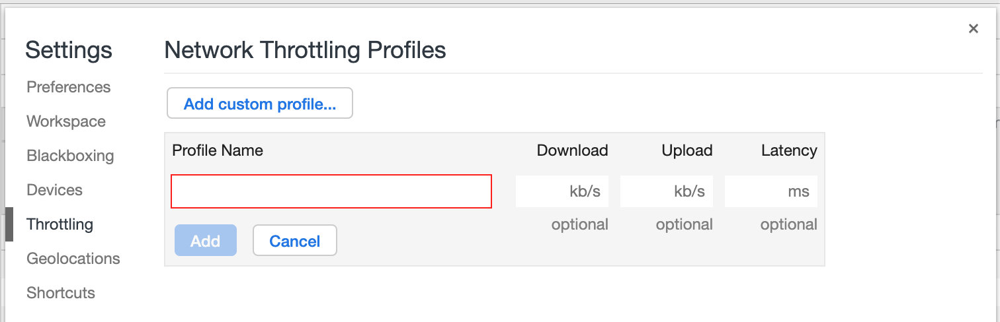

> 官方文档：https://developers.google.com/web/tools/chrome-devtools/network/

最近打算写一写Chrome教程文档，不知道大家最感兴趣的是什么内容呢？

## 1.如何打开

无论是在Windows还是Mac，都可以使用（FN）+F12键打开Chrome的Network面板。

## 2.面板组成

如图所示，Chrome的Network面板主要由5个部分组成，包括控制器、过滤器、概览、请求列表、概要，下面简单介绍下这5个部分的作用。

**控制器**：控制面板的外观与功能

**过滤器**：过滤请求列表中显示的资源

- 按住Command（Mac）或Ctrl（Window/Linux），然后点击过滤器可以同时选择多个过滤器。

**概览**：显示HTTP请求、响应的时间轴。

**请求列表**：默认时间排序，可选择显示列。

**概要**：请求总数、总数据量、总花费时间等。

## 3.控制器

### 模拟慢速网络

还可以自定义，点击Add...

## 4.过滤器

如何对请求进行过滤呢？

### 4.1按字符串

1.键入png到**过滤**文本框。仅显示包含文本的文件png。在这种情况下，与过滤器匹配的唯一文件是PNG图像。

2.类型`/.*\.[cj]s+$/`。DevTools过滤掉任何资源，其文件名不以a `j`或`c`后跟1个或多个`s`字符结尾。

3.类型`-main.css`。DevTools过滤掉了`main.css`。如果任何其他文件与模式匹配，它们也将被过滤掉。

### 4.2按类型

- XHR、JS、CSS、Img、Media、Font、Doc、WS（WebSocket）、Manifest或Other（此处为列出的任何其他类型）
- 多个类型，按住Command（Mac）或Ctrl（Windows、Linux）
- 按时间过滤：概览面板，拖动滚动条
- 隐藏Data URLs：CSS图片等小文件以 BASE64 格式嵌入HTML中，以减少HTTP请求数。

### 4.3属性过滤

下面演示使用Filter过滤器，如图所示：

- **domain**:仅显示来自指定域的资源。您可以使用通配符字符（*）纳入多个域
- **has-response-header**：显示包含指定HTTP响应标头的资源
- **is**：使用 is:running 可以查找 WebSocket 资源，is:from-cache 可查找缓存读出的资源
- **Larget-than**：显示大于指定大小的资源（以字节为单位）。将值设为1000等同于设置为1k
- **method**：显示通过指定 HTTP 方法类型检索的资源
- **mime-type**：显示指定 MIME 类型的资源
- **mixed-content**：显示所有混合内容资源（mixed-content:all）,或者仅显示当前显示的资源（mixed-content:displayed）
- **scheme**：显示通过未保护HTTP（scheme:http）或受保护 HTTPS（scheme:https）检索的资源。
- **set-cookie-domain**：显示具有 Set-Cookie 标头并且 Domain 属性与指定值匹配的资源。
- **set-cookie-name**：显示具有 Set-Cookie 标头并且名称与指定值匹配的资源。
- **set-cookie-value**：显示具有 Set-Cookie 标头并且值与指定值匹配的资源。
- **status-code**：仅显示 HTTP 状态代码与指定代码匹配的资源。

多属性间通过空格实现 AND 操作。

## 5.请求列表的排序

1. 时间排序，默认

2. 按列排序

3. 按活动时间排序
   - Start Time：发出的第一个请求位于顶部
   - Response Time：开始下载的第一个请求位于顶部
   - End Time：完成的第一个请求位于顶部
   - Total Duration：连接设置时间和请求/响应时间最短的请求位于顶部
   - Latency：等待最短响应时间的请求位于顶部

## 6.请求列表

简单介绍下每列的含义：

**Name**：资源的名称

**Status**：HTTP状态代码

**Type**：请求的资源的MIME类型

**Initiator**：发起请求的对象或进程。它可能有以下几种值：

- Parser（解析器）：Chrome的 HTML 解析器发起了请求（鼠标悬停显示JS脚本）
- Redirect（重定向）：HTTP重定向启动了请求
- Script（脚本）：脚本启动了请求
- Other（其他）：一些其他进程或动作发起请求，例如用户点击链接跳转到页面或在地址栏中输入网址。

**Size**：服务器返回的响应大小（包括头部和包体），可显示解压后大小

**Time**：总持续时间，从请求的开始到接受响应中的最后一个字节

**Waterfall**：各请求相关活动的直观分析图

**鼠标右键单击，添加其他列：**

**还可以自定义header头**：

## 7.预览请求内容

如图所示，在请求列表点击以下

功能包括：

- 查看头部，包括请求头、响应头。
- 查看Cookie
- 预览响应正文：查看图像用
- 查看响应正文
- 时间详细分布
- 导出数据为HAR格式
- 查看未压缩的资源大小：Use Large Request Rows
- 浏览器加载时间（概览、概要、请求列表）DOMContentLoaded 事件的颜色设置为蓝色，而load事件设置为红色
- 将请求数据复制到剪贴板
  - Copy Link Address：将请求的网址复制到剪贴板
  - Copy Response：将响应包体复制到剪贴板
  - Copy as cURL：以 cURL 命令形式复制请求
  - Copy All as cURL：以一系列 cURL 命令形式复制所有请求
  - Copy All as HAR：以 HAR 数据形式复制所有请求
- 查看请求上下游：按住 shift 键悬停请求上，绿色是上游，红色是下游。

下面演示如何查看请求上下游，首先按住 shift 键，其次移动鼠标到不同请求，如图所示：

## 8.浏览器加载时间

触发流程：

- 解析 HTML 结构
- 加载外部脚本和样式表文件
- 解析并执行脚本代码 // 部分脚本会阻塞页面的加载
- DOM 树构建完成 // DOMContentLoaded 事件
- 加载图片等外部文件
- 页面加载完毕 // load事件

## 9.请求时间详细分布

点击请求列表后，找到Timing，看到如图所示的字段

**Queueing**：浏览器在以下情况下对请求排队

- 存在更高优先级的请求
- 此源已打开六个 TCP 连接，达到限值，仅适用于 HTTP/1.0 和 HTTP/1.1
- 浏览器正在短暂分配磁盘缓存中的空间

**Stalled**：请求可能会因 Queueing 中描述的任何原因而停止

**DNS Lookup**：浏览器正在解析请求额IP地址

**Proxy Negotiation**：浏览器正在与代理服务器协商请求

**Request sent**：正在发送请求

**ServiceWorker Preparation**：浏览器正在启动Service Worker

**Request to ServiceWorker**：正在将请求发送到Service Worker

**Waiting（TTFB）**：浏览器正在等待响应的第一个字节。TTFB表示Time To First Byte（至第一字节的时间）。此时间包括1次往返延迟时间及服务器准备响应所用的时间

**Content Download**：浏览器正在接收响应

**Receiving Push**：浏览器正在通过 HTTP/2 服务器推送接收此响应的数据

**Reading Push**：浏览器正在读取之前收到的本地数据

## 10.阻止请求

当某些资源不可用时，页面的外观和行为如何？它完全失败了，还是仍然有些功能？阻止要求查找：

1.按Control+ Shift+ P或 Command+ Shift+ P（Mac）打开**命令菜单**。

2.键入`block`，选择“ **显示请求阻止”**，然后按Enter。

 

3.单击**添加模式**。

4.类型`main.css`。

 

5.单击**添加**。

6.重新加载页面。正如预期的那样，页面的样式有点混乱，因为它的主样式表已被阻止。请注意`main.css`网络日志中的行。红色文本表示资源已被阻止。  

`main.css`已被封锁

7.取消选中**启用请求阻止**复选框。