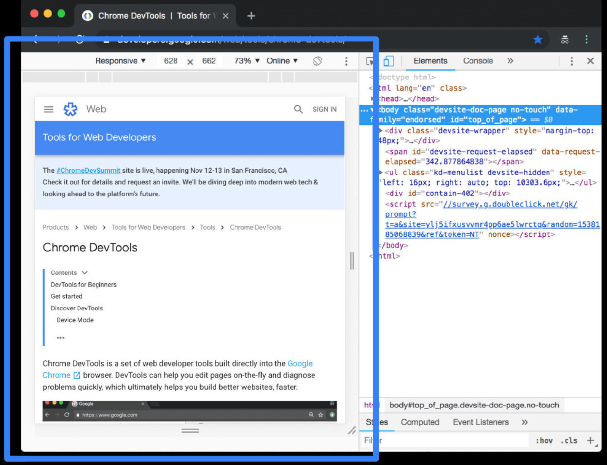
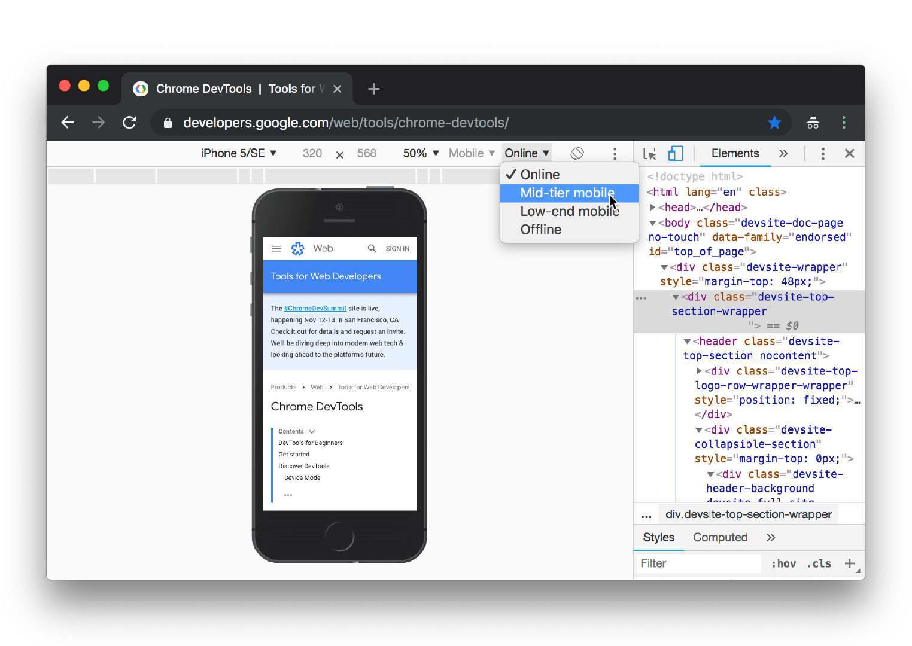
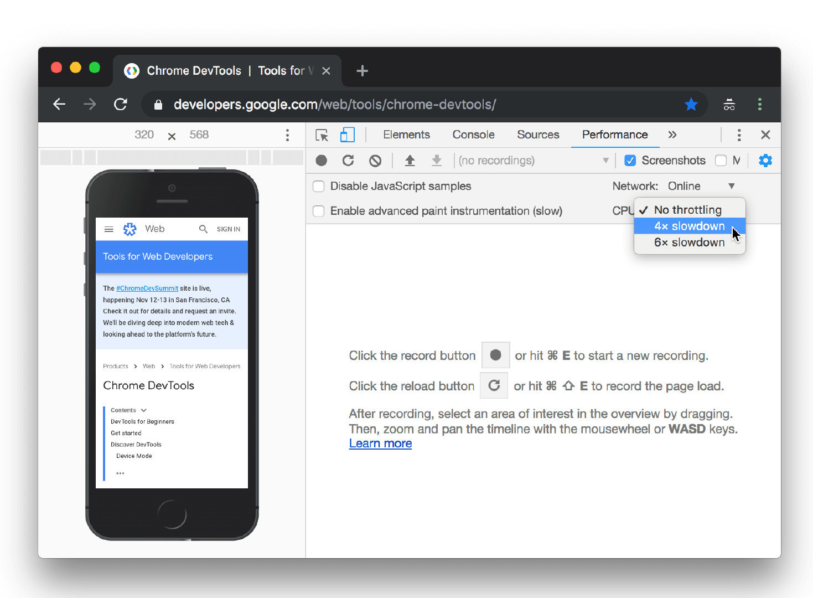
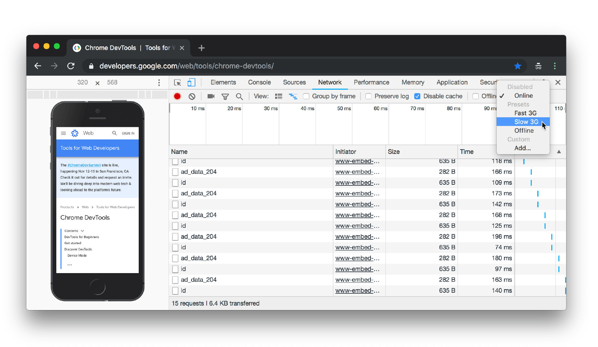
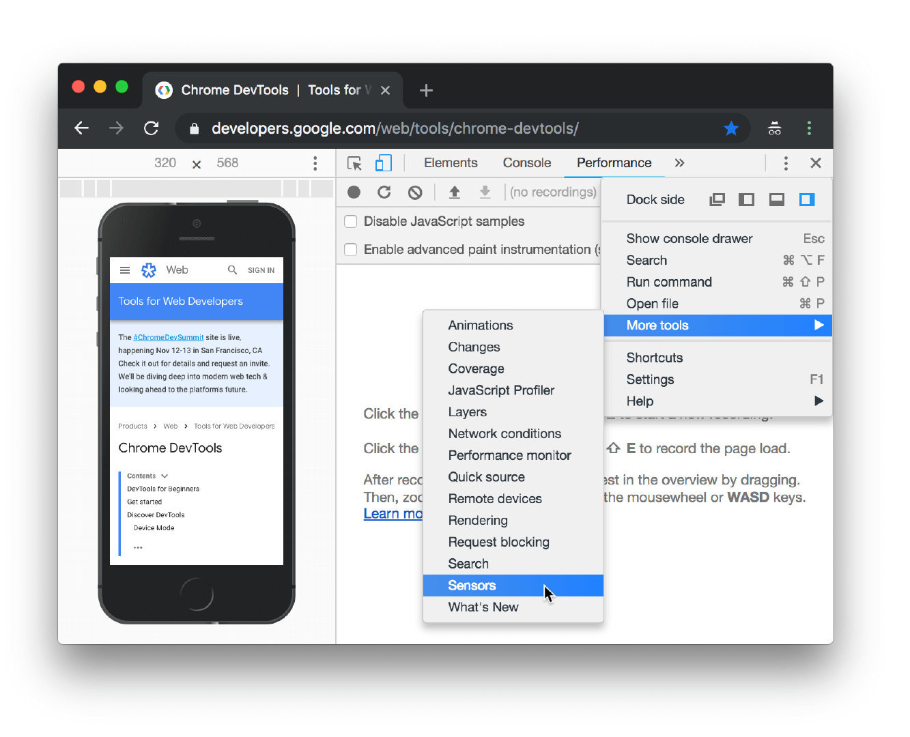
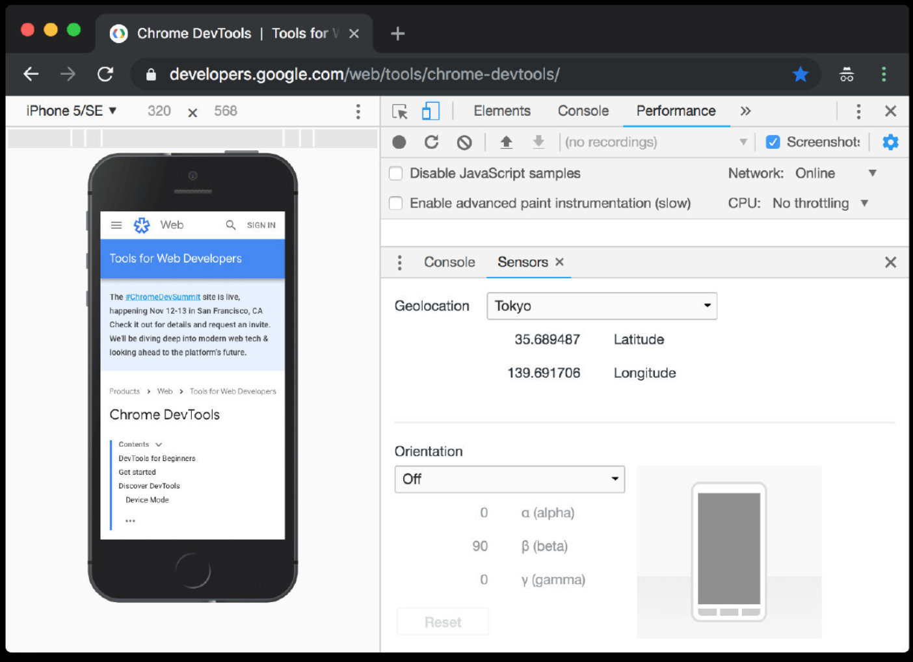

## 1.模拟移动设备

点击 **Toggle Device Toolbar** 

## 2.限制网络流量和 CPU 占用率

要限制网络流量和 CPU 占用率，请从 **Throttle** 列表中选择 **Mid-tier mobile** 或 **Low-end mobile**。

**Mid-tier mobile** 可模拟快速 3G 网络，并限制 CPU 占用率，以使模拟性能比普通性能低 4 倍。 **Low-end mobile** 可模拟慢速 3G 网络，并限制 CPU 占用率，以使模拟性能比普通性能低 6 倍。 请记住，限制是相对于笔记本电脑或桌面设备的普通性能而言。

请注意，如果 **Device Toolbar** 布局较窄，则会隐藏 **Throttle** 列表。

### 2.1只限制 CPU 占用率

如果只限制 CPU 占用率而不限制网络流量，请转至 **Performance** 面板，点击 **Capture Settings** 

### 2.2只限制网络流量

如果只限制网络流量而不限制 CPU 占用率，请转至 **Network** 面板，然后从 **Throttle** 列表中选择 **Fast 3G**或 **Slow 3G**。

## 2.3.替换地理定位

要打开地理定位替换界面，请点击 **Customize and control DevTools** 

从 **Geolocation** 列表中选择其中一个预设，或选择 **Custom location** 以输入自己的坐标，或选择 **Location unavailable** 以测试您的页面在地理定位处于错误状态时的表现。

