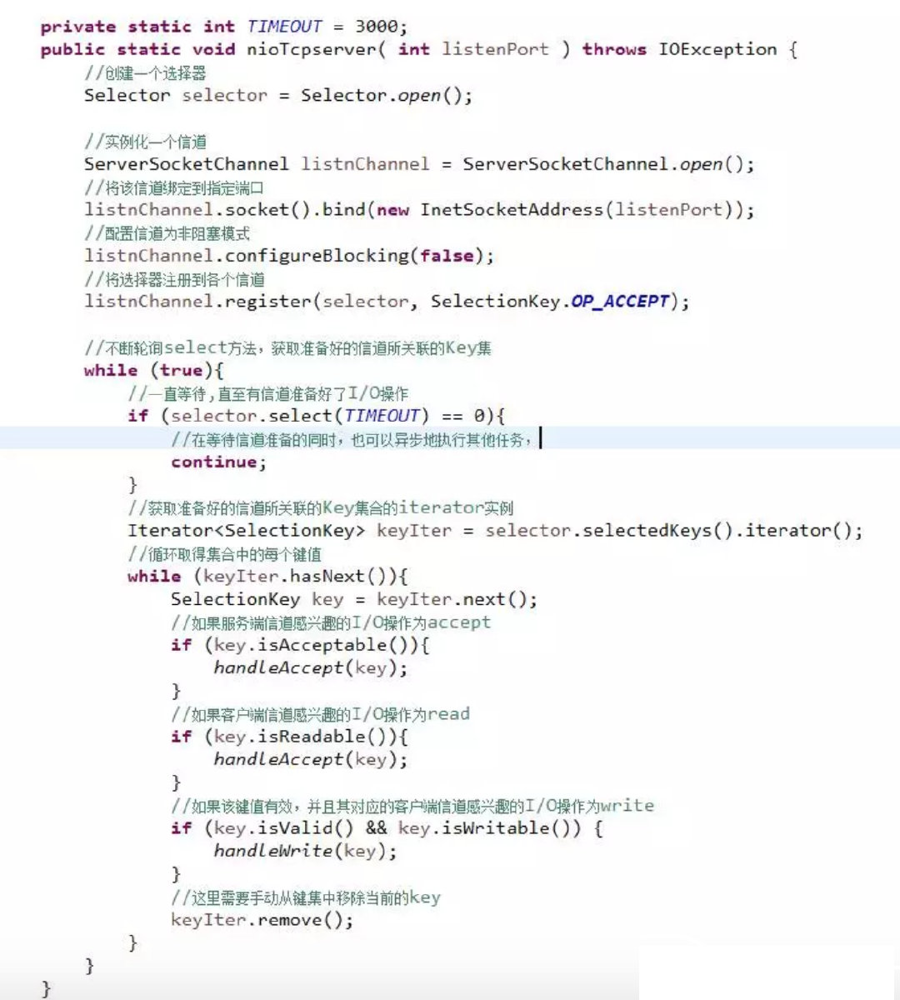
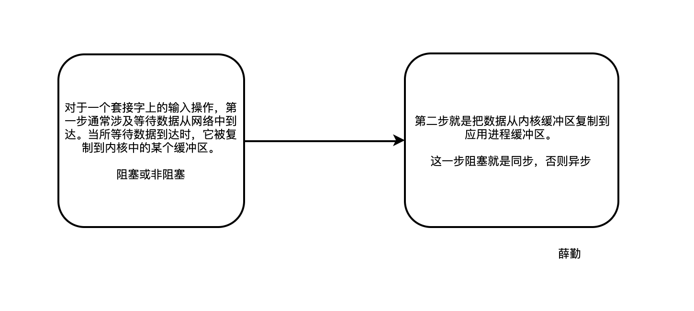

## 1.发发牢骚

相信大家在网上看过不少讲解 BIO/NIO/AIO 的文章，文章中举起栗子来更是夯吃夯吃一大堆，让人越看越觉得 What are you 讲啥嘞？


本文将针对 BIO/NIO/AIO 、阻塞与非阻塞、同步与异步等特别容易混淆的概念进行对比区分，理清混乱的思路。

## 2.魔幻的IO模型

#### BIO (同步阻塞I/O)

数据的读取写入必须阻塞在一个线程内等待其完成。

这里使用那个经典的烧开水例子，这里假设一个烧开水的场景，有一排水壶在烧开水，BIO的工作模式就是， 叫一个线程停留在一个水壶那，直到这个水壶烧开，才去处理下一个水壶。但是实际上线程在等待水壶烧开的时间段什么都没有做。

#### NIO（同步非阻塞）

同时支持阻塞与非阻塞模式，但这里我们以其同步非阻塞I/O模式来说明，那么什么叫做同步非阻塞？如果还拿烧开水来说，NIO的做法是叫一个线程不断的轮询每个水壶的状态，看看是否有水壶的状态发生了改变，从而进行下一步的操作。

#### AIO （异步非阻塞I/O）

异步非阻塞与同步非阻塞的区别在哪里？异步非阻塞无需一个线程去轮询所有IO操作的状态改变，在相应的状态改变后，系统会通知对应的线程来处理。对应到烧开水中就是，为每个水壶上面装了一个开关，水烧开之后，水壶会自动通知我水烧开了。

> 上面这些烧开水（或者服务员端菜）的例子百度一下相当多，但只能帮你理解些相关概念，使你知其然但不知其所以然，下面我会对概念进一步加深理解，并加以区分。

## 3.同步与异步的区别

同步和异步是针对应用程序和内核的交互而言的，同步指的是用户进程触发IO操作并等待或者轮询的去查看IO操作是否就绪，而异步是指用户进程触发IO操作以后便开始做自己的事情，而当IO操作已经完成的时候会得到IO完成的通知。

**简而言之，同步和异步最关键的区别在于同步必须等待（BIO）或者主动的去询问（NIO）IO是否完成，而异步（AIO）操作提交后只需等待操作系统的通知即可。**（思考一下：操作系统底层通过什么去通知数据使用者？）


大型网站一般都会使用消息中间件进行解藕、异步、削峰，生产者将消息发送给消息中间件就返回，消息中间件将消息转发到消费者进行消费，这种操作方式其实就是异步。

与之相比，什么是同步？

生产者将消息发送到消息中间件，消息中间件将消息发送给消费者，消息者消费后返回响应给消息中间件，消息中间件返回响应给生产者，该过程由始至终都需要生产者进行参与，这就是同步操作。

*（注：上面的举例只用于理解BIO/NIO概念，不代表消息中间件的真实使用过程）*

## 4.阻塞和非阻塞的区别

阻塞和非阻塞是针对于进程在访问数据的时候，根据IO操作的就绪状态来采取的不同方式，说白了是一种读取或者写入操作方法的实现方式，**阻塞方式下读取或者写入函数将一直等待（BIO），而非阻塞方式下，读取或者写入方法会立即返回一个状态值（NIO）**。


BIO对应的Socket网络编程代码如下，其中`server.accept()`代码会一直阻塞当前线程，直到有新的客户端与之连接后，就创建一个新的线程进行处理，注意这里是一次连接创建一个线程。

```java
public static void main(String[] args) throws IOException {
		int port = 8899;
		// 定义一个ServiceSocket监听在端口8899上
		ServerSocket server = new ServerSocket(port);
		System.out.println("等待与客户端建立连接...");
		while (true) {
			// server尝试接收其他Socket的连接请求，server的accept方法是阻塞式的
			Socket socket = server.accept();
			// 每接收到一个Socket就建立一个新的线程来处理它
			new Thread(new Task(socket)).start();
		}
		// server.close();
}
```

NIO的Socket网络编程代码如下图（在网上找了半天），我们只需要观察NIO的关键两个点：轮询、IO多路复用。



找到`while(true){}`代码就找到了轮询的代码，其中调用的 `selector.select()` 方法会一直阻塞到某个注册的通道有事件就绪，然后返回当前就绪的通道数，也就是非阻塞概念中提到的状态值。

## 5.IO多路复用

我们都听说过NIO具有IO多路复用，其实关键点就在于NIO创建一个连接后，是不需要创建对应的一个线程，这个连接会被注册到多路复用器（Selector）上面，所以所有的连接只需要一个线程就可以进行管理，当这个线程中的多路复用器进行轮询的时候，发现连接上有请求数据的话，才开启一个线程进行处理，也就是一个有效请求一个线程模式。如果连接没有数据，是没有工作线程来处理的。

光讲概念恐怕读者很难听的懂，所以我还是以上面那张图中的代码讲解。

在代码中，main方法所在的主线程拥有多路复用器并开启了一个主机端口进行通信，所有的客户端连接都会被注册到主线程所在的多路复用器，通过轮询`while(true){}`不断检测多路复用器上所有连接的状态，这些状态通过调用 SelectionKey.isAcceptable()、SelectionKey.isReadable() 等方法读取。发现请求有效，就开启一个线程进行处理，无效的请求，就不需要创建线程进行处理。

与BIO对比不难发现，这种方式相比BIO一次连接创建一个线程大大减少了线程的创建数量，性能岂能不提高。

## 6.AIO：异步非阻塞的编程方式

BIO/NIO都需要在调用读写方法后，要么一直等待，要么轮询查看，直到有了结果再来执行后续代码，这就是同步操作了。

而AIO则是真正的异步，当进行读写操作时，只须直接调用API的 read 或 write 方法即可。对于读操作而言，当有流可读取时，操作系统会将可读的流传入 read 方法的缓冲区，并通知应用程序；对于写操作而言，当操作系统将 write 方法传递的流写入完毕时，操作系统主动通知应用程序。你可以理解为，read/write 方法都是异步的，完成后会主动调用回调函数，这也就是同步与异步真正的区别了。


示例代码：

```java
public static void main(String[] args) {
   AsynchronousServerSocketChannel assc = AsynchronousServerSocketChannel.open();
   assc.bind(new InetSocketAddress("localhost", 8080));
   //非阻塞方法，注册回调函数，只能接受一个连接
   assc.accept(null, new CompletionHandler<AsynchronousSocketChannel, Object>() {

     @Override
     public void completed(AsynchronousSocketChannel asc, Object attachment) {
     }

     @Override
     public void failed(Throwable exc, Object attachment) {  
     }
   });
}
```

*（注：Java7后引入AIO ，但不同操作系统底层原理不一致，比如Linux的epoll， Window的iocp）*

## 7.后续

文章讲到这里，其实只是开始。

如今，大名鼎鼎的IO多路复用你已经知道了What，但我们依旧有着许多的Why不理解，Selector为什么可以做到多路复用？selector.select() 方法的调用经历了什么？操作系统又在其中扮演着什么样的角色？AIO中操作系统是如何做到主动通知应用程序调用回调函数？...

对于这些问题，你是否丧失了深究下去的兴趣？

最后补一张图：

