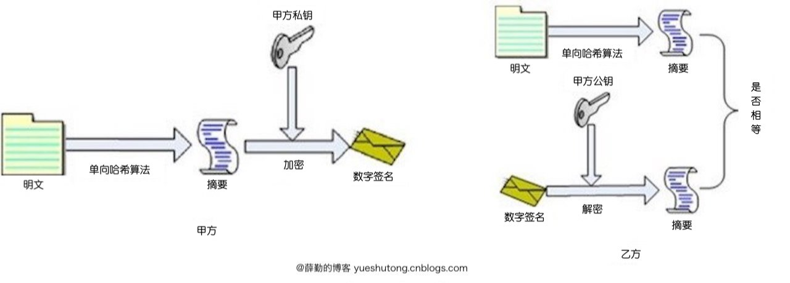

> 在腾讯工作已经第三周了，由于是支付业务，不免会涉及到加解密、数字签名之类的安全手段，花了一天时间，学习了下数字签名，整理发出。

## 1.数字签名概述

在讨论数字签名之前，我们先来说说签名。**签名**，即自己写自己的名字，尤其为表示同意、认可、承担责任或义务。在实际生活中，一些方式（如字迹，指纹等）一直被用作签名者身份的证明。这是因为：签名是可信的；不可伪造的；不可重用的；不可抵赖的。签名即代表着同意，并产生法律效力，在法律上赋予了文件以真实性。

在日渐来临的数字化生活中，由于信息在存储，传输和处理等过程往往是在开放的通信网络上进行的，所以信息更容易受到来自外界或内部的窃听、截取、修改、伪造和重放等多种手段的攻击。这时候，就需要**数字签名**来保证消息的来源、消息的真实，并确保消息发送者不可以抵赖自己发送的消息，其与现实生活中签名的作用大致相同。

## 2.数字签名性质

数字签名作为一种密码技术，具有以下功能和性质:

1.防冒充

其他人不能伪造对消息的签名，因为私有密钥只有签名者自己知道，所以其他人不能伪造出正确的签名结果。要求私钥的持有人保存好自己的私钥。

2.防篡改

对于数字签名，签名和原有文件己经形成一个混合的整体数据，不能篡改，从而保证了数据的完整性。

3.防重放

在数字签名中，如果采用了对签名报文添加流水号、时戳等技术，可以防止重放攻击.

4.防抵赖

数字签名可以鉴别身份，不可能冒充伪造。签名者无法对自己作过的签名抵赖。要防止接收者的抵赖，在数字签名体制中，要求接收者返回一个自己签名的表示收到的报文，给对方或者是第三方，或者引入第三方仲裁机制。这样，双方均不可抵赖。

5.机密性

有了机密性的保证，截取攻击就不会成功了。对要签名的消息进行适合的加密操作来保证机密性，这些涉及到加密或签密理论。

## 3.对称加密和非对称加密

在学习数字签名的工作原理之前，需要了解对称加密和非对称加密的原理。

**对称加密**

所谓对称加密，是采用对称密码编码技术的加密措施，它的特点是文件加密和解密都是使用相同的密钥。

这种方法在密码学中叫做对称加密算法，对称加密算法使用起来简单快捷，密钥较短，且破译困难，除了数据加密标准（DES），另一个对称密钥加密系统是国际数据加密算法（IDEA），它比DES的加密性好，而且对计算机功能要求也没有那么高。

**非对称加密**

与对称加密算法不同，非对称加密算法需要两个密钥：公开密钥（publickey）和私有密钥（privatekey）。

公开密钥与私有密钥是一对，如果用公开密钥对数据进行加密，只有用对应的私有密钥才能解密；如果用私有密钥对数据进行加密，那么只有用对应的公开密钥才能解密。

因为加密和解密使用的是两个不同的密钥，所以这种算法叫作非对称加密算法。

## 4.信息摘要

**信息摘要**：对数据进行处理，得到一段固定长度的结果。

一般在进行数字签名时，需要先对文件使用HASH算法计算其信息摘要，然后对该摘要值进行数字签名。

信息摘要特点有：

1、输出长度固定。即输出长度和输入长度无关。

2、不可逆。即由输出数据理论上不能推导出输入数据

4、对输入数据敏感。当输入数据变化极小时，输出数据也会发生明显的变化

5、防碰撞。即不同的数据数据得到相同输出数据的可能性极低。

由于信息摘要具有上述特点，一般保证数据的完整性，对一个大文件进行摘要运算，得到其摘要值。通过网络或者其他渠道传输后，通过验证其摘要值，确定大文件本身有没有发生变化。

## 5.数字签名原理

数字签名实现的具体原理： 

1.将报文按双方约定的HASH算法计算得到一个固定位数的报文摘要。在数学上保证，只要改动报文中任何一位，重新计算出的报文摘要值就会与原先的值不相符。这样就保证了报文的不可更改性。

2.将该报文摘要值用发送者的私人密钥加密即称数字签名，然后连同原报文和数字证书（包含公钥）一起发送给接收者。

3.接收方收到数字签名后，用同样的HASH算法对报文计算摘要值，然后将数字签名用发送者的公钥进行解密，并与报文摘要值相比较，如相等则说明报文确实来自所称的发送者。

上述过程可以借用下图完美诠释：



为了防止公钥在传输过程中被调包，需要证书中心（简称CA）为公钥做认证。证书中心用自己的私钥，对公钥和一些相关信息一起加密，生成"数字证书"（Digital Certificate），客户端用CA的公钥解开数字证书，从而确定公钥的真实性。

## 5.数字签名算法—RSA

RSA是目前计算机密码学中最经典算法，也是目前为止使用最广泛的数字签名算法，RSA数字签名算法的密钥实现与RSA的加密算法是一样的，算法的名称都叫RSA。密钥的产生和转换都是一样的，包括在售的所有SSL数字证书、代码签名证书、文档签名以及邮件签名大多都采用RSA算法进行加密。

RSA是目前最有影响力的公钥加密算法，它能够抵抗到目前为止已知的绝大多数密码攻击，已被ISO推荐为公钥数据加密标准。

RSA算法支持公钥加密、私钥解密以及私钥加密、公钥解密。

但是RSA数字签名算法存在着因计算方法本身同构造成签名易被伪造和计算时间长的弱点，因此实际对文件签名前，需要对消息经单向散列函数计算其消息摘要。

比如 **MD5withRSA 是将正文通过MD5消息摘要后，将其再次通过RSA密钥加密，生成数字签名**。

具体消息摘要算法结合RSA算法的选择如下表格所示：


示例代码：

```java
import java.security.KeyFactory;
import java.security.KeyPair;
import java.security.KeyPairGenerator;
import java.security.PrivateKey;
import java.security.PublicKey;
import java.security.Signature;
import java.security.interfaces.RSAPrivateKey;
import java.security.interfaces.RSAPublicKey;
import java.security.spec.PKCS8EncodedKeySpec;
import java.security.spec.X509EncodedKeySpec;

public class HelloRSA {

    private final static String SIGNATURE_ALGORITHM = "RSA";
    private final static String KEY_ALGORITHM = "SHA256withRSA"; // MD5withRSA
    private final static String src = "Hello World";

    public static void main(String[] args) {
        jdkRSA();
    }

    public static void jdkRSA() {
        try {
            //1.初始化密钥
            KeyPairGenerator keyPairGenerator = KeyPairGenerator.getInstance(SIGNATURE_ALGORITHM);
            keyPairGenerator.initialize(512); // 位(64的整数倍)
            KeyPair keyPair = keyPairGenerator.generateKeyPair();
            RSAPublicKey rsaPublicKey = (RSAPublicKey)keyPair.getPublic(); //公钥
            RSAPrivateKey rsaPrivateKey = (RSAPrivateKey)keyPair.getPrivate(); //私钥

            //2.执行签名
            //PKCS8EncodedKeySpec类表示私钥的ASN.1编码。
            PKCS8EncodedKeySpec pkcs8EncodedKeySpec = new PKCS8EncodedKeySpec(rsaPrivateKey.getEncoded());
            KeyFactory keyFactory = KeyFactory.getInstance(SIGNATURE_ALGORITHM);
            PrivateKey privateKey = keyFactory.generatePrivate(pkcs8EncodedKeySpec);
            //签名
            Signature signature = Signature.getInstance(KEY_ALGORITHM);
            signature.initSign(privateKey);
            signature.update(src.getBytes());
            byte[] result = signature.sign();
            System.out.println("jdk "+SIGNATURE_ALGORITHM+" sign : " + bytesToHexString(result));

            //3.验证签名
            //X509EncodedKeySpec类表示根据ASN.1类型SubjectPublicKeyInfo编码的公钥的ASN.1编码。
            X509EncodedKeySpec x509EncodedKeySpec = new X509EncodedKeySpec(rsaPublicKey.getEncoded());
            keyFactory = KeyFactory.getInstance(SIGNATURE_ALGORITHM);
            PublicKey publicKey = keyFactory.generatePublic(x509EncodedKeySpec);
            //验签
            signature = Signature.getInstance(KEY_ALGORITHM);
            signature.initVerify(publicKey);
            signature.update(src.getBytes());
            boolean bool = signature.verify(result);
            System.out.println("jdk "+SIGNATURE_ALGORITHM+" verify : " + bool);
        } catch (Exception e) {
            e.printStackTrace();
        }
    }


    /**
     * byte[] 转 16进制
     */
    private static String bytesToHexString(byte[] src) {
        StringBuilder stringBuilder = new StringBuilder();
        if (src == null || src.length <= 0) {
            return null;
        }
        for (int i = 0; i < src.length; i++) {
            int v = src[i] & 0xFF;
            String hv = Integer.toHexString(v);
            if (hv.length() < 2) {
                stringBuilder.append(0);
            }
            stringBuilder.append(hv);
        }
        return stringBuilder.toString();
    }

}
```

## 6.数字签名算法—DSA

DSA全称Digital Signature Algorithm，DSA只是一种算法，和RSA不同之处在于它不能用作加密和解密，也不能进行密钥交换，只用于签名，所以它比RSA要快很多，其安全性与RSA相比差不多。

**那么签名算法与公钥加密算法的区别是什么呢？**

签名算法，用来确保信息发布人的身份和信息的完整性，不能用来做加密传输，为了实现这个功能，信息的原文（或者消息摘要）必须随着签名一起传输和公布才能被验证。而 RSA 是公钥加密体系，它可以用来加密传输（即信息原文在传输中加密，到达对方后解密），它也可以实现签名验证。

具体消息摘要算法结合DSA算法的选择如下表格所示：


示例代码：

```java
import java.security.KeyFactory;
import java.security.KeyPair;
import java.security.KeyPairGenerator;
import java.security.PrivateKey;
import java.security.PublicKey;
import java.security.Signature;
import java.security.interfaces.DSAPrivateKey;
import java.security.interfaces.DSAPublicKey;
import java.security.spec.PKCS8EncodedKeySpec;
import java.security.spec.X509EncodedKeySpec;

public class HelloDSA {

    private final static String SIGNATURE_ALGORITHM = "DSA";
    private final static String KEY_ALGORITHM = "SHA1withDSA";
    private final static String src = "Hello World";

    public static void main(String[] args) {
        jdkDSA();
    }

    public static void jdkDSA() {
        try {
            //1.初始化密钥
            KeyPairGenerator keyPairGenerator = KeyPairGenerator.getInstance(SIGNATURE_ALGORITHM);
            keyPairGenerator.initialize(512); // 位(64的整数倍)
            KeyPair keyPair = keyPairGenerator.generateKeyPair();
            DSAPublicKey dsaPublicKey = (DSAPublicKey)keyPair.getPublic(); //公钥
            DSAPrivateKey dsaPrivateKey = (DSAPrivateKey)keyPair.getPrivate(); //私钥

            //2.执行签名
            //PKCS8EncodedKeySpec类表示私钥的ASN.1编码。
            PKCS8EncodedKeySpec pkcs8EncodedKeySpec = new PKCS8EncodedKeySpec(dsaPrivateKey.getEncoded());
            KeyFactory keyFactory = KeyFactory.getInstance(SIGNATURE_ALGORITHM);
            PrivateKey privateKey = keyFactory.generatePrivate(pkcs8EncodedKeySpec);
            //签名
            Signature signature = Signature.getInstance(KEY_ALGORITHM);
            signature.initSign(privateKey);
            signature.update(src.getBytes());
            byte[] result = signature.sign();
            System.out.println("jdk "+SIGNATURE_ALGORITHM+" sign : " + bytesToHexString(result));

            //3.验证签名
            //X509EncodedKeySpec类表示根据ASN.1类型SubjectPublicKeyInfo编码的公钥的ASN.1编码。
            X509EncodedKeySpec x509EncodedKeySpec = new X509EncodedKeySpec(dsaPublicKey.getEncoded());
            keyFactory = KeyFactory.getInstance(SIGNATURE_ALGORITHM);
            PublicKey publicKey = keyFactory.generatePublic(x509EncodedKeySpec);
            //验签
            signature = Signature.getInstance(KEY_ALGORITHM);
            signature.initVerify(publicKey);
            signature.update(src.getBytes());
            boolean bool = signature.verify(result);
            System.out.println("jdk "+SIGNATURE_ALGORITHM+" verify : " + bool);
        } catch (Exception e) {
            e.printStackTrace();
        }
    }


    /**
     * byte[] 转 16进制
     */
    private static String bytesToHexString(byte[] src) {
        StringBuilder stringBuilder = new StringBuilder();
        if (src == null || src.length <= 0) {
            return null;
        }
        for (int i = 0; i < src.length; i++) {
            int v = src[i] & 0xFF;
            String hv = Integer.toHexString(v);
            if (hv.length() < 2) {
                stringBuilder.append(0);
            }
            stringBuilder.append(hv);
        }
        return stringBuilder.toString();
    }

}
```

## 7.数字签名算法—ECDSA

椭圆曲线数字签名算法 ECDSA 是使用椭圆曲线密码 ECC 对数字签名算法 DSA 的模拟。ECDSA 于1999年成为 ANSI 标准，并于2000年成为 IEEE 和 NIST 标准。它在1998年既已为ISO所接受，并且包含它的其他一些标准亦在ISO的考虑之中。

比特币所使用的数字签名算法就是椭圆曲线数字签名算法。

ECC 与 RSA 相比，有以下的优点：

（1）相同密钥长度下，安全性能更高，如160位ECC已经与1024位RSA、DSA有相同的安全强度。

（2）计算量小，处理速度快，在私钥的处理速度上（解密和签名），ECC远 比RSA、DSA快得多。

（3）存储空间占用小 ECC的密钥尺寸和系统参数与RSA、DSA相比要小得多， 所以占用的存储空间小得多。

（4）带宽要求低使得ECC具有广泛得应用前景。

具体消息摘要算法结合ECDSA算法的选择如下表格所示：


示例代码：

```java
import java.security.KeyFactory;
import java.security.KeyPair;
import java.security.KeyPairGenerator;
import java.security.PrivateKey;
import java.security.PublicKey;
import java.security.Signature;
import java.security.interfaces.ECPrivateKey;
import java.security.interfaces.ECPublicKey;
import java.security.spec.PKCS8EncodedKeySpec;
import java.security.spec.X509EncodedKeySpec;

public class HelloECDSA {

    private final static String SIGNATURE_ALGORITHM = "EC";
    private final static String KEY_ALGORITHM = "SHA1withECDSA";
    private final static String src = "Hello World";

    public static void main(String[] args) {
        jdkEC();
    }

    public static void jdkEC() {
        try {
            //1.初始化密钥
            KeyPairGenerator keyPairGenerator = KeyPairGenerator.getInstance(SIGNATURE_ALGORITHM);
            keyPairGenerator.initialize(256); // 位
            KeyPair keyPair = keyPairGenerator.generateKeyPair();
            ECPublicKey rsaPublicKey = (ECPublicKey)keyPair.getPublic(); //公钥
            ECPrivateKey rsaPrivateKey = (ECPrivateKey)keyPair.getPrivate(); //私钥

            //2.执行签名
            //PKCS8EncodedKeySpec类表示私钥的ASN.1编码。
            PKCS8EncodedKeySpec pkcs8EncodedKeySpec = new PKCS8EncodedKeySpec(rsaPrivateKey.getEncoded());
            KeyFactory keyFactory = KeyFactory.getInstance(SIGNATURE_ALGORITHM);
            PrivateKey privateKey = keyFactory.generatePrivate(pkcs8EncodedKeySpec);
            //签名
            Signature signature = Signature.getInstance(KEY_ALGORITHM);
            signature.initSign(privateKey);
            signature.update(src.getBytes());
            byte[] result = signature.sign();
            System.out.println("jdk "+SIGNATURE_ALGORITHM+" sign : " + bytesToHexString(result));

            //3.验证签名
            //X509EncodedKeySpec类表示根据ASN.1类型SubjectPublicKeyInfo编码的公钥的ASN.1编码。
            X509EncodedKeySpec x509EncodedKeySpec = new X509EncodedKeySpec(rsaPublicKey.getEncoded());
            keyFactory = KeyFactory.getInstance(SIGNATURE_ALGORITHM);
            PublicKey publicKey = keyFactory.generatePublic(x509EncodedKeySpec);
            //验签
            signature = Signature.getInstance(KEY_ALGORITHM);
            signature.initVerify(publicKey);
            signature.update(src.getBytes());
            boolean bool = signature.verify(result);
            System.out.println("jdk "+SIGNATURE_ALGORITHM+" verify : " + bool);
        } catch (Exception e) {
            e.printStackTrace();
        }
    }


    /**
     * byte[] 转 16进制
     */
    private static String bytesToHexString(byte[] src) {
        StringBuilder stringBuilder = new StringBuilder();
        if (src == null || src.length <= 0) {
            return null;
        }
        for (int i = 0; i < src.length; i++) {
            int v = src[i] & 0xFF;
            String hv = Integer.toHexString(v);
            if (hv.length() < 2) {
                stringBuilder.append(0);
            }
            stringBuilder.append(hv);
        }
        return stringBuilder.toString();
    }

}
```

## 延伸阅读

[数字证书原理](https://www.cnblogs.com/JeffreySun/archive/2010/06/24/1627247.html)

## 参考文章

[openssl 摘要和签名验证指令dgst使用详解](https://www.cnblogs.com/gordon0918/p/5382541.html)

[Java实现数字签名](https://blog.csdn.net/lovelichao12/article/details/75007189)

[数字签名算法介绍和区别](https://zhuanlan.zhihu.com/p/33195438)

