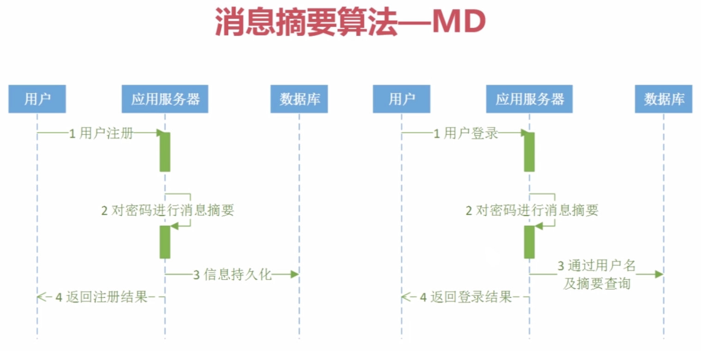
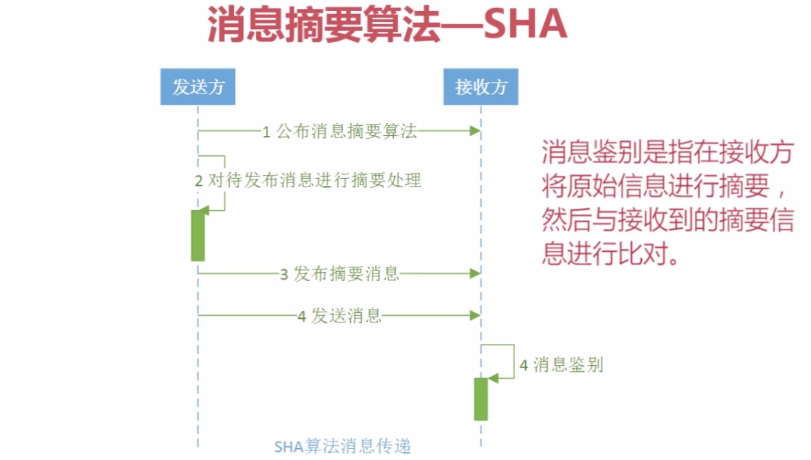

## 1.消息摘要概述

消息摘要（Message Digest）又称为数字摘要（Digital Digest）。它是一个唯一对应一个消息或文本的固定长度的值，它由一个单向Hash加密函数对消息进行作用而产生。如果消息在途中改变了，则接收者通过对收到消息的新产生的摘要与原摘要比较，就可知道消息是否被改变了。**因此消息摘要保证了消息的完整性。** 

消息摘要采用单向Hash函数将需加密的明文"摘要"成一串固定位数（如128bit）的密文，这一串密文亦称为数字指纹（Finger Print），它有固定的长度，且不同的明文摘要成密文，其结果总是不同的，而同样的明文其摘要必定一致。这样这串摘要便可成为验证明文是否是“真身”的“指纹”了。

消息摘要具有不可逆性，在消息摘要生成过程中，会丢失很多原文的信息，而且无法找回。一个好的摘要算法，是极难产生Hash碰撞的，也就是找到另一段明文经计算后产生相同的摘要。

## 2.消息摘要算法-MD2、MD4、MD5

MD是应用非常广泛的一个算法家族，尤其是 MD5（Message-Digest Algorithm 5，消息摘要算法版本5），它由MD2、MD3、MD4发展而来，由Ron Rivest（RSA公司）在1992年提出，目前被广泛应用于数据完整性校验、数据（消息）摘要、数据加密等。MD2、MD4、MD5 都产生16字节（**128位**）的校验值，一般用32位十六进制数表示。MD2的算法较慢但相对安全，MD4速度很快，但安全性下降，MD5比MD4更安全、速度更快。

目前在互联网上进行大文件传输时，都要得用MD5算法产生一个与文件匹配的、存储MD5值的文本文件（后缀名为 .md5或.md5sum），这样接收者在接收到文件后，就可以利用与 SFV 类似的方法来检查文件完整性，目前绝大多数大型软件公司或开源组织都是以这种方式来校验数据完整性，而且部分操作系统也使用此算法来对用户密码进行加密，另外，它也是目前计算机犯罪中数据取证的最常用算法。与MD5 相关的工具有很多，如 WinMD5等。

**MD算法的实现**

| 算法 | 摘要长度 | 实现方        |
| ---- | -------- | ------------- |
| MD2  | 128      | JDK           |
| MD4  | 128      | Bouncy Castle |
| MD5  | 128      | JDK           |

在运行下面的所有Java程序之前，你需要引入Bouncy Castle和Commons Codec的依赖：

```xml
<dependency>
   <groupId>org.bouncycastle</groupId>
   <artifactId>bcprov-jdk15</artifactId>
   <version>1.46</version>
</dependency>
<dependency>
   <groupId>commons-codec</groupId>
   <artifactId>commons-codec</artifactId>
   <version>1.10</version>
</dependency>
```

Java代码实现：

```java
import java.security.MessageDigest;
import java.security.NoSuchAlgorithmException;
import java.security.Security;
import org.apache.commons.codec.digest.DigestUtils;
import org.bouncycastle.crypto.digests.MD4Digest;
import org.bouncycastle.crypto.digests.MD5Digest;
import org.bouncycastle.jce.provider.BouncyCastleProvider;

public class MD5 {

  public static final String src = "md5 test";

  public static void main(String[] args) throws NoSuchAlgorithmException {
    jdkMD5();
    jdkMD2();
    ccMD5();
    ccMD2();
    bcMD5();
    bcMD4();
    bc2jdkMD4();
  }

  // 用jdk实现:MD5
  public static void jdkMD5() throws NoSuchAlgorithmException {
    MessageDigest md = MessageDigest.getInstance("MD5");
    byte[] md5Bytes = md.digest(src.getBytes());
    System.out.println("JDK MD5:" + bytesToHexString(md5Bytes));

  }

  // 用jdk实现:MD2
  public static void jdkMD2() throws NoSuchAlgorithmException {
    MessageDigest md = MessageDigest.getInstance("MD2");
    byte[] md2Bytes = md.digest(src.getBytes());
    System.out.println("JDK MD2:" + bytesToHexString(md2Bytes));
  }


  // 用bouncy castle实现:MD5
  public static void bcMD5() {
    MD5Digest digest = new MD5Digest();
    digest.update(src.getBytes(), 0, src.getBytes().length);
    byte[] md5Bytes = new byte[digest.getDigestSize()];
    digest.doFinal(md5Bytes, 0);
    System.out.println("bouncy castle MD5:" + bytesToHexString(md5Bytes));

  }


  // 用bouncy castle实现:MD4
  public static void bcMD4() {
    MD4Digest digest = new MD4Digest();
    digest.update(src.getBytes(), 0, src.getBytes().length);
    byte[] md4Bytes = new byte[digest.getDigestSize()];
    digest.doFinal(md4Bytes, 0);
    System.out.println("bouncy castle MD4:" + bytesToHexString(md4Bytes));
  }

  // 用bouncy castle与jdk结合实现:MD4
  public static void bc2jdkMD4() throws NoSuchAlgorithmException {
    Security.addProvider(new BouncyCastleProvider());
    MessageDigest md = MessageDigest.getInstance("MD4");
    byte[] md4Bytes = md.digest(src.getBytes());
    System.out.println("bc and JDK MD4:" + bytesToHexString(md4Bytes));
  }

  // 用common codes实现实现:MD5
  public static void ccMD5() {
    System.out.println("common codes MD5:" + DigestUtils.md5Hex(src.getBytes()));
  }

  // 用common codes实现实现:MD2
  public static void ccMD2() {
    System.out.println("common codes MD2:" + DigestUtils.md2Hex(src.getBytes()));
  }

  /**
   * byte[] 转 16进制
   */
  private static String bytesToHexString(byte[] src) {
    StringBuilder stringBuilder = new StringBuilder();
    if (src == null || src.length <= 0) {
      return null;
    }
    for (int i = 0; i < src.length; i++) {
      int v = src[i] & 0xFF;
      String hv = Integer.toHexString(v);
      if (hv.length() < 2) {
        stringBuilder.append(0);
      }
      stringBuilder.append(hv);
    }
    return stringBuilder.toString();
  }

}
```

MD算法可用于密码保护。在用户注册时，利用MD算法取密码的摘要值，存入数据库。在用户登录时，将用户密码再次消息摘要后，与数据库密码进行比较即可得出用户登录结果。流程图如下：



## 3.消息摘要算法-SHA

SHA（Secure Hash Algorithm）是由美国专门制定密码算法的标准机构——美国国家标准技术研究院（NIST）制定的，SHA系列算法的摘要长度分别为：SHA-1为20字节（160位）、SHA-224为32字节（224位）、SHA-256为32字节（256位）、SHA-384为48字节（384位）、SHA-512为64字节（512位），由于它产生的数据摘要的长度更长，因此更难以发生碰撞，因此也更为安全，它是未来数据摘要算法的发展方向。由于SHA系列算法的数据摘要长度较长，因此其运算速度与MD5相比，也相对较慢。

目前SHA1的应用较为广泛，主要应用于CA和数字证书中，另外在目前互联网中流行的BT软件中，也是使用SHA1来进行文件校验的。

**SHA算法的实现**

| 算法    | 摘要长度 | 实现方        |
| ------- | -------- | ------------- |
| SHA-1   | 160      | JDK           |
| SHA-224 | 224      | Bouncy Castle |
| SHA-256 | 256      | JDK           |
| SHA-384 | 384      | JDK           |
| SHA-512 | 512      | JDK           |

Java代码实现：

```java
import java.io.UnsupportedEncodingException;
import java.math.BigInteger;
import java.security.MessageDigest;
import java.security.NoSuchAlgorithmException;
import java.security.Security;
import org.apache.commons.codec.digest.DigestUtils;
import org.bouncycastle.crypto.Digest;
import org.bouncycastle.crypto.digests.SHA1Digest;
import org.bouncycastle.crypto.digests.SHA224Digest;
import org.bouncycastle.jce.provider.BouncyCastleProvider;

public class SHA {

  public static final String src = "sha test";

  public static void main(String[] args)
      throws UnsupportedEncodingException, NoSuchAlgorithmException {
    jdkSHA1();
    bcSHA1();
    bcSHA224();
    bcSHA224b();
    generateSha256();
    ccSHA1();
  }

  // 用jdk实现:SHA1
  public static void jdkSHA1() throws NoSuchAlgorithmException {
    MessageDigest md = MessageDigest.getInstance("SHA");
    md.update(src.getBytes());
    byte[] bytes = md.digest();
    //byte[]转16进制
    BigInteger bigInt = new BigInteger(1, bytes);
    System.out.println("jdk sha-1:" + bigInt.toString(16));
  }

  // 用jdk实现:SHA256
  public static void generateSha256()
      throws UnsupportedEncodingException, NoSuchAlgorithmException {
    MessageDigest md = MessageDigest.getInstance("SHA-256");
    md.update(src.getBytes("UTF-8")); // Change this to "UTF-16" if needed
    byte[] digest = md.digest();
    BigInteger bigInt = new BigInteger(1, digest);
    System.out.println("Sha256 hash: " + bigInt.toString(16));
  }

  // 用bouncy castle实现:SHA1
  public static void bcSHA1() {
    Digest digest = new SHA1Digest();
    digest.update(src.getBytes(), 0, src.getBytes().length);
    byte[] sha1Bytes = new byte[digest.getDigestSize()];
    digest.doFinal(sha1Bytes, 0);
    BigInteger bigInt = new BigInteger(1, sha1Bytes);
    System.out.println("bc sha-1:" + bigInt.toString(16));
  }


  // 用bouncy castle实现:SHA224
  public static void bcSHA224() {
    Digest digest = new SHA224Digest();
    digest.update(src.getBytes(), 0, src.getBytes().length);
    byte[] sha224Bytes = new byte[digest.getDigestSize()];
    digest.doFinal(sha224Bytes, 0);
    BigInteger bigInt = new BigInteger(1, sha224Bytes);
    System.out.println("bc sha-224:" + bigInt.toString(16));
  }

  // 用bouncy castle与jdk结合实现:SHA224
  public static void bcSHA224b() throws NoSuchAlgorithmException {
    Security.addProvider(new BouncyCastleProvider());
    MessageDigest md = MessageDigest.getInstance("SHA224");
    md.update(src.getBytes());
    BigInteger bigInt = new BigInteger(1, md.digest());
    System.out.println("bc and JDK sha-224:" + bigInt.toString(16));
  }

  // 用common codes实现实现:SHA1
  public static void ccSHA1() {
    System.out.println("common codes SHA1 - 1 :" + DigestUtils.sha1Hex(src.getBytes()));
    System.out.println("common codes SHA1 - 2 :" + DigestUtils.sha1Hex(src));
  }

}
```

消息鉴别：



## 4.消息摘要算法-MAC

MAC算法 (Message Authentication Codes消息认证码算法) 含有密钥的散列函数算法，兼容了MD和SHA算法的特性，并在此基础上加上了密钥。因此MAC算法也经常被称作HMAC算法。消息的散列值由只有通信双方知道的密钥来控制。此时Hash值称作MAC。

经过MAC算法得到的摘要值也可以使用十六进制编码表示，其摘要值得长度与实现算法的摘要值长度相同。例如 HmacSHA算法得到的摘要长度就是SHA1算法得到的摘要长度，都是160位二进制数，换算成十六进制的编码为40位。

**流程分析：**

甲乙双方进行数据交换可以采取如下流程：

1.甲方向乙方公布摘要算法（就是指定要使用的摘要算法名）

2.甲乙双方按照约定构造密钥，双方拥有相同的密钥（一般是一方构造密钥后通知另外一方，此过程不需要通过程序实现，就是双方约定个字符串，但是这个字符串可不是随便设定的，也是通过相关算法获取的）

3.甲方使用密钥对消息做摘要处理，然后将消息和生成的摘要消息一同发送给乙方

4.乙方收到消息后，使用甲方已经公布的摘要算法+约定好的密钥 对收到的消息进行摘要处理。然后比对自己的摘要消息和甲方发过来的摘要消息。甄别消息是否是甲方发送过来的。

**MAC算法的实现：**

| 算法       | 摘要长度 | 备注             |
| ---------- | -------- | ---------------- |
| HmacMD5    | 128      | JAVA6实现        |
| HmacSHA1   | 160      | JAVA6实现        |
| HmacSHA256 | 256      | JAVA6实现        |
| HmacSHA384 | 384      | JAVA6实现        |
| HmacSHA512 | 512      | JAVA6实现        |
| HmacMD2    | 128      | BouncyCastle实现 |
| HmacMD4    | 128      | BouncyCastle实现 |
| HmacSHA224 | 224      | BouncyCastle实现 |

Java代码实现：

```java
import java.math.BigInteger;
import javax.crypto.KeyGenerator;
import javax.crypto.Mac;
import javax.crypto.SecretKey;
import javax.crypto.spec.SecretKeySpec;
import org.apache.commons.codec.binary.Hex;
import org.bouncycastle.crypto.digests.MD5Digest;
import org.bouncycastle.crypto.macs.HMac;
import org.bouncycastle.crypto.params.KeyParameter;

public class HMAC {

  public static final String src = "hmac test";

  public static void main(String[] args) {
    jdkHmacMD5();
    bcHmacMD5();
  }

  // 用jdk实现:
  public static void jdkHmacMD5() {
    try {
      // 初始化KeyGenerator
      KeyGenerator keyGenerator = KeyGenerator.getInstance("HmacMD5");
      // 产生密钥
      SecretKey secretKey = keyGenerator.generateKey();
      // 获取密钥
//			byte[] key = secretKey.getEncoded();
      byte[] key = Hex.decodeHex(new char[]{'1', '2', '3', '4', '5', '6', '7', '8', '9', 'a', 'b', 'c', 'd', 'e'});
      // 还原密钥
      SecretKey restoreSecretKey = new SecretKeySpec(key, "HmacMD5");
      // 实例化MAC
      Mac mac = Mac.getInstance(restoreSecretKey.getAlgorithm());
      // 初始化MAC
      mac.init(restoreSecretKey);
      // 执行摘要
      byte[] hmacMD5Bytes = mac.doFinal(src.getBytes());
      System.out.println("jdk hmacMD5:" + Hex.encodeHexString(hmacMD5Bytes));
    } catch (Exception e) {
      e.printStackTrace();
    }
  }

  // 用bouncy castle实现:
  public static void bcHmacMD5() {
    HMac hmac = new HMac(new MD5Digest());
    // 必须是16进制的字符，长度必须是2的倍数
    hmac.init(new KeyParameter(org.bouncycastle.util.encoders.Hex.decode("123456789abcde")));
    hmac.update(src.getBytes(), 0, src.getBytes().length);
    // 执行摘要
    byte[] hmacMD5Bytes = new byte[hmac.getMacSize()];
    hmac.doFinal(hmacMD5Bytes, 0);
    BigInteger bigInteger = new BigInteger(1,hmacMD5Bytes);
    System.out.println("bc hmacMD5:" + bigInteger.toString(16));
  }

}
```

## 参考文章

[常用消息摘要算法介绍](https://www.cnblogs.com/schips/p/9952158.html)

[消息摘要算法-MAC系列](https://blog.csdn.net/kongqz/article/details/6281710)