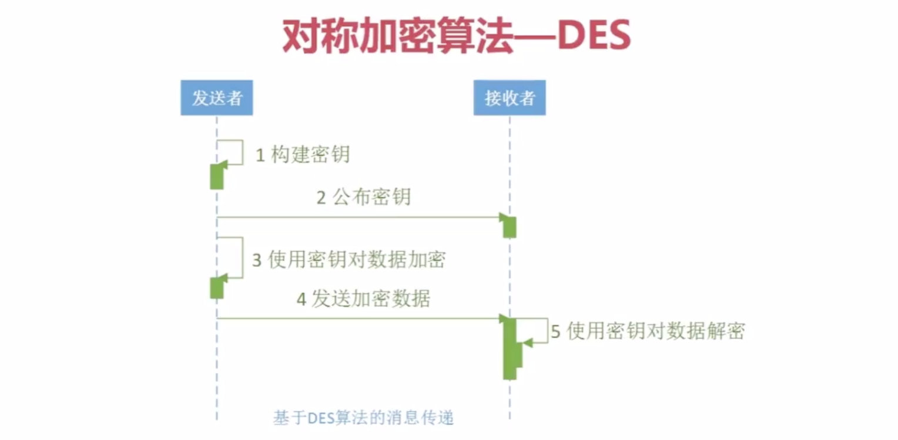
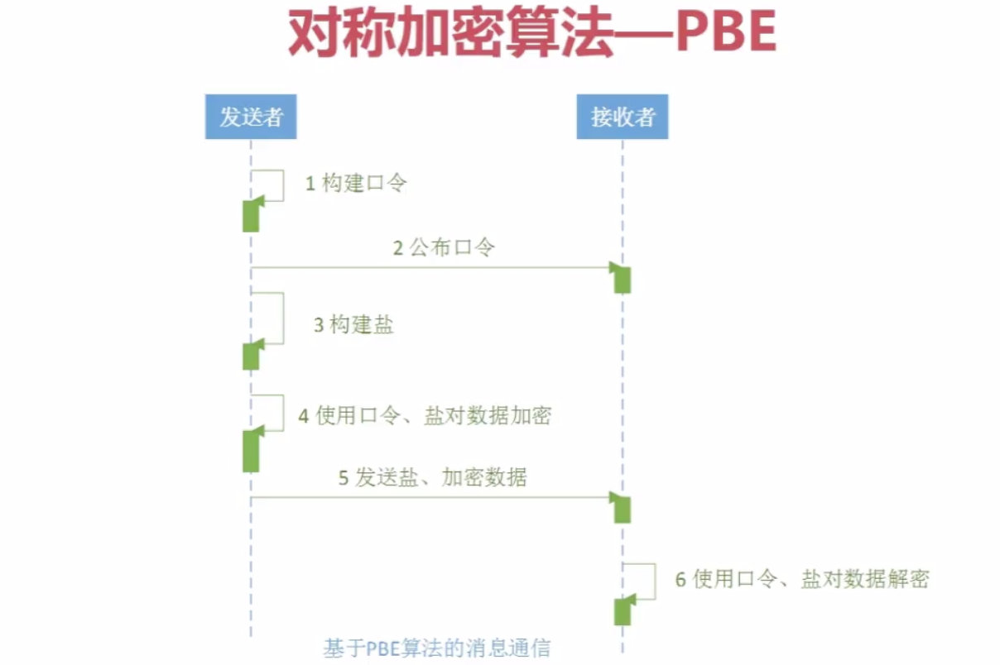

## 1.对称加密算法概述

对称加密算法是应用较早的加密算法，技术成熟。在对称加密算法中，数据发信方将明文和加密密钥一起经过特殊加密算法处理后，使其变成复杂的加密密文发送出去。收信方收到密文后，若想解读原文，则需要使用加密用过的密钥及相同算法的逆算法对密文进行解密，才能使其恢复成可读明文。

在对称加密算法中，使用的密钥只有一个，发收信双方都使用这个密钥对数据进行加密和解密，这就要求解密方事先必须知道加密密钥。

对称加密算法的特点是算法公开、计算量小、加密速度快、加密效率高。

不足之处是，交易双方都使用同样钥匙，安全性得不到保证。

在计算机系统中广泛使用的对称加密算法有DES和IDEA等。因为DES近年来屡屡被破解，所以，美国国家标准局倡导的AES即将作为新标准取代DES。

## 2.对称加密算法-DES

DES算法为密码体制中的对称密码体制，又被称为美国数据加密标准，是1972年美国IBM公司研制的对称密码体制加密算法。

明文按64位进行分组，密钥长64位，密钥事实上是56位参与DES运算（第8、16、24、32、40、48、56、64位是校验位， 使得每个密钥都有奇数个1）分组后的明文组和56位的密钥按位替代或交换的方法形成密文组的加密方法。

| 密钥长度 | 默认 | 工作模式                                                 | 填充方式                                                     | 实现方 |
| -------- | ---- | -------------------------------------------------------- | ------------------------------------------------------------ | ------ |
| 56       | 56   | ECB、CBC、PCBC、CTR、CTS、CFB、CFB8到128、OFB、OFB8到128 | NoPadding、PKCS5Padding、ISO10126Padding                     | JDK    |
| 64       | 56   | 同上                                                     | PKCS7Padding、ISO10126d2Padding、X932Padding、ISO7816d4Padding、ZeroBytePadding | BC     |

引入Bouncy Castle依赖：

```xml
<dependency>
   <groupId>org.bouncycastle</groupId>
   <artifactId>bcprov-jdk15</artifactId>
   <version>1.46</version>
</dependency>
```

引入Commons Codec依赖：

```xml
<dependency>
   <groupId>commons-codec</groupId>
   <artifactId>commons-codec</artifactId>
   <version>1.10</version>
</dependency>
```

Java代码实现：

```java
import java.security.Key;
import java.security.Security;
import javax.crypto.Cipher;
import javax.crypto.KeyGenerator;
import javax.crypto.SecretKey;
import javax.crypto.SecretKeyFactory;
import javax.crypto.spec.DESKeySpec;
import org.apache.commons.codec.binary.Hex;
import org.bouncycastle.jce.provider.BouncyCastleProvider;

public class DES {

  public static final String src = "des test";

  public static void main(String[] args) {
    jdkDES();
    bcDES();
  }

  // 用jdk实现:
  public static void jdkDES() {
    try {
      // 生成KEY
      KeyGenerator keyGenerator = KeyGenerator.getInstance("DES");
      keyGenerator.init(56);
      // 产生密钥
      SecretKey secretKey = keyGenerator.generateKey();
      // 获取密钥
      byte[] bytesKey = secretKey.getEncoded();

      // KEY转换
      DESKeySpec desKeySpec = new DESKeySpec(bytesKey);
      SecretKeyFactory factory = SecretKeyFactory.getInstance("DES");
      Key convertSecretKey = factory.generateSecret(desKeySpec);

      // 加密
      Cipher cipher = Cipher.getInstance("DES/ECB/PKCS5Padding");
      cipher.init(Cipher.ENCRYPT_MODE, convertSecretKey);
      byte[] result = cipher.doFinal(src.getBytes());
      System.out.println("jdk des encrypt:" + Hex.encodeHexString(result));

      // 解密
      cipher.init(Cipher.DECRYPT_MODE, convertSecretKey);
      result = cipher.doFinal(result);
      System.out.println("jdk des decrypt:" + new String(result));
    } catch (Exception e) {
      e.printStackTrace();
    }
  }

  // 用bouncy castle实现:
  public static void bcDES() {
    try {
      Security.addProvider(new BouncyCastleProvider());

      // 生成KEY
      KeyGenerator keyGenerator = KeyGenerator.getInstance("DES", "BC");
      keyGenerator.getProvider();
      keyGenerator.init(56);
      // 产生密钥
      SecretKey secretKey = keyGenerator.generateKey();
      // 获取密钥
      byte[] bytesKey = secretKey.getEncoded();

      // KEY转换
      DESKeySpec desKeySpec = new DESKeySpec(bytesKey);
      SecretKeyFactory factory = SecretKeyFactory.getInstance("DES");
      Key convertSecretKey = factory.generateSecret(desKeySpec);

      // 加密
      Cipher cipher = Cipher.getInstance("DES/ECB/PKCS5Padding");
      cipher.init(Cipher.ENCRYPT_MODE, convertSecretKey);
      byte[] result = cipher.doFinal(src.getBytes());
      System.out.println("bc des encrypt:" + Hex.encodeHexString(result));

      // 解密
      cipher.init(Cipher.DECRYPT_MODE, convertSecretKey);
      result = cipher.doFinal(result);
      System.out.println("bc des decrypt:" + new String(result));
    } catch (Exception e) {
      e.printStackTrace();
    }
  }
}
```

应用例子：



## 3.对称加密算法-3DES

密码学中，**三重数据加密算法**（英语：Triple Data Encryption Algorithm，缩写为TDEA，Triple DEA），或称**3DES**（Triple DES），是一种对称密钥加密块密码，相当于是对每个数据块应用三次数据加密标准（DES）算法。由于计算机运算能力的增强，原版DES密码的密钥长度变得容易被暴力破解；3DES即是设计用来提供一种相对简单的方法，即通过增加DES的密钥长度来避免类似的攻击，而不是设计一种全新的块密码算法。

Java代码实现：

```java
import java.security.Key;
import java.security.SecureRandom;
import java.security.Security;
import javax.crypto.Cipher;
import javax.crypto.KeyGenerator;
import javax.crypto.SecretKey;
import javax.crypto.SecretKeyFactory;
import javax.crypto.spec.DESedeKeySpec;
import org.apache.commons.codec.binary.Hex;
import org.bouncycastle.jce.provider.BouncyCastleProvider;

public class DES3 {

  public static final String src = "3des test";

  public static void main(String[] args) {
    jdk3DES();
    bc3DES();
  }

  // 用jdk实现:
  public static void jdk3DES() {
    try {
      // 生成KEY
      KeyGenerator keyGenerator = KeyGenerator.getInstance("DESede");
      // 必须长度是：112或168
//			keyGenerator.init(168);
      keyGenerator.init(new SecureRandom());
      // 产生密钥
      SecretKey secretKey = keyGenerator.generateKey();
      // 获取密钥
      byte[] bytesKey = secretKey.getEncoded();

      // KEY转换
      DESedeKeySpec desKeySpec = new DESedeKeySpec(bytesKey);
      SecretKeyFactory factory = SecretKeyFactory.getInstance("DESede");
      Key convertSecretKey = factory.generateSecret(desKeySpec);

      // 加密
      Cipher cipher = Cipher.getInstance("DESede/ECB/PKCS5Padding");
      cipher.init(Cipher.ENCRYPT_MODE, convertSecretKey);
      byte[] result = cipher.doFinal(src.getBytes());
      System.out.println("jdk 3des encrypt:" + Hex.encodeHexString(result));

      // 解密
      cipher.init(Cipher.DECRYPT_MODE, convertSecretKey);
      result = cipher.doFinal(result);
      System.out.println("jdk 3des decrypt:" + new String(result));

    } catch (Exception e) {
      e.printStackTrace();
    }
  }

  // 用bouncy castle实现:
  public static void bc3DES() {
    try {
      Security.addProvider(new BouncyCastleProvider());

      // 生成KEY
      KeyGenerator keyGenerator = KeyGenerator.getInstance("DESede", "BC");
      keyGenerator.getProvider();
      keyGenerator.init(168);
      // 产生密钥
      SecretKey secretKey = keyGenerator.generateKey();
      // 获取密钥
      byte[] bytesKey = secretKey.getEncoded();

      // KEY转换
      DESedeKeySpec desKeySpec = new DESedeKeySpec(bytesKey);
      SecretKeyFactory factory = SecretKeyFactory.getInstance("DESede");
      Key convertSecretKey = factory.generateSecret(desKeySpec);

      // 加密
      Cipher cipher = Cipher.getInstance("DESede/ECB/PKCS5Padding");
      cipher.init(Cipher.ENCRYPT_MODE, convertSecretKey);
      byte[] result = cipher.doFinal(src.getBytes());
      System.out.println("bc 3des encrypt:" + Hex.encodeHexString(result));

      // 解密
      cipher.init(Cipher.DECRYPT_MODE, convertSecretKey);
      result = cipher.doFinal(result);
      System.out.println("bc 3des decrypt:" + new String(result));

    } catch (Exception e) {
      e.printStackTrace();
    }
  }
}
```

## 4.对称加密算法-AES

高级加密标准（英语：Advanced Encryption Standard，缩写：AES），在密码学中又称Rijndael加密法，是美国联邦政府采用的一种区块加密标准。这个标准用来替代原先的DES，已经被多方分析且广为全世界所使用。经过五年的甄选流程，高级加密标准由美国国家标准与技术研究院（NIST）于2001年11月26日发布于FIPS PUB 197，并在2002年5月26日成为有效的标准。2006年，高级加密标准已然成为对称密钥加密中最流行的算法之一。

该算法为比利时密码学家Joan Daemen和Vincent Rijmen所设计，结合两位作者的名字，以Rijndael为名投稿高级加密标准的甄选流程。（Rijndael的发音近于"Rhine doll"）

| 密钥长度      | 默认 | 工作模式                                                 | 填充方式                                 | 实现方                                     |
| ------------- | ---- | -------------------------------------------------------- | ---------------------------------------- | ------------------------------------------ |
| 128、192、256 | 128  | ECB、CBC、PCBC、CTR、CTS、CFB、CFB8到128、OFB、OFB8到128 | NoPadding、PKCS5Padding、ISO10126Padding | JDK（256位密钥需要获得无政策限制权限文件） |
| 同上          | 同上 | 同上                                                     | PKCS7Padding、ZeroBytePadding            | BC                                         |

Java代码实现：

```java
import java.security.Key;
import java.security.Security;
import javax.crypto.Cipher;
import javax.crypto.KeyGenerator;
import javax.crypto.SecretKey;
import javax.crypto.spec.SecretKeySpec;
import org.apache.commons.codec.binary.Hex;
import org.bouncycastle.jce.provider.BouncyCastleProvider;

public class AES {

  public static final String src = "aes test";

  public static void main(String[] args) {
    jdkAES();
    bcAES();
  }

  // 用jdk实现:
  public static void jdkAES() {
    try {
      // 生成KEY
      KeyGenerator keyGenerator = KeyGenerator.getInstance("AES");
      keyGenerator.init(128);
      // 产生密钥
      SecretKey secretKey = keyGenerator.generateKey();
      // 获取密钥
      byte[] keyBytes = secretKey.getEncoded();

      // KEY转换
      Key key = new SecretKeySpec(keyBytes, "AES");

      // 加密
      Cipher cipher = Cipher.getInstance("AES/ECB/PKCS5Padding");
      cipher.init(Cipher.ENCRYPT_MODE, key);
      byte[] result = cipher.doFinal(src.getBytes());
      System.out.println("jdk aes encrypt:" + Hex.encodeHexString(result));

      // 解密
      cipher.init(Cipher.DECRYPT_MODE, key);
      result = cipher.doFinal(result);
      System.out.println("jdk aes decrypt:" + new String(result));
    } catch (Exception e) {
      e.printStackTrace();
    }
  }

  // 用bouncy castle实现:
  public static void bcAES() {
    try {
      Security.addProvider(new BouncyCastleProvider());

      // 生成KEY
      KeyGenerator keyGenerator = KeyGenerator.getInstance("AES", "BC");
      keyGenerator.getProvider();
      keyGenerator.init(128);
      // 产生密钥
      SecretKey secretKey = keyGenerator.generateKey();
      // 获取密钥
      byte[] keyBytes = secretKey.getEncoded();

      // KEY转换
      Key key = new SecretKeySpec(keyBytes, "AES");

      // 加密
      Cipher cipher = Cipher.getInstance("AES/ECB/PKCS5Padding");
      cipher.init(Cipher.ENCRYPT_MODE, key);
      byte[] result = cipher.doFinal(src.getBytes());
      System.out.println("bc aes encrypt:" + Hex.encodeHexString(result));

      // 解密
      cipher.init(Cipher.DECRYPT_MODE, key);
      result = cipher.doFinal(result);
      System.out.println("bc aes decrypt:" + new String(result));
    } catch (Exception e) {
      e.printStackTrace();
    }
  }
}
```

## 5.对称加密算法-PBE

PBE算法（Password Based Encryption，基于口令加密）是一种基于口令的加密算法，其特点是使用口令代替了密钥，而口令由用户自己掌管，采用随机数杂凑多重加密等方法保证数据的安全性。

PBE算法在加密过程中并不是直接使用口令来加密，而是加密的密钥由口令生成，这个功能由PBE算法中的KDF函数完成。KDF函数的实现过程为：将用户输入的口令首先通过“盐”（salt）的扰乱产生准密钥，再将准密钥经过散列函数多次迭代后生成最终加密密钥，密钥生成后，PBE算法再选用对称加密算法对数据进行加密，可以选择DES、3DES、RC5等对称加密算法。

具体实现如下：

| 算法                            | 密钥长度 | 默认 | 工作模式          | 填充方式                                                     | 实现             |
| ------------------------------- | -------- | ---- | ----------------- | ------------------------------------------------------------ | ---------------- |
| PBEWithMD5AndDES                | 64       | 64   | CBC（下同） | PKCS5Padding、PKCS7Padding、ISO10126Padding、ZeroBytePadding、（下同） | BC（下同） |
| PBEWithMD5AndRC2                | 112      | 128  |                   |                                                              |                  |
| PBEWithSHA1AndDES               | 64       | 64   |                   |                                                              |                  |
| PBEWithSHA1AndRC2               | 128      | 128  |                   |                                                              |                  |
| PBEWithSHAAndIDEA-CBC           | 128      | 128  |                   |                                                              |                  |
| PBEWithSHAAnd2-KeyTripleDES-CBC | 128      | 128  |                   |                                                              |                  |
| PBEWithSHAAnd3-KeyTripleDES-CBC | 192      | 192  |                   |                                                              |                  |
| PBEWithSHAAnd128BitRC2-CBC      | 128      | 128  |                   |                                                              |                  |
| PBEWithSHAAnd40BitRC2-CBC       | 40       | 40   |                   |                                                              |                  |
| PBEWithSHAAnd128BitRC4          | 128      | 128  |                   |                                                              |                  |
| PBEWithSHAAnd40BitRC4           | 40       | 40   |                   |                                                              |                  |
| PBEWithSHAAndTwofish-CBC        | 256      | 256  |                   |                                                              |                  |


Java代码实现：

```java
import java.security.Key;
import java.security.SecureRandom;
import javax.crypto.Cipher;
import javax.crypto.SecretKeyFactory;
import javax.crypto.spec.PBEKeySpec;
import javax.crypto.spec.PBEParameterSpec;
import org.apache.commons.codec.binary.Hex;

public class PBE {

  public static final String src = "pbe test";

  public static void main(String[] args) {
    jdkPBE();
  }

  // 用jdk实现:
  public static void jdkPBE() {
    try {
      // 初始化盐
      SecureRandom random = new SecureRandom();
      byte[] salt = random.generateSeed(8);

      // 口令与密钥
      String password = "timliu";
      PBEKeySpec pbeKeySpec = new PBEKeySpec(password.toCharArray());
      SecretKeyFactory factory = SecretKeyFactory.getInstance("PBEWITHMD5andDES");
      Key key = factory.generateSecret(pbeKeySpec);

      // 加密
      PBEParameterSpec pbeParameterSpac = new PBEParameterSpec(salt, 100);
      Cipher cipher = Cipher.getInstance("PBEWITHMD5andDES");
      cipher.init(Cipher.ENCRYPT_MODE, key, pbeParameterSpac);
      byte[] result = cipher.doFinal(src.getBytes());
      System.out.println("jdk pbe encrypt:" + Hex.encodeHexString(result));

      // 解密
      cipher.init(Cipher.DECRYPT_MODE, key, pbeParameterSpac);
      result = cipher.doFinal(result);
      System.out.println("jdk pbe decrypt:" + new String(result));
    } catch (Exception e) {
      e.printStackTrace();
    }
  }
}
```

应用举例：

