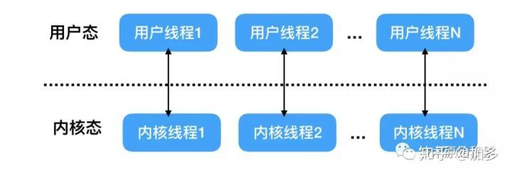
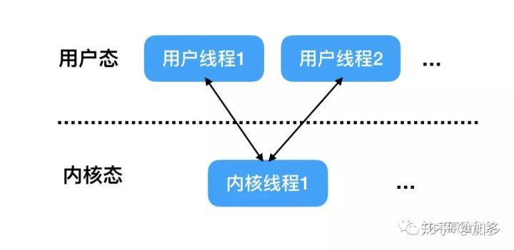
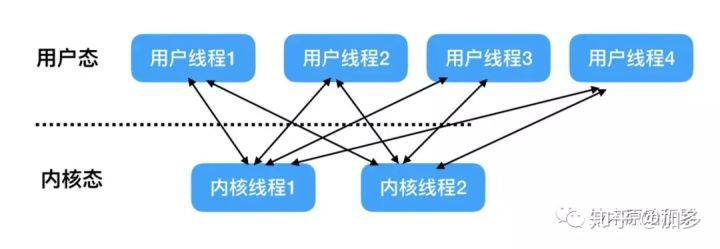
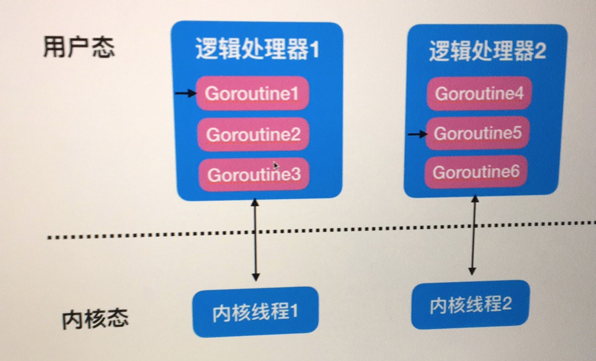
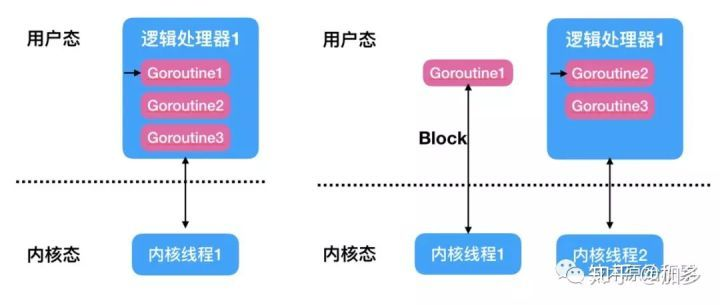

> 原著：翟陆续（加多) 资深Java , 著Java并发编程之美

## 一、前言

本节我们来探讨Go的线程模型，首先我们先来回顾下常见的三种线程模型，然后在介绍Go中独特的线程模型。

## 二、三种线程模型

线程的并发执行是有操作系统来进行调度的，操作系统一般都都在内核提供对线程的支持。而我们在使用高级语言编写程序时候创建的线程是用户线程，那么用户线程与内核线程是什么关系那？其实下面将要讲解的三种线程模型就是根据用户线程与内核线程关系的不同而划分的。

## 2.1 一对一模型

这种线程模型下用户线程与内核线程是一一对应的，当从程序入口点（比如main函数）启动后，操作系统就创建了一个进程，这个main函数所在的线程就是主线程，在main函数内当我们使用高级语言创建一个用户线程的时候，其实对应创建了一个内核线程，如下图：

这种线程模型优点是在多处理器上，多个线程可以真正实现并行运行，并且当一个线程由于网络IO等原因被阻塞时候，其他的线程不受影响。

缺点是由于一般操作系统会限制内核线程的个数，所以用户线程的个数会受到限制。另外由于用户线程与系统线程一一对应，当用户线程比如执行Io操作（执行系统调用）时候，需要从用户态的用户程序的执行切换到内核态执行内核操作，然后等执行完毕后又会从内核态切换到用户态执行用户程序，而这个切换操作开销是相对比较大的。

另外这里提下高级语言Java的线程模型就是使用的这种一对一的模型，所以Java中多线程对共享变量使用锁同步时候会导致获取锁失败的线程进行上下文切换，而JUC包提供的无锁CAS操作则不会产生上下文切换。

## 2.2 多对一模型

多对一模型是指多个用户线程对应一个内核线程，同时同一个用户线程只能对应一个内核线程，这时候对应同一个内核线程的多个用户线程的上下文切换是由用户态的运行时线程库来做的，而不是由操作系统调度系统来做的，其模型如下：

这种模型好处是由于上下文切换在用户态，所以切换速度很快，开销很小；另外可创建的用户线程的数量可以很多，只受内存大小限制。

这种模型由于多个用户线程对应一个内核线程，当该内核线程对应的一个用户线程被阻塞挂起时候，该内核线程对应的其他用户线程也不能运行了，因为这时候内核线程已经被阻塞挂起了。另外这种模型并不能很好的利用多核CPU进行并发运行。

## 2.3 多对多模型

多对多模型则结合一对一和多对一模型的特点，让大量的用户线程对应少数几个内核线程上，其模型图如下：

这时候每个内核线程对应多个用户线程，每个用户线程有可以对应多个内核线程，当一个用户线程阻塞后，其对应的当前的内核线程会被阻塞，但是被阻塞的内核线程对应的其他用户线程可以切换到其他的内核线程上继续运行，所以多对多模型是可以充分利用多核CPU提升运行效能的。

另外多对多模型也对用户线程个数没有限制，理论上只要内存够用可以无限创建。

## 三、Go线程模型

Go线程模型属于多对多线程模型，其模型如下

Go中使用使用go语句创建的goroutine可以认为是轻量级的用户线程，go线程模型包含三个概念：内核线程(M)，goroutine(G),逻辑处理器（P）,在Go中每个逻辑处理器(P)会绑定到某一个内核线程上,每个逻辑处理器（P）内有一个本地队列，用来存放go运行时分配的goroutine。在上面介绍的多对多线程模型中是操作系统调度线程在物理CPU上运行，在Go中则是Go的运行时调度goroutine在逻辑处理器（P）上运行。

在go中存在两级调度，一级是操作系统的调度系统，该调度系统调度逻辑处理器占用cpu时间片运行，一级是go的运行时调度系统，该调度系统调度某个goroutine在逻辑处理上运行。

使用go语句创建一个goroutine后，创建的goroutine会被放入go运行时调度器的全局运行队列中，然后go运行时调度器会把全局队列中的goroutine分配给不同的逻辑处理器（P），分配的goroutine会被放到逻辑处理器（P)的本地队列中，当本地队列中某个goroutine就绪后待分配到时间片后就可以在逻辑处理器上运行了，如上图goroutine1当前正在占用逻辑处理器1运行。

需要注意的是为了避免某些goroutine出现饥饿现象，被分配到某一个逻辑处理器（P)上的多个goroutine是分时在该逻辑处理器运行的，而不是独占运行直到结束，比如每个goroutine从开始到运行结束需要10分钟，那么当前逻辑处理器下的goroutine1，goroutine2，goroutine3，并不是顺序执行，而是交叉并发运行的。

goroutine内部实现与在多个操作系统线程(Os 线程)之间复用的协程(coroutines)一样。如果一个goroutine阻塞OS线程，例如等待输入，则该OS线程对应的逻辑处理器P中的其他goroutine将迁移到其他OS线程，以便它们可以继续运行

如上图左侧假设goroutine1在执行文件文件读取操作，则goroutine1会导致内核线程1阻塞，这时候go运行时调度器会把goroutine1所在的逻辑处理器1迁移到其他的内核线程上（这里是内核线程2上），这时候逻辑处理器1上的goroutine2和goroutine3就不会受goroutine1的影响了。等goroutine1文件读取操作完成后goroutine1又会被go运行时调度系统重新放入到逻辑处理器1的本地队列。

需要注意的是go运行时内核线程(M)的数量默认是10000个，你可以使用runtime/debug包里面的debug.SetMaxThreads(10000)来设置。

默认情况下，Go默认是给每个可用的物理处理器都分配一个逻辑处理器（p）,如果你需要修改逻辑处理器(P)个数可以使用runtime包的runtime.GOMAXPROCS函数设置.

至于goroutine（G）的数量则是由用户程序自己来确定，理论只要内存够大，可以无限制创建。

## 四、总结

本节我们探讨了go的线程模型，讲解了Go中是多对多的线程模型，正是由于这种线程模型才让go中每台机器可以创建成千上万的goroutine（轻量级线程），了解了go的线程模型，特别是其中的MPG概念，就可以随业务需要动态设置最优方案。