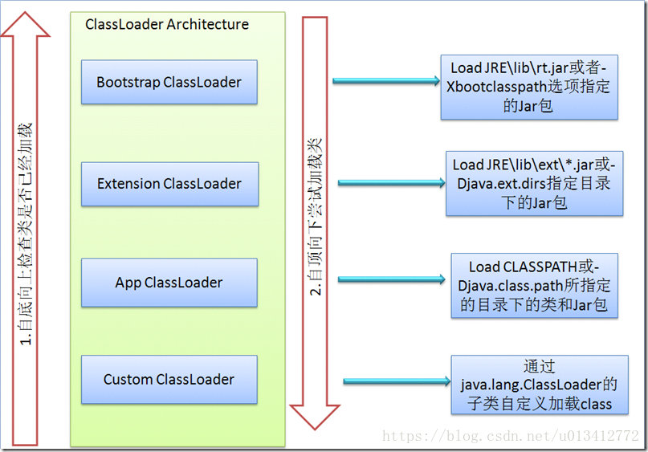
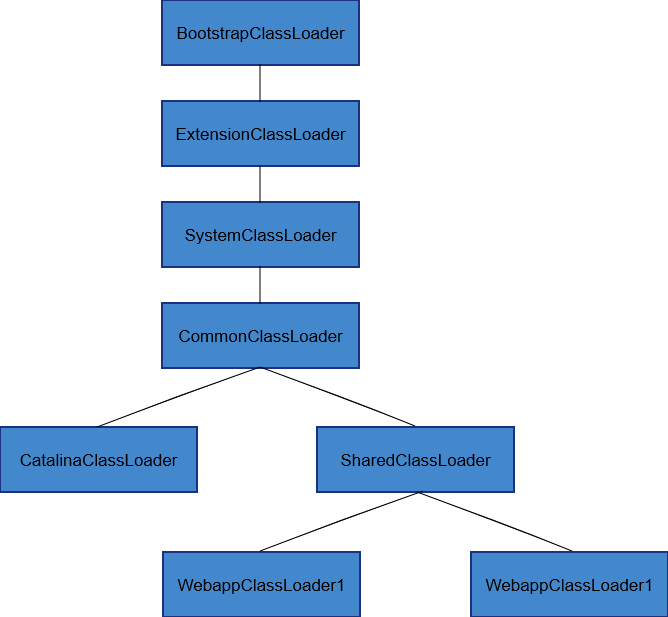

### 问题一：双亲委派模型是什么

如果一个类加载器收到了加载某个类的请求，则该类加载器并不会去加载该类，而是把这个请求委派给父类加载器，每一个层次的类加载器都是如此，因此所有的类加载请求最终都会传送到顶端的启动类加载器；只有当父类加载器在其搜索范围内无法找到所需的类，并将该结果反馈给子类加载器，子类加载器会尝试去自己加载。



#### 双亲委派模型的好处

这样做的好处就是：Java类随着它的类加载器一起具备了一种带有优先级的层次关系。例如类java.lang.Object，它存放在rt.jar中，无论哪一个类加载器要加载这个类，最终都是委派给处于模型最顶端的启动类加载器进行加载，因此Object类在程序的各种类加载器环境中都是同一个类。相反，如果没有使用双亲委派模型，由各个类加载器自行去加载的话，如果用户自己编写了一个称为java.lang.object的类，并放在程序的ClassPath中，那系统中将会出现多个不同的Object类，Java类型体系中最基础的行为也就无法保证，应用程序也将会变得一片混乱。

其次是考虑到安全因素。假设通过网络传递一个名为java.lang.Integer的类，通过双亲委托模式传递到启动类加载器，而启动类加载器在核心Java API发现这个名字的类，发现该类已被加载，并不会重新加载网络传递的过来的java.lang.Integer，而直接返回已加载过的Integer.class，这样便可以防止核心API库被随意篡改。

### 问题二：JDBC为什么要破坏双亲委派模型

#### 问题背景

在JDBC 4.0之后实际上我们不需要再调用Class.forName来加载驱动程序了，我们只需要把驱动的jar包放到工程的类加载路径里，那么驱动就会被自动加载。

这个自动加载采用的技术叫做SPI，数据库驱动厂商也都做了更新。可以看一下jar包里面的META-INF/services目录，里面有一个java.sql.Driver的文件，文件里面包含了驱动的全路径名。

使用上，我们只需要通过下面一句就可以创建数据库的连接：

```java
Connection con =    
             DriverManager.getConnection(url , username , password ) ;   
```

#### 问题解答

**因为类加载器受到加载范围的限制，在某些情况下父类加载器无法加载到需要的文件，这时候就需要委托子类加载器去加载class文件。**

JDBC的Driver接口定义在JDK中，其实现由各个数据库的服务商来提供，比如MySQL驱动包。DriverManager 类中要加载各个实现了Driver接口的类，然后进行管理，但是DriverManager位于 \$JAVA_HOME中jre/lib/rt.jar 包，由BootStrap类加载器加载，而其Driver接口的实现类是位于服务商提供的 Jar 包，**根据类加载机制，当被装载的类引用了另外一个类的时候，虚拟机就会使用装载第一个类的类装载器装载被引用的类。**也就是说BootStrap类加载器还要去加载jar包中的Driver接口的实现类。我们知道，BootStrap类加载器默认只负责加载 \$JAVA_HOME中jre/lib/rt.jar 里所有的class，所以需要由子类加载器去加载Driver实现，这就破坏了双亲委派模型。

查看DriverManager类的源码，看到在使用DriverManager的时候会触发其静态代码块，调用 loadInitialDrivers() 方法，并调用ServiceLoader.load(Driver.class) 加载所有在META-INF/services/java.sql.Driver 文件里边的类到JVM内存，完成驱动的自动加载。

```java
    static {
        loadInitialDrivers();
        println("JDBC DriverManager initialized");
    }

    private static void loadInitialDrivers() {

        AccessController.doPrivileged(new PrivilegedAction<Void>() {
            public Void run() {

                ServiceLoader<Driver> loadedDrivers = ServiceLoader.load(Driver.class);
                Iterator<Driver> driversIterator = loadedDrivers.iterator();

                try{
                    while(driversIterator.hasNext()) {
                        driversIterator.next();
                    }
                } catch(Throwable t) {
                // Do nothing
                }
                return null;
            }
        });

    }
```

```java
    public static <S> ServiceLoader<S> load(Class<S> service) {
        ClassLoader cl = Thread.currentThread().getContextClassLoader();
        return ServiceLoader.load(service, cl);
    }
```

这个子类加载器是通过 Thread.currentThread().getContextClassLoader() 得到的线程上下文加载器。

**那么这个上下文类加载器又是什么呢？**

```java
public Launcher() {
    ...
    try {
        this.loader = Launcher.AppClassLoader.getAppClassLoader(var1);
    } catch (IOException var9) {
        throw new InternalError("Could not create application class loader", var9);
    }
    Thread.currentThread().setContextClassLoader(this.loader);
    ...
}
```

可以看到，在 sun.misc.Launcher 初始化的时候，会获取AppClassLoader，然后将其设置为上下文类加载器，所以**线程上下文类加载器默认情况下就是系统加载器**。

### 问题三：Tomcat为什么要破坏双亲委派模型

Tomcat类加载器：




Tomcat如何破坏双亲委派模型的呢？

**每个Tomcat的webappClassLoader加载自己的目录下的class文件，不会传递给父类加载器。**

事实上，tomcat之所以造了一堆自己的classloader，大致是出于下面三类目的：

- 对于各个 `webapp`中的 `class`和 `lib`，需要相互隔离，不能出现一个应用中加载的类库会影响另一个应用的情况，而对于许多应用，需要有共享的lib以便不浪费资源。
- 与 `jvm`一样的安全性问题。使用单独的 `classloader`去装载 `tomcat`自身的类库，以免其他恶意或无意的破坏；
- 热部署。相信大家一定为 `tomcat`修改文件不用重启就自动重新装载类库而惊叹吧。

#### 延伸阅读

https://blog.csdn.net/u012129558/article/details/81540804

https://blog.csdn.net/liweisnake/article/details/8470285


