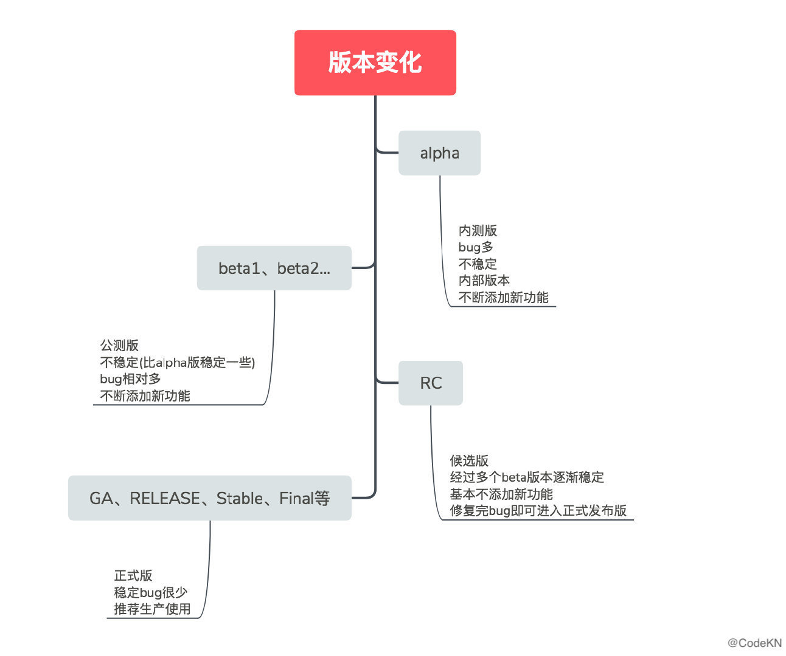

对应上图的表格如下：

| 名词！    | 说明                                                         |
| ------- | ------------------------------------------------------------ |
| Alpha   | α是希腊字母的第一个，表示最早的版本，内部测试版，一般不向外部发布，bug会比较多，功能也不全，一般只有测试人员使用。 |
| Beta    | β是希腊字母的第二个，公开测试版，比alpha版本晚些，主要会有“粉丝用户”测试使用，该版本仍然存在很多bug，但比alpha版本稳定一些。这个阶段版本还会不断增加新功能。分为Beta1、Beta2等，直到逐渐稳定下来进入RC版本。 |
| RC      | Release Candidate，发行候选版本，基本不再加入新的功能，主要修复bug。是最终发布成正式版的前一个版本，将bug修改完就可以发布成正式版了。 |
| GA      | General Availability，正式发布的版本，官方开始推荐广泛使用，国外有的用GA来表示release版本。 |
| RELEASE | 正式发布版，官方推荐使用的版本，有的用GA来表示。比如spring。 |
| Stable  | 稳定版，开源软件有的会用stable来表示正式发布的版本。比如Nginx。 |
| Final   | 最终版，也是正式发布版的一种表示方法。比如Hibernate。        |

#### 授权和功能划分

| 名词         | 说明                                                         |
| ------------ | ------------------------------------------------------------ |
| Trial        | 试用版，通常都有时间限制，有些试用版软件还在功能上做了一定的限制。可注册或购买成为正式版 |
| Unregistered | 未注册版，通常没有时间限制，在功能上相对于正式版做了一定的限制。可注册或购买成为正式版。 |
| Demo         | 演示版，仅仅集成了正式版中的几个功能，不能升级成正式版。     |
| Lite         | 精简版。                                                     |
| Full         | 完整版，属于正式版。                                         |

#### 语言划分

| 名词          | 说明                                                         |
| ------------- | ------------------------------------------------------------ |
| SC            | Simplified　Chinese简体中文版                                |
| CN            | 简体中文版                                                   |
| GBK           | 简体中文汉字内码扩展规范版                                   |
| TC            | Traditional　Chinese繁体中文版                               |
| CHT           | 繁体中文版                                                   |
| BIG5          | 繁体中文大五码版                                             |
| EN            | 英文版                                                       |
| Multilanguage | 多语言版                                                     |
| UTF8          | Unicode Transformation Format 8 bit，对现有的中文系统不是好的解决方案 |

#### 其他版本

| 名词                       | 说明                                                         |
| -------------------------- | ------------------------------------------------------------ |
| Enhance                    | 增强版或者加强版，属于正式版1                                |
| Free                       | 自由版                                                       |
| Release                    | 发行版　有时间限制                                           |
| Upgrade                    | 升级版                                                       |
| Retail                     | 零售版                                                       |
| Cardware                   | 属共享软件的一种，只要给作者回复一封电邮或明信片即可。（有的作者并由此提供注册码等），目前这种形式已不多见。 |
| Plus                       | 属增强版，不过这种大部分是在程序界面及多媒体功能上增强。     |
| Preview                    | 预览版                                                       |
| Corporation　&　Enterprise | 企业版                                                       |
| Standard                   | 标准版                                                       |
| Mini                       | 迷你版，也叫精简版只有最基本的功能                           |
| Premium                    | 贵价版                                                       |
| Professional(Pro)          | 专业版                                                       |
| Express                    | 特别版                                                       |
| Deluxe                     | 豪华版                                                       |
| Regged                     | 已注册版                                                     |
| Build                      | 内部标号                                                     |
| Delux                      | 豪华版                                                       |
| Plus                       | 加强版                                                       |