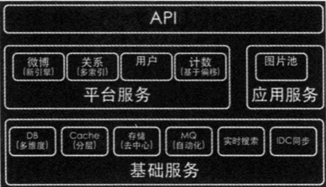

> 什么是模式？每一个模式描述了一个在我们周围不断发生的问题及该问题解决方案的核心。这样，你就能一次又一次地使用该方案而不必做重复的工作。

也许互联网产品不是随便复制就能成功的，创新的产品更能为用户创造价值。但是网站架构却有一些共同的模式，这些模式已经被许多大型网站一再验证，通过对这些模式的学习，我们可以掌握大型网站架构的一般思路和解决方案，以指导我们的架构设计。

## 1.网站架构模式

为了解决大型网站面临的高并发访问、海量数据处理、高可靠运行等一系列问题与挑战，大型互联网公司在实践中提出了许多解决方案，以实现网站高性能、高可用、易伸缩、可扩展、安全等各种技术架构目标。这些解决方案又被更多网站重复使用，从而逐渐形成大型网站架构模式。

### 1.1 分层

分层是企业应用系统中最常见的一种架构模式，将系统在横向维度上切分成几个部分，每个部分负责一部分相对比较单一的职责，然后通过上层对下层的依赖和调用组成个完整的系统。
分层结构在计算机世界中无处不在，网络的7层通信协议是一种分层结构；计算机硬件、操作系统、应用软件也可以看作是一种分层结构。在大型网站架构中也采用分层结构，将网站软件系统分为应用层、服务层、数据层，如下所示。

| 应用层 | 负责具体业务和视图展示，如网站首页及搜索输入和结果展示 |
| ------ | ------------------------------------------------------ |
| 服务层 | 为应用层提供服务支持，如用户管理服务，购物车服务等     |
| 数据层 | 提供数据存储访问服务，如数据库、缓存、文件、搜索引擎等 |

通过分层，可以更好地将一个庞大的软件系统切分成不同的部分，便于分工合作开发和维护；各层之间具有一定的独立性，只要维持调用接口不变，各层可以根据具体问题独立演化发展而不需要其他层必须做出相应调整。
但是分层架构也有一些挑战，就是必须合理规划层次边界和接口，在开发过程中严格遵循分层架构的约束，禁止跨层次的调用（应用层直接调用数据层）及逆向调用（数据层调用服务层，或者服务层调用应用层）在实践中，大的分层结构内部还可以继续分层，如应用层可以再细分为视图层（美工负责）和业务逻辑层（工程师负责）；服务层也可以细分为数据接口层（适配各种输入和输出的数据格式）和逻辑处理层。
分层架构是逻辑上的，在物理部署上，三层结构可以部署在同一个物理机器上，但是随着网站业务的发展，必然需要对已经分层的模块分离部署，即三层结构分别部署在不同的服务器上，使网站拥有更多的计算资源以应对越来越多的用户访问。所以虽然分层架构模式最初的目的是规划软件清晰的逻辑结构便于开发维护，但在网站的发展过程中，分层结构对网站支持高并发向分布式方向发展至关重要。因此在网站规模还很小的时候就应该采用分层的架构，这样将来网站做大时才能有更好地应对。

### 1.2 分割

如果说分层是将软件在横向方面进行切分，那么分割就是在纵向方面对软件进行切分。
网站越大，功能越复杂，服务和数据处理的种类也越多，将这些不同的功能和服务分割开来，包装成高内聚低耦合的模块单元，一方面有助于软件的开发和维护；另一方面，便于不同模块的分布式部署，提高网站的并发处理能力和功能扩展能力。

大型网站分割的粒度可能会很小。比如在应用层，将不同业务进行分割，例如将购物、论坛、搜索、广告分割成不同的应用，由独立的团队负责，部署在不同的服务器上；在同一个应用内部，如果规模庞大业务复杂，会继续进行分割，比如购物业务，可以进一步分割成机票酒店业务、3C业务，小商品业务等更细小的粒度。而即使在这个粒度上，还是可以继续分割成首页、搜索列表、商品详情等模块，这些模块不管在逻辑上还是物理部署上，都可以是独立的。同样在服务层也可以根据需要将服务分割成合适的模块。

### 1.3 分布式

对于大型网站，分层和分割的一个主要目的是为了切分后的模块便于分布式部署，即将不同模块部署在不同的服务器上，通过远程调用协同工作。分布式意味着可以使用更多的计算机完成同样的功能，计算机越多，CPU、内存、存储资源也就越多，能够处理的并发访问和数据量就越大，进而能够为更多的用户提供服务。
但分布式在解决网站高并发问题的同时也带来了其他问题。首先，分布式意味着服务调用必须通过网络，这可能会对性能造成比较严重的影响；其次，服务器越多，服务器宕机的概率也就越大，一台服务器宕机造成的服务不可用可能会导致很多应用不可访问，使网站可用性降低；另外，数据在分布式的环境中保持数据一致性也非常困难，分布式事务也难以保证，这对网站业务正确性和业务流程有可能造成很大影响；分布式还导致网站依赖错综复杂，开发管理维护困难。因此分布式设计要根据具体情况量力而行，切莫为了分布式而分布式。
在网站应用中，常用的分布式方案有以下几种。

- **分布式应用和服务**：将分层和分割后的应用和服务模块分布式部署，除了可以改善网站性能和并发性、加快开发和发布速度、减少数据库连接资源消耗外；还可以使不同应用复用共同的服务，便于业务功能扩展。

- **分布式静态资源**：网站的静态资源如 Js，CSS，Logo 图片等资源独立分布式部署，并采用独立的域名，即人们常说的动静分离。静态资源分布式部署可以减轻应用服务器的负载压力；通过使用独立域名加快浏览器并发加载的速度；由负责用户体验的团队进行开发维护有利于网站分工合作，使不同技术工种术业有专攻。

- **分布式数据和存储**：大型网站需要处理以P为单位的海量数据，单台计算机无法提供如此大的存储空间，这些数据需要分布式存储。除了对传统的关系数据库进行分布式部署外，为网站应用而生的各种 NOSQL 产品几乎都是分布式的。

- **分布式计算**：严格说来，应用、服务、实时数据处理都是计算，网站除了要处理这些在线业务，还有很大一部分用户没有直观感受的后台业务要处理，包括搜索引擎的索引构建、数据仓库的数据分析统计等。这些业务的计算规模非常庞大，目前网站普遍使用 Hadoop 及其 MapReduce 分布式计算框架进行此类批处理计算，其特点是移动计算而不是移动数据，将计算程序分发到数据所在的位置以加速计算和分布式计算。

此外，还有可以支持网站线上服务器配置实时更新的**分布式配置**；分布式环境下实现并发和协同的**分布式锁**；支持云存储的**分布式文件系统**等。

### 1.4 集群

使用分布式虽然已经将分层和分割后的模块独立部署，但是对于用户访问集中的模块(比如网站的首页)，还需要将独立部署的服务器集群化，即多台服务器部署相同应用构成一个集群，通过负载均衡设备共同对外提供服务。
因为服务器集群有更多服务器提供相同服务，因此可以提供更好的并发特性，当有更多用户访问的时候，只需要向集群中加入新的机器即可。同时因为一个应用由多台服务器提供，当某台服务器发生故障时，负载均衡设备或者系统的失效转移机制会将请求转发到集群中其他服务器上，使服务器故障不影响用户使用。所以在网站应用中，即使是访问量很小的分布式应用和服务，也至少要部署两台服务器构成一个小的集群，目的就是提高系统的可用性。

### 1.5 缓存

缓存就是将数据存放在距离计算最近的位置以加快处理速度。缓存是改善软件性能的第一手段，现代CPU越来越快的一个重要因素就是使用了更多的缓存，在复杂的软件设计中，缓存几乎无处不在。大型网站架构设计在很多方面都使用了缓存设计。

- **CDN**：即内容分发网络，部署在距离终端用户最近的网络服务商，用户的网络请求总是先到达他的网络服务商那里，在这里缓存网站的一些静态资源（较少变化的数据），可以就近以最快速度返回给用户，如视频网站和门户网站会将用户访问量大的热点内容缓存在CDN。

- **反向代理**：反向代理属于网站前端架构的一部分，部署在网站的前端，当用户请求到达网站的数据中心时，最先访问到的就是反向代理服务器，这里缓存网站的静态资源，无需将请求继续转发给应用服务器就能返回给用户。

- **本地缓存**：在应用服务器本地缓存着热点数据，应用程序可以在本机内存中直接访问数据，而无需访问数据库。

- **分布式缓存**：大型网站的数据量非常庞大，即使只缓存一小部分，需要的内存空间也不是单机能承受的，所以除了本地缓存，还需要分布式缓存，将数据缓存在一个专门的分布式缓存集群中，应用程序通过网络通信访问缓存数据。

使用缓存有两个前提条件，一是数据访问热点不均衡，某些数据会被更频繁的访问，这些数据应该放在缓存中；二是数据在某个时间段内有效，不会很快过期，否则缓存的数据就会因已经失效而产生脏读，影响结果的正确性。网站应用中，缓存除了可以加快数据访问速度，还可以减轻后端应用和数据存储的负载压力，这一点对网站数据库架构至关重要，网站数据库几乎都是按照有缓存的前提进行负载能力设计的。

### 1.6 异步

计算机软件发展的一个重要目标和驱动力是降低软件耦合性。事物之间直接关系越少，就越少被彼此影响，越可以独立发展。大型网站架构中，系统解耦合的手段除了前面提到的分层、分割、分布等，还有一个重要手段是异步，业务之间的消息传递不是同步调用，而是将一个业务操作分成多个阶段，每个阶段之间通过共享数据的方式异步执行进行协作。
在单一服务器内部可通过多线程共享内存队列的方式实现异步，处在业务操作前面的线程将输出写入到队列，后面的线程从队列中读取数据进行处理；在分布式系统中，多个服务器集群通过分布式消息队列实现异步，分布式消息队列可以看作内存队列的分布式部署。
异步架构是典型的生产者消费者模式，两者不存在直接调用，只要保持数据结构不变，彼此功能实现可以随意变化而不互相影响，这对网站扩展新功能非常便利。除此之外，使用异步消息队列还有如下特性。

- **提高系统可用性**。消费者服务器发生故障，数据会在消息队列服务器中存储堆积，生产者服务器可以继续处理业务请求，系统整体表现无故障。消费者服务器恢复正常后，继续处理消息队列中的数据。

- **加快网站响应速度**。处在业务处理前端的生产者服务器在处理完业务请求后，将数据写入消息队列，不需要等待消费者服务器处理就可以返回，响应延迟减少。

- **消除并发访问高峰**。用户访问网站是随机的，存在访问高峰和低谷，即使网站按照一般访问高峰进行规划和部署，也依然会出现突发事件，比如购物网站的促销活动，微博上的热点事件，都会造成网站并发访问突然增大，这可能会造成整个网站负载过重，响应延迟，严重时甚至会出现服务宕机的情况。使用消息队列将突然增加的访问请求数据放入消息队列中，等待消费者服务器依次处理，就不会对整个网站负载造成太大压力。

但需要注意的是，使用异步方式处理业务可能会对用户体验、业务流程造成影响，需要网站产品设计方面的支持。

### 1.7 冗余

网站需要7×24小时连续运行，但是服务器随时可能出现故障，特别是服务器规模比较大时，出现某台服务器宕机是必然事件。要想保证在服务器宕机的情况下网站依然可以继续服务，不丢失数据，就需要一定程度的服务器冗余运行，数据冗余备份，这样当某台服务器宕机时，可以将其上的服务和数据访问转移到其他机器上。
访问和负载很小的服务也必须部署至少两台服务器构成一个集群，其目的就是通过冗余实现服务高可用。数据库除了定期备份，存档保存，实现**冷备份**外，为了保证在线业务高可用，还需要对数据库进行主从分离，实时同步实现**热备份**。
为了抵御地震、海啸等不可抗力导致的网站完全瘫痪，某些大型网站会对整个数据中心进行备份，全球范围内部署**灾备数据中心**。网站程序和数据实时同步到多个灾备数据中心。

### 1.8 自动化

在无人值守的情况下网站可以正常运行，一切都可以自动化是网站的理想状态。目前大型网站的自动化架构设计主要集中在发布运维方面。
发布对网站都是头等大事，许多网站故障出在发布环节，网站工程师经常加班也是因为发布不顺利。通过减少人为干预，使**发布过程自动化**可有效减少故障。发布过程包括诸多环节。**自动化代码管理**，代码版本控制、代码分支创建合并等过程自动化，开发工程师只要提交自己参与开发的产品代号，系统就会自动为其创建开发分支，后期会自动进行代码合并；**自动化测试**，代码开发完成，提交测试后，系统自动将代码部署到测试环境，启动自动化测试用例进行测试，向相关人员发送测试报告，向系统反馈测试结果；**自动化安全检测**，安全检测工具通过对代码进行静态安全扫描及部署到安全测试环境进行安全攻击测试，评估其安全性；最后进行**自动化部署**，将工程代码自动部署到线上生产环境。
此外，网站在运行过程中可能会遇到各种问题：服务器宕机、程序**Bug**、存储空间不足、突然爆发的访冋高峰。网站需要对线上生产环境进行**自动化监控**，对服务器进行心跳检测，并监控其各项性能指标和应用程序的关键数据指标。如果发现异常、超出预设的阈值，就进行**自动化报警**，向相关人员发送报警信息，警告故障可能会发生。在检测到故障发生后，系统会进行**自动化失效转移**，将失效的服务器从集群中隔离出去，不再处理系统中的应用请求。待故障消除后，系统进行**自动化失效恢复**，重新启动服务，同步数据保证数据的一致性。在网站遇到访问高峰，超出网站最大处理能力时，为了保证整个网站的安全可用，还会进行**自动化降级**，通过拒绝部分请求及关闭部分不重要的服务将系统负载降至一个安全的水平，必要时，还需要**自动化分配资源**，将空闲资源分配给重要的服务，扩大其部署规模。

### 1.9 安全

互联网的开放特性使得其从诞生起就面对巨大的安全挑战，网站在安全架构方面也积累了许多模式：通过**密码**和**手机校验码**进行身份认证；登录、交易等操作需要对网络通信进行**加密**，网站服务器上存储的敏感数据如用户信息等也进行加密处理；为了防止机器人程序滥用网络资源攻击网站，网站使用**验证码**进行识别；对于常见的用于**攻击**网站的 XSS 攻击、SQL 注入、进行编码转换等相应处理；对于垃圾信息、敏感信息进行**过滤**；对交易转账等重要操作根据交易模式和交易信息进行**风险控制**。

## 2.架构模式在新浪微博的应用

短短几年时间新浪微博的用户数就从零增长到数亿，明星用户的粉丝数达数千万围绕着新浪微博正在发展一个集社交、媒体、游戏、电商等多位一体的生态系统。同大多数网站一样，新浪微博也是从一个小网站发展起来的。简单的LAMP（Linux+ Apache+ MySQL+PHP）架构，支撑起最初的新浪微博，应用程序用PHP开发，所有的数据，包括微博、用户、关系都存储在 MySQL数据库中。

这样简单的架构无法支撑新浪微博快速发展的业务需求，随着访问用户的逐渐增加，系统不堪重负。新浪微博的架构在较短时间内几经重构，最后形成现在的架构，如图所示。

系统**分为三个层次**，最下层是基础服务层，提供数据库、缓存、存储、搜索等数据服务，以及其他一些基础技术服务，这些服务支撑了新浪微博的海量数据和高并发访问，是整个系统的技术基础。
中间层是平台服务和应用服务层，新浪微博的核心服务是微博、关系和用户，它们是新浪微博业务大厦的支柱。这些服务被分割为独立的服务模块，通过依赖调用和共享基础数据构成新浪微博的业务基础。
最上层是API和新浪微博的业务层，各种客户端(包括Web网站)和第三方应用，通过调用AP集成到新浪微博的系统中，共同组成一个生态系统。
这些被分层和分割后的业务模块与基础技术模块**分布式**部署，每个模块都部署在组独立的服务器**集群**上，通过远程调用的方式进行依赖访问。新浪微博在早期还使用过一种叫作 MPSS（MultiPort Single Server，单服务器多端口）的分布式集群部署方案，在集群中的多台服务器上，每台都部署多个服务，每个服务使用不同的端口对外提供服务，通过这种方式使得有限的服务器可以部署更多的服务实例，改善服务的负载均衡和可用性。现在网站应用中常见的将物理机虚拟化成多个虚拟机后，在虚拟机上部署应用的方案跟新浪微博的 MPSS 方案异曲同工，只是更加简单，还能在不同虚拟机上使用相同的端口号。

在新浪微博的早期架构中，微博发布使用同步推模式，用户发表微博后系统会立即将这条微博插入到数据库所有粉丝的订阅列表中，当用户量比较大时，特别是明星用户发布微博时，会引起大量的数据库写操作，超出数据库负载，系统性能急剧下降，用户响应延迟加剧。后来新浪微博改用**异步**推拉结合的模式，用户发表微博后系统将微博写入消息队列后立即返回，用户响应迅速，消息队列消费者任务将微博推送给所有当前在线粉丝的订阅列表中，非在线用户登录后再根据关注列表拉取微博订阅列表。

由于微博频繁刷新，新浪微博使用多级**缓存**策略，热门微博和明星用户的微博缓存在所有的微博服务器上，在线用户的微博和近期微博缓存在分布式缓存集群中，对于微博操作中最常见的“刷微博“操作，几乎全部都是缓存访问操作，可以获得很好的系统性能。
为了提高系统的整体可用性和性能，新浪微博启用了多个数据中心。这些数据中心既是地区用户访问中心，用户可以就近访问最近的数据中心以加快访问速度，改善系统性能；同时也是数据**冗余**复制的灾备中心，所有的用户和微博数据通过远程消息系统在不同的数据中心之间同步，提高系统可用性。
同时，新浪微博还开发了一系列**自动化**工具，包括自动化监控，自动化发布，自动化故障修复等，这些自动化工具还在持续开发中，以改善运维水平提高系统可用性。
由于微博的开放特性，新浪微博也遇到了一系列的**安全**挑战，垃圾内容、僵尸粉、微博攻击从未停止，除了使用一般网站常见的安全策略，新浪微博在开放平台上使用多级安全审核的策略以保护系统和用户。

## 3.小结

在程序设计与架构设计领域，模式正变得越来越受人关注，许多人寄希望通过模式一劳永逸地解决自己的问题。正确使用模式可以更好地利用业界和前人的思想与实践，用更少的时间开发出更好的系统，使设计者的水平也达到更高的境界。但是模式受其适用场景限制，对系统的要求和约束也很多，不恰当地使用模式只会画虎不成反类犬，不但没有解决原来的老问题，反而带来了更棘手的新问题。
好的设计绝对不是模仿，不是生搬硬套某个模式，而是对问题深刻理解之上的创造与创新，即使是“微创新”，也是让人耳目一新的似曾相识。**山寨与创新的最大区别不在于是否抄袭，是否模仿，而在于对问题和需求是否真正理解与把握。**

## 参考资料

[1]《大型网站技术架构 核心原理与案例分析》李智慧