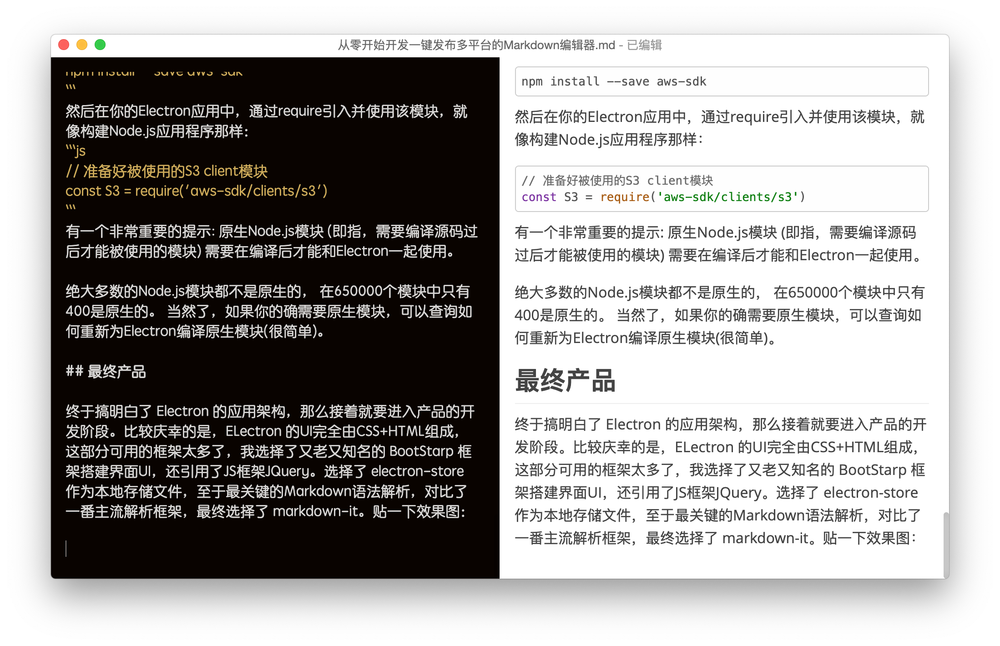
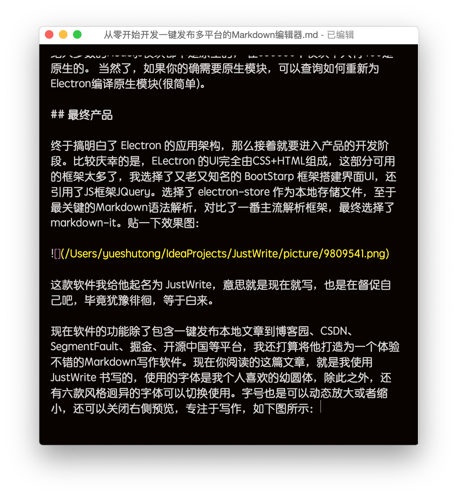

## 原始冲动

最近一直在学习 Electron 开发桌面应用程序，目的是想做一个桌面编辑器，虽然一直在使用Typora这款神器，但无奈Typora太过国际化，在国内水土不服，无法满足我的一些需求。

比如实现本地图片上传到云端（mac版可以借助iPic），无法帮我把本地图片和文章一起发布到博客园、CSDN、SegmentFault、掘金等国内知名博客平台，要么使用一些免费或付费的图床，借助类似iPic的工具，把图片一键上传到云端。

我个人也尝试过七牛云的免费10G存储空间，但是说实话，这些免费的空间到最后一定是为了让你成为付费用户，各种限制各种吐槽在网上很容易可以搜索到。

免费的图床如新浪微博等，还算是比较好的图床工具，相比一些网络上的压根不知道啥公司甚至是归属个人的免费图床，新浪应该是比较靠谱的，相对来说可以保证图片的存活时间，我个人用过一些免费的图床网站，记得印象深刻的就是服务器出问题，网站挂个公告，曾经的图片再去访问就是默认的404。

虽然新浪家大业大不是说倒闭就倒闭的，图片相对稳定可靠，不过新浪的图片服务器会检测访问来源Referer来防止外部网站引用，造成访问403。

总结起来就是一句话，图片还是随着文章一键发布到博客平台比较好。要丢一起丢～

## 心理挣扎

缘起这个动机，但是下定决心依旧是困难重重。

我个人是一个Java工程师，虽说搞过Andorid、HTML前端，但对前端深感不适的我果断放弃了。对于桌面程序开发，我连Swing都不会，造一个Markdown编辑器有点难，何况还要加上这些定制功能。

犹犹豫豫，还是决定去尝试一下。于是调研写跨平台的一些途径。

先尝试Swing，不过Swing不好实现我期望的一些功能，改成JavaFX倒是可以，不过说实话，写起来很累，太过繁琐，就放弃了。最后把目光瞄向electron，就它了，HTML+Js+Css，听起来就很简单，事实证明，无论是测试还是打包都很方便。

决定之后，便开始进行 Electron 的系统学习。

## 迈出第一步

第一步就是安装 Electron 的本地开发环境，这也是大多数应用开发的第一步。

你需要安装 Node.js 在你的本地电脑，Electron 也是依赖于 Node.js 的环境，严格来说， Electron 通过将 Chromium 和 Node.js 合并到同一个运行时环境中，并将其打包为Mac，Windows和Linux系统下的应用来实现这一目的。

关于 Electron 的具体开发流程，这里不再赘述，你完全可以在开发中使用Web前端开发的思维，除了在处理多个窗口之间交互的时候，就不得不了解Eelctron的进程机制。

## 主进程和渲染进程

Electron 运行 package.json 的 main 脚本的进程被称为主进程。 在主进程中运行的脚本通过创建web页面来展示用户界面。 一个 Electron 应用总是有且只有一个主进程。

由于 Electron 使用了 Chromium 来展示 web 页面，所以 Chromium 的多进程架构也被使用到。 每个 Electron 中的 web 页面运行在它自己的渲染进程中。

在普通的浏览器中，web页面通常在沙盒环境中运行，并且无法访问操作系统的原生资源。 然而 Electron 的用户在 Node.js 的 API 支持下可以在页面中和操作系统进行一些底层交互。

## 主进程与渲染进程的区别

主进程使用 BrowserWindow 实例创建页面。 每个 BrowserWindow 实例都在自己的渲染进程里运行页面。 当一个 BrowserWindow 实例被销毁后，相应的渲染进程也会被终止。

主进程管理所有的web页面和它们对应的渲染进程。 每个渲染进程都是独立的，它只关心它所运行的 web 页面。

在页面中调用与 GUI 相关的原生 API 是不被允许的，因为在 web 页面里操作原生的 GUI 资源是非常危险的，而且容易造成资源泄露。 如果你想在 web 页面里使用 GUI 操作，其对应的渲染进程必须与主进程进行通讯，请求主进程进行相关的 GUI 操作。

## 主进程与渲染进程通信

那么进程间如何通讯？

Electron为主进程（ main process）和渲染器进程（renderer processes）通信提供了多种实现方式，如可以使用ipcRenderer 和 ipcMain模块发送消息，使用 remote模块进行RPC方式通信。

你还可以用 Electron 内的 IPC 机制实现。将数据存在主进程的某个全局变量中，然后在多个渲染进程中使用 remote 模块来访问它。

示例代码：

```js
// 在主进程中
global.sharedObject = {
  someProperty: 'default value'
}
```
```js
// 在第一个页面中
require('electron').remote.getGlobal('sharedObject').someProperty = 'new value'
```
```js
// 在第二个页面中
console.log(require('electron').remote.getGlobal('sharedObject').someProperty)
```

## 使用Electron的API

Electron在主进程和渲染进程中提供了大量API去帮助开发桌面应用程序， 在主进程和渲染进程中，你可以通过require的方式将其包含在模块中以此，获取Electron的API

```js
const electron = require('electron')
```

所有Electron的API都被指派给一种进程类型。 许多API只能被用于主进程或渲染进程中，但其中一些API可以同时在上述两种进程中使用。 每一个API的文档都将声明你可以在哪种进程中使用该API。

Electron中的窗口是使用BrowserWindow类型创建的一个实例， 它只能在主进程中使用。

```js
// 这样写在主进程会有用，但是在渲染进程中会提示'未定义'
const { BrowserWindow } = require('electron')

const win = new BrowserWindow()
```
因为进程之间的通信是被允许的, 所以渲染进程可以调用主进程来执行任务。 Electron通过remote模块暴露一些通常只能在主进程中获取到的API。 为了在渲染进程中创建一个BrowserWindow的实例，通常使用remote模块为中间件：
```js
// 这样写在渲染进程中时行得通的，但是在主进程中是'未定义'
const { remote } = require('electron')
const { BrowserWindow } = remote

const win = new BrowserWindow()
```

## 使用Node.js的API

Electron同时在主进程和渲染进程中对Node.js 暴露了所有的接口。 这里有两个重要的定义：

1)所有在Node.js可以使用的API，在Electron中同样可以使用。 在Electron中调用如下代码是有用的：
```js
const fs = require('fs')

const root = fs.readdirSync('/')

// 这会打印出磁盘根级别的所有文件
// 同时包含'/'和'C:\'。
console.log(root)
```

2)你可以在你的应用程序中使用Node.js的模块。 选择您最喜欢的 npm 模块。 npm 提供了目前世界上最大的开源代码库，那里包含良好的维护、经过测试的代码，提供给服务器应用程序的特色功能也提供给Electron。

例如，在你的应用程序中要使用官方的AWS SDK，你需要首先安装它的依赖：
```
npm install --save aws-sdk
```
然后在你的Electron应用中，通过require引入并使用该模块，就像构建Node.js应用程序那样：
```js
// 准备好被使用的S3 client模块
const S3 = require('aws-sdk/clients/s3')
```
有一个非常重要的提示: 原生Node.js模块 (即指，需要编译源码过后才能被使用的模块) 需要在编译后才能和Electron一起使用。

## 最终产品杀青落地

终于搞明白了 Electron 的应用架构，那么接着就要进入产品的开发阶段。比较庆幸的是，ELectron 的UI完全由CSS+HTML组成，这部分可用的框架太多了，我选择了又老又知名的 BootStarp 框架搭建界面UI，还引用了JS框架JQuery。选择了 electron-store 作为本地存储文件，至于最关键的Markdown语法解析，对比了一番主流解析框架，最终选择了 markdown-it。贴一下效果图：



这款软件我给他起名为 JustWrite，意思就是现在就写，也是在督促自己吧，毕竟犹豫徘徊，等于白来。

现在软件的功能除了包含一键发布本地文章加本地图片到博客园、CSDN、SegmentFault、掘金、开源中国等平台，我还打算将他打造为一个体验不错的Markdown写作软件。现在你阅读的这篇文章，就是我使用 JustWrite 书写的，使用的字体是我个人喜欢的幼圆体，除此之外，还有六款风格迥异的字体可以切换使用。字号也是可以动态放大或者缩小，还可以关闭右侧预览，专注于写作，如下图所示：



这些截图是我截屏后使用快捷键Ctrl+V一键粘贴的，图片会自动放到当前md文件所在目录下的picture文件夹内。

关于 JustWrite 从构思到实践的心路历程大致就以上这些了，这次开发 JustWrite 也让我过了一把产品经理的瘾，基本已经满足了我的日常需求。如果你有更好的想法和创意也可以告诉我，说不定第二天就会实现了。

Github：https://github.com/yueshutong/JustWrite

## 视频演示

<iframe src="//player.bilibili.com/player.html?aid=78534183&cid=134371981&page=1" scrolling="no" border="0" frameborder="no" framespacing="0" allowfullscreen="true" style="zoom: 300%;"> </iframe>

