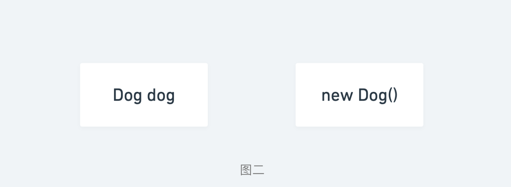
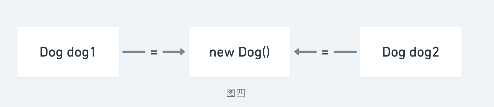
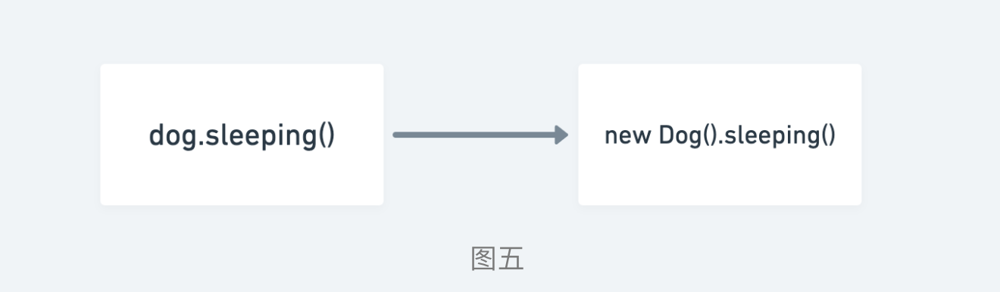
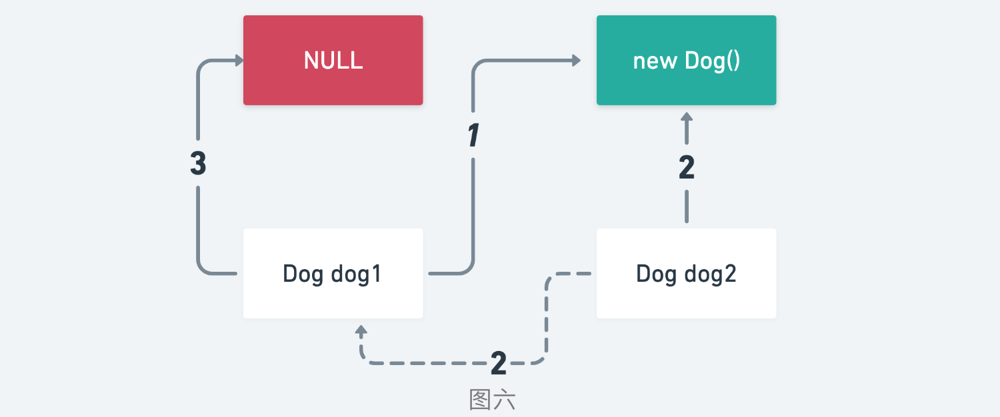

本文旨在扫盲，深入理解类、对象、引用三者之间的关系，在处理 a = b = c 这类问题上可以有清晰无误的思考。

## 一、什么是类

**类是一个模板，它描述一类对象的行为和状态。**

拿一条狗来举例，它的状态有：名字、品种、颜色，行为有：叫、摇尾巴和跑。

说白了，类就是我们自然界的一些统称，比如人、狗、车等。我们已经在实际生活中，将一些事物主动划分为某一类，将这个概念延伸至软件开发中，就是我们自己所写的 class 文件。

具体将哪些事物划分为某一类是由我们自己去调节的。比如，你可以将狗划分为一类，但是狗中的杜宾犬也可以成为一类。举个例子，一家专门出售杜宾犬的商店可以对所有的杜宾犬进行编号，记录每个杜宾犬的姓名、饮食时间。

## 二、什么是对象

**对象是类的一个实例，具有状态和行为。**

如果说类是指的某一类，那么对象就是这一类当中具体的一个事物。比如狗，具体起来又分为拉布拉多、哈士奇，巴哥犬、吉娃娃等。它们都有自己独特的状态：名字、品种、颜色，以及独特的行为：叫、摇尾巴和跑。

对比现实对象和软件对象，它们之间十分相似。

软件对象也有状态和行为。软件对象的状态就是属性，行为通过方法体现。

在软件开发中，方法操作对象内部状态的改变，对象的相互调用也是通过方法来完成。

## 三、类与对象

类是我们所写的 class 文件，抽象出了一系列状态和行为，是我们实例化具体对象的模板。

比如我们有一个类（Dog.class），代码如下：

```java
public class Dog{
  String breed;
  int age;
  String color;
  void barking(){
  }
 
  void hungry(){
  }
 
  void sleeping(){
  }
```
在Java中，使用关键字new来创建一个新的对象。

```java
new Dog();
```
通过 new 关键字，我们完成了由抽象类实例化具体对象的步骤。并且在内存空间，多了一块保存该实例对象的区域。如图一所示：


## 四、对象与引用

对象已经 new 出来了，我们如何发出指令来调用对象自身的属性和方法呢？

还需要一个引用（reference）来帮我们实现发出指令的操作。

Java中引用的代码声明如下：
```java
Dog dog;
```
更清晰的理解可以用图二表示如下：



使用等号（=）将引用与对象进行链接，代码如下：
```java
Dog dog = new Dog();
```
更清晰的理解用图三表示如下：


对象与引用的关系是一对多的关系，一个对象可以被多个多个引用链接。如图四所示：



由引用实现发出指令的操作，指令的执行是由对象自身完成的。比如下面这段代码：
```java
Dog dog = new Dog();
dog.sleeping()
```
在内存空间中的执行原理如图五所示：



引用 dog 发出执行 sleeping() 方法的指令，具体的执行完全是由内存中的 Dog 对象来完成的。

## 五、引用传递

对于上述中的引用指向对象，执行的过程已经清晰明了，那么对于引用指向引用的情况又该如何去做呢？比如下面这段Java代码：

```java
Dog dog1 = new Dog();
Dog dog2 = dog1;
dog1 = null;
dog2.sleeping()
```
此时执行代码的最后一行究竟会不会报错呢？答案是不会。

因为引用A指向引用B，实际上是指向引用B指向的内存空间，并不是指向引用本身。

上述代码用图六表示如下：



引用可以理解为没有空间的存在，只要使用引用就必须对其初始化赋值（可为 NULL）。

在C语言的世界里，没有引用，只有指针。在Java的世界里，没有指针，只有引用。实际上，Java里的引用就是C里的指针，只是Java把这个指针封装了起来，避免进行繁琐的指针操作。

## 六、课后练习

不运行代码，你可以分析出这段Java代码的执行逻辑吗？（推荐使用上面图片的形式进行画图分析）

```java
public class Node {
    Node prev;
    Node next;
    int id;

    public Node(int id) {
        this.id = id;
    }

    public static void main(String[] args) {
        Node e = new Node(1);
        e.next = new Node(2);
        e.next.next = new Node(3);

        Node hd = null, tl = null;
        do {
            Node p = new Node(e.id);
            if (tl == null)
                hd = p;
            else {
                p.prev = tl;
                tl.next = p;
            }
            tl = p;
        } while ((e = e.next) != null);

        Node n = hd;
        do {
            System.out.println(n.id);
        }while ((n = n.next)!=null);
    }
}
```