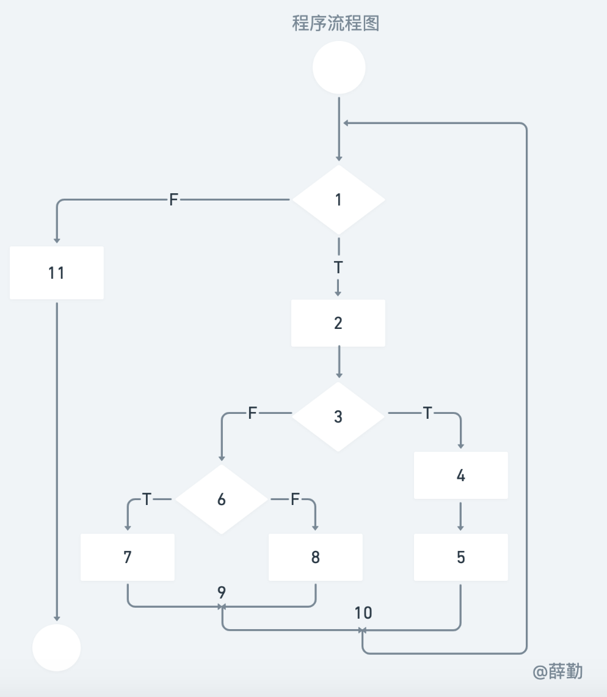
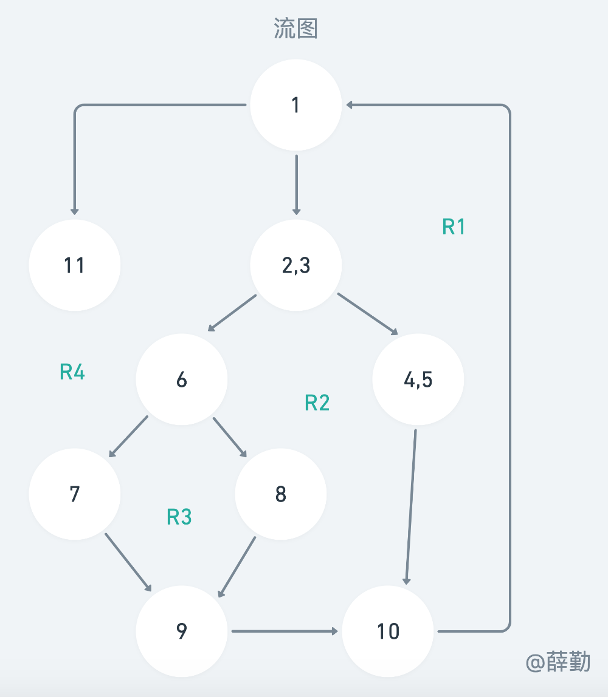
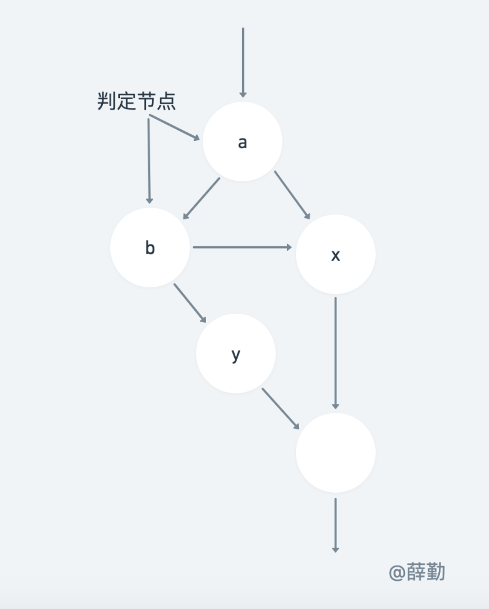

请画出下面代码的程序流程图及对应的流图，并计算环形复杂度。

```java
void func(int x,int y){ //画图时，不需要考虑此行
    while(x>0){ //1
    	int sum = x+y; //2
        if(sum>1){ //3
            x--; //4
            y--; //5
        }else{
            if(sum<-1){ //6
                a-=2; //7
            }else{
                a-=4; //8
            } //9
        } // end of if(sum>1) //10
    }    // end of while
    x = x+y; //11
} // end of func //画图时，不需要考虑此行
```



程序流程图画法总结：
1. 只考虑方法体内代码。
2. if..else..后必有被两条箭头所指节点，可以为空白，但必须有数字。
3. 保留开始和结尾的空白圆框但不写数字。



环形复杂度的计算方法：

1. 流图中线性无关的区域数等于环形复杂度。
2. 流图G的环形复杂度 V(G)=E-N+2，其中，E是流图中边的条数，N是结点数。
3. 流图G的环形复杂度V(G)=P+1，其中，P是流图中判定结点的数目。

上述例题的判定条件是单一的，如果涉及`IF a OR b`这种包含复合条件的伪码，例如：

```pdl
IF a OR b
    then procedure x
    else procedure y
ENDIF
```




