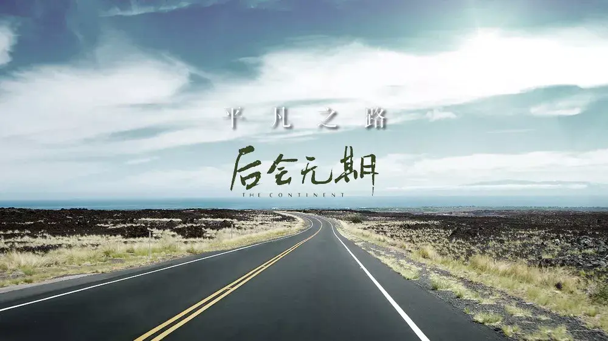

>作者：薛勤，互联网从业者，编程爱好者。
>
>本文首发自公众号：代码艺术（ID：onblog）未经许可，不可转载

## 01：终于步入大学

我既没有跨过山和大海，也没有穿过人山人海，我就是我，一个普通本科大学生。身为读者的你，关注了我，自然是想获取知识与经验，我所能分享的，也只有我的一些知识与经历。

那年，我大一刚入学，边学着入门级的C语言，边对未来迷茫着。面试学生会，失败。面试新媒体部，失败。本以为连连失败的我已经输在了大学的起跑线上，意外让我面试了一个IT编程工作室，成功。我感谢工作室里带我入门的学长们，让我知道了C语言以后可以干什么，Java可以干什么，促使我迈入Java世界的大门。寒假两月，自学完Java基础语法。

## 02：孤独的旅行者

第二年，我放弃了喜爱的篮球，放弃了游戏，从 jsp、servlet、html 开始学习，搭建了一个自习室查询网页，并出售给了一个校公众号团队。

我在大一下学期报了校软件设计大赛，并设计开发了一个微教务系统，原理是模拟登陆校教务系统，爬取成绩课表等信息，然后进行网页展示。获得了推荐奖，也就是没进前十名。校软件大赛举办的作用是选拔团队去参加山东省大学生软件设计大赛，虽然是推荐奖，但只要完成了作品，还是可以报销三百报名费的。就这样，我拨通了我妈的手机号，给我妈要了三百块钱。

在官网报名时才发现一个问题，每个团队最低三个人。

可我的团队，只有我一个人。

是的，校赛现场答辩时，也只有我。

我最终还是参加了这个比赛，我庆幸我有两个月的暑假可以去准备。在这两个月里，我抱着一本 Android 入门到精通的书籍，开始一章一章的做Demo。最后，我做了一个校园App，主要包括论坛发帖、点赞、评论功能，以及查成绩、查课表、看校园新闻等功能。

我获得了齐鲁软件大赛作品完成奖，不是一、二、三等奖。所以，我的第一次软件大赛结果，失败。

大二上学期，我把我的这款校园App发给了校猿码工作室，成为工作室的一员。期间工作室计划了两个超级大项目，可惜最终都不了了之。

国庆假期期间，特别想换掉我那台1500块买的笔记本电脑，于是我去了游乐场兼职，每天早7晚10的的日子，赚了一千多块钱，加上花呗分期，买了我现在的这款电脑华硕K55VD，原款配置略低，我又加了内存条、固态硬盘。一共两千多吧。为啥这么便宜，因为是柜台展示机，其实和新电脑没啥区别。

在年底，我利用我学会的安卓开发技能开发了一款Vip视频破解App。这款软件已经不再维护，它是一款收费软件，软件可以免费观看爱奇艺、优酷、腾讯、乐视、PPTV、芒果的VIP视频。原理很简单，调用网上已有的破解接口，并嵌入腾讯X5浏览器内核。关于收费模块，貌似我那时候支付宝还不支持个人开发者，于是想到了卖卡平台。用户去第三方买卡，到我的软件输入卡密即可使用。不过推广不利，并没有赚多少钱。

## 03：在反思中进步

转眼，大三到来。

我还是那个两眼不闻窗外事、一心只想敲代码的我。年后，接了个学校的项目，这时候正好我的技能栈已经扩充到Spring生态圈了，Spring Boot、Spring MVC用的贼溜。正好，基于Spring Boot仿实习僧做了个招聘系统，酬金税后2000。

技能栈越来越多，我开始思考更深层次的意义。

我的基础到底扎实不扎实，每次想到这，我好慌。

我的基础仿佛没有，我既没有研究过jdk源码，又没有搞过算法竞赛。我开始主动寻求Java中的基础，去寻找我经常听到却不会的。我问我的学长们，听学长们讲述面经。这时候，一系列我不知晓的名词涌来，让我仿佛觉得自己是个摇摇欲坠的大厦。

多线程，什么是多线程？什么是线程安全？我一点不懂。JVM？这是啥，GC又是是什么？BIO、NIO、AIO，抱歉，我不会。

我觉得我要开始改变了。内心仿佛总是有一股力量在揪着我，催着我，让我去做，去行动。我觉得，我不能再看视频学习了，慕课网已经不适合我了。我要去看书。

在我的印象中，我主动看的第一本书，是葛一鸣的《Java程序性能优化》。我非常感谢这本书，感动到想给作者打赏。这本书完全打开了我对Java未知领域的大门，是它，让我知道Java基础中String的底层原理、List、Map的底层原理与优化，是它，让我知道了设计模式这种东西，是它，让我知道了GC、JVM，让我知道了Java世界中最重要的多线程相关知识，让我体验了Java性能调优。这本书中的内容，基础知识我看的懂，JVM、多线程等看不懂，但为我指引了方向。按着这个方向，我买了《深入理解Java虚拟机》《Java多线程编程核心技术》《Java并发编程的艺术》，我读的如饥似渴，书上的示例我都照着敲一遍，可我担心学得快忘得快，于是我开始记笔记，我把书上的内容都抄了下来，发布在了我的博客上。学完多线程相关的知识，我再回来过看葛一鸣的书，我懂了。

## 04：再战软件大赛

大二暑假临近，非常热闹。

这次我的团队很给力，指导老师也很给力。我们一起开会讨论做比赛！没错，还是山东省大学生软件设计大赛。这次，我想全力以赴。

我们用了一个多月去寻找我们究竟要做什么？我的导师特别想做一个医生机器人，还给我们看了相关的图片。我们的课题是大数据分析与挖掘。起初，我们压根没有头绪，走了非常非常多的弯路，怎么说呢。我去学了Hadoop，学完后发现项目规模太小，用不上。然后去学了Elasticsearch。最初的作品是一个网页对话窗口，集成思必驰语音合成接口，后端是Elasticsearch做的查询接口。非常简单（low）。

了解到其它队伍大都是做了做数据爬取、分析，然后用ECharts做可视化展示，我的导师建议我做知识图谱，并提供了示例。于是，我去百度调研，用了一周的时间学习了Neo4j，并结合Spring Boot做了个Demo。只有图数据库的支持是不够的，还需要前端展示，于是学了d3.js。但我的前端技能并不是特别好，数据量太大，做出的知识图谱节点都挤在了一起，作品效果非常不好看。

那段时期，我又陷入了迷茫。我究竟要做什么？第一次参赛一败涂地，这一次，我还要继续失败吗？

导师告诉我，让我多试几个网站爬取数据源。无意中，我看到了某医疗网站的自助诊断系统，瞬间惊呆了，这就是我要做的东西！

导师要做知识图谱，可我要坚持做医疗诊断系统。在思考系统的算法逻辑时，我惊奇的发现，支撑诊断算法的正是知识图谱。当我在办公室里的小黑板手写算法思路，向队友、导师展示的时候，我那时非常开心，因为我终于知道了我要做什么。

大三下学期开学后，我被通知作品进了二等奖，一等奖决赛即将在山东大学举办，让我务必准时参加决赛答辩。

答辩我准备的非常充分，而且，在决赛答辩之前，我就在另一个省级比赛中答辩过一次了，算是涨了一波经验。

不负所望，我的作品获得山东省大学生软件大赛一等奖。

## 05：开源作品爆发

在做"医疗诊断系统"参加省软件大赛的同时，我深深感受到在爬取大量数据时的时间消耗是多么巨大。最长的时候，我的电脑两天没关机，一直在后台爬。最后，受不了的我，用Java写了一个多线程爬虫框架，并发布到了我的Github。

我以前都是一个人做项目，而且，越来越发现自己对页面相关的设计开发效率低下。现在有了团队，非常渴望前后端分离。当时，我一直在用模板引擎，基于服务拆分的思想，我做了一个类似Tomcat的静态web服务器发布到了我的Github。

在学完《深入理解Java虚拟机》后，我觉得我不应该学完就完了，我要把学的知识做成一个作品出来。当时学完了java性能监控的工具后，觉得软件形式的监控也比较麻烦，如果能有一个可视化的web版再结合ECharts图表展示就太方便了。我用了几天的时间做完了JavaMonitor项目的单机版，没想到后来star越来越多，吸取了一些建议，做了支持分布式监控的javaMonitorPlus。

也是在暑假这段时期，我收到了来自一位阿里技术专家的邮件。内容简单概括就是想不想来阿里，可以帮着内推。当时收到邮件的意义，对我来说非常巨大，他让我第一次感受到BAT与自己的距离似乎不是那么遥远，我一个普通本科仿佛也可以实现去BAT工作的梦想。

## 06：人生的转折点

大三结尾，我迎来了我人生的第一个转折点。

当时，我已经感受到了技术仿佛到了一个瓶颈，单机架构我做的很溜，但涉及企业的分布式架构，我还是不太了解。当时恰好得知省赛颁奖典礼有现场招聘会时，我便精心准备了一份简历，并彩印了5份，打算投递。可到了现场，看到的都是小公司在招软件销售人员，我就瞬间奔溃了，我心底一直有一种骄傲，我可以去大公司的，我有这能力。最终，我一份简历没投。

看着写了好几页的简历，我是真的不想就这么白白浪费。

想起来我大一曾注册过的几家招聘网站，我就把我的简历发在了上面。其中一家网站是实习僧。

我以为压根没有我的岗位，因为我还没有到大四，我才大三。可我打开实习僧，却发现竟然有大三的实习生招聘，我有点惊讶。不过，也仅此而已，我不认为我有能力可以进新浪、百度、京东这些大公司。我记得我当时抱着不浪费我写的这么多页的简历的心态，只投大公司，小公司不投。然后，洗洗睡了，压根没怎么放心上。

不久的一天早上，我还在睡觉，接听到了第一个电话，来自中国电信北研院，问我在京吗？什么时候有时间，约一下电话面试。然后，自己开心的不得了。又不久，京东打来了电话，让我去北京参加现场面试。我推到了我的期末考试结束后。又不久，新浪也发了现场面试的邮件。

一天晚上，我收到了百度打来的面试邀请电话，当时我在商业街买吃的。听到了开心的不得了，约定了一小时后电话面试。东西也不买了，直接回学校，看了一会书，复习复习，因为那时候我已经半个月没碰过代码了，《剑指Offer》才刷了几章就停下来一直在复习期末考试。庆幸自己买了本《Java程序员面试笔试宝典》。百度一面，如约而至。我记得我当时说的最多的就两句话：忘了，不了解。面完后，我觉得我挂了。但我的习惯还是让我把面试官问到的所有基础知识都看了一遍。就这样，我第二天接到了网易一面的电话，回答的算是very good，就一个SQL左连接查询我忘了，因为我忘了复习SQL了。

意外惊喜，接到了百度二面的面试邀约，我这次提前看了很多知识，复写了Java虚拟机，多线程相关的知识，二面这块的基础知识娓娓道来，但谁知，面试官问我Redis底层原理，如何设置过期时间，我说不会，面试官便引导我说："不会没事，我提醒下你"。就这样，我断断续续回答出了这块的内容。又问我消息队列，我又懵逼了，问我，如何设计秒杀系统，我说可以用队列，队列满了就直接false。面试官又问，分布式系统呢？那当然用MQ中间件。说实话，面试后，我对百度拜服。不久，网易二面来了，回答也算是very good！

网易三面来的非常快，我觉得网易面试很舒服。不久，网易HR通过我的联系方式告知了我结果，人生第一个offer正式到手！

百度三面迟迟不来，我以为我挂了，心想好吧，去网易也不错！杭州，舒服。可我觉得还有希望，便给百度打了电话，百度说，等段时间。不久，百度三面到来，三面主要是聊项目，聊的还不错，毕竟自己做的东西被人欣赏自己也很开心。没多久，百度HR直接给我打电话，说offer已发，让我当天就要确认。

晚上，问了很多老师学长，包括我的家人，都希望我去百度，最后，我去了杭州、网易。因为，那里有阿里。

## 07：曲折的阿里路

准备阿里春招实习，我从过年后就开始了。

那个时候，我还在网易实习，白天工作，晚上复习面试内容。

正如网络上说的，面试内容基本涵盖操作系统、计算机网络、数据库原理、数据结构与算法、编程语言以及框架源码，针对每个人的情况，还会询问项目经历这块。

我自认为自己编程语言这块已经没有问题，于是投入所有的精力去刷《剑指offer》上面的题，不过还是非常担心自己过后就忘，于是反复看，反复敲，慢慢地，总结出了一些数据结构常用的解法心得。比如链表题，一个指针解决不了的，往往两个指针就可以解决。

3月中旬，阿里春招开始，我信心满满的面过了阿里一面和二面。

在三面，我遭遇了滑铁卢，并且面评非常不好，这直接导致我后续的几次其它部门的面试一一失败。

失败了多少次呢？7个部门吧。

而且你每次失败的原因，后续的面试官都可以看得到。面到最后，我已经失去了浑身力气。

最煎熬莫过于面完终面后的等待，焦虑、忐忑，甚至好几次，我彻夜未眠。

本以为自己已经掉队，本以为这个梦我马上就要清醒，但老天还是垂怜有梦想的人，我春招还是收获了腾讯的实习offer。

## 08：秋招重新冲刺

腾讯暑期实习后，我立马投入到秋招的备战状态，可这个时候，已经有很多朋友在提前批斩获offer。

那时的我，比较心急，没有准备就加入战场，最终，全部折戟沉沙。也是在失败过后，才意识到，自身的短处。

从那开始，我一方面系统复习面试内容，另一方面开始准备一些有含金量的项目去做。

我扩充自己的复习范围，包括计算机组成原理等内容，并使用思维导图软件进行整理。

我对分布式限流比较感兴趣，于是模仿阿里的分布式限流产品 Sentinel 的功能自己造了个轮子。

至于为什么选择阿里的产品去模仿，也是因为自己始终有一种不服输的精神，外界的否定我又何必在意，只要我相信我，相信真正的牛人根本不需要平台的衬托！

## 09：我终圆阿里梦

很快，一个月的复习时间过去，期间也参加了十几个公司的网上笔试，我终于有了新的面试机会，其中包括阿里巴巴。

不过此时的我，已经对之古井无波。

经过陆陆续续的远程面试，我收获了一个又一个公司的offer，包括 Special Offer、Super Special Offer。

到了秋招末尾，我以为我的秋招已经结束，并且也已经决定和一家心仪的公司签下三方协议。

就在这个时候，我接到了阿里巴巴的通知，告诉我已经通过了5轮面试，评级是SP...

看来，古井无波注定与我无缘，我还是不免非常激动。

到此，我终于圆满结束了我的大学生涯，实现了自己曾经暗暗许下的梦想！

最后，希望我的这篇文章可以鼓励到每一个有梦想的人，出身不会决定你的出路，思路才是。