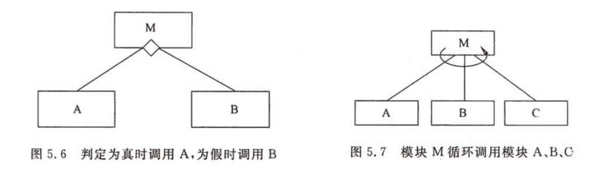

## 一、前言

软件工程中规定，软件生命周期由软件定义、软件开发和运行维护（也称为软件维护）3个时期组成，每一个时期又进一步划分为若干个阶段。

- 软件定义时期包括问题定义、可行性研究、需求分析三个阶段。

- 软件开发时期包括总体设计、详细设计、编码和单元测试、综合测试四个阶段。

- 软件维护时期只包括软件维护这一个阶段。

本文旨在说明在软件生命周期不同阶段的各种图的含义与使用。

## 二、可行性研究

### 2.1 系统流程图

系统流程图是概括地描绘物理系统的传统工具。它的基本思想是用图形符号以黑盒子形式描绘组成系统的每个部件（程序、文档、数据库、人工过程等）。系统流程图表达的数据在系统各部件之间流动的情况，而不是对数据进行加工处理的控制过程，因此尽管系统流程图的某些符号和程序流程图的符号形式相同，但是它却是物理数据流图而不是程序流程图。

#### 符号

当以概括的方式抽象的描绘一个实际系统时，仅仅使用图2.1中列出的基本符号就足够了。当需要更具体地描绘一个物理系统时还需要使用图2.2中列出的系统符号，利用这些符号可以把一个广义的输入输出操作具体化为读写存储在特殊设备上的文件（或数据库），把抽象处理具体化为特定的程序或手工操作等。

#### 用法

#### 例子

#### 分层

面对复杂的系统时，一个比较好的方法是分层次地描绘这个系统。首先用一张高层次的系统流程图描绘系统总体概貌，表明系统的关键功能。然后分别把每个关键功能扩展到适当的详细程度，画在单独的一页纸上。这种分层次的描绘方法便于阅读者按从抽象到具体的过程逐步深入地了解一个复杂的系统。

### 2.2 数据流图

数据流图（DFD）是一种图形化技术，它描绘信息流和数据从输入移动到输出的过程中所经受的变换。在数据流图中没有任何具体的物理部件，它只是描绘数据在软件中流动和被处理的逻辑过程。数据流图是系统逻辑功能的图形表示，即使不是专业的计算机技术人员也容易理解它，因此是分析员与用户之间极好的通信工具。此外，设计数据流图时只需要考虑系统必须完成的基本逻辑功能，完全不需要考虑样具体的实现这些功能，所以它也是今后进行软件设计的很好的出发点。

#### 符号

#### 例子

## 三、需求分析

### 3.1 实体-联系图

为了把用户的数据要求清楚、准确地描述出来，系统分析员通常建立一个概念性的数据模型（也称为信息模型）。概念性数据模型是一种面向问题的数据模型，是按照用户的观点对数据建立的模型。它描述了从用户角度看到的数据，它反映了用户的现实环境，而且与在软件系统中的实现方法无关。数据模型中包含 3 种相互关联的信息：数据对象、数据对象的属性及数据对象彼此间相互连接的关系。

通常，使用实体-联系图（entity-relationship diagram）来建立数据模型。可以把实体-联系图简称为 ER 图，相应地可把用 ER 图描绘的数据模型称为 ER 模型。

#### 符号

ER 图中包含了实体、关系和属性 3 种基本成分，通常用矩形框代表实体，用连接相关实体的菱形框表示关系，用椭圆形或圆角矩形表示实体（或关系）的属性，并用直线把实体（或关系）与其属性连接起来。

#### 例子

### 3.2 状态转换图

在需求分析过程中应该建立起软件系统的行为模型。状态转换图（简称为状态图）通过描绘系统的状态及引起系统状态转换的事件，来表示系统的行为。此外，状态图还指明了作为特定事件的结果系统将做哪些动作（例如，处理数据）。

#### 状态

状态是任何可以被观察到的系统行为模式，一个状态代表系统的一种行为模式。状态规定了系统对事件的响应方式。系统对事件的响应，既可以是做一个(或一系列)动作，也可以是仅仅改变系统本身的状态，还可以是既改变状态又做动作。

在状态图中定义的状态主要有：初态（即初始状态）、终态（即最终状态）和中间状态。在一张状态图中只能有一个初态，而终态则可以有 0 至多个。

状态图既可以表示系统循环运行过程，也可以表示系统单程生命期。当描绘循环运行过程时，通常并不关心循环是怎样启动的。当描绘单程生命期时，需要标明初始状态（系统启动时进入初始状态）和最终状态（系统运行结束时到达最终状态）。

#### 事件

事件是在某个特定时刻发生的事情，它是对引起系统做动作或（和）从一个状态转换到另一个状态的外界事件的抽象。例如，内部时钟表明某个规定的时间段已经过去，用户移动或单击鼠标等都是事件。简而言之，事件就是引起系统做动作或（和）转换状态的控制信息。

#### 符号

在状态图中，初态用实心圆表示，终态用一对同心圆（内圆为实心圆）表示。
中间状态用圆角矩形表示，可以用两条水平横线把它分成上、中、下 3 个部分。上面部分为状态的名称，这部分是必须有的；中间部分为状态变量的名字和值，这部分是可选的；下面部分是活动表，这部分也是可选的。

活动表的语法格式如下：

**事件名（参数表）/ 动作表达式**

其中，“事件名”可以是任何事件的名称。在活动表中经常使用下述 3 种标准事件：entry，exit 和 do。 entry 事件指定进入该状态的动作，exit 事件指定退出该状态的动作，而 do 事件则指定在该状态下的动作。需要时可以为事件指定参数表。活动表中的动作表达式描述应做的具体动作。

状态图中两个状态之间带箭头的连线称为状态转换，箭头指明了转换方向。状态变迁通常是由事件触发的，在这种情况下应在表示状态转换的箭头线上标出触发转换的事件表达式；如果在箭头线上未标明事件，则表示在源状态的内部活动执行完之后自动触发转换。

事件表达式的语法如下：

**事件说明[守卫条件] / 动作表达式**

其中，事件说明的语法为：事件名（参数表）。

守卫条件是一个布尔表达式。如果同时使用事件说明和守卫条件，则当且仅当事件发生且布尔表达式为真时，状态转换才发生。如果只有守卫条件没有事件说明，则只要守卫条件为真，状态转换就发生。

动作表达式是一个过程表达式，当状态转换开始时执行该表达式。

图 3.3 给出了状态图中使用的主要符号。

#### 例子

### 3.3 层次方框图

层次方框图用树形结构的一系列多层次的矩形框描绘数据的层次结构。树形结构的顶层是一个单独的矩形框，它代表完整的数据结构，下面的各层矩形框代表这个数据的子集，最底层的各个框代表组成这个数据的实际数据元素（不能再分割的元素）。

#### 例子

### 3.4 Warnier图

法国计算机科学家 Warnier 提出了表示信息层次结构的另外一种图形工具— Warnier 图。和层次方框图类似，Warnier 图也用树形结构描绘信息，但是这种图形工具比层次方框图提供了更丰富的描绘手段。

用 Warnier 图可以表明信息的逻辑组织，也就是说，它可以指出一类信息或一个信息元素是重复出现的，也可以表示特定信息在某一类信息中是有条件地出现的。因为重复和条件约束是说明软件处理过程的基础，所以很容易把 Warnier 图转变成软件设计的工具。

#### 例子

图中花括号用来区分数据结构的层次，在一个花括号内的所有名字都属于同一类信息；异
或符号（⊕）表明一类信息或一个数据元素在一定条件下才出现，而且在这个符号上、下方
的两个名字所代表的数据只能出现一个；在一个名字下面（或右边）的圆括号中的数字指明了这个名字代表的信息类（或元素）在这个数据结构中重复出现的次数。（例如 P1 种、 P2 种）

### 3.5 IPO图

IPO 图是输入、处理、输出图的简称，它是由美国 IBM 公司发展完善起来的一种图形工具，能够方便地描绘输入数据、对数据的处理和输出数据之间的关系。

IPO 图使用的基本符号既少又简单，因此很容易学会使用这种图形工具。它的基本形式是在左边的框中列出有关的输入数据，在中间的框内列出主要的处理，在右边的框内列出产生的输出数据。处理框中列出处理的次序暗示了执行的顺序，但是用这些基本符号还不足以精确描述执行处理的详细情况。在IPO图中还用类似向量符号的粗大箭头清楚地指出数据通信的情况。

#### 例子

## 四、总体设计

### 4.1 层次图

层次图用来描绘软件的层次结构。层次图中的一个矩形框代表一个模块，方框间的连线表示**调用关系**而不像层次方框图那样表示**组成关系**。

#### 例子

### 4.2 HIPO图

HIPO 图是美国 IBM 公司发明的“层次图加输入/处理/输出图”的英文缩写。为了能使 HIPO 图具有可追踪性，在 H 图（层次图）里除了最顶层的方框之外，每个方框都加了编号。

#### 例子

### 4.3 结构图

Yourdon 提出的结构图是进行软件结构设计的另一个有力工具。结构图和层次图类似，也是描绘软件结构的图形工具，图中一个方框代表一个模块，框内注明模块的名字或主要功能；方框之间的箭头（或直线）表示模块的调用关系。

在结构图中通常还用带注释的箭头表示模块调用过程中来回传递的信息。如果希望进一步标明传递的信息是数据还是控制信息，则可以利用注释箭头尾部的形状来区分：尾部是空心圆表示传递的是数据，实心圆表示传递的是控制信息。

#### 例子

## 五、详细设计

### 5.1 程序流程图

程序流程图又称为程序框图，它是历史最悠久、使用最广泛的描述过程设计的方法，然而它也是用得最混乱的一种方法。

从20世纪40年代末到70年代中期，程序流程图一直是软件设计的主要工具。它的主要优点是对控制流程的描绘很直观，便于初学者掌握。由于程序流程图历史悠久，为最广泛的人所熟悉，尽管它有种种缺点，许多人建议停止使用它，但至今仍在广泛使用着。不过总的趋势是越来越多的人不再使用程序流程图了。

程序流程图的主要缺点如下。

1. 程序流程图本质上不是逐步求精的好工具，它诱使程序员过早地考虑程序的控制流程，而不去考虑程序的全局结构。
2. 程序流程图中用箭头代表控制流，因此程序员不受任何约束，可以完全不顾结构程序设计的精神，随意转移控制。
3. 程序流程图不易表示数据结构。

#### 符号

#### 例子

### 5.2 盒图

出于要有一种不允许违背结构程序设计精神的图形工具的考虑，Nassi 和 Shneiderman 提出了盒图，又称为 N-S 图。它有下述特点。

1. 功能域（即，一个特定控制结构的作用域）明确，可以从盒图上一眼就看出来。
2. 不可能任意转移控制。
3. 很容易确定局部和全程数据的作用域。
4. 很容易表现嵌套关系，也可以表示模块的层次结构。

#### 符号

### 5.3  PAD 图

PAD 图是问题分析图（problem analysis diagram）的英文缩写，自 1973年由日本日立公司发明以后，已得到一定程度的推广。它用二维树形结构的图来表示程序的控制流，将这种图翻译成程序代码比较容易。

#### 符号

#### 优点

PAD图的主要优点如下：

1. 使用表示结构化控制结构的 PAD 符号所设计出来的程序必然是结构化程序。
2. PAD 图所描绘的程序结构十分清晰。图中最左面的竖线是程序的主线，即第一层结构。随着程序层次的增加，PAD 图逐渐向右延伸，每增加一个层次，图形向右扩展一条竖线。PAD 图中竖线的总条数就是程序的层次数。
3. 用 PAD 图表现程序逻辑，易读、易懂、易记。PAD图是二维树形结构的图形，程序从图中最左竖线上端的结点开始执行，自上而下，从左向右顺序执行，遍历所有结点。
4. 容易将 PAD 图转换成高级语言源程序，这种转换可用软件工具自动完成，从而可省去人工编码的工作，有利于提高软件可靠性和软件生产率。
5. 即可用于表示程序逻辑，也可用于描绘数据结构。
6. PAD 图的符号支持自顶向下、逐步求精方法的使用。开始时设计者可以定义一个抽象的程序，随着设计工作的深入而使用 def 符号逐步增加细节，直至完成详细设计。

#### 例子

### 5.4 判定表

判定表能够清晰地表示复杂的条件组合与应做的动作之间的对应关系。

判定表由 4 部分组成，左上部分列出所有条件，左下部是所有可能做的动作，右上部是表示各种条件组合的一个矩阵，右下部是和每种条件组合相对应的动作。判定表右半部的每一列实质上是一条规则，规定了与特定的条件组合相对应的动作。

#### 例子

### 5.5 判定树

判定表虽然能清晰地表示复杂的条件组合与应做的动作之间的对应关系，但其含义却不是一眼就能看出来的。

判定树是判定表的变种，它也能清晰地表示复杂的条件组合与应做的动作之间的对应关系.

#### 例子

## 六、后记

本文简要描述了软件工程中经常用到的一些图，其实还有很多图没有介绍到，比如UML（标准图、类图）等，感兴趣的小伙伴可以自行学习。

### 参考资料

《软件工程导论》