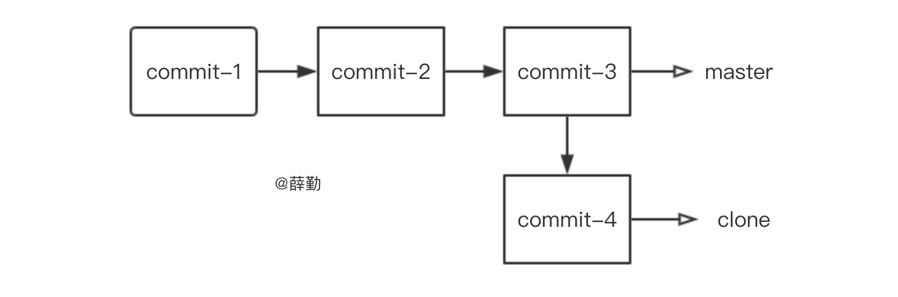

有时候，我们提交了一些隐私的数据例如密码等到 Github 仓库，就算更新了仓库文件，但依旧会在 commit 历史记录中保存这部分数据。这个时候，我们就需要一种方法，可以把Github分支下所有提交记录进行删除！

#### 第一步：新建一个空白的分支

一般使用新建分支，都会在当前 master 分支的基础上克隆一份，如下图所示：



所以，我们需要新建一个空白的分支：

```shell
git checkout --orphan latest_branch
```

#### 第二步：添加所有文件到新分支

添加你想提交的所有文件到这个新分支：

```shell
git add -A
```

别忘了提交该操作：

```shell
git commit -m "commit message"
```

#### 第三步：新分支替换旧分支

分为三步，先将旧分支删除：

```shell
git branch -D master
```

再将新分支的名字改为旧分支的名字：

```shell
git branch -m master
```

最后提交所有本地操作到Github仓库：

```shell
git push -f origin master
```

`-f`参数的作用是强制提交本地仓库到远程仓库。

