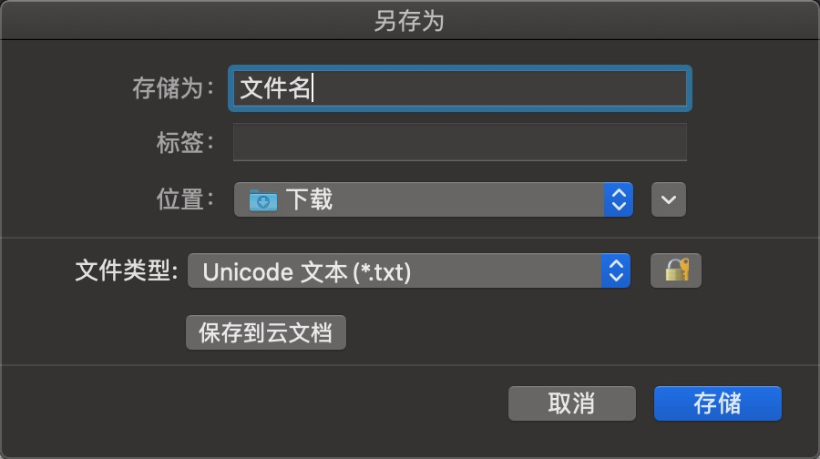
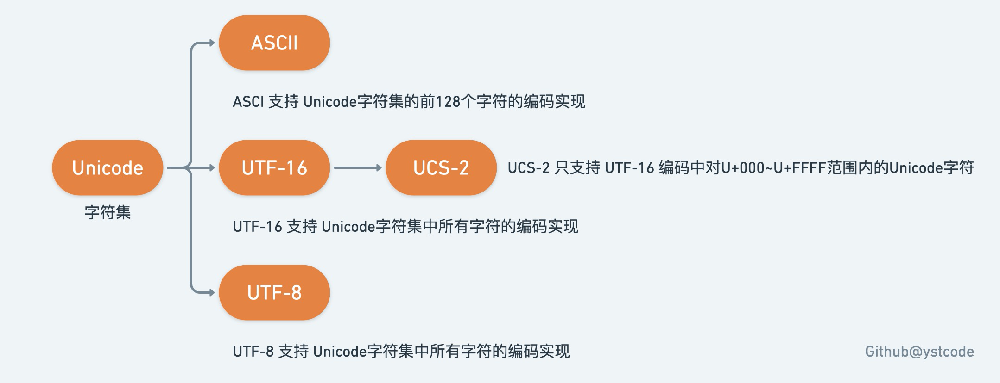

## 前言

本文起因于一次我使用WPS的表格另存为功能导出为TXT文本，如下图所示：



WPS 提示保存的文本文件的类型为 Unicode ，事实上这句提示很废话。

因为众所周知，Unicode 只是一套编码标准，而不是具体的编码实现，简而言之只是**提供了二进制与具体字符之间的对应关系**。相信在实际开发中应该没有人在程序中指定编码格式为 Unicode 吧。

我在第一次读取导出的 txt 文件时是尝试的 utf-8 编码，代码如下：

```js
const fs = require('fs')
fs.readFile('文本.txt',{encoding: 'utf8'},(err, data) => {
    console.log(data)
})
```

没想到打印输出的全是乱码，没事，换个编码方式再尝试下。

fs 模块支持的编码方式包括 utf8、ucs2、ascii、binary、base64、hex。除了utf8 之外，属于 Unicode 编码标准的就是 ucs2 了，换成 ucs2 之后果然得到了正确的输出文字。

问题来了，utf8 和 ucs2 的区别是什么呢？别急，等我慢慢道来。

## ASCII编码

先来了解一下编码的“祖宗” ASCII（American Standard Code for Information Interchange）即美国信息交换标准代码。它主要用于显示现代英语，包含了阿拉伯数字、大小写英文字母以及一些常用英式标点符号等。

简单来说，ASCII 编码使用 8 位共 1 字节的二进制数表示字符，范围从 0000 0000 到 0111 1111，可以表示 128 个字符。

Unicode 字符集中对这 128 个字符的编码与 ASCII 是一致的。

## UTF-8编码

根据笔者在维基百科上的学习所得，utf-8 是一种针对 Unicode 的可变长度字符编码，也是一种前缀码。它可以用一至四个字节对Unicode字符集中的所有有效编码点进行编码，属于 Unicode 标准的一部分。

UTF-8 编码的规则还可以用下表所表示：

| 字节数 | 二进制                              |
| ------ | ----------------------------------- |
| 1字节  | 0xxxxxxx                            |
| 2字节  | 110xxxxx 10xxxxxx                   |
| 3字节  | 1110xxxx 10xxxxxx 10xxxxxx          |
| 4字节  | 11110xxx 10xxxxxx 10xxxxxx 10xxxxxx |

因此，对 UTF-8 编码中的任意字节，根据第一位是否为 0，可判断是否为 ASCII 字符；根据前二位，可判断该字节是否为一个字符编码的第一个字节；根据前四位（如果前两位均为 1 ），可确定该字节为字符编码的第一个字节，并且可判断对应的字符由几个字节表示；根据前五位（如果前四位为 1 ），可判断编码是否有错误或数据传输过程中是否有错误。

## UTF-16编码

看下维基百科的专业解释：

> UTF-16 是 Unicode 字符编码五层次模型的第三层：字符编码表（Character Encoding Form，也称为"storage format"）的一种实现方式。即把Unicode字符集的抽象码位映射为16位长的整数（即码元）的序列，用于数据存储或传递。Unicode字符的码位，需要1个或者2个16位长的码元来表示，因此这是一个变长表示。
>

虽然有些晦涩难懂，但我们依旧可以得出，UTF-16 编码实现只支持通过 2 字节或者 4 字节去表示 Unicode 字符；也可以得出 UTF-16 编码实现不兼容 ASCII 编码（ASCII编码使用 1 字节来进行存储）。

## UCS-2编码

我在维基百科的学习中，看到 UCS-2 词条放在了 UTF-16 词条文章下方，并有写明 UTF-16 可看成是 UCS-2 的父集。这是为什么呢？

如果把 UTF-16 支持的 Unicode 字符范围分为两块，即如下表所示：

| Unicode范围          | UTF-16编码方式 |
| -------------------- | -------------- |
| `U+000`~`U+FFFF`     | 2 Byte存储     |
| `U+10000`~`U+10FFFF` | 4 Byte存储     |

UTF-16 编码实现和 UCS-2 编码实现的区别就在于 UCS-2 只支持 UTF-16 编码中对`U+000`~`U+FFFF`范围内的Unicode字符。

对于小于 0x10000 的 UCS 码，UTF-16 编码就等于UCS码。现在如果有软件声称自己支持 UCS-2 编码，那其实是在说它不能支持在 UTF-16 中超过 2 字节的字集。

## 后记

到此，我们终于搞明白了 UTF-8 和 UCS-2 编码方式的区别，明白了他们虽同属于 Unicode 编码标准实现体系的一部分，但实际对 Unicode 字符编码的实现完全不同。以后，如果再看到存储为 Unicode 文本，你可以尝试下以 UCS-2 格式进行解码，相信大部分情况下都是行得通的。

忽略历史原因，只用下面这一张图就足够解释 Unicode 字符集的编码问题：



最后提供一个查看 Unicode 字符与编码的网站 [Unicode字符百科](https://unicode-table.com/cn/blocks/cjk-unified-ideographs/)