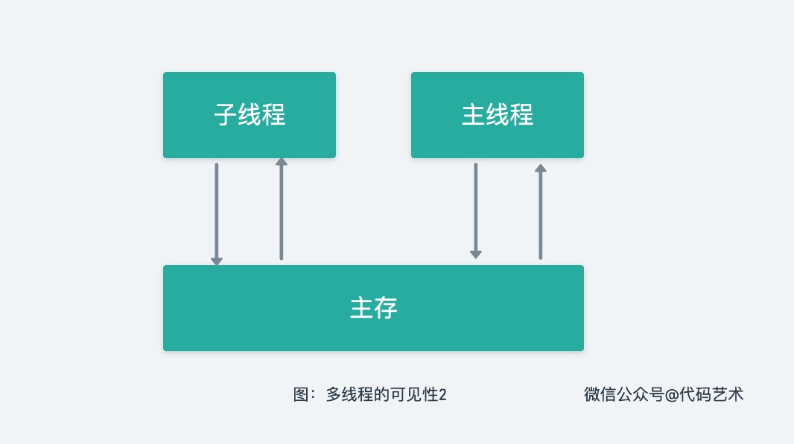

## 前言

并发编程的本质其实是要解决：可见性、原子性、有序性这三大问题。

相信这句话你已经听了无数遍，那我问你，单核CPU是否有并发问题，是否还需要加锁呢？线程的工作内存在哪里，你可别给我说是栈。

本文就是想搞清楚一直的聊的并发编程问题，究竟是什么？

## 可见性

学过计算机组成原理的我们知道，计算机存储系统的层次结构主要体现在缓存 - 主存和主存 - 辅存这两个存储层次上，如图所示。显然，CPU 和缓存、主存都能直接交换信息；缓存能直接和CPU、主存交换信息；主存可以和CPU、缓存、辅存交换信息。


<u>（注：主存指 RAM 和 ROM；辅存指光盘、磁带、磁盘等）</u>

对于如今的多核处理器，CPU的每个内核都有自己的缓存，而缓存仅仅对它所在的处理器可见，所以缓存向主存刷新数据时就容易造成数据的不一致问题。如图所示。


在Java内存模型中提到了线程栈为线程的工作内存，其实**线程的工作内存是对 CPU 寄存器和高速缓存的抽象描述**，使用频率高的数据从主存拷贝到高速缓存中，每个线程在 CPU 高速缓存中对拷贝的数据进行读取、计算、赋值，再在合适的时候同步更新到主存的该数据。

**所谓的可见性，就是一个线程对共享变量的修改，另外一个线程能够立刻看到。**

导致可见性问题的原因就是缓存不能及时刷新至主存。

例如一段代码如下所示：

```java
public class PrintString implements Runnable{
    private boolean isContinuePrint = true;

    @Override
    public void run() {
        while (isContinuePrint){
            System.out.println("Thread: "+Thread.currentThread().getName());
            try {
                Thread.sleep(1000);
            } catch (InterruptedException e) {
                e.printStackTrace();
            }
        }
    }

    public boolean isContinuePrint() {
        return isContinuePrint;
    }

    public void setContinuePrint(boolean continuePrint) {
        isContinuePrint = continuePrint;
    }

    public static void main(String[] args) throws InterruptedException {
        PrintString printString = new PrintString();
        Thread thread = new Thread(printString,"Thread-A");
        thread.start();
        Thread.sleep(100);
        System.out.println("我要停止它！" + Thread.currentThread().getName());
        printString.setContinuePrint(false);
    }
}
```

JVM有Client和Server两种模式，我们可以通过运行：`java -version` 来查看 JVM 默认工作在什么模式。我们在IDE中把 JVM 设置为在 Server 服务器的环境中，具体操作只需配置运行参数为 `-server`。然后启动程序，打印结果：

```
Thread begin: Thread-A
我要停止它！main
```

代码 `System.out.println("Thread end: "+Thread.currentThread().getName());`从未被执行。

是什么样的原因造成将JVM设置为 -server 就出现死循环呢？

在启动thread线程时，变量`boolean isContinuePrint = true;`存在于公共堆栈及线程的私有堆栈中。在JVM设置为 -server 模式时为了线程运行的效率，线程一直在私有堆栈中取得 `isRunning` 的值是 true。而代码 `thread.setRunning(false);` 虽然被执行，更新的却是公共堆栈中的 `isRunning` 变量值 false，所以一直就是死循环的状态。内存结构图：


这个问题其实就是线程工作内存中的值和主内存中的值不同步造成的。解决这样的问题就要使用`volatile`关键字了，它主要的作用就是当线程访问 `isRunning` 这个变量时，强制性从主内存中进行取值。内存结构图：



此图是不是和本文最开始所讲，CPU 可与主存直接进行信息交换一致呢，果然，JVM 内存模型只是对计算机系统的一层封装。

## 原子性

**原子性是什么？**

把一个或者多个操作在 CPU 执行的过程中不被中断的特性称为原子性。

**为什么会有原子性问题？**

线程是CPU调度的基本单位。CPU会根据不同的调度算法进行线程调度，将时间片分派给线程。当一个线程获得时间片之后开始执行，在时间片耗尽之后，就会失去CPU使用权。多线程场景下，由**于时间片在线程间轮换，就会发生原子性问题**。

如：对于一段代码，一个线程还没执行完这段代码但是时间片耗尽，在等待CPU分配时间片，此时其他线程可以获取执行这段代码的时间片来执行这段代码，导致多个线程同时执行同一段代码，也就是原子性问题。

**线程切换带来原子性问题。**

在Java中，对基本数据类型的变量的读取和赋值操作是原子性操作，即这些操作是不可被中断的，要么执行，要么不执行。

```java
i = 0;		// 原子性操作
j = i;		// 不是原子性操作，包含了两个操作：读取i，将i值写回给j
i++; 			// 不是原子性操作，包含了三个操作：读取i值、i + 1 、将结果写回给i
i = j + 1;// 不是原子性操作，包含了三个操作：读取j值、j + 1 、将结果写回给i
```

自增操作实际是 3 个离散操作的简写形式：**获取当前值，加 1，写回新值**。这是一个“**读-改-写**”操作的实例。

要想保证自增操作的原子性，可以在自增操作中使用 `synchronized` 关键字进行加锁，代码如下：

```java
public class ThreadTest extends Thread {
    int i = 0;

    @Override
    public void run(){
        for (int j = 0; j < 1000; j++) {
            synchronized (ThreadTest.class) {
                i++;
            }
        }
    }

    public static void main(String[] args) throws InterruptedException {
        ThreadTest threadTest = new ThreadTest();
        for (int i = 0; i < 10; i++) {
            new Thread(threadTest).start();
        }
        Thread.sleep(2000);
        System.out.println(threadTest.i);
    }
  
}
```

这段程序的作用是将 int 变量 i 通过 10 个线程累加到 10000，运行后可以看到程序的结果符合我们的预期，原因分析如下：


上面我们说了线程拥有自己的工作内存（寄存器或缓存），但是上图中只标识出写入内存，因为 `synchronized` 不止可以保证我们“读-改-写”操作的**原子性**，还可以保证内存的**可见性**，即由 CPU 直接对主存进行信息交换。

## 有序性

**有序性：程序执行的顺序按照代码的先后顺序执行。**

编译器为了优化性能，有时候会改变程序中语句的先后顺序。例如程序中：`a=6；b=7；`编译器优化后可能变成`b=7；a=6；`，在这个例子中，编译器调整了语句的顺序，但是不影响程序的最终结果。不过有时候编译器及解释器的优化可能导致意想不到的效果。

**有序性问题举例**

Java中的一个经典的案例：利用双重检查锁创建单例对象。

```java
public class Singleton {
  static Singleton instance;
  static Singleton getInstance(){
    if (instance == null) {
      synchronized(Singleton.class) {
        if (instance == null)
          instance = new Singleton();
        }
    }
    return instance;
  }
}
```

在获取实例 getInstance() 的方法中，我们首先判断 instance 是否为空，如果为空，则锁定 Singleton.class 并再次检查 instance 是否为空，如果还为空则创建 Singleton 的一个实例。
看似很完美，既保证了线程完全的初始化单例，又经过判断 instance 为 null 时再用synchronized 同步加锁。但是还有问题！

`instance = new Singleton();` 创建对象的代码，分为三步：

①分配内存空间

②初始化对象Singleton

③将内存空间的地址赋值给 instance

但是这三步经过重排之后：

①分配内存空间

②将内存空间的地址赋值给instance

③初始化对象Singleton

会导致什么结果呢？

线程 A 先执行 getInstance() 方法，当执行完指令 ② 时恰好发生了线程切换，切换到了线程 B 上；如果此时线程 B 也执行 getInstance() 方法，那么线程 B 在执行第一个判断时会发现 `instance!=null`，所以直接返回 instance，而此时的 instance 是没有初始化过的，如果我们这个时候访问 instance 的成员变量就可能触发空指针异常。

时序图如下：


解决这个问题的方法就是使用 `volatile`关键字。对修饰变量的操作不会与其他的内存操作一起重排序，即其具有**禁止指令重排序**的功能。

## 问题

回到最初的问题，单核CPU是否有并发问题，是否还需要加锁呢？

学习到这里，相信你已经明白了，单核CPU只能说具有天然的内存可见性，但并发问题涉及的原子性和有序性，依旧还是需要自行解决。

## 声明

本文所述观点如有不足请留言告知，多谢。

## 参考资料

https://mp.weixin.qq.com/s/rkl916p8RIErGn58DNcihw