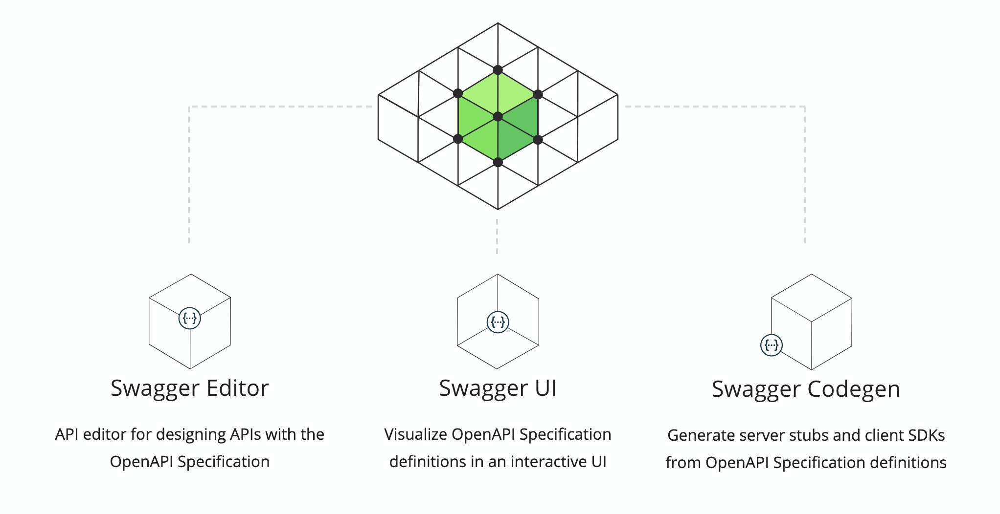
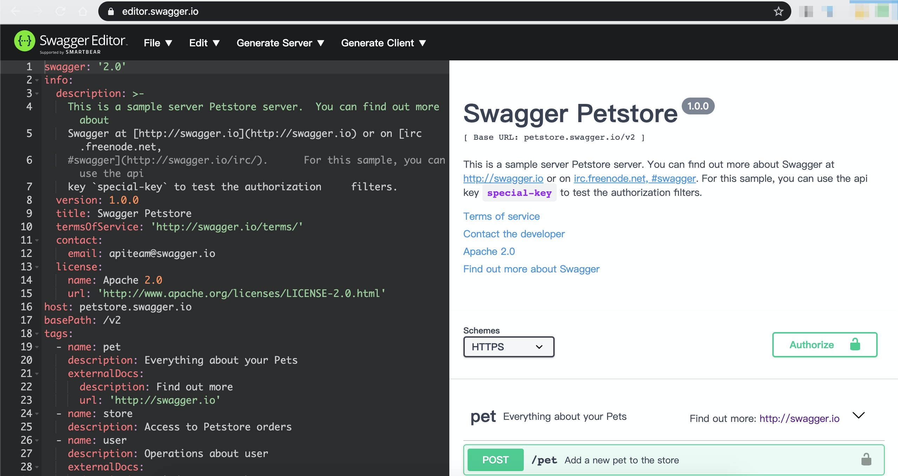
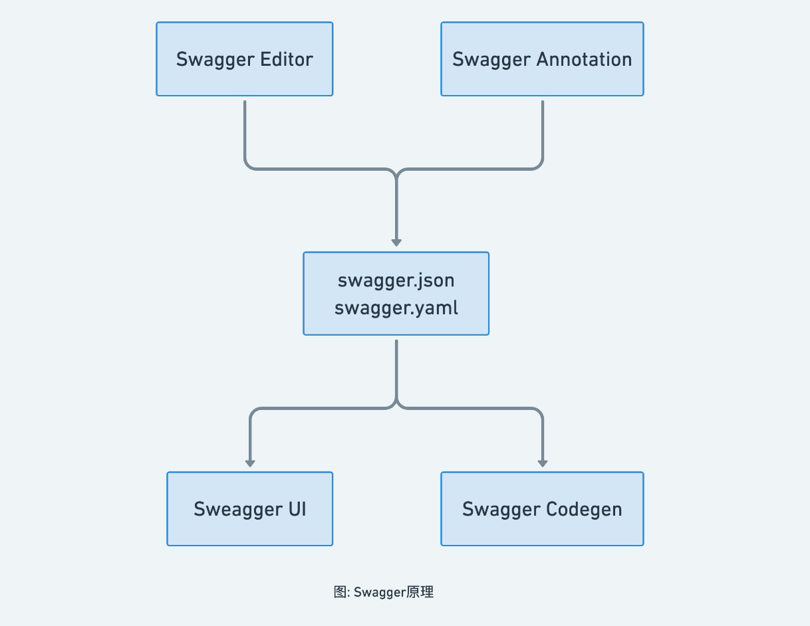
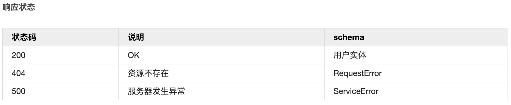
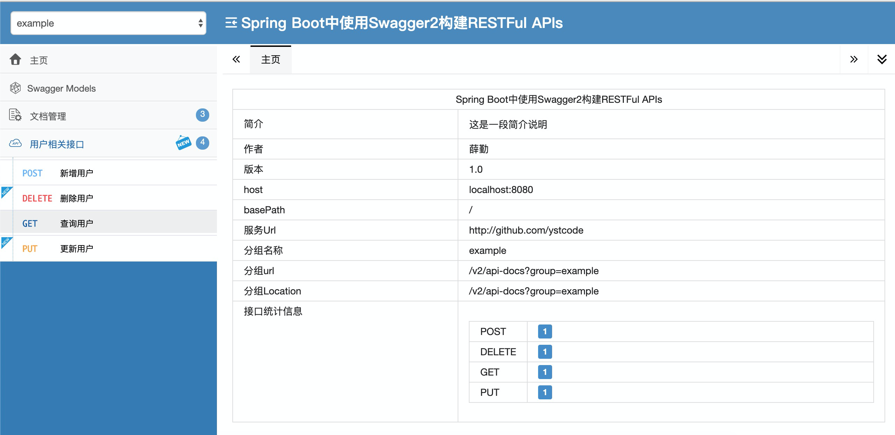
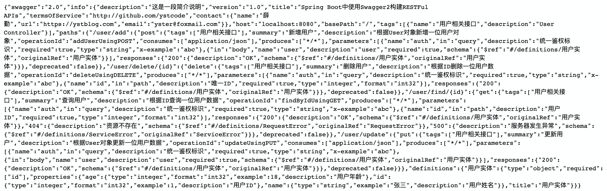
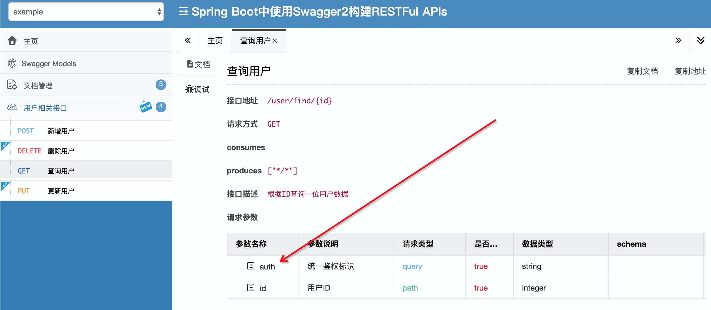
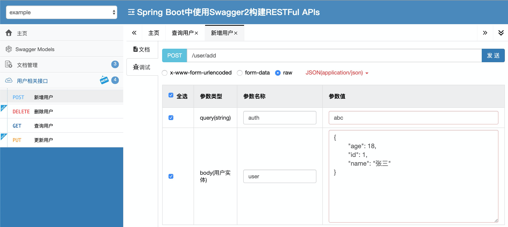

## 前言

Spring Boot 框架是目前非常流行的微服务框架，我们很多情况下使用它来提供 Rest API。而对于 Rest API 来说很重要的一部分内容就是文档，Swagger 为我们提供了一套通过代码和注解自动生成文档的方法，这一点对于保证 API 文档的及时性将有很大的帮助。

本文将使用 Swagger 2 规范的 Springfox 实现来了解如何在 Spring Boot 项目中使用 Swagger，主要包含了如何使用 Swagger 自动生成文档、使用 Swagger 文档以及 Swagger 相关的一些高级配置和注解。

## Swagger简介

Swagger 是一套基于 OpenAPI 规范构建的开源工具，可以帮助我们设计、构建、记录以及使用 Rest API。

Swagger 的 OpenAPI 规范与编程语言无关，根据 OpenAPI 规范可以生成 Swagger 文档。

Swagger 文档支持 YAML 语法和 JSON 语法，这两种语法风格可以相互转换，都可以用来对我们的 RESTful API 接口的信息进行准确描述，便于人类和机器阅读。

### Swagger组成



如图所示，Swagger 主要包含了以下三个部分：

1.Swagger Editor：基于浏览器的 Swagger 文档编辑器，我们可以使用它编写我们 OpenAPI 规范文档。

官方提供的[在线编辑器](https://editor.swagger.io)截图如下：



2.Swagger UI：它会将我们编写的 OpenAPI 规范文档呈现为交互式的 API 文档，后文我将使用浏览器来查看并且操作我们的 Rest API，你也可以访问官方提供的 [Demo](https://petstore.swagger.io) 率先体验。

3.Swagger Codegen：它可以通过为 OpenAPI（以前称为 Swagger）规范定义的任何 API 生成服务器存根和客户端 SDK 来简化构建过程。

### Swagger原理

Swagger 的大致原理是通过 Swagger Editor 或者嵌入到代码中的注解来生成具有 OpenAPI 规范的 Swagger 文档，即 swagger.json 或 swagger.yaml 文件，然后交给 Swagger UI 和 Swagger Codegen 使用并生成相应服务，如下图所示。



### Swagger优势

传统意义上的文档都是后端开发人员手动编写的，相信大家也都知道这种方式很难保证文档的及时性，这种文档久而久之也就会失去其参考意义，反而还会加大我们的沟通成本。而 Swagger 给我们提供了一个全新的维护 API 文档的方式，下面我们就来了解一下它的优点：

1. 代码变，文档变。只需要少量的注解，Swagger 就可以根据代码自动生成 API 文档，很好的保证了文档的时效性。
2. 跨语言性，支持 40 多种语言。
3. Swagger UI 呈现出来的是一份可交互式的 API 文档，我们可以直接在文档页面尝试 API 的调用，省去了准备复杂的调用参数的过程。
4. 还可以将文档规范导入相关的工具（例如 SoapUI）, 这些工具将会为我们自动地创建自动化测试。

以上这些优点足以说明我们为什么要使用 Swagger 了，您是否已经对 Swagger 产生了浓厚的兴趣了呢？下面我们就将一步一步地在 Spring Boot 项目中集成和使用 Swagger，让我们从准备一个 Spring Boot 的 Web 项目开始吧。

## 准备 Spring Boot 项目

首先通过 IDEA 创建一个空白的 Spring Boot 项目，然后添加 Web 依赖。

```xml
<dependency>
    <groupId>org.springframework.boot</groupId>
    <artifactId>spring-boot-starter-web</artifactId>
</dependency>
```

### 编写接口

1. 首先我们创建三个包：`com.example.swagger.controller`、`com.example.swagger.config` 以及 `com.example.swagger.vo`。
2. 在 controller 包下新建 `UserController.java` 类，在 config 包下新建 `Swagger2Config.java` 类，在 vo 包下新建 `User.java` 类。
3. `UserController` 提供用户的增、删、改、查四个接口，代码我会在后面和Swagger集成后贴出来。`User` 用户实体类包括用户的ID（整型）、姓名（字符串）和年龄（整型）。

### 集成 Swagger2

#### 添加依赖

首先要做的自然是添加 Swagger2 的依赖。

```xml
<!--    理论上导入这一个包就可以    -->
<dependency>
    <groupId>io.springfox</groupId>
    <artifactId>springfox-swagger2</artifactId>
    <version>2.9.2</version>
</dependency>
```

笔者在测试的发现该依赖的子依赖 `swagger-annotations` 和 `swagger-models` 的版本有些 bug，所以最好还是手动升级这两个依赖的版本。

```xml
<!--    但是需要手动升级这两个包的版本减少一些bug    -->
<dependency>
    <groupId>io.swagger</groupId>
    <artifactId>swagger-annotations</artifactId>
    <version>1.5.22</version>
</dependency>
<dependency>
    <groupId>io.swagger</groupId>
    <artifactId>swagger-models</artifactId>
    <version>1.5.22</version>
</dependency>
```

最后呢，我们还需要添加 `swagger ui` 模块用于生成与浏览器交互的文档，这里我们选择非官方的 `swagger-bootstrap-ui `框架。

```xml
<!--  最后使用非官方swagger-ui框架  -->
<dependency>
    <groupId>com.github.xiaoymin</groupId>
    <artifactId>swagger-bootstrap-ui</artifactId>
    <version>1.9.6</version>
</dependency>
```

#### 配置信息

接下里，我们通过配置 Swagger2Config 类添加文档信息。在这一步中，不仅需要配置 `@EnableSwagger2` 注解开启 Swagger2 文档页面，还需要配置 Docket 类的对象实例，并初始化必要的参数，包括文档的标题、摘要、版本、开发者信息。

```java
@Configuration
@EnableSwagger2
public class Swagger2Config {

    @Bean
    public Docket createRestApi() {
        return new Docket(DocumentationType.SWAGGER_2)
                // API文档简介
                .apiInfo(new ApiInfoBuilder()
                        .title("Spring Boot中使用Swagger2构建RESTFul APIs")
                        .description("这是一段简介说明")
                        .termsOfServiceUrl("http://site.com/index.html")
                        .contact(new Contact("姓名", "https://github.com/onblog", "example@foxmail.com"))
                        .version("1.0")
                        .build())
                // 如果存在多个Docket实例，则每个实例都必须具有此方法提供的唯一组名称。默认值为"default"。
                .groupName("example")
                // 构建 ApiSelectorBuilder 的第一步
                .select()
                // 自定义包扫描
                .apis(RequestHandlerSelectors.any())
                // 过滤到的才有效
                .paths(PathSelectors.any())
                // 构建 ApiSelectorBuilder 的最后一步
                .build();
    }

}
```

#### 接口过滤

有些时候我们并不是希望所有的 Rest API 都呈现在文档上，这种情况下 Swagger2 提供给我们了两种方式配置，一种是基于 `@ApiIgnore` 注解，另一种是在 Docket 上增加筛选。

1. 如果想在文档中屏蔽掉删除用户的接口（user/delete），那么只需要在删除用户的方法上加上 @ApiIgnore 即可。


2. 在 Docket 上增加筛选。Docket 类提供了 `apis()` 和 `paths()`两 个方法来帮助我们在不同级别上过滤接口：

- `apis()`：这种方式我们可以通过指定包名的方式，让 Swagger 只去某些包下面扫描。
- `paths()`：这种方式可以通过筛选 API 的 url 来进行过滤，匹配的才会显示。

在集成 Swagger2 的章节中我们这两个方法指定的都是扫描所有，没有指定任何过滤条件。如果我们在我们修改之前定义的 Docket 对象的 `apis()` 方法和 `paths()` 方法为下面的内容，那么接口文档将只会展示 /user/add 和 /user/find/{id} 两个接口。

```java
.apis(RequestHandlerSelectors.basePackage("com.example.swagger.controller"))
.paths(Predicates.or(PathSelectors.ant("/user/add"),PathSelectors.ant("/user/find/*")))
```

#### 自定义响应消息

Swagger 允许我们通过 Docket 的 `globalResponseMessage()` 方法全局覆盖 HTTP 方法的响应消息，但是首先我们得通过 Docket 的 `useDefaultResponseMessages` 方法告诉 Swagger 不使用默认的 HTTP 响应消息，假设我们现在需要覆盖所有 GET 方法的 500 和 404 错误的响应消息，我们只需要在 Swagger2Config.java 类中的 Docket Bean 下添加如下内容：

```java
// 自定义响应消息的说明
.useDefaultResponseMessages(false)
.globalResponseMessage(RequestMethod.GET, Arrays.asList(
        new ResponseMessageBuilder()
                .code(500)
                .message("服务器发生异常")
                .responseModel(new ModelRef("ServiceError"))
                .build(),
        new ResponseMessageBuilder()
                .code(404)
                .message("资源不存在")
                .responseModel(new ModelRef("RequestError"))
                .build()
        )
)
```
添加如上面的代码后，如下图所示，等会运行你就会发现在 SwaggerUI 页面展示的所有 GET 类型请求的 404 以及 500 错误的响应消息都变成了我们自定义的内容。



#### 默认参数

针对项目中的权限校验等情况，Swagger 还在 UI 界面为所有请求添加默认参数，位置可以是 header, cookie, body, query 等。

```java
// 在UI界面为所有请求添加默认参数，Swagger不做处理，可以使用拦截器进行处理。
.globalOperationParameters(Arrays.asList(
        new ParameterBuilder()
                .name("auth")
                .description("统一鉴权标识")
                .scalarExample("abc")
                .required(true)
                .modelRef(new ModelRef("String"))
                .parameterType("query")
                .order(1)
                .build()))
```
### 使用注解

到这里，我们的文档在全局上已经配置完成，但是我们还需要在细节上对接口进行描述。正如开头提到的，我们需要使用 Swagger 注解嵌入到代码中去完善 Swagger 文档信息。

#### 描述类：@API

通过在控制器类上增加`@Api` 注解，可以给控制器增加标签和描述信息。

```java
@Api(tags = "用户相关接口", description = "提供用户相关的 Rest API")
public class UserController {
    private Map<Integer, User> userService = new ConcurrentHashMap<>();
}
```

属性列表:

- tags: API分组标签。具有相同标签的API将会被归并在一组内展示。
- value: 如果tags没有定义，value将作为Api的tags使用
- description: API的详细描述，在1.5.X版本之后不再使用，但实际发现在2.0.0版本中仍然可以使用

#### 描述接口：@ApiOperation

通过在接口方法上增加 `@ApiOperation` 注解来展开对接口的描述：

```java
@PostMapping("/add")
@ApiOperation(value = "新增用户", notes = "根据User对象新增一位用户对象")
public User addUser(@RequestBody User user) {
    userService.put(user.getId(), user);
    return userService.get(user.getId());
}

@PutMapping("/update")
@ApiOperation(value = "更新用户", notes = "根据User对象更新一位用户数据")
public User update(@RequestBody User user) {
    if (userService.containsKey(user.getId())) {
        userService.put(user.getId(), user);
        return userService.get(user.getId());
    }
    return null;
}
```

属性列表:

- value: 对接口的简单说明，长度为120个字母，60个汉字
- notes: 对接口的详细说明
- tags: 标签
- response: 接口返回类型
- httpMethod: 接口请求方式，可选值有："GET", "HEAD", "POST", "PUT", "DELETE", "OPTIONS" and "PATCH"
- produces: 对应接口的 produces 字段，例如 "application/json, application/xml"

#### 描述实体：@ApiModel 和 @ApiModelProperty

1. `@ApiModel`: 可设置接口相关实体的描述。
2. `@ApiModelProperty`: 可设置实体属性的相关描述。

我们可以通过` @ApiModel` 和 `@ApiModelProperty` 注解来对我们 API 中所涉及到的对象做描述。

```java
@ApiModel(value = "用户实体")
public class User {
    @ApiModelProperty(value = "用户ID", required = true, example = "1")
    private Integer id;
    @ApiModelProperty(value = "用户姓名", example = "张三")
    private String name;
    @ApiModelProperty(value = "用户年龄", example = "18")
    private Integer age;
}
```

属性列表:

- value: 字段说明
- name: 重写字段名称
- dataType: 重写字段类型
- required: 是否必填
- example: 举例说明
- hidden: 是否在文档中隐藏该字段
- allowEmptyValue: 是否允许为空
- allowableValues: 该字段允许的值，当我们 API 的某个参数为枚举类型时，使用这个属性就可以清楚地告诉 API 使用者该参数所能允许传入的值。

#### 描述参数：@ApiImplicitParam

1. `@ApiImplicitParams`: 用于描述接口的非对象参数集。
2. `@ApiImplicitParam`: 用于描述接口的非对象参数，一般与 `@ApiImplicitParams` 组合使用。

我们可以使用 `@ApiImplicitParam` 注解对接口参数进行描述：

```java
@GetMapping("/find/{id}")
@ApiOperation(value = "查询用户", notes = "根据ID查询一位用户数据")
@ApiImplicitParams({
         @ApiImplicitParam(name = "id", value = "用户ID", required = true, dataType = "int", paramType = "path")
})
// @ApiImplicitParam(name = "id", value = "用户ID", required = true, dataType = "int", paramType = "path")
public User findById(@PathVariable("id") Integer id) {
    if (userService.containsKey(id)) {
        return userService.get(id);
    }
    return null;
}
```

属性列表:

- name: 参数名称
- value: 参数的简短描述
- required: 是否为必传参数
- dataType: 参数类型，可以为类名，也可以为基本类型（String，int、boolean等）
- paramType: 指定参数的位置，可选值有 path, query, body, header, form

#### 描述参数：@ApiParam

我们还可以使用 `@ApiParam`  注解对接口参数进行描述，这种方式更加简洁，推荐使用。

```java
@DeleteMapping("/delete/{id}")
@ApiOperation(value = "删除用户", notes = "根据ID删除一位用户数据")
public User delete(
        @ApiParam(value = "唯一ID", required = true)
        @PathVariable("id") Integer id
) {
    User user;
    if ((user = userService.remove(id)) == null) {
        return null;
    }
    return user;
}
```

属性列表:

- required: 是否为必传参数
- value: 参数简短说明

#### 描述返回值：@ApiResponse

1. `@ApiResponses`: 用于描述接口返回值的所有可能集。
2. `@ApiResponse`: 用于描述接口可能的返回值。

用法示例：
```java
@ApiResponses({
       @ApiResponse(code = 200, message = "ok", response = User.class)
})  
@GetMapping("/find/{id}")
public User findById(@PathVariable("id") Integer id) {
    if (userService.containsKey(id)) {
        return userService.get(id);
    }
    return null;
}
```

属性列表:

- code: HTTP请求返回码。有效值必须符合标准的HTTP Status Code Definitions
- message: 更加易于理解的文本消息
- response: 返回类型信息，必须使用完全限定类名
- responseContainer: 如果返回类型为容器类型，可以设置相应的值。有效值为 "List", "Set" or "Map"，其他任何无效的值都会被忽略

### 运行项目

如下图所示，运行项目后访问 `/doc.html` 路径你就会发现在 SwaggerUI 页面的主页菜单栏下会出现我们自定义的这些信息，包括左上角设置的 GroupName。



正如我们刚开始讲解的 Swagger 原理，访问 `/v2/api-docs?group=example` 路径即可以看到生成的 JSON 格式的 Swagger 文档。



当你点击左侧“查询用户”菜单时，可以看到如下图所示的请求参数，除了参数 id 外，还包括我们设置的默认参数 auth。



点击左侧“新增用户”菜单，选择调试，可以看到已经为我们生成了模拟参数，我们可以直接点击“发送”进行调试。



## 结束语

在本教程中，我们学会了如何使用 Swagger 2 来生成 Spring Boot REST API 的文档。我们还研究了如何过滤 API、自定义 HTTP 响应消息以及如何使用 SwaggerUI 直接调用我们的 API。您可以在 Gitee 上找到本教程的[完整实现](https://gitee.com/onblog/SwaggerDemo)，这是一个基于 IntelliJ IDEA 的项目，因此它应该很容易导入和运行，当然如果您想对本教程做补充的话欢迎发表评论或者直接在 Gitee 上提交 Pull Request。

## 参考文章

[在 Spring Boot 项目中使用 Swagger 文档](https://www.ibm.com/developerworks/cn/java/j-using-swagger-in-a-spring-boot-project/index.html)