> 作者：薛勤
>
> 公众号：代码艺术
>
> 版权所有｜侵权必究

## 一、前言

面试时回答计算机网络这块的问题，很对应试者回答的内容多为讲解计算机网络的 TCP 三次握手、四次挥手，或者是 OSI 七层模型的细节阐释。

当被问到数据包如何在网络上进行传输的，比如 IP 路由、ARP 寻址、交换机与路由器的区别、私有 IP 与全局 IP 的转换等细节，只能沉默以对。

本文将会梳理清楚数据包在网络中由一台主机发往另一台主机的详细过程，内容包括调制解调器、中继器、网卡、交换机、路由器等网络设备，以及 IP 协议相关技术 DNS、ARP、DHCP、NAT、ICMP等。

## 二、设备

搭建一套网络环境要涉及各种各样的电缆和网络设备，既然要搞清楚数据的传输，那就先搞清楚数据传输的媒介。

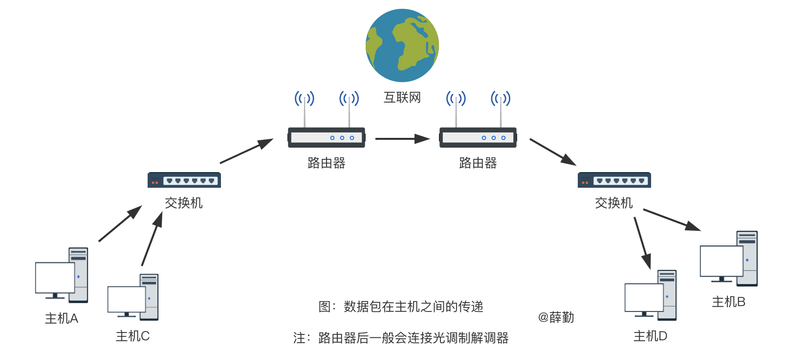

如图所示，主机A向主机B发送数据包，需要经过交换机、路由器等设备。但在物理层（OSI 模型的第 1 层），还需要调制解调器和中继器。

### 2.1 调制解调器

现代家庭网络搭建宽带时，可以看到路由器后接的调制解调器（英语：Modem），我们一般亲切称之为“猫”。

调制解调器是将计算机产生的数字信号转换为模拟信号进行传输，并解调收到的模拟信号以得到数字信号的电子设备。

以前用电话线上网用的是电话调制解调器，现在都是光纤上网，用的是光纤调制解调器，即用于数字信号与光纤信号的转换。

### 2.2 中继器

同调制解调器一样工作在物理层的还有中继器，它的作用是将电缆传过来的电信号或光信号经由中继器的波形调整和放大再传给另一个电缆，简而言之，中继器是对减弱的信号进行放大和发送的设备。

### 2.3 网卡

一台计算机要想上网必备的就是网卡，而现在大多数计算机也早已内置了网卡。

网卡，又称为网络适配器、LAN 卡，是一块被设计用来允许计算机在计算机网络上进行通讯的计算机硬件。由于其拥有 MAC 地址，因此属于 OSI 模型的第 2 层（数据链路层）。

我们所讲的计算机的 MAC 地址或主机的 MAC 地址，实际上是网卡的 MAC 地址。

如下图所示，Mac 电脑可以在「系统偏好设置 - 网络 - Wi-Fi - 高级 - 硬件」查看当前计算机的 MAC 地址。

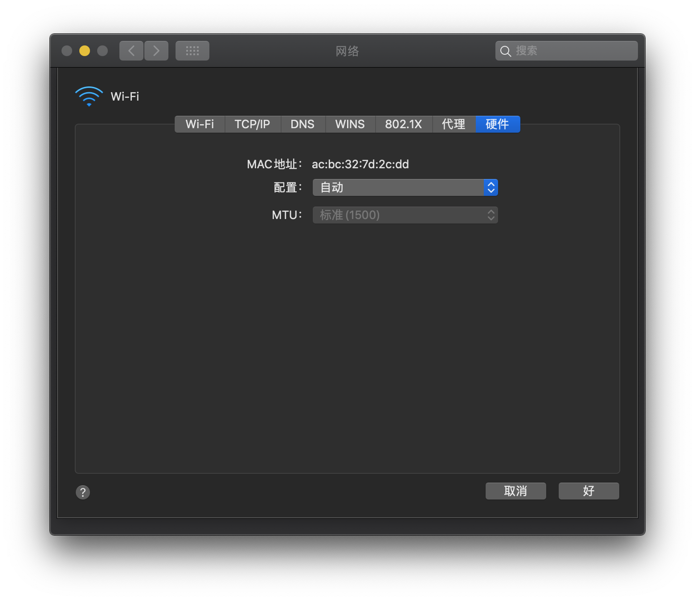

### 2.4 交换机

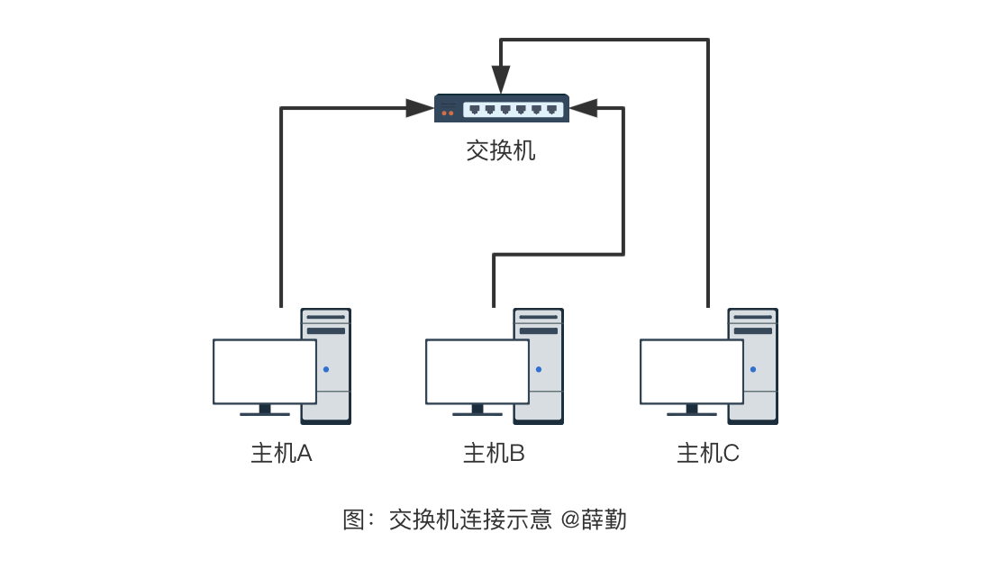

交换机是一种网络设备，通过报文交换方式接收和转发数据到目标设备。

简而言之，交换机就是接收数据包、查看数据包的目的地址以选择路由、将数据包转发给下一跳路由。

需要明确，交换机不修改数据包，只负责转发数据包。

交换机又被称为网桥或者 2 层交换机，所谓 2 层，就是工作于数据链路层。这代表着，交换机在转发数据包时，不知道也无需要知道来源主机和目的主机的 IP 地址，只需知其 MAC 地址。

#### 2.4.1 交换机的工作原理

交换机内部的 CPU 会在每个端口成功连接时，通过将 MAC 地址和端口对应，形成一张 MAC 表。

|   端口号  |  MAC地址   |
| --- | --- |
|  1   |  ac:bc:32:7d:2c:dd   |
|  2   |  ac:bc:43:8d:3c:dd   |
|  ..   |  ..   |

当一台交换机安装配置好之后，其工作过程如下：

1. 交换机端口 1 收到 MAC 地址为 X 的计算机发给 MAC 地址为 Y 的计算机的数据包，交换机从而记下了 MAC 地址 X 在端口 1 。（学习）

2. 如果目的地 MAC 地址 Y 不能在 MAC 表中找到时，交换机会把数据包转发给除端口 1 外的所有数据包。（洪泛）

3. MAC 地址 Y 的计算机收到该数据包，向 MAC 地址 X 发出确认包。交换机收到该包后，从而记录下 MAC 地址 Y 所在的网段。

4. 交换机向 MAC 地址 X 转发确认包。（转发）

5. 交换机收到一个数据包，查表后发现该数据包的来源地址与目的地址属于同一个端口，交换机将不处理该数据包。（过滤）

6. 交换机内部的 MAC 地址-端口 查询表的每条记录采用时间戳记录最后一次访问的时间。早于某个阈值（用户可配置）的记录被清除。（老化）

### 2.5 路由器

路由器可以连接不同的数据链路。例如连接两个以太网。现在，人们在家或办公室里连接互联网时所使用的宽带路由器也是路由器的一种。

路由器又被称为 3 层交换机，是在 OSI 模型的第 3 层即网络层面上连接两个网络、并对分组报文进行转发的设备。

交换机是根据物理地址（MAC地址）进行处理，参考的是 MAC 表，而路由器则是根据 IP 地址进行处理，所参考的表叫做路由控制表。

值得一提的是，一般家用路由器都自带交换机的功能。

#### 2.5.1 路由控制表

发送数据包时所使用的地址是网络层的 IP 地址。然而仅仅有 IP 地址还不足以实现将数据包发送到对端目标地址，在数据发送过程中还需要类似“指明下一个路由器或主机”的这方面信息，以便真正发往目标地址。保存这种信息的就是路由控制表。

实现 IP 通信的主机和路由器都必须持有一张这样的表。它们也正是在这个表格的基础上才得以进行数据包发送的。

该路由控制表的形成方式有两种：一种是管理员手动设置，另一种是路由器与其它路由器相互交换信息时自动刷新。前者也叫静态路由控制，而后者叫做动态路由控制。

为了让动态路由及时刷新路由表，在网络上互连的路由器之间必须设置好**路由协议**，保证正常读取路由控制信息。

#### 2.5.2 查看本机路由表

Linux 和 Mac 系统可以通过终端输入`route`或`netstat -nr`命令查看，如下图所示：

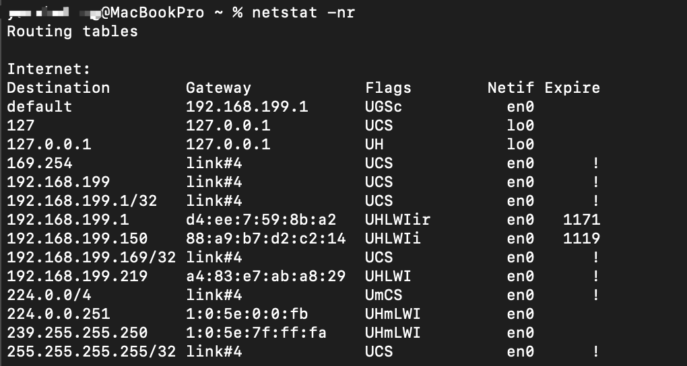

可以看到，路由控制表中记录着目的 IP 地址与下一步应该发送至路由器的地址。

在发送 IP 包时，首先要确定 IP 包首部中的目标地址，再从路由控制表中找到该地址具有相同网络地址的记录，根据该记录将 IP 包转发给相应的下一个路由器。

如果路由控制表中存在多条相同网络地址的记录，就选择一个最为吻合的网络地址。所谓最为吻合是指相同位数最多的意思。

例如 172.20.100.52 的网络地址与 172.20/16 和 172.20.100/24 两项都匹配。此时，应该选择匹配度最长的 172.20.100/24 。

默认路由是指路由表中任何一个地址都能与之匹配的记录。默认路由一般标记为 0.0.0.0/0 或 default。这里的 0.0.0.0/0 并不是指 IP 地址是 0.0.0.0，为了避免人们误以为 0.0.0.0 是IP地址，故后缀是 /0 。

## 三、协议

在访问 Web 站点和发送、接收电子邮件时，我们通常会直接输入 Web 网站的地址或电子邮件地址等那些由应用层提供的地址，而不会使用由十进制数字组成的某个 IP 地址。

但是网络层需要的是 IP 地址，这就需要一种功能--将应用中使用的地址映射为 IP 地址。

此外，在数据链路层也不需要 IP 地址，需要的是 MAC 地址传输数据包。由此可知，在实际通信中，还需要众多支持 IP 的相关技术才能够实现通信。

IP 的辅助技术包括 DNS、ARP、ICMP、ICMPv6、DHCP、NAT 等。还包括如 IP 隧道、 IP多播、IP任播、质量控制以及网络拥塞的显式通知和 Mobile IP 技术。

### 3.1 DNS
域名系统（英语：Domain Name System，缩写：DNS）是互联网的一项服务。它作为将域名和 IP 地址相互映射的一个分布式数据库，能够使人更方便地访问互联网。DNS 使用 TCP 和 UDP 端口 53 。当前，对于每一级域名长度的限制是 63 个字符，域名总长度则不能超过 253 个字符。

#### 3.1.1 DNS查询过程

以查询 zh.wikipedia.org 为例： 客户端发送查询报文 "query zh.wikipedia.org" 至DNS服务器，DNS服务器首先检查自身缓存，如果存在记录则直接返回结果。 如果记录老化或不存在，则： 

1. DNS服务器向根域名服务器发送查询报文"query zh.wikipedia.org"，根域名服务器返回顶级域 .org 的权威域名服务器地址。 

2. DNS服务器向 .org 域的权威域名服务器发送查询报文"query zh.wikipedia.org"，得到二级域 .wikipedia.org 的权威域名服务器地址。 

3. DNS服务器向 .wikipedia.org 域的权威域名服务器发送查询报文"query zh.wikipedia.org"，得到主机 zh 的A记录，存入自身缓存并返回给客户端。

#### 3.1.2 查看修改DNS

如下图所示，Mac 电脑可以在「系统偏好设置 - 网络 - Wi-Fi - 高级 - DNS」查看当前网络所使用的 DNS。

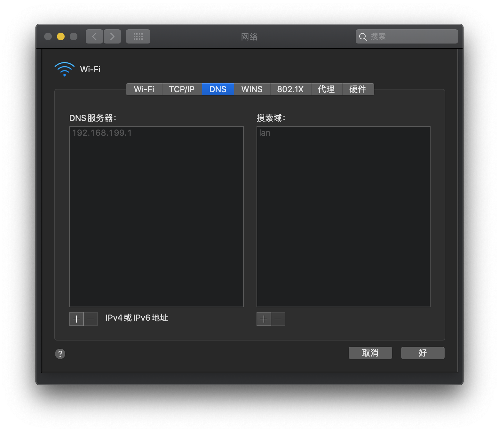

为什么我们从来不需要设置 DNS 服务器呢？这是因为现代路由器大多具备 DHCP 服务器的功能，DHCP 服务器自动为我们提供默认的 DNS 服务器地址。

路由器会将连接到自身所有设备的 DNS 服务器地址设置为路由器自带的 DNS 服务器地址。连接该路由器的手机、电脑等网络设备的 DNS 请求，统一发送至路由器 DNS 服务器，此时路由器扮演各设备的 DNS 服务器。然后，路由器转发 DNS 请求，到实际的 DNS 服务器。实际的 DNS 服务器解析域名 IP，返回给路由器。最后，路由器再把 IP 返回给终端设备。

发送 DNS 请求到 DNS 服务器获取网站真实的 IP 地址，这个过程需要一定的时间，影响这个时间的因素之一就是 DNS 服务器的地理位置。DNS 服务器离你越近，传输数据自然更快。因此默认情况下，路由器将从网络提供商提供获取最近的 DNS 服务器地址，实现最快的网络响应。

网上有一些说法是，通过修改 DNS 服务器地址可以提高你的网速，这是有一定根据的，但却不一定是有效的。

### 3.2 ARP
只要确定了 IP 地址，就可以向这个目标地址发送 IP 数据报。然而，在底层数据链路层，进行实际通信却有必要了解每个 IP 地址所对应的 MAC 地址。

于是需要一种方法，根据目的主机的 IP 地址，获得其 MAC 地址。这就是 ARP 协议要做的事情。所谓地址解析（address resolution）就是主机在发送帧前将目标 IP 地址转换成目标 MAC 地址的过程。

另外，当发送主机和目的主机不在同一个局域网中时，即便知道对方的 MAC 地址，两者也不能直接通信，必须经过路由转发才可以。所以此时，发送主机通过 ARP 协议获得的将不是目的主机的真实 MAC 地址，而是一台可以通往局域网外的路由器的 MAC 地址。于是此后发送主机发往目的主机的所有帧，都将发往该路由器，通过它向外发送。这种情况称为委托 ARP 或 ARP代理（ARP Proxy）。

#### 3.2.1 ARP工作原理

ARP 是如何知道 MAC 地址的呢？简单来说，ARP 是借助 ARP 请求与 ARP 响应两种类型的包确定 MAC 地址的。

在每台安装有 TCP/IP 协议的电脑或路由器里都有一个 ARP 缓存表，表里的 IP 地址与 MAC 地址是一对应的，如下表所示。

|主机名称|IP地址|MAC地址|
|---|---|---|
|A|192.168.38.10|00-AA-00-62-D2-02|
|B|192.168.38.11|00-BB-00-62-C2-02|
|C|192.168.38.12|00-CC-00-62-C2-02|
|D|192.168.38.13|00-DD-00-62-C2-02|
|E|192.168.38.14|00-EE-00-62-C2-02|
|...|...|...|

以主机A（192.168.38.10）向主机B（192.168.38.11）发送数据为例。

1. 当发送数据时，主机A会在自己的 ARP 缓存表中寻找是否有目标 IP 地址。如果找到就知道目标 MAC 地址为（00-BB-00-62-C2-02），直接把目标 MAC 地址写入帧里面发送就可。

2. 如果在 ARP 缓存表中没有找到相对应的 IP 地址，主机A就会在网络上发送一个广播（ARP request），目标 MAC 地址是“FF.FF.FF.FF.FF.FF”，这表示向同一网段内的所有主机发出这样的询问：“192.168.38.11的 MAC 地址是什么？”

3. 网络上其他主机并不响应 ARP 询问，只有主机B接收到这个帧时，才向主机A做出这样的回应（ARP response）：“192.168.38.11的 MAC 地址是00-BB-00-62-C2-02”，此回应以单播方式。这样，主机A就知道主机B的 MAC 地址，它就可以向主机B发送信息。同时它还更新自己的 ARP 高速缓存（ARP cache），下次再向主机B发送信息时，直接从 ARP 缓存表里查找就可。

需要注意，上述示例中的主机 A 和主机 B 属于同一网段。如果主机 A 和主机 B 不属于同一网段，那么主机 A 发送的广播（ARP request）主机 B 就不可能收到。

所以，在发送广播（ARP request）前，主机 A 会判断主机 B 是否属于同一网段（参考下文判断是否在同一网段），如果不属于，就会在自己的 ARP 缓存表中寻找网关（也就是路由器）的 MAC 地址。如果没有找到，主机 A 就会在网络上发送一个广播（ARP request）询问网关（路由器）的 MAC 地址。

ARP 缓存表采用老化机制，在一段时间内如果表中的某一行没有使用，就会被删除，这样可减少缓存表的长度，加快查询速度。

#### 3.2.2 查看本机ARP

如何查看本机 ARP 缓存表呢？

- Windows：开始 → 运行 → cmd → `arp -a`（参数a表示显示所有内容）

- Linux：终端 → `arp -nv`

- MacOS：终端 → `arp -nla`

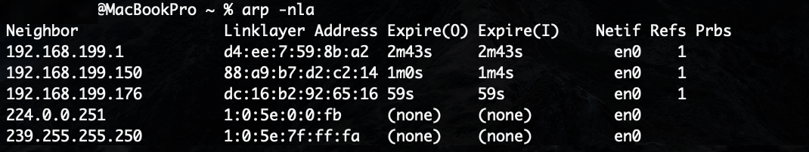

### 3.3 DHCP

如果逐一为每一台主机设置 IP 地址会是非常繁琐的事情。于是，为了实现自动设置 IP 地址、统一管理 IP 地址分配，就产生了 DHCP 协议。

如下图所示，Mac 电脑可以在「系统偏好设置 - 网络 - Wi-Fi - 高级 - TCP/IP」查看当前本地 IP 配置。

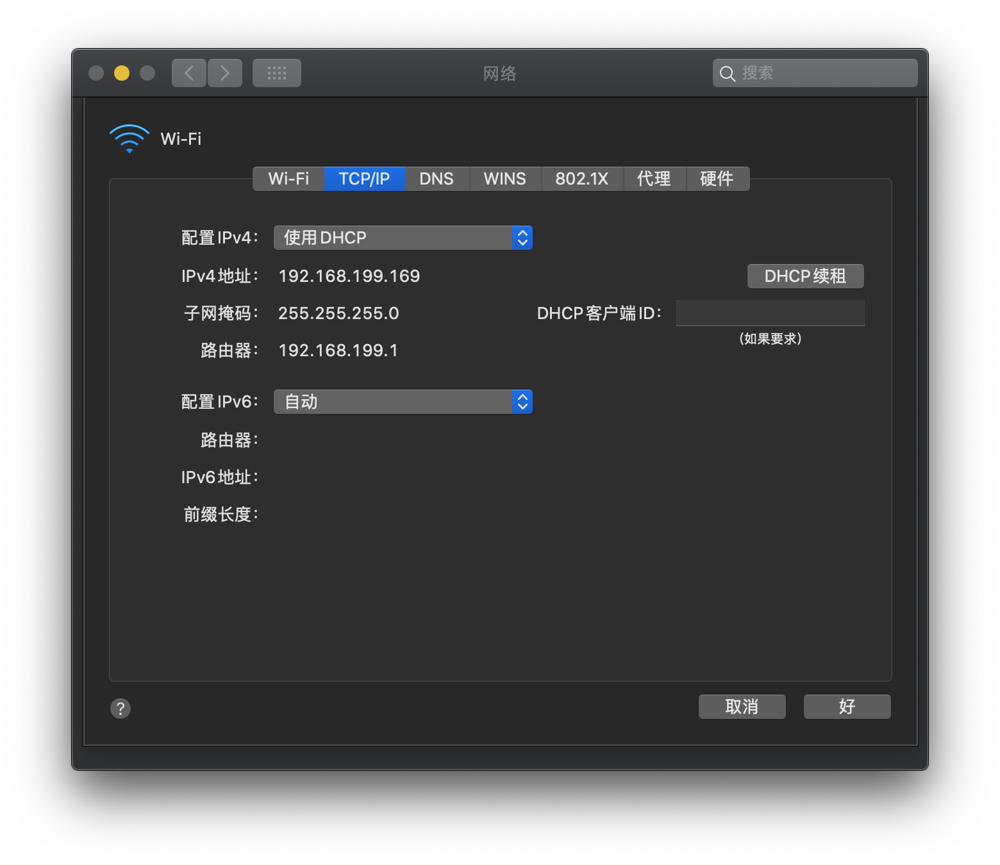

DHCP 服务器会统一管理每个子网的 IP 地址分配范围、子网掩码、默认路由以及 DNS 服务器。

有了 DHCP ，计算机只要连接到网络，就可以进行 TCP/IP 通信。也就是说，DHCP 让即插即用变得可能。而 DHCP 不仅在 IPv4 中，在 IPv6 中也可以使用。

#### 3.3.1 DHCP 的工作机制

在使用 DHCP 之前，首先要架设一台 DHCP 服务器（很多时候用该网段的路由器充当 DHCP 服务器。）。然后将 DHCP 所要分配的 IP 地址设置到服务器上。此外，还需要将相应的子网掩码、路由控制信息以及 DNS 服务器的地址等设置到服务器上。

DHCP 服务器搭建好之后，DHCP 的运行分为四个基本过程，分别为请求 IP 租约、提供 IP 租约、选择 IP 租约和确认 IP 租约。所谓租约，也就是计算机 IP 地址的有效期。

由此，DHCP 的网络设置结束，可以进行 TCP/IP 通信。不需要 IP 地址时，可以发送 DHCP 解除包。

另外，DHCP客户端在 IP 租约到期前可以发送 DHCP 请求包通知想要延长这个时限。

### 3.4 NAT

告诉大家一个有趣的实验，拿起你的手机和电脑，连接同一 Wi-Fi ，然后访问百度，输入“IP”，你会惊奇的看到手机和电脑显示的 IP 地址是相同的，而且并非是本机 IP 地址。

那么问题来了，在数据包的发送过程中，是根据网络层的来源 IP 地址和目的 IP 地址进行定位。同一局域网的来源 IP 地址根据上面实验的结果显然都是相同的公网 IP ，那么百度响应过来的数据包是如何精确发送到我们的本地计算机呢？答案是使用 NAT 技术。

NAT（Network Address Translator）是用于在本地网络中使用私有地址，在连接互联网时转而使用全局 IP 地址。除转换 IP 地址外，还出现了可以转换 TCP、UDP 端口号的 NART（Network Address Ports Translator）技术，由此可以实现用一个 IP 地址与多个主机的通信。现在我们所说的 NAT 多半都是 NAPT，或者称之为 IP 伪装。

NAT（NAPT）实际上是为了正在面临地址枯竭的 IPv4 而开发的技术，不过，IPv6 为了提高网络安全也正在使用 NAT，在 IPv4 和 IPv6 之间的相互通信当中常常使用 NAT-PT。

#### 3.4.1 NAT的工作机制
如下图所示，以 10.0.0.10 的主机与 163.221.120.9 的主机进行通信为例。利用 NAT ，途中的 NAT 路由器将发送源地址从 10.0.0.10 转换为全局的 IP 地址（202.244.174.37）再发送数据。反之，当包从地址163.221.120.9 发过来时，目标地址（202.244.174.37）先被转换成私有 IP 地址 10.0.0.10 以后再被转发。

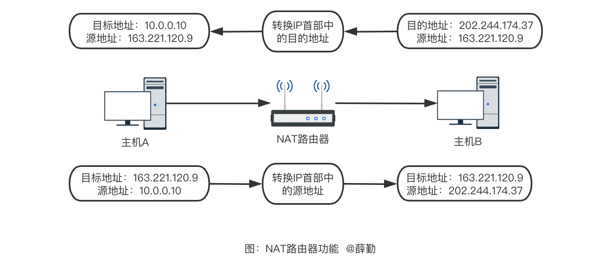

> NAT 对数据包的  IP 首部进行改动，由于在 TCP 或 UDP 中，IP 地址还用于校验和的计算，因此 IP 发生变化时，也需要相应地将 TCP、UDP 的首部进行转换。

在 NAT（NAPT）路由器的内部，有一张自动生成的用来转换地址的表。当 10.0.0.10 向 163.221.120.9 发送第一个包时生成这张表，并按照表中的映射关系进行处理。

当私有网络内的多台机器同时都要与外部进行通信时，仅仅转换 IP 地址，人们不免担心全局 IP 地址是否不够用。这时采用如下图所示的包含端口号一起转换的方式（NAPT）可以解决这个问题。

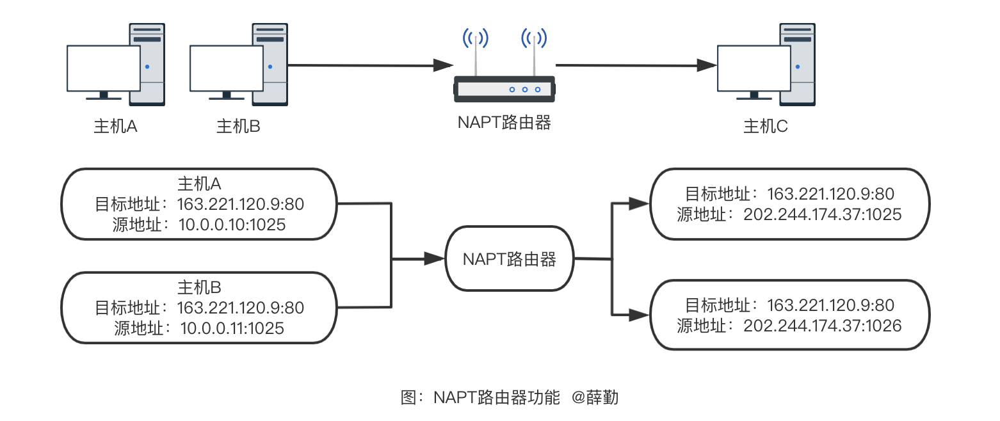

如图所示，主机 163.221.120.9 的端口号是 80，局域网有两个客户端 10.0.0.10 和 10.0.0.11 同时进行通信，并且这两个客户端的本地端口都是 1025。此时，仅仅转换 IP 地址为某个全局地址 202.244.174.37，会令转换后的所有数字完全一致。为此，只要将 10.0.0.11 的端口号转换为 1026 就可以解决问题。

将上图椭圆形内容进行合并，生成一个 NAPT 路由器的转换表，就可以正确地转换地址跟端口的组合，令客户端 A、B 能同时与服务器之间进行通信。

这种转换表在 NAT 路由器上自动生成。例如，在 TCP 的情况下，建立 TCP 连接首次握手时的 SYN 包一经发出，就会生成这个表。而后又随着收到关闭连接时发出 FIN 包的确认应答从表中被删除。

在使用 TCP 或 UDP 的通信当中，只有目标地址、源地址、目标端口、源端口以及协议类型（TCP 还是 UDP）五项内容都一致时才被认为是同一个通信连接。也就是复用转换表的同一行记录。

### 3.5 ICMP

架构 IP 网络时需要特别注意两点：确认网络是否正常工作，以及遇到异常时进行问题诊断。

例如，一个刚刚搭建好的网络，需要验证该网络的设置是否正确。ICMP 正是提供这类功能的一种协议。

ICMP 的主要功能包括，确认 IP 包是否成功送达目标地址，通知在发送过程当中 IP 包被废弃的具体原因，改善网络设置等。有了这些功能以后，就可以获得网络是否正常、设置是否有误以及设备有何异常等信息，从而便于进行网络上的问题诊断。

在 IP 通信中如果某个 IP 包因为某种原因未能达到目标地址，那么这个具体的原因将由 ICMP 负责通知。例如，主机 A 向主机 B 发送了数据包，由于某种原因，途中的路由器未能发现主机 B 的存在，这时，路由器就会向主机 A 发送一个 ICMP 包，说明发往主机 B 的包未能成功。

ICMP 的消息大致可以分为两类：一类是通知出错原因的错误消息，另一类是用于诊断的查询消息。

#### 3.5.1 ping

ping（呯）是使用 ICMP 协议的一种计算机网络工具，用来测试数据包能否透过 IP 协议到达特定主机。

ping 的运作原理是向目标主机传出一个 ICMP 的请求回显数据包，并等待接收回显回应数据包。程序会按时间和成功响应的次数估算丢失数据包率（丢包率）和数据包往返时间（网络时延，Round-trip delay time）。

ping 有时候也被我们说成了动词，如 “ping一下计算机XXX，看它是否开着。”

下面以 ping 百度的网址作为示例：

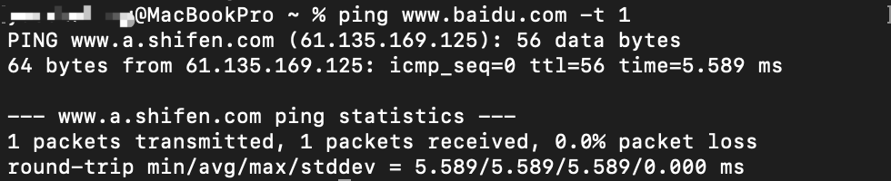

可以看到，百度的 IP 地址是 61.135.169.125，以 64 bytes 测试，反应时间 5.589 毫秒，TTL（Time To Live）值为 56。

这里不得不解释 TTL 是什么？

IP 包中有一个字段叫做 TTL （Time To Live，生存周期），它的值随着没经过一次路由器就会减 1，直到减到 0 时该 IP 包会被丢弃。此时，IP 路由器将会发送一个 ICMP 超时的消息给发送端主机，并通知该包已被丢弃。

示例中 TTL 的值为 56 ，假设发送端设置的 TTL 为 64，那么中间经历的路由数为 64 - 56 = 8。

## 四、通信

根据 OSI 七层模型，程序在发送消息时，应用层按既定的协议打包数据，随后由传输层加上双方的端口号，由网络层加上双方的 IP 地址，并指明上层协议（TCP/UDP），由链路层加上双方的 MAC 地址，并将数据拆分成数据帧，经过多个路由器和网关后，达到目标机器。简而言之，就是按“端口 -> IP 地址 -> MAC 地址”这样的路径进行数据的封装和发送，解包的时候反过来操作即可。

但是对于同一网段和不同网段主机间的通信过程是有所不同的，接一下笔者将对网络传输的基本原理进行梳理。

### 4.1 判断是否在同一网段

所谓的同网段可以简单理解为同一路由器下的主机，不同网段则是不同路由器下的主机。

但是事实上，主机 A 在与其它主机进行通信时，还需要通过对目的主机 B 的 IP 地址进行计算，进而判断是否在同一网段。具体过程为：

主机 A 通过自己的子网掩码与主机 B 的 IP 地址进行位与运算得出网络号，主机 A 也会通过子网掩码与自己的 IP 地址进行位与运算得出网络号，两者网络号相同即为同一网段，不同则为不同网段。

### 4.2 同网段不同主机通信

如下图所示，同一网段下的主机通信其实是不需要路由器进行中转的。

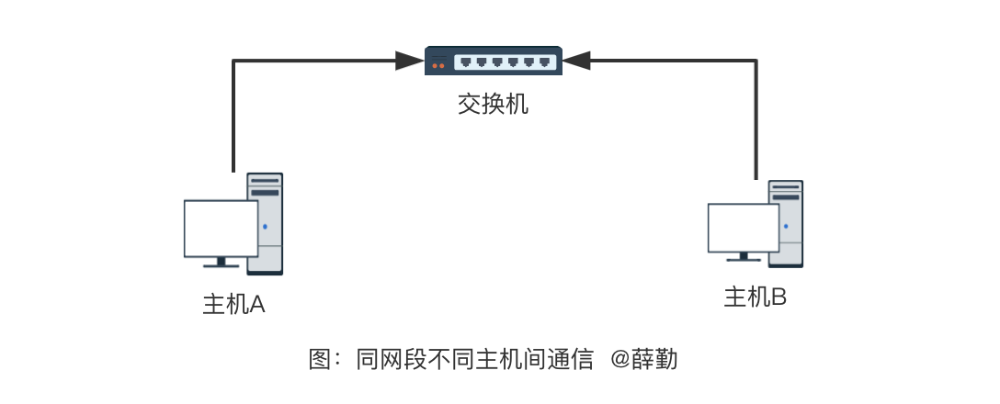

上图中，当主机 A 向主机 B 发送数据时，是在已知主机 B 的 IP 地址的前提下。程序在发送消息时，应用层、传输层、网络层都已准备就绪，但是链路层还需要下一跳的 MAC 地址。

通过判断得知主机 A 与主机 B 在同一网段，于是使用 ARP 协议获取主机 B 的 MAC 的地址，最后将数据拆分成数据帧发往主机 B ，中途经交换机进行端口转发。

### 4.3 不同网段不同主机通信

如下图所示，不同网段其实也意味着是不同路由器下的主机进行通信。

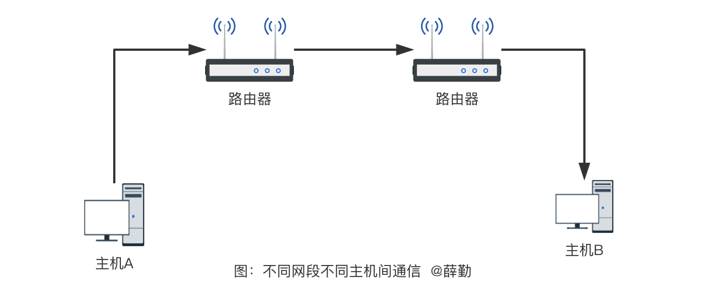

上图中，当主机 A 向主机 B 发送数据时，是在已知主机 B 的 IP 地址的前提下。程序在发送消息时，应用层、传输层、网络层都已准备就绪，但是链路层还需要下一跳的 MAC 地址。

通过判断得知主机 A 与主机 B 不在同一网段，于是主机 A 查询本机路由控制表得到网关（即路由器）的 IP 地址，有了路由器 IP 地址后，再使用 ARP 协议获取路由器的 MAC 的地址，最后将数据包拆分成数据帧发往路由器 。

路由器收到主机 A 发送的数据包，检查目的 MAC 地址是否为自身，否则丢弃。将 IP 包中目标 IP 与路由表进行匹配，如匹配路由表不成功，则丢弃，返回 ICMP 错误消息；若成功，则通过路由表找到下一跳路由器的 IP 地址，通过 ARP 协议获取下一跳路由器的 MAC 地址，将数据包的来源 MAC 地址设置为自身，目的 AMC 地址设置为下一跳路由器的 MAC 地址，最后将数据拆分成帧发往下一跳路由器。

后续路由器收到数据包后，经查路由表得知目的 IP 地址正好位于自身网段，于是便将数据包发往目的主机 B，具体过程这里不再赘述。

## 五、结束语

通过本文的学习，我们掌握了数据传输所依赖的设备与协议，但限于篇幅有限，本文并未对 TCP/IP 报文内容进行详细的阐述。希望本文能对你在探索计算机网络的世界中有所帮助！
