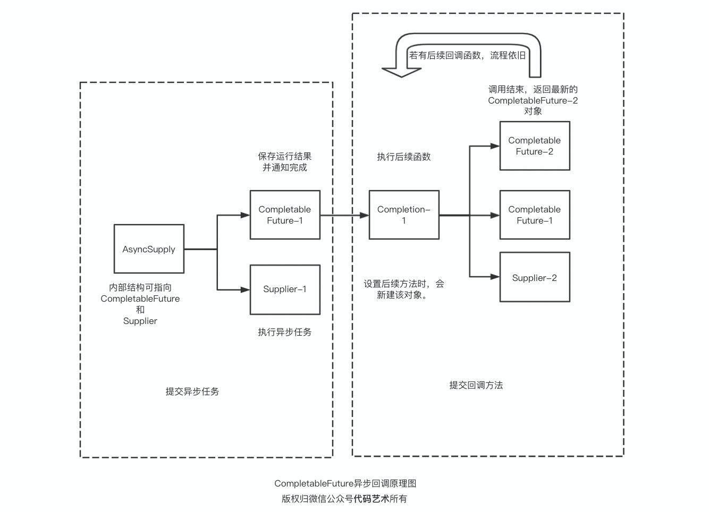

## 一、引言

一说到异步任务，很多人上来咔咔新建个线程池。为了防止线程数量肆虐，一般还会考虑使用单例模式创建线程池，具体使用方法大都如下面的代码所示：

```java
@Test
public void demo1() throws ExecutionException, InterruptedException {
    ExecutorService executorService = Executors.newFixedThreadPool(5);
    Future<Object> future1 = executorService.submit(new Callable<Object>() {
        @Override
        public Object call() throws Exception {
            return Thread.currentThread().getName();
        }
    });
    System.out.println(future1.get());
    executorService.execute(new Runnable() {
        @Override
        public void run() {
            System.out.println(Thread.currentThread().getName());
        }
    });
}
```

经常使用 JavaScript 的同学相信对于异步回调的用法相当熟悉了，毕竟 JavaScript 拥有“回调地狱”的美誉。

我们大 Java 又开启了新一轮模仿之旅。🐂🍺

java.util.concurrent 包新增了 CompletableFuture 类可以实现类似 JavaScript 的连续回调。

## 二、两种基本用法

先来看下 CompletableFuture 的两种基本用法，代码如下：

```java
@Test
public void index1() throws ExecutionException, InterruptedException {
    CompletableFuture<String> completableFuture1 = CompletableFuture.supplyAsync(() -> Thread.currentThread().getName());
    CompletableFuture<Void> completableFuture2 = CompletableFuture.runAsync(() -> Thread.currentThread().getName());
    System.out.println(completableFuture1.get());
    System.out.println(completableFuture2.get());
}
```

打印输出：

    ForkJoinPool.commonPool-worker-1
    null
初看代码，第一反应是代码简洁。直接调用 CompletableFuture 类的静态方法，提交任务方法就完事了。但是，随之而来的疑问就是，异步任务执行的背后是一套什么逻辑呢？是一对一使用`new Thread()`还是依赖线程池去执行的呢。

## 三、探索线程池原理

翻阅 CompletableFuture 类的源码，我们找到答案。关键代码如下：

```java
private static final boolean useCommonPool =
    (ForkJoinPool.getCommonPoolParallelism() > 1);

/**
 * Default executor -- ForkJoinPool.commonPool() unless it cannot
 * support parallelism.
 */
private static final Executor asyncPool = useCommonPool ?
    ForkJoinPool.commonPool() : new ThreadPerTaskExecutor();
```

可以看到 CompletableFuture 类默认使用的是 `ForkJoinPool.commonPool()` 方法返回的线程池。当然啦，前提是 ForkJoinPool 线程池的数量大于 1 。否则，则使用 CompletableFuture 类自定义的 ThreadPerTaskExecutor 线程池。

ThreadPerTaskExecutor 线程池的实现逻辑非常简单，一行代码简单实现了 Executor 接口，内部执行逻辑是一条任务对应一条线程。代码如下：

```java
/** Fallback if ForkJoinPool.commonPool() cannot support parallelism */
static final class ThreadPerTaskExecutor implements Executor {
    public void execute(Runnable r) { new Thread(r).start(); }
}
```

## 四、两种异步接口

之前我们使用线程池执行异步任务时，当不需要任务执行完毕后返回结果的，我们都是实现 Runnable 接口。而当需要实现返回值时，我们使用的则是 Callable 接口。

同理，使用 CompletableFuture 类的静态方法执行异步任务时，不需要返回结果的也是实现 Runnable 接口。而当需要实现返回值时，我们使用的则是 Supplier 接口。其实，Callable 接口和 Supplier 接口并没有什么区别。

接下来，我们来分析一下 CompletableFuture 是如何实现异步任务执行的。

### runAsync

CompletableFuture 执行无返回值任务的是 runAsync() 方法。该方法的关键执行代码如下：

```java
static CompletableFuture<Void> asyncRunStage(Executor e, Runnable f) {
    if (f == null) throw new NullPointerException();
    CompletableFuture<Void> d = new CompletableFuture<Void>();
    e.execute(new AsyncRun(d, f));
    return d;
}
```

可以看到，该方法将 Runnable 实例作为参数封装至 AsyncRun 类。实际上， AsyncRun 类是对 Runnable 接口的进一步封装。实际上，AsyncRun 类也是实现了 Runnable 接口。观察下方 AsyncRun 类的源码，可以看到 AsyncRun 类的 run() 方法中调用了 Runnable 参数的 run() 方法。

```java
public void run() {
    CompletableFuture<Void> d; Runnable f;
    if ((d = dep) != null && (f = fn) != null) {
        dep = null; fn = null;
        if (d.result == null) {
            try {
                f.run();
                d.completeNull();
            } catch (Throwable ex) {
                d.completeThrowable(ex);
            }
        }
        d.postComplete();
    }
}
```

当提交的任务执行完毕后，即`f.run()`方法执行完毕。调用`d.completeNull()`方法设置任务执行结果为空。代码如下：

```java
/** The encoding of the null value. */
static final AltResult NIL = new AltResult(null);

/** Completes with the null value, unless already completed. */
final boolean completeNull() {
    return UNSAFE.compareAndSwapObject(this, RESULT, null,
                                       NIL);
}
```

可以看到，对于任务返回值为 null 的执行结果，被封装为 `new AltResult(null)` 对象。而且，还是调用的 CAS 本地方法实现了原子操作。

为什么需要对 null 值进行单独封装呢？观察 get() 方法的源码：

```java
public T get() throws InterruptedException, ExecutionException {
    Object r;
    return reportGet((r = result) == null ? waitingGet(true) : r);
}
```

原来原因是便于使用 null 值区分异步任务是否执行完毕。

如果你对 CAS 不太了解的话，可以查阅 compareAndSwapObject 方法的四个参数的含义。该方法的参数 RESULT 是什么呢？查看代码如下：

```java
RESULT = u.objectFieldOffset(k.getDeclaredField("result"));
```

原来，RESULT 是获取 CompletableFuture 对象中 result 字段的偏移地址。这个 result 字段又是啥呢？就是任务执行完毕后的结果值。代码如下：

```java
// Either the result or boxed AltResult
volatile Object result;   
```

### supplyAsync

CompletableFuture 执行有返回值任务的是 supplyAsync() 方法。该方法的关键执行代码如下：

```java
static <U> CompletableFuture<U> asyncSupplyStage(Executor e,
                                                 Supplier<U> f) {
    if (f == null) throw new NullPointerException();
    CompletableFuture<U> d = new CompletableFuture<U>();
    e.execute(new AsyncSupply<U>(d, f));
    return d;
}
```

与 AsyncRun 类对 Runnable 接口的封装相同的是，AsyncSupply 类也是对 Runnable 接口的 run() 方法进行了一层封装。代码如下：

```java
public void run() {
    CompletableFuture<T> d; Supplier<T> f;
    if ((d = dep) != null && (f = fn) != null) {
        dep = null; fn = null;
        if (d.result == null) {
            try {
                d.completeValue(f.get());
            } catch (Throwable ex) {
                d.completeThrowable(ex);
            }
        }
        d.postComplete();
    }
}
```

当异步任务执行完毕后，返回结果会经`d.completeValue()`方法进行封装。与`d.completeNull()`方法不同的是，该方法具有一个参数。代码如下：

```java
/** Completes with a non-exceptional result, unless already completed. */
final boolean completeValue(T t) {
    return UNSAFE.compareAndSwapObject(this, RESULT, null,
                                       (t == null) ? NIL : t);
}
```

无论是类 AsyncRun 还是类 AsyncSupply ，run() 方法都会在执行结束之际调用 CompletableFuture 对象的 `postComplete()` 方法。顾名思义，该方法将通知后续回调函数的执行。

## 五、探究回调函数原理

前面我们提到了 CompletableFuture 具有连续回调的特性。举个例子：

```java
@Test
public void demo2() throws ExecutionException, InterruptedException {
    CompletableFuture<ArrayList> completableFuture = CompletableFuture.supplyAsync(() -> {
        System.out.println(Thread.currentThread().getName());
        return new ArrayList();
    })
            .whenCompleteAsync((list, throwable) -> {
                System.out.println(Thread.currentThread().getName());
                list.add(1);
            })
            .whenCompleteAsync((list, throwable) -> {
                System.out.println(Thread.currentThread().getName());
                list.add(2);
            })
            .whenCompleteAsync((list, throwable) -> {
                System.out.println(Thread.currentThread().getName());
                list.add(3);
            });
    System.out.println(completableFuture.get());
}
```

打印输出：

```
ForkJoinPool.commonPool-worker-1
ForkJoinPool.commonPool-worker-1
ForkJoinPool.commonPool-worker-1
ForkJoinPool.commonPool-worker-1
[1, 2, 3]
```

上面的测试方法中，通过 supplyAsync 方法提交异步任务，当异步任务运行结束，对结果值添加三个回调函数进一步处理。

观察打印输出，可以初步得出如下结论：

1. 异步任务与回调函数均运行在同一个线程中。
2. 回调函数的调用顺序与添加回调函数的顺序一致。

那么问题来了，CompletableFuture 内部是如何处理连续回调函数的呢？

### AsyncSupply

当我们提交异步任务时，等价于向线程池提交 AsyncSupply 对象或者 AsyncRun 对象。观察这两个类的唯一构造方法都是相同的，代码如下：

```java
AsyncSupply(CompletableFuture<T> dep, Supplier<T> fn) {
    this.dep = dep; this.fn = fn;
}
```

这就将 AsyncSupply 异步任务与返回给用户的 CompletableFuture 对象进行绑定，用于在执行结束后回填结果到 CompletableFuture 对象，以及通知后续回调函数的运行。

### Completion

回调函数均是 Completion 类的子类，抽取 Completion 类与子类的关键代码：

```java
Completion next;
CompletableFuture<V> dep;  
CompletableFuture<T> src;
Function fn;
```

Completion 类含有 next 字段，很明显是一个链表。

Completion 的子类含有两个 CompletableFuture 类型的参数，dep 是新建的、用于下一步的 CompletableFuture 对象，src 则是引用它的 CompletableFuture 对象。

当 Completion 执行完回调方法后，一般会返回 dep 对象，用于迭代遍历。

### CompletableFuture

观察源码，CompletableFuture 主要包含下面两个参数：

```java
volatile Object result;  //结果    
volatile Completion stack;  //回调方法栈
```

Completion 类型封装了回调方法，但为什么要起名为 stack （栈）呢？

**因为 CompletableFuture 借助 Completion 的链表结构实现了栈。**每当调用 CompletableFuture 对象的 whenCompleteAsync() 或其它回调方法时，都会新建一个 Completion 对象，并压到栈顶。代码如下：

```java
final boolean tryPushStack(Completion c) {
    Completion h = stack;
    lazySetNext(c, h);
    return UNSAFE.compareAndSwapObject(this, STACK, h, c);
}
```

### postComplete

回顾上面两种异步任务类的实现，当异步任务执行完毕之后，都会调用`postComplete()`方法通知回调方法的执行。代码如下：

```java
final void postComplete() {
    CompletableFuture<?> f = this; Completion h;
    while ((h = f.stack) != null ||
           (f != this && (h = (f = this).stack) != null)) {
        CompletableFuture<?> d; Completion t;
        if (f.casStack(h, t = h.next)) {
            if (t != null) {
                if (f != this) {
                    pushStack(h);
                    continue;
                }
                h.next = null;    // detach
            }
            f = (d = h.tryFire(NESTED)) == null ? this : d;
        }
    }
}
```

这段代码是本文的核心部分，大致逻辑如下：

当异步任务执行结束后，CompletableFuture 会查看自身是否含有回调方法栈，如果含有，会通过 `casStack()` 方法拿出栈顶元素 h ，此时的栈顶是原来栈的第二位元素 t。如果 t 等于 null，那么直接执行回调方法 h，并返回下一个 CompletableFuture 对象。然后一直迭代这个过程。

简化上述思路，我更想称其为通过 Completion 对象实现桥接的 CompletableFuture 链表，流程图如下：



上面的过程是属于正常情况下的，也就是一个 CompletableFuture 对象只提交一个回调方法的情况。如果我们使用同一个 CompletableFuture 对象连续调用多次回调方法，那么就会形成 Completion 栈。

你以为 Completion 栈内元素会依次调用，不会的。从代码中来看，当回调方法 t 不等于 null，有两种情况：

情况 1：如果当前迭代到的 CompletableFuture 对象是 this （也就是 CompletableFuture 链表头），会令 `h.next = null` ，因为 h.next 也就是 t 通过 CAS 的方式压到了 this 对象的 stack 栈顶。

情况 2：如果当前迭代到的 CompletableFuture 对象 f 不是 this （不是链表头）的话，会将回调函数 h 压入 this （链表头）的 stack 中。然后从链表头再次迭代遍历。这样下去，对象 f 中的回调方法栈假设为 3-2-1，从 f 的栈顶推出再压入 this 的栈顶，顺序就变为了 1-2-3。这时候，情况就变成了第 1 种。

这样，当回调方法 t = h.next  等于 null 或者 f 等于 this 时，都会对栈顶的回调方法进行调用。

简单来说，就是将拥有多个回调方法的 CompletableFuture 对象的多余的回调方法移到到 this 对象的栈内。

回调方法执行结束要么返回下一个 CompletableFuture 对象，要么返回 null 然后手动设置为 f = this，再次从头遍历。

### Async

回调函数的执行其实分为两种，区别在于带不带 Async 后缀。例如：

```java
@Test
public void demo3() throws ExecutionException, InterruptedException {
    CompletableFuture<ArrayList> completableFuture = CompletableFuture.supplyAsync(() -> {
        System.out.println(Thread.currentThread().getName());
        return new ArrayList();
    })
            .whenComplete((arrayList, throwable) -> {
                System.out.println(Thread.currentThread().getName());
                arrayList.add(1);
            }).whenCompleteAsync((arrayList, throwable) -> {
                System.out.println(Thread.currentThread().getName());
                arrayList.add(2);
            });
    System.out.println(completableFuture.get());
}
```

打印输出：

```java
ForkJoinPool.commonPool-worker-1
main
ForkJoinPool.commonPool-worker-1
[1, 2]
```

whenComplete() 和 whenCompleteAsync() 方法的区别在于是否在立即执行。源码如下：

```java
private CompletableFuture<T> uniWhenCompleteStage(
    Executor e, BiConsumer<? super T, ? super Throwable> f) {
    if (f == null) throw new NullPointerException();
    CompletableFuture<T> d = new CompletableFuture<T>();
    if (e != null || !d.uniWhenComplete(this, f, null)) {
        UniWhenComplete<T> c = new UniWhenComplete<T>(e, d, this, f);
        push(c);
        c.tryFire(SYNC);
    }
    return d;
}
```

两个方法都是调用的 uniWhenCompleteStage() ，区别在于参数 Executor e 是否为 null。从而控制是否调用 d.uniWhenComplete() 方法，该方法会判断 result 是否为 null，从而尝试是否立即执行该回调方法。若是 supplyAsync() 方法提交的异步任务耗时相对长一些，那么就不建议使用 whenComplete() 方法了。此时由 whenComplete() 和 whenCompleteAsync() 方法提交的异步任务都会由线程池执行。

### 本章小结

通过本章节的源码分析，我们明白了 Completion 之所以将自身设置为链表结构，是因为 CompletableFuture 需要借助 Completion 的链表结构实现栈。也明白了同一个 CompletableFuture 对象如果多次调用回调方法时执行顺序会与调用的顺序不符合。换言之，一个 CompletableFuture 对象只调用一个回调方法才是 CompletableFuture 设计的初衷，我们在编程中也可以利用这一特性来保证回调方法的调用顺序。

因篇幅有限，本文并没有分析更多的 CompletableFuture 源码，感兴趣的小伙伴可以自行查看。

## 六、用法集锦

### 异常处理

方法：

```java
public CompletableFuture<T>     exceptionally(Function<Throwable,? extends T> fn)
```

示例：

```java
@Test
public void index2() throws ExecutionException, InterruptedException {
    CompletableFuture<Integer> completableFuture = CompletableFuture.supplyAsync(() -> 2 / 0)
            .exceptionally((e) -> {
                System.out.println(e.getMessage());
                return 0;
            });
    System.out.println(completableFuture.get());
}
```

输出：

    java.lang.ArithmeticException: / by zero
    0
### 任务完成后对结果的处理

方法：

```java
public CompletableFuture<T>   whenComplete(BiConsumer<? super T,? super Throwable> action)
public CompletableFuture<T>  whenCompleteAsync(BiConsumer<? super T,? super Throwable> action)
public CompletableFuture<T>  whenCompleteAsync(BiConsumer<? super T,? super Throwable> action, Executor executor)
```

示例：

```java
@Test
public void index3() throws ExecutionException, InterruptedException {
    CompletableFuture<HashMap> completableFuture = CompletableFuture.supplyAsync(() -> new HashMap())
            .whenComplete((map, throwable) -> {
                map.put("key1", "value1");
            });
    System.out.println(completableFuture.get());
}
```

输出：

```
{key=value}
```

### 任务完成后对结果的转换

方法：

```java
public <U> CompletableFuture<U>   thenApply(Function<? super T,? extends U> fn)
public <U> CompletableFuture<U>  thenApplyAsync(Function<? super T,? extends U> fn)
public <U> CompletableFuture<U>  thenApplyAsync(Function<? super T,? extends U> fn, Executor executor)
```

示例：

```java
@Test
public void index4() throws ExecutionException, InterruptedException {
    CompletableFuture<Integer> completableFuture = CompletableFuture.supplyAsync(() -> 2)
            .thenApply((r) -> r + 1);
    System.out.println(completableFuture.get());
}
```

输出：

```
3
```

### 任务完成后对结果的消费

方法：

```java
public CompletableFuture<Void>    thenAccept(Consumer<? super T> action)
public CompletableFuture<Void>   thenAcceptAsync(Consumer<? super T> action)
public CompletableFuture<Void>   thenAcceptAsync(Consumer<? super T> action, Executor executor)
```

示例：

```java
@Test
public void index5() throws ExecutionException, InterruptedException {
    CompletableFuture<Void> completableFuture = CompletableFuture.supplyAsync(() -> 2)
            .thenAccept(System.out::println);
    System.out.println(completableFuture.get());
}
```

输出：

    2
    null
### 任务的组合（需等待上一个任务完成）

方法：

```java
public <U> CompletableFuture<U>   thenCompose(Function<? super T,? extends CompletionStage<U>> fn)
public <U> CompletableFuture<U>  thenComposeAsync(Function<? super T,? extends CompletionStage<U>> fn)
public <U> CompletableFuture<U>  thenComposeAsync(Function<? super T,? extends CompletionStage<U>> fn, Executor executor)
```
示例：
```java
@Test
public void index6() throws ExecutionException, InterruptedException {
    CompletableFuture<Integer> completableFuture = CompletableFuture.supplyAsync(() -> 2)
            .thenCompose(integer -> CompletableFuture.supplyAsync(() -> integer + 1));
    System.out.println(completableFuture.get());
}
```

输出：

```
3
```

### 任务的组合（不需等待上一步完成）

方法：

```java
public <U,V> CompletableFuture<V> 	thenCombine(CompletionStage<? extends U> other, BiFunction<? super T,? super U,? extends V> fn)
public <U,V> CompletableFuture<V> 	thenCombineAsync(CompletionStage<? extends U> other, BiFunction<? super T,? super U,? extends V> fn)
public <U,V> CompletableFuture<V> 	thenCombineAsync(CompletionStage<? extends U> other, BiFunction<? super T,? super U,? extends V> fn, Executor executor)
```

示例：

```java
@Test
public void index7() throws ExecutionException, InterruptedException {
    CompletableFuture<Integer> completableFuture = CompletableFuture.supplyAsync(() -> 2)
            .thenCombine(CompletableFuture.supplyAsync(() -> 1), (x, y) -> x + y);
    System.out.println(completableFuture.get());
}
```

输出：

```
3
```

### 消费最先执行完毕的其中一个任务，不返回结果

方法：

```java
public CompletableFuture<Void> 	acceptEither(CompletionStage<? extends T> other, Consumer<? super T> action)
public CompletableFuture<Void> 	acceptEitherAsync(CompletionStage<? extends T> other, Consumer<? super T> action)
public CompletableFuture<Void> 	acceptEitherAsync(CompletionStage<? extends T> other, Consumer<? super T> action, Executor executor)
```

示例：

```java
@Test
public void index8() throws ExecutionException, InterruptedException {
    CompletableFuture<Void> completableFuture = CompletableFuture.supplyAsync(() -> {
        try {
            Thread.sleep(100);
        } catch (InterruptedException e) {
            e.printStackTrace();
        }
        return 2;
    })
            .acceptEither(CompletableFuture.supplyAsync(() -> 1), System.out::println);
    System.out.println(completableFuture.get());
}
```

输出：

```
1
null
```

### 消费最先执行完毕的其中一个任务，并返回结果

方法：

```java
public <U> CompletableFuture<U> 	applyToEither(CompletionStage<? extends T> other, Function<? super T,U> fn)
public <U> CompletableFuture<U> 	applyToEitherAsync(CompletionStage<? extends T> other, Function<? super T,U> fn)
public <U> CompletableFuture<U> 	applyToEitherAsync(CompletionStage<? extends T> other, Function<? super T,U> fn, Executor executor)
```

示例：

```java
@Test
public void index9() throws ExecutionException, InterruptedException {
    CompletableFuture<Integer> completableFuture = CompletableFuture.supplyAsync(() -> {
        try {
            Thread.sleep(100);
        } catch (InterruptedException e) {
            e.printStackTrace();
        }
        return 2;
    })
            .applyToEither(CompletableFuture.supplyAsync(() -> 1), x -> x + 10);
    System.out.println(completableFuture.get());
}
```

输出：

```
11
```

### 等待所有任务完成

方法：

```java
public static CompletableFuture<Void> allOf(CompletableFuture<?>... cfs)
```
示例：
```java
@Test
public void index10() throws ExecutionException, InterruptedException {
    CompletableFuture<Integer> completableFuture1 = CompletableFuture.supplyAsync(() -> {
        try {
            Thread.sleep(2000);
        } catch (InterruptedException e) {
            e.printStackTrace();
        }
        return 1;
    });
    CompletableFuture<Integer> completableFuture2 = CompletableFuture.supplyAsync(() -> 2);
    CompletableFuture<Void> completableFuture = CompletableFuture.allOf(completableFuture1, completableFuture2);
    System.out.println("waiting all task finish..");
    System.out.println(completableFuture.get());
    System.out.println("all task finish");
}
```

输出：

```
waiting all task finish..
null
all task finish
```

### 返回最先完成的任务结果

方法：

```java
public static CompletableFuture<Object> anyOf(CompletableFuture<?>... cfs)
```

示例：

```java
@Test
public void index11() throws ExecutionException, InterruptedException {
    CompletableFuture<Integer> completableFuture1 = CompletableFuture.supplyAsync(() -> {
        try {
            Thread.sleep(100);
        } catch (InterruptedException e) {
            e.printStackTrace();
        }
        return 1;
    });
    CompletableFuture<Integer> completableFuture2 = CompletableFuture.supplyAsync(() -> 2);
    CompletableFuture<Object> completableFuture = CompletableFuture.anyOf(completableFuture1, completableFuture2);
    System.out.println(completableFuture.get());
}
```

输出：

```
2
```

