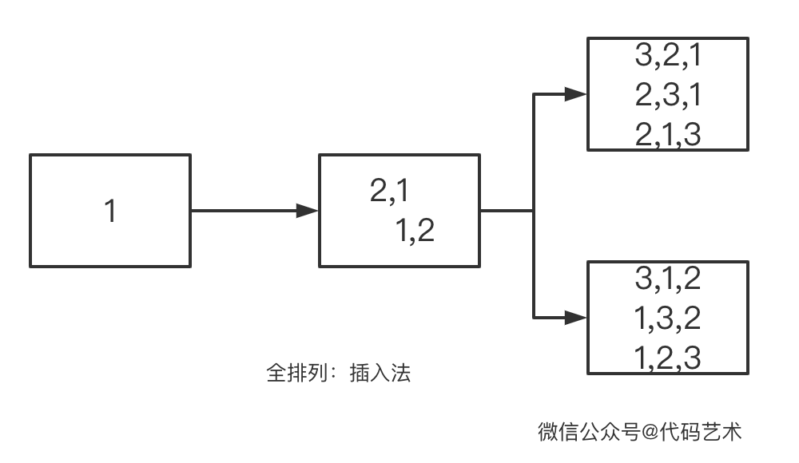
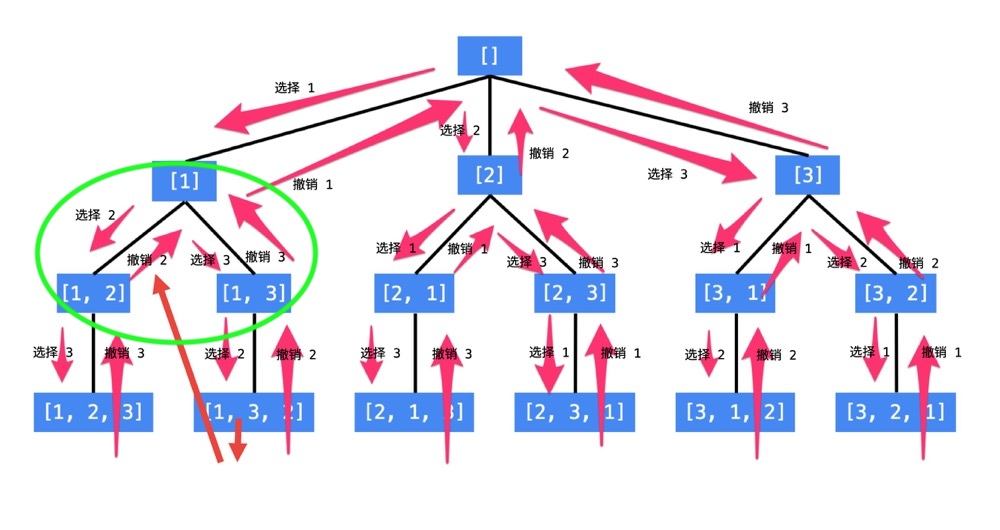
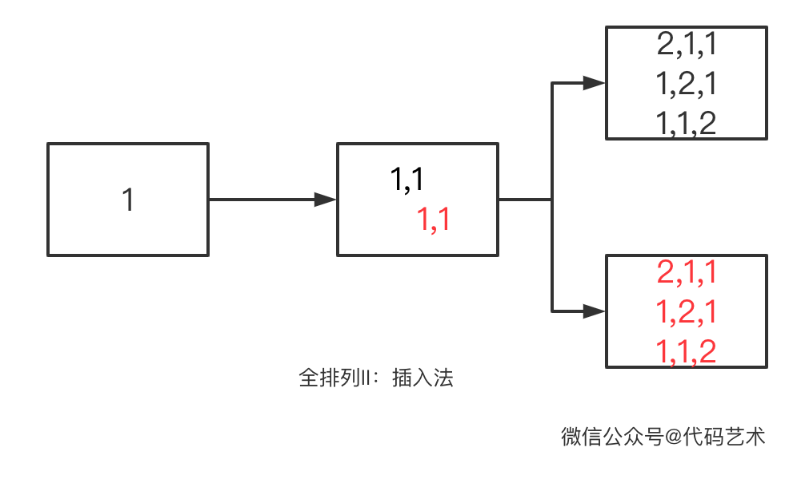
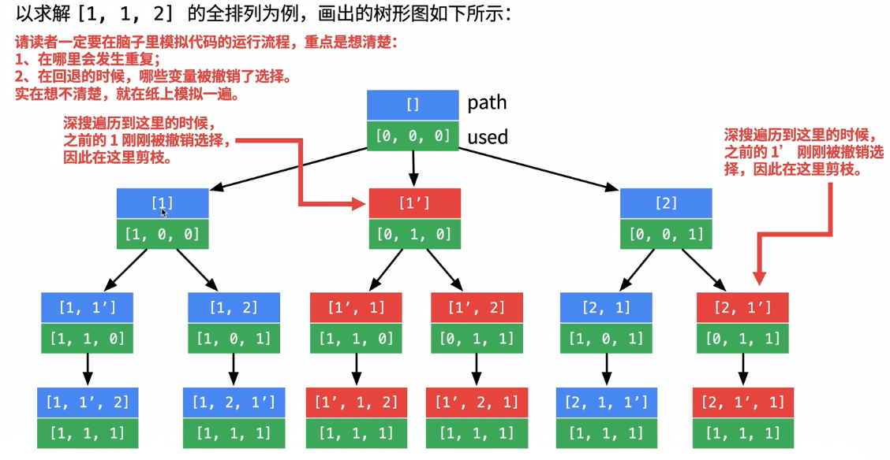

## 题目一

给定一个 **没有重复** 数字的序列，返回其所有可能的全排列。

示例:

```
输入: [1,2,3]
输出:
[
  [1,2,3],
  [1,3,2],
  [2,1,3],
  [2,3,1],
  [3,1,2],
  [3,2,1]
]
```

### 解法一：插入法



解题思路：

1. 待排列数字为 [1, 2, 3]，先排列数字 1 ，结果是 [1]。
2. 再排列数字 2 ，插入到上一个排列中，插到 1 前面得到[2,1]，插到 1 后面得到 [1,2]。
3. 再排列数字 3 ，现在的集合中包含两个排列了 [2, 1] 和 [1, 2] 。于是遍历集合，先插入到第一个排列 [2,1] 中，插入过程中原排列的顺序不变。从前往后插入，得到 [3, 2, 1], [2, 3, 1], [2, 1, 3]。继续遍历插入到下一个排列 [1, 2]。

代码如下：

```java
public List<List<Integer>> permute(int[] nums) {
    if (nums == null || nums.length == 0) {
        return null;
    }
    List<List<Integer>> lists = new ArrayList<>();
    List<List<Integer>> tempLists = new ArrayList<>();
    // 从前向后逐个插入到之前的排列中
    for (int i = 0; i < nums.length; i++) {
        // 待插入数字
        int num = nums[i];
        // 无处可插
        if (i == 0) {
            lists.add(Arrays.asList(num));
            continue;
        }
        // 遍历每一条数字排列
        int listSize = lists.size();
        for (int j = 0; j < listSize; j++) {
            // 插它
            List<Integer> list = lists.get(j);
            for (int k = 0; k <= list.size(); k++) {
                // 插完后新的排列放到缓存里
                ArrayList<Integer> tempList = new ArrayList<>(list);
                tempList.add(k, num);
                tempLists.add(tempList);
            }
            // 排列全部遍历完毕，清空，更新
            if (j + 1 == listSize) {
                lists.clear();
                lists.addAll(tempLists);
                tempLists.clear();
            }
        }
    }
    return lists;
}
```

### 解法二：回溯法

在数据结构与算法中，对大部分人来说，最难的就是递归和动态规划了。这两个都是概念容易理解但是却不是那么容易去实现。

**做题之前还是先画画图，找找规律。**



以绿色圈出部分为例，我们需要循环所有待排列数字，来选择下一个合适的数字：

1. 遍历到数字 1 ，因为当前节点 [1] 包含数字 1 ，所以跳过。
2. 遍历到数字 2 ，组成新节点 [1,2]。开始递归新节点。递归结束，撤销数字 2 回到节点 1 。
3. 遍历到数字 3，组成新节点 [1,3]。开始递归新节点。递归结束，撤销数字 3 回到节点 1 。

从图中最底层，可以看到递归的终止条件就是已排列数字的个数与递归深度相同（从 0 开始） 。

代码如下：

```java
public List<List<Integer>> permute(int[] nums) {
    if (nums == null || nums.length == 0) {
        return null;
    }
    List<List<Integer>> res = new ArrayList<>();
    Deque<Integer> path = new ArrayDeque<>();
    boolean[] used = new boolean[nums.length];
    dfs(nums, nums.length, 0, path, used, res);
    return res;
}

/**
 * @param deep 递归到第几层
 * @param path 已经选了哪些数字
 * @param used 布尔数组
 */
private void dfs(int[] nums, int len, int deep, Deque<Integer> path, boolean[] used, List<List<Integer>> res) {
    if (deep == len) {
        res.add(new ArrayList<>(path));
        return;
    }
    for (int i = 0; i < len; i++) {
        if (used[i]) {
            continue;
        }
        path.addLast(nums[i]);
        used[i] = true;
        dfs(nums, len, deep + 1, path, used, res);
        path.removeLast();
        used[i] = false;
    }
}
```

## 题目二

给定一个可包含重复数字的序列，返回所有不重复的全排列。

示例:

```
输入: [1,1,2]
输出:
[
  [1,1,2],
  [1,2,1],
  [2,1,1]
]
```

### 解法一：插入法



解题思路：

图中红色标记的全是重复的排列，可以将 List 缓存换成 Map 缓存，达到去重的目的。

代码如下：

```java
public List<List<Integer>> permuteUnique(int[] nums) {
    if (nums == null || nums.length == 0) {
        return null;
    }
    List<List<Integer>> lists = new ArrayList<>();
    Map<String, List<Integer>> tempMap = new HashMap<>();
    // 从前向后逐个插入到之前的排列中
    for (int i = 0; i < nums.length; i++) {
        // 待插入数字
        int num = nums[i];
        // 无处可插
        if (i == 0) {
            lists.add(Arrays.asList(num));
            continue;
        }
        // 遍历每一条数字排列
        int listSize = lists.size();
        for (int j = 0; j < listSize; j++) {
            // 插它
            List<Integer> list = lists.get(j);
            for (int k = 0; k <= list.size(); k++) {
                // 插完后新的排列放到缓存里
                ArrayList<Integer> tempList = new ArrayList<>(list);
                tempList.add(k, num);
                tempMap.put(tempList.toString(), tempList);
            }
            // 排列全部遍历完毕，清空，更新
            if (j + 1 == listSize) {
                lists.clear();
                lists.addAll(tempMap.values());
                tempMap.clear();
            }
        }
    }
    return lists;
}
```

### 解法二：回溯法



解题思路：

**上一步撤销的数字和这一步选择的数字相同的话，就会产生重复。**

但是，这句话有个前提，那就是待排列数字是已经排序好的，例如 [1, 1, 2]。如果是 [1, 2, 1] 的话，在树的根节点撤销数字 1，选择数字 2 ；再撤销数字 2 ，选择数字 1。这样，上述解题思路就无法适用了。

代码如下：

```java
public List<List<Integer>> permuteUnique(int[] nums) {
    if (nums == null || nums.length == 0) {
        return null;
    }
    // 排序
    Arrays.sort(nums);
    List<List<Integer>> res = new ArrayList<>();
    Deque<Integer> path = new ArrayDeque<>();
    boolean[] used = new boolean[nums.length];
    dfs(nums, nums.length, 0, path, used, res);
    return res;
}

private void dfs(int[] nums, int len, int deep, Deque<Integer> path, boolean[] used, List<List<Integer>> res) {
    if (deep == len) {
        res.add(new ArrayList<>(path));
        return;
    }
    Stack<Integer> stack = new Stack<>();
    for (int i = 0; i < len; i++) {
        if (used[i]) {
            continue;
        }
        // i>0 为了防止 i-1<0
        // used[i-1]=false 确保上一步是撤销，而不是递归
        if (i > 0 && nums[i] == nums[i - 1] && !used[i - 1]) {
            continue;
        }
        path.addLast(nums[i]);
        used[i] = true;
        dfs(nums, len, deep + 1, path, used, res);
        path.removeLast();
        used[i] = false;
    }
}
```

