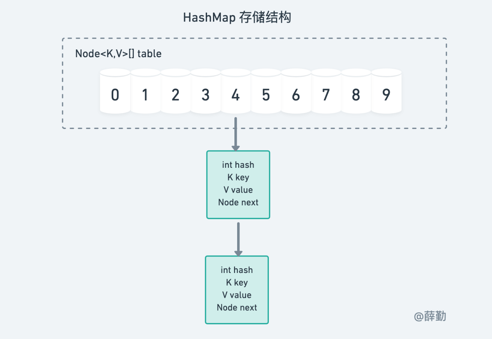
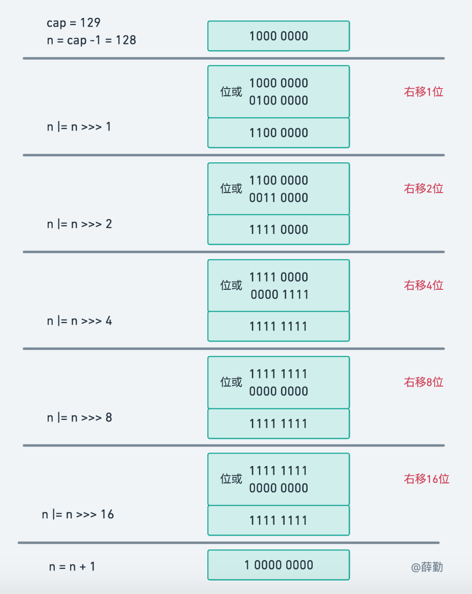
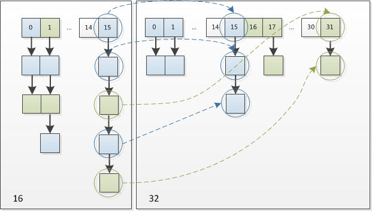
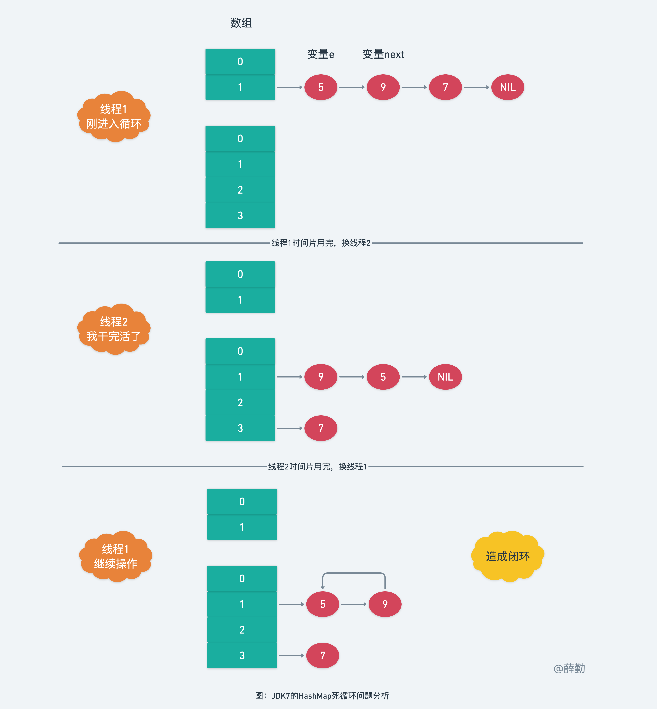
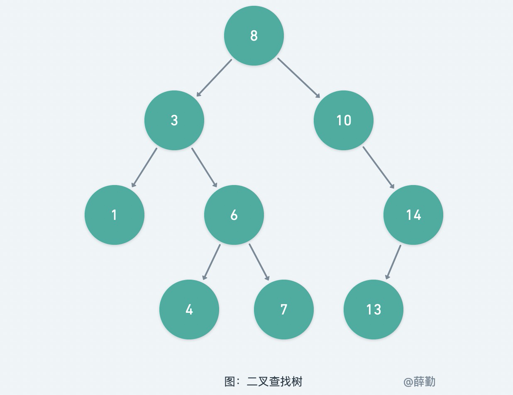
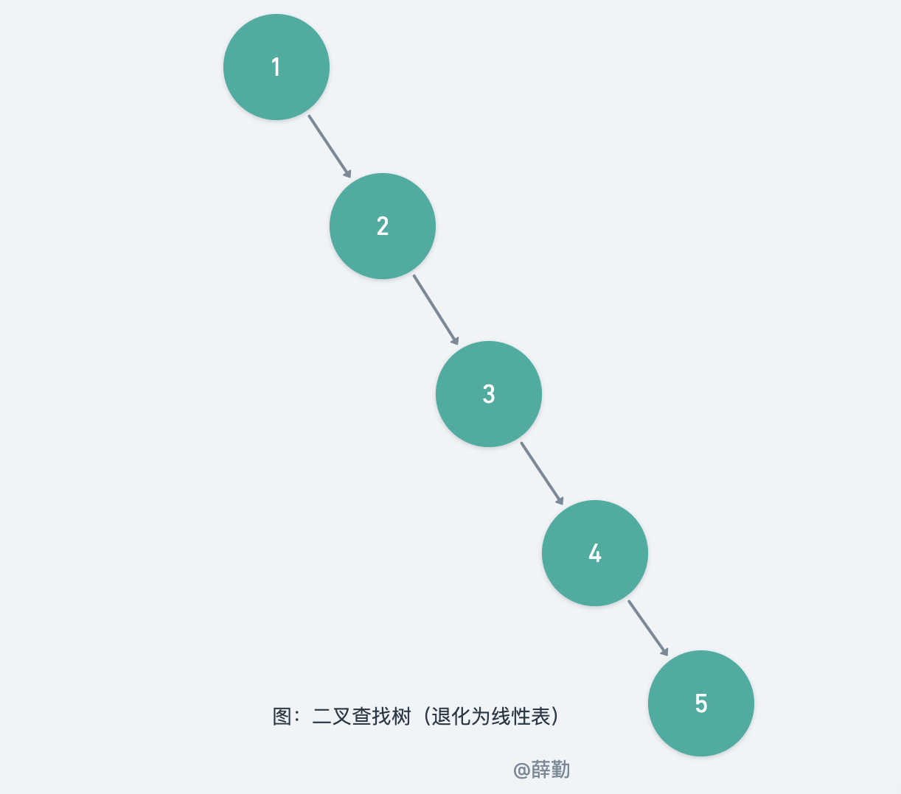
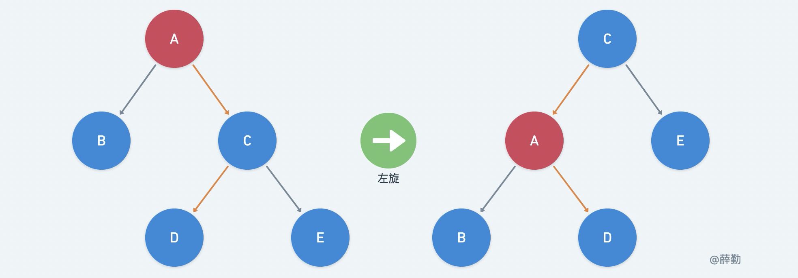
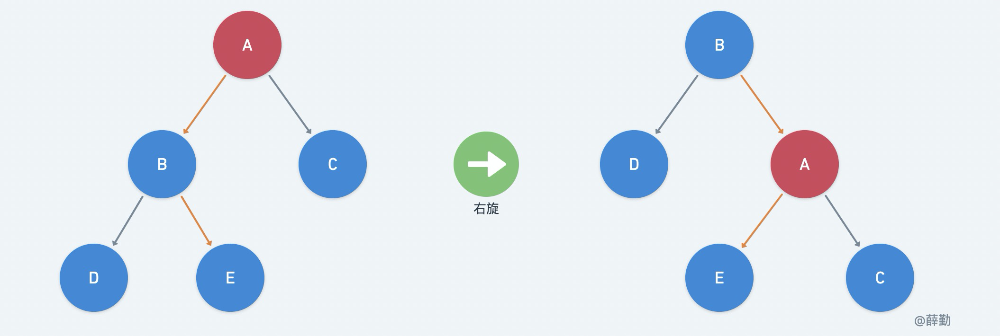

# 写在前面

相信读者也看过了不少讲解 HashMap 源码的文章了，笔者认为，一切脱离源码去讲原理的都是泛泛而谈。一些所谓的原理大都是阅读源码之后的个人概括，这些概括参差不齐，再加上没有阅读源码，读者们是很难有切身体会的。正因如此，笔者逐行分析了 HashMap 的源码后，开启了本场写作。

笔者在阅读 HashMap 源码的时候，曾对每个内部属性，每个内部方法和方法调用逻辑做了简要注释，但在整理成文的时候，还是遇到了略微的困难。对于一些内部属性的解释，需要结合它在一些方法的使用中发挥的作用来综合说明，笔者打算按照从浅到深的顺序，先带读者熟悉HashMap的宏观设计思想，再通读一遍源码，然后讲解源码的设计细节。要让读者边看文字边对照源码进行学习，形成自己的领悟和体会，避免造成笔者一人的泛泛而谈。

无论自己的领悟是深是浅，终归是自己的，无论别人的领悟多么高深，那也是别人的。希望每个读者都能有自己的收获和体会。

由于 HashMap 源码中涉及到较多的位运算的知识，对这方面基础薄弱的读者可以阅读我之前发布的文章。

## Java版本

```java
$ java -version
java version "1.8.0_211"
Java(TM) SE Runtime Environment (build 1.8.0_211-b12)
Java HotSpot(TM) 64-Bit Server VM (build 25.211-b12, mixed mode)
```

# 第一章: HashMap篇

## 1.1 HashMap概述

> 以下内容主要对HashMap的一些特性和注意事项做了简单的说明，笔者对一些比较重要的知识点做了加粗处理。

基于哈希表的 Map 接口的实现。此实现提供所有可选的映射操作，**并允许使用 null 值和 null 键**。（除了不同步和允许使用 null 之外，HashMap 类与 Hashtable 大致相同。）此类不保证映射的顺序，特别是它**不保证该顺序恒久不变**。

此实现假定哈希函数将元素正确分布在各桶之间，可为基本操作（get 和 put）提供稳定的性能。迭代集合视图所需的时间与 HashMap 实例的“容量”（桶的数量）及其大小（键-值映射关系数）的和成比例。所以，如果迭代性能很重要，则不要将初始容量设置得太高（或将加载因子设置得太低）。

HashMap 的实例有两个参数影响其性能：初始容量 和加载因子。**容量 是哈希表中桶的数量**，初始容量只是哈希表在创建时的容量。**加载因子 是哈希表在其容量自动增加之前可以达到多满的一种尺度**。当哈希表中的条目数超出了**加载因子与当前容量的乘积**时，通过调用 rehash 方法将容量翻倍。

通常，默认加载因子 (.75) 在时间和空间成本上寻求一种折衷。加载因子过高虽然减少了空间开销，但同时也增加了查询成本（在大多数 HashMap 类的操作中，包括 get 和 put 操作，都反映了这一点）。在设置初始容量时应该考虑到映射中所需的条目数及其加载因子，以便最大限度地降低 rehash 操作次数。如果初始容量大于最大条目数除以加载因子，则不会发生 rehash 操作。

如果很多映射关系要存储在 HashMap 实例中，则相对于按需执行自动的 rehash 操作以增大表的容量来说，使用足够大的初始容量创建它将使得映射关系能更有效地存储。

注意，此实现**不是同步的**。如果多个线程同时访问此映射，而其中至少一个线程从结构上修改了该映射，则它必须保持外部同步。（结构上的修改是指添加或删除一个或多个映射关系的操作；仅改变与实例已经包含的键关联的值不是结构上的修改。）这一般通过对自然封装该映射的对象进行同步操作来完成。如果不存在这样的对象，则应该使用 Collections.synchronizedMap 方法来“包装”该映射。最好在创建时完成这一操作，以防止对映射进行意外的不同步访问，如下所示：

```java
Map m = Collections.synchronizedMap(new HashMap(...));
```
由所有此类的“集合视图方法”所返回的迭代器都是**快速失败（fast-fail）**的：在迭代器创建之后，如果从结构上对映射进行修改，除非通过迭代器自身的 remove 或 add 方法，其他任何时间任何方式的修改，迭代器都将抛出 ConcurrentModificationException。因此，面对并发的修改，迭代器很快就会完全失败，而不冒在将来不确定的时间任意发生不确定行为的风险。

注意，迭代器的快速失败行为不能得到保证，一般来说，存在不同步的并发修改时，不可能作出任何坚决的保证。快速失败迭代器尽最大努力抛出 ConcurrentModificationException。因此，编写依赖于此异常程序的方式是错误的，正确做法是：迭代器的快速失败行为应该仅用于检测程序错误。

此类是 Java Collections Framework 的成员。

## 1.2 HashMap存储结构

> 学习源码之前，最好在脑海中明确 HashMap 的存储结构，不然后面阅读源码，遇到容量、数量等参数可能会有些许困惑。

相信你已经有所耳闻，HashMap 内部包含了一个 Node 类型的数组 table。Node 存储着键值对。

Node 类源码如下：

```java
static class Node<K, V> implements Map.Entry<K, V> {
    final int hash;
    final K key;
    V value;
    Node<K, V> next;

    Node(int hash, K key, V value, Node<K, V> next) {
        this.hash = hash;
        this.key = key;
        this.value = value;
        this.next = next;
    }

    public final K getKey() {
        return key;
    }

    public final V getValue() {
        return value;
    }

    public final String toString() {
        return key + "=" + value;
    }

    public final int hashCode() {
        return Objects.hashCode(key) ^ Objects.hashCode(value);
    }

    public final V setValue(V newValue) {
        V oldValue = value;
        value = newValue;

        return oldValue;
    }

    public final boolean equals(Object o) {
        if (o == this) {
            return true;
        }

        if (o instanceof Map.Entry) {
            Map.Entry<?, ?> e = (Map.Entry<?, ?>) o;

            if (Objects.equals(key, e.getKey()) &&
                    Objects.equals(value, e.getValue())) {
                return true;
            }
        }

        return false;
    }
}

```

它包含了四个字段，从 next 字段我们可以看出 Node 是一个链表。即数组中的每个位置被当成一个桶，一个桶存放一个链表。HashMap 使用链地址法来解决哈希冲突，即同一个链表中存放**哈希值和散列桶取模运算结果相同**的 Node。HashMap 存储结构如下图所示：



## 1.3 HashMap静态属性

```java
static final int DEFAULT_INITIAL_CAPACITY = 1 << 4; // aka 16
```
默认的 table 容量，1<<4 = 2^4 = 16，规定必须是2的幂。

```java
static final int MAXIMUM_CAPACITY = 1 << 30;
```
最大的 table 容量，规定必须是 2 的幂，类型为 int，掐指一算，那只能是 0100 0000 0000 0000 0000 0000 0000 0000。因为 Java中 int 有 32 位，除第 1 位符号位外，数值部分只有 31 位，只有 1<<30 满足条件。

> 这里需要说明一下，对于 2 的幂，在计算机的世界里是一群特殊的存在，它们的二进制中只有一个1，其余位全为 0 。这个特性会影响与它进行位运算后的结果具有一些特殊效果。

```java
static final float DEFAULT_LOAD_FACTOR = 0.75f;
```
构造函数中未指定时使用的负载因子。

```java
static final int TREEIFY_THRESHOLD = 8;
```
相信很多人知道链表长度大于 8 会转为红黑树，依据也就是这个字段的注释说明。但其实这只是条件之一，另一个条件就是下面这个参数。

```java
static final int MIN_TREEIFY_CAPACITY = 64;
```

在进行链表转红黑树的时候，第一步是检查链表的长度是否大于等于 8，第二步会检查 table 数组的容量是否小于此数值，若小于，则取消转为红黑树，只对 table 数组进行扩容。

```java
static final int UNTREEIFY_THRESHOLD = 6;
```
当键值对数量过多时需要对 table 数组进行扩容，并且将每个键值对放到新的桶中（或者不变）。原来的桶的内部结构有可能是链表，也有可能是红黑树，经过一番洗牌之后，如果桶结构为红黑树的键值对数量过低，就会重新转变为链表。低到哪个程度呢？就是这个字段对应的大小。

## 1.4 HashMap成员属性

```java
transient Node<K,V>[] table;
```
HashMap 的内部 Node 类型的数组，属性名为 table，下文称为哈希表。

```java
transient int modCount;
```
该字段起标记作用，值是对该 HashMap 进行结构修改的次数，主要用于迭代器访问时检测 HashMap 是否因为删除等其它操作内部机构发生变化，即达到**快速失败（fast-fail）**的目的。

```java
transient Set<Map.Entry<K,V>> entrySet;
```
HashMap 内部有很多内部类，扩展了 HashMap 的一些功能，EntrySet 类就是其中一种，该类较为简单，无内部属性，你可以理解为一个工具类，对 HashMap 进行了简单的封装，提供了方便的遍历、删除等操作。

调用 HashMap 的 entrySet() 方法就可以返回 EntrySet 实例对象，为了不至于每次调用该方法都返回新的 EntrySet 对象，所以设置该属性，缓存 EntrySet 实例。

```java
transient int size;
```

键值对的数量。

```java
int threshold;
```
size 的临界值，当 size 大于 threshold 就必须进行扩容操作。

```java
final float loadFactor;
```
负载因子，被 final 修饰，在构造方法中就被初始化，不指定就用默认的。


## 1.5 HashMap构造方法

HashMap 共有三个构造方法，源码如下：

```java
public HashMap() {
    this.loadFactor = DEFAULT_LOAD_FACTOR; // all other fields defaulted
}

public HashMap(int initialCapacity) {
    this(initialCapacity, DEFAULT_LOAD_FACTOR);
}

public HashMap(int initialCapacity, float loadFactor) {
    if (initialCapacity < 0)
        throw new IllegalArgumentException("Illegal initial capacity: " +
                                           initialCapacity);
    if (initialCapacity > MAXIMUM_CAPACITY)
        initialCapacity = MAXIMUM_CAPACITY;
    if (loadFactor <= 0 || Float.isNaN(loadFactor))
        throw new IllegalArgumentException("Illegal load factor: " +
                                           loadFactor);
    this.loadFactor = loadFactor;
    this.threshold = tableSizeFor(initialCapacity);
}
```

初看源码，可以发现，被 final 修饰的 loadFactor 一定会在构造方法中被初始化。

带参构造方法主要做的就是对 initialCapacity 和 loadFactor 的校验工作，并且会通过 tableSizeFor 方法计算其合理的初始容量，由于此时 table 数组尚未实例化，所以该合理的初始容量被暂存在 threshold 属性中，由其代为保管。

## 1.6 计算哈希表的容量

tableSizeFor(int cap) 静态方法的作用是计算 HashMap 内部 table 数组合理的初始容量，也就是满足 2 的幂，且大于等于手动指定的数值 cap，最接近的那一个数即可。

该方法使用位运算设计了高效的算法逻辑，方法源码如下：

```java
static final int tableSizeFor(int cap) {
    int n = cap - 1;
    n |= n >>> 1;
    n |= n >>> 2;
    n |= n >>> 4;
    n |= n >>> 8;
    n |= n >>> 16;
    return (n < 0) ? 1 : (n >= MAXIMUM_CAPACITY) ? MAXIMUM_CAPACITY : n + 1;
}
```
参数 cap 的值肯定大于 0，故 n 大于等于 0 ，假设 n = 0，经过右移之后，依旧为 0 ，0 与 0 异或依旧为 0 ，通过 return 语句的 n+ 1 计算得 1，即 2 的 0 次幂。

当 n 大于 0 时，n 的二进制位肯定会有位的值为 1，即 001xx..xx 的形式，接着，对 n 右移 1 位得 0001xx..xx，再进行位或，由于 1 与 0 或 1 异或结果都为 1，所以结果必为 0011xx..xx 的形式。以此类推，位移 2 位、4 位、8 位、 16 位，最终该算法能让最高位的 1 后面的所有位全变为 1 。

下面用一张图举例说明一下：



该算法的最后再让结果值 n + 1，所得即为 2 的整数次幂。为了让结果使结果大于等于参数 cap ，在算法开始时，令 cap - 1。

## 1.7 计算Key的hash值

hash(Object key) 方法是 HashMap 的核心静态方法，用于计算 key 的 hash 值，该方法的源码如下：

```java
static final int hash(Object key) {
    int h;
    return (key == null) ? 0 : (h = key.hashCode()) ^ (h >>> 16);
}
```

方法逻辑很简单，key 为 null 返回 0 ，根据桶下标计算公式 `(capacity - 1) & hash` ，以及 0 与 0 或 1 位与结果均为 0，可知，null 键对应的桶下标为 0 。

当 key 不为 null 时，调用 key.hashCode() 并将 hashCode 的低 16 位与高 16 位异或。

这步操作是因为 table 数组使用 2 的幂作为容量，且计算桶下标是通过 `(capacity - 1) & hash` ，所以仅在当前容量上方的位中变化的 hashCode 将始终发生冲突。

举个例子，初始容量为 16，hash值按 32 位计算，
```properties
16 = 10000（二进制）
16 - 1 =  0000 0000 0000 0000 0000 0000 0000 1111
hash1 = 0000 0000 0000 0000 0000 0000 0001 1111
hash2 = 0000 0000 0000 0000 0000 0000 0011 1111
```
因为 0 与任何数位与 & 的结果都是 0 ，所以无论 hash 值是多少，计算后除后 4 位外的位必定都为 0，如果 hash 值只在前 32 - 4 = 28 位发生变化，计算后的结果都是相同的，都会放入同一个桶中，始终发生冲突。 

因此，设计者们在速度，实用性和位扩展质量之间进行权衡后应用了一种变换，通过将 hashcode 的低 16 位与高 16 位异或向下传播较高位的影响。

由于许多常见的哈希值已经合理分布（比如 hash 值的前 16 位都为 0 的一些数，它们的低 16 位与 高 16 位异或后值不变，因此无法从扩展中受益），并且由于我们使用树来处理容器中的大量冲突，因此我们仅以最方便的方式对一些移位后的位进行异或，以减少系统损失，以及合并最高位的影响，否则由于 table 数组容量的限制，这些位将永远不会在索引计算中使用。

## 1.8 桶下标计算公式

计算桶下标时，需要先通过 HashMap 内部的 hash()方法计算其 hash 值， 然后将 hash 值对桶个数取模，即

```java
hash % capacity
```

如果能保证 capacity 为 2 的幂，那么就可以将这个操作转换为高效的位运算，也就是 HashMap 源码中的桶下标计算公式：
```java
(capacity - 1) & hash
```
以上便是 HashMap 内部数组的容量为 2 的幂的其中一个原因，另一个原因是在 resize() 扩容方法中可以更高效的重新计算桶下标。

## 1.9 HashMap的put方法

该方法将指定值与该映射中的指定键相关联。若是 Key 已存在，则覆盖并返回旧的 Value（可为 null）；若是没有键值对映射，则返回 null。该方法源码如下：

```java
public V put(K key, V value) {
    return putVal(hash(key), key, value, false, true);
}
```

可以看到，该方法实际是封装的 putVal() 方法。putVal() 方法有 5 个参数，依次为 key 的 hash 值，key 本身，value 本身，参数 onlyIfAbsent 表示是否在键已存在的情况放弃覆盖旧值，参数 evict 作为 afterNodeInsertion(evict) 方法的参数，并不为 HashMap 所用，而是交由 LinkedHashMap 处理。

该方法的源码如下：

```java
final V putVal(int hash, K key, V value, boolean onlyIfAbsent,
               boolean evict) {
    Node<K,V>[] tab; Node<K,V> p; int n, i;
    // 步骤①：table为空则创建
    if ((tab = table) == null || (n = tab.length) == 0)
        n = (tab = resize()).length;
    // 步骤②：计算桶下标，若是没有碰撞直接放桶里
    if ((p = tab[i = (n - 1) & hash]) == null)
        tab[i] = newNode(hash, key, value, null);
    else {
        // 步骤③：发生hash碰撞，若键已存在就返回该Node，并用属性 e 引用，若键不存在就创建一个新的Node，并直接插入到桶中
        Node<K,V> e; K k;
        // 检查碰撞的节点是否是头节点
        if (p.hash == hash &&
            ((k = p.key) == key || (key != null && key.equals(k))))
            e = p;
        // 若该桶的内部结构是树
        else if (p instanceof TreeNode)
            e = ((TreeNode<K,V>)p).putTreeVal(this, tab, hash, key, value);
        // 若该桶的内部结构是链表
        else {
            for (int binCount = 0; ; ++binCount) {
                if ((e = p.next) == null) {
                    // 直接插入新节点到链表的尾部
                    p.next = newNode(hash, key, value, null);
                    // 链表长度大于8转为红黑树处理
                    if (binCount >= TREEIFY_THRESHOLD - 1) // -1 for 1st
                        treeifyBin(tab, hash);
                    break;
                }
                if (e.hash == hash &&
                    ((k = e.key) == key || (key != null && key.equals(k))))
                    break;
                p = e;
            }
        }
        // 步骤④：该键已经存在
        if (e != null) { // existing mapping for key
            V oldValue = e.value;
            if (!onlyIfAbsent || oldValue == null)
            	// 直接覆盖，并返回旧值
                e.value = value;
            afterNodeAccess(e);
            return oldValue;
        }
    }
    ++modCount;
    // 步骤⑤：检查键值对数量是否超过临界值，是则扩容
    if (++size > threshold)
        resize();
    afterNodeInsertion(evict);
    return null;
}
```

## 1.10 哈希表的初始化与扩容

resize() 方法的作用是初始化 table 数组，或扩大 table 数组的容量。

如果 table 数组为 null，则根据字段 threshold 中保持的初始容量进行分配。否则扩容，因为我们使用的是 2 的幂，所以每个桶中的元素必须保持相同的索引，或者在新 table 中以 2 的幂偏移。

举个例子，例如容量从 16 扩展为 32 时，具体变化如下：

```properties
16-1  =  0000 0000 0000 0000 0000 0000 0000 1111
hash1 =  0000 0000 0000 0000 0000 0000 0000 1111
hash2 =  0000 0000 0000 0000 0000 0000 0001 1111
// 桶下标为
(16-1)&hash1 = 0000 0000 0000 0000 0000 0000 0000 1111
(16-1)&hash2 = 0000 0000 0000 0000 0000 0000 0000 1111
```

容量为 16 时，hash1 和 hash2 经过桶下标计算后结果相同，会进入同一个桶中。当容量扩展为 32 后，新的桶下标计算过程如下所示：

```properties
32-1  =  0000 0000 0000 0000 0000 0000 0001 1111
hash1 =  0000 0000 0000 0000 0000 0000 0000 1111
hash2 =  0000 0000 0000 0000 0000 0000 0001 1111
// 桶下标为
(32-1)&hash1 = 0000 0000 0000 0000 0000 0000 0000 1111
(32-1)&hash2 = 0000 0000 0000 0000 0000 0000 0001 1111
```

hash1 和 hash2 经过桶下标公式重新计算之后，hash1的结果不变，所以依旧在原来的桶里；而 hash2 的结果比原来多了 1 位，即 2^4 = 16，也就是偏移了原来的容量大小。如下图所示：



因此，在扩充 HashMap 的时候，不需要重新计算 hash，只需要检查二进制 hash 中与二进制桶下标中新增的有效位的位置相同的那个位（以下简称“新增位”）是 0 还是 1 即可，是 0 的话索引没变，是 1 的话索引变成“原索引+oldCap”。

如何检查新增位是 0 还是 1 呢？HashMap 中使用 `hash & oldCap` 位与运算检查该新增位。oldCap 是 2 的幂，故二进制表示只有 1 位是 1，且该位正好与之对应。不得不说这个设计还是非常巧妙的，既省去了重新计算 hash 值的时间，而且，由于新增的 1 位是 0 还是 1 可以认为是随机的，因此在扩容的过程，均匀的把之前碰撞的节点分散到新旧桶中。

resize() 方法的源码如下：

```java
final Node<K,V>[] resize() {
    Node<K,V>[] oldTab = table;
    int oldCap = (oldTab == null) ? 0 : oldTab.length;
    int oldThr = threshold;
    int newCap, newThr = 0;
    // 步骤①：根据 oldCap 判断是扩容还是初始化数组，若是扩容..
    if (oldCap > 0) {
    	// 超过最大容量就不再扩容，随它去碰撞
        if (oldCap >= MAXIMUM_CAPACITY) {
            threshold = Integer.MAX_VALUE;
            return oldTab;
        }
        // 没超过最大值，就扩容为原来的2倍
        else if ((newCap = oldCap << 1) < MAXIMUM_CAPACITY &&
                 oldCap >= DEFAULT_INITIAL_CAPACITY)
            newThr = oldThr << 1; // double threshold
    }
    // 步骤②：若是初始化数组，若是字段 threshold 中已经保存初始容量
    else if (oldThr > 0) // initial capacity was placed in threshold
        newCap = oldThr;
    // 步骤③：若是初始化数组，若是字段 threshold 中没有保存初始容量，则使用默认容量
    else {               // zero initial threshold signifies using defaults
        newCap = DEFAULT_INITIAL_CAPACITY;
        newThr = (int)(DEFAULT_LOAD_FACTOR * DEFAULT_INITIAL_CAPACITY);
    }
    // 步骤④：计算新的键值对临界值
    if (newThr == 0) {
        float ft = (float)newCap * loadFactor;
        newThr = (newCap < MAXIMUM_CAPACITY && ft < (float)MAXIMUM_CAPACITY ?
                  (int)ft : Integer.MAX_VALUE);
    }
    threshold = newThr;
    @SuppressWarnings({"rawtypes","unchecked"})
    // 步骤⑤：实例化新的 table 数组
    Node<K,V>[] newTab = (Node<K,V>[])new Node[newCap];
    table = newTab;
    if (oldTab != null) {
        // 步骤⑥：将每个桶及内部节点都移到新的 table 数组中
        for (int j = 0; j < oldCap; ++j) {
            Node<K,V> e;
            if ((e = oldTab[j]) != null) {
            	// 去掉旧数组对该桶的引用
                oldTab[j] = null;
                // 若是该桶无哈希碰撞，重新计算桶下标
                if (e.next == null)
                    newTab[e.hash & (newCap - 1)] = e;
                // 若是该桶内部结构为树   
                else if (e instanceof TreeNode)
                    ((TreeNode<K,V>)e).split(this, newTab, j, oldCap);
                // 若是该桶内部结构为链表，则碰撞的节点要么在原桶，要么在新桶
                else { // preserve order
                    // 原桶的头尾节点引用
                    Node<K,V> loHead = null, loTail = null;
                    // 新桶的头尾节点引用
                    Node<K,V> hiHead = null, hiTail = null;
                    Node<K,V> next;
                    // 循环遍历桶内碰撞节点
                    do {
                        next = e.next;
                        // 新增位是 0 放原桶
                        if ((e.hash & oldCap) == 0) {
                            if (loTail == null)
                                loHead = e;
                            else
                                loTail.next = e;
                            loTail = e;
                        }
                        // 新增位是 1 放新桶
                        else {
                            if (hiTail == null)
                                hiHead = e;
                            else
                                hiTail.next = e;
                            hiTail = e;
                        }
                    } while ((e = next) != null);
                    // 原桶放新 table 数组
                    if (loTail != null) {
                        loTail.next = null;
                        newTab[j] = loHead;
                    }
                    // 新桶放新 table 数组
                    if (hiTail != null) {
                        hiTail.next = null;
                        newTab[j + oldCap] = hiHead;
                    }
                }
            }
        }
    }
    return newTab;
}
```

## 1.11 解析HashMap死循环问题

HashMap 的扩容方法在 Java8 中使用尾插法取消了 Java7 的头插法，这避免了多线程下使用 HashMap 造成死循环的风险。

Java7 的 HashMap 扩容源码如下：

```java
void transfer(Entry[] newTable, boolean rehash) {
    int newCapacity = newTable.length;
    for (Entry<K,V> e : table) {
        while(null != e) {
           // 记住此处的变量 e 与变量 next ！
            Entry<K,V> next = e.next;
            if (rehash) {
                e.hash = null == e.key ? 0 : hash(e.key);
            }
            // 找到桶下标 
            int i = indexFor(e.hash, newCapacity);
            // 头插法：将节点e插入到新桶的顶部
            e.next = newTable[i];
            newTable[i] = e;
            // 继续下一个
            e = next;
        }
    }
}
```

为什么使用头插法会造成死循环问题呢？下面笔者通过图画的形式进行演示说明。



上图过程如下：

1. 当线程 1 进入扩容方法执行到 while 循环体内，已在当前线程栈声明了变量 e =  5 与变量 next = 9 。此时线程 1 的 CPU 时间片用尽，暂停换线程 2 继续执行。
2. 线程 2 执行完扩容方法并结束。
3. 线程 1 继续执行循环体，将变量 e = 5 通过“头插法”插入到桶 1 的顶部，但是经过线程 2 的作用，节点 9 的next 指针指向节点 5 ，这就形成了节点 5 与节点 9 的闭环。后面继续处理 next = 9，但依旧还是闭环的状态。

形成闭环后，当调用 get() 方法时，就会使程序陷入死循环的状态。Java 8 使用尾插法就可以完全避免死循环的问题，感兴趣的小伙伴可以动手尝试分析，本文不再作讲解。

以上就是关于 HashMap 在 Java7 版本中的死循环问题的全部内容。

## 1.12 HashMap的get方法

该方法返回指定键所映射到的值，如果不包含该键对应的映射关系，则返回 null。

返回值为 null 不一定表示不包含该键对应的映射关系，也可能表示该键对应的值为 null。 如果需要验证是否存在该键对应的映射关系可以调用 containsKey() 方法。

该方法的源码如下：

```java
public V get(Object key) {
    Node<K,V> e;
    return (e = getNode(hash(key), key)) == null ? null : e.value;
}
```

方法内部调用的 getNode() 方法，参数为 key 的 hash 值与 key 本身，方法的源码如下：

```java
final Node<K,V> getNode(int hash, Object key) {
    Node<K,V>[] tab; Node<K,V> first, e; int n; K k;
    // 步骤①：计算并得到键值对所在的桶
    if ((tab = table) != null && (n = tab.length) > 0 &&
        (first = tab[(n - 1) & hash]) != null) {
        // 步骤②：每次 get 都要先检查该桶头节点是否是要找的键值对，因为不存在哈希碰撞的可能性较大
        if (first.hash == hash && // always check first node
            ((k = first.key) == key || (key != null && key.equals(k))))
            return first;
        // 步骤③：若是该桶存在哈希碰撞，则遍历桶内节点
        if ((e = first.next) != null) {
            // 如果桶的内部结构是树..
            if (first instanceof TreeNode)
                return ((TreeNode<K,V>)first).getTreeNode(hash, key);
            // 如果桶的内部结构是链表..  
            do {
                if (e.hash == hash &&
                    ((k = e.key) == key || (key != null && key.equals(k))))
                    return e;
            } while ((e = e.next) != null);
        }
    }
    return null;
}
```

## 1.13 HashMap序列化与反序列化

在前面的介绍中，HashMap 内部使用 transient 关键字修饰 table 等属性。transient 关键字的作用是使被修饰的成员属性不被序列化，为什么 HashMap 要使用该关键字呢？

在使用 put 操作存入一个键值对时，需要调用 key.hashCode() 方法参与计算 hash 值。而 Object.hashCode() 是 native 方法，不同的 JVM 里可能是不一样的。

举个例子，你在 JVM-1 中，使用字符串“123”作为 key 存入键值对，调用 key.hashCode() 方法的结果是 1，然后在 JVM-1 中进行序列化，在 JVM-2 中反序列化。当你仍使用字符串“123”作为 key 获取 value 时，此时 key.hashCode() 方法的结果可能是 2。

所以，HashMap 取消对成员属性 table 的序列化操作，并实现了自己的序列化与反序列方法。

在序列化方法中通过两层 for 循环遍历并提取出所有的 key 与 value ；在反序列化方法中，读取每个键值对并调用 put 方法存入 table 数组。

序列化的代码如下：

```java
private void writeObject(java.io.ObjectOutputStream s)
        throws IOException {
    int buckets = capacity();
    // Write out the threshold, loadfactor, and any hidden stuff
    s.defaultWriteObject();
    s.writeInt(buckets);
    s.writeInt(size);
    internalWriteEntries(s);
}
void internalWriteEntries(java.io.ObjectOutputStream s) throws IOException {
    Node<K,V>[] tab;
    if (size > 0 && (tab = table) != null) {
        for (int i = 0; i < tab.length; ++i) {
            for (Node<K,V> e = tab[i]; e != null; e = e.next) {
                s.writeObject(e.key);
                s.writeObject(e.value);
            }
        }
    }
}
```

反序列化代码如下：

```java
private void readObject(java.io.ObjectInputStream s)
        throws IOException, ClassNotFoundException {
    // Read in the threshold (ignored), loadfactor, and any hidden stuff
    s.defaultReadObject();
    reinitialize();
    if (loadFactor <= 0 || Float.isNaN(loadFactor))
        throw new InvalidObjectException("Illegal load factor: " +
                loadFactor);
    s.readInt();                // Read and ignore number of buckets
    int mappings = s.readInt(); // Read number of mappings (size)
    // 如果键值对数量小于0，抛出异常
    if (mappings < 0)
        throw new InvalidObjectException("Illegal mappings count: " +
                mappings);
    // 如果键值对数量大于0            
    else if (mappings > 0) { // (if zero, use defaults)
        // Size the table using given load factor only if within
        // range of 0.25...4.0
        float lf = Math.min(Math.max(0.25f, loadFactor), 4.0f);
        float fc = (float)mappings / lf + 1.0f;
        int cap = ((fc < DEFAULT_INITIAL_CAPACITY) ?
                DEFAULT_INITIAL_CAPACITY :
                (fc >= MAXIMUM_CAPACITY) ?
                        MAXIMUM_CAPACITY :
                        tableSizeFor((int)fc));
        float ft = (float)cap * lf;
        threshold = ((cap < MAXIMUM_CAPACITY && ft < MAXIMUM_CAPACITY) ?
                (int)ft : Integer.MAX_VALUE);

        // Check Map.Entry[].class since it's the nearest public type to
        // what we're actually creating.
        SharedSecrets.getJavaOISAccess().checkArray(s, Map.Entry[].class, cap);
        //创建 table 数组
        @SuppressWarnings({"rawtypes","unchecked"})
        Node<K,V>[] tab = (Node<K,V>[])new Node[cap];
        table = tab;

        // Read the keys and values, and put the mappings in the HashMap
        // 读取键值对，通过 put 操作存入
        for (int i = 0; i < mappings; i++) {
            @SuppressWarnings("unchecked")
            K key = (K) s.readObject();
            @SuppressWarnings("unchecked")
            V value = (V) s.readObject();
            putVal(hash(key), key, value, false, false);
        }
    }
}
```


## 1.14 链表转为红黑树的条件

为了解决哈希冲突，哈希表的内部节点是链表结构，但随着哈希冲突的数量增多，链表就不再是比较好的一种数据结构，红黑树成为了替代链表的首选数据结构。

在前面对 put 操作的介绍中，当链表的长度大于等于 TREEIFY_THRESHOLD 也就是 8 时，会调用 treeifyBin() 方法将桶的结构由 Node 转为 TreeNode，即链表转化为红黑树。但严格来说，这句话不应该如此表述。因为 treeifyBin() 方法会判断当前 table 数组的容量是否小于 MIN_TREEIFY_CAPACITY（64），若是，则放弃链表转为红黑树，而选择扩容。

treeifyBin() 方法的源码如下：

```java
final void treeifyBin(Node<K,V>[] tab, int hash) {
    int n, index; Node<K,V> e;
    // 如果当前 table 数组的容量小于 64 就放弃树化，选择扩容。
    if (tab == null || (n = tab.length) < MIN_TREEIFY_CAPACITY)
        resize();
    // 链表转为红黑树
    else if ((e = tab[index = (n - 1) & hash]) != null) {
        // hd：链表头节点，tl：链表尾节点
        TreeNode<K,V> hd = null, tl = null;
        do {
            // 将Node转为TreeNode，并保持链表的结构
            TreeNode<K,V> p = replacementTreeNode(e, null);
            if (tl == null)
                hd = p;
            else {
                p.prev = tl;
                tl.next = p;
            }
            tl = p;
        } while ((e = e.next) != null);
        if ((tab[index] = hd) != null)
            // 这一步才是真正的链表转为红黑树
            hd.treeify(tab);
    }
}
```

# 第二章: 红黑树篇

## 2.1 红黑树概述

从本章节开始，笔者将对 HashMap 内部的 TreeNode 内部类源码开始分析，这部分的内容也就是我们所说的红黑树。

红黑树是建立在二叉查找树的基础之上的，二叉查找树又是建立在二叉树的基础之上。所以，我们需要从二叉树开始学习红黑树的发展脉络。

### 2.1.1 二叉树

二叉树（英语：Binary tree）是每个节点最多只有两个分支（即不存在分支度大于2的节点）的树结构。通常分支被称作“左子树”或“右子树”。二叉树的分支具有左右次序，不能随意颠倒。

### 2.1.2 二叉查找树

**二叉查找树**（英语：Binary Search Tree），也称为二叉搜索树、有序二叉树（ordered binary tree）或排序二叉树（sorted binary tree），是指一棵空树或者具有下列性质的二叉树：

1. 若任意节点的左子树不空，则左子树上所有节点的值均小于它的根节点的值；
2. 若任意节点的右子树不空，则右子树上所有节点的值均大于或等于它的根节点的值；
3. 任意节点的左、右子树也分别为二叉查找树；

一颗二叉查找树如下图所示：



但是，当我们顺序插入一系列节点后，二叉查找树就退化为线性表，如下图所示：



虽然二叉查找树退化为线性表之后，最坏效率降为 O(n)。但依旧有很多改进版的二叉查找树可以使树高为O(log n)，从而将最坏效率降至O(log n)，如AVL树、红黑树等。

### 2.1.3 AVL树

**AVL 树**是最早被发明的自平衡二叉查找树。在AVL树中，任一节点对应的两棵子树的最大高度差为 1 ，因此它也被称为高度平衡树。查找、插入和删除在平均和最坏情况下的时间复杂度都是 O(logn)。增加和删除元素的操作则可能需要借由一次或多次树旋转，以实现树的重新平衡。

在 AVL 树中，节点的**平衡因子**是它的左子树的高度减去它的右子树的高度（有时相反）。带有平衡因子 1、0 或 -1 的节点被认为是平衡的。带有平衡因子 -2 或 2 的节点被认为是不平衡的，并需要重新平衡这个树。平衡因子可以直接存储在每个节点中，或从可能存储在节点中的子树高度计算出来。

AVL 树自平衡的方式是做一次或多次所谓的"AVL旋转"。

### 2.1.4 红黑树

**红黑树**（英语：Red–black tree）也是一种自平衡二叉查找树。红黑树在二叉查找树的基础之上，对每个节点都增加了颜色属性，分为红色或黑色。在二叉查找树强制的一般要求以外，对于任何有效的红黑树增加了如下 5 条额外要求：

1. 节点是红色或黑色。
2. 根节点是黑色。
3. 所有叶子都是黑色（叶子是NIL节点）。
4. 每个红色节点必须有两个黑色的子节点。（从每个叶子到根的所有路径上不能有两个连续的红色节点。）
5. 从任一节点到其每个叶子的所有简单路径都包含相同数目的黑色节点。

下面是一个具体的红黑树的图例：


红黑树的这些特性，保证了红黑树**从根到叶子的最长的可能路径不多于最短的可能路径的两倍长**，造成的结果是红黑树大致上是平衡的。如上图所示，"nil叶子"或"空（null）叶子"不包含数据而只充当树在此结束的指示。

对于红黑树的读与写，因为每一个红黑树都是一个（特殊的）二叉查找树，因此红黑树上的只读操作与普通二叉查找树上的只读操作相同。然而，在红黑树上进行插入操作和删除操作会导致不再符合红黑树的性质。恢复红黑树的性质需要少量 O(log n) 的颜色变更（实际是非常快速的）和不超过三次的树旋转（对于插入操作是两次）。虽然插入和删除很复杂，但操作时间仍可以保持为 O(log n) 次。

本章节开始结合 HashMap 源码讲解红黑树的插入、红黑树的删除、红黑树的自平衡、左旋、右旋等内容。

## 2.2 链表转为红黑树的过程

HashMap 的桶类型除了 Node (链表)外，还有 TreeNode (树)。

TreeNode 类包含成员方法 `treeify()` ，该方法的作用是形成以当前 TreeNode 对象为根节点的红黑树。

树化过程不外乎是循环遍历链表，构造一颗二叉查找树，最后使用红黑树的平衡方法进行自平衡。

该方法源码如下：

```java
final void treeify(Node<K,V>[] tab) {
    TreeNode<K,V> root = null;
    // 步骤①：循环遍历当前TreeNode链表
    for (TreeNode<K,V> x = this, next; x != null; x = next) {
        next = (TreeNode<K,V>)x.next;
        x.left = x.right = null;
        // 步骤②：如果还未设置根节点..
        if (root == null) {
            x.parent = null;
            x.red = false;
            root = x;
        }
        // 步骤③：如果已设置根节点..
        else {
            K k = x.key;
            int h = x.hash;
            Class<?> kc = null;
            // 步骤④：从根节点开始遍历，插入新节点
            for (TreeNode<K,V> p = root;;) {
                int dir, ph;
                K pk = p.key;
                // 步骤⑤：比较当前节点的hash值与新节点的hash值
                // 若是新节点hash值较小
                if ((ph = p.hash) > h)
                    dir = -1;
                // 若是新节点的hash值较大
                else if (ph < h)
                    dir = 1;
                // 若是新节点与当前节点的hash值相等    
                else if (
                    // 如果新节点的key没有实现Comparable接口..
                    (kc == null && (kc = comparableClassFor(k)) == null) 
                    // 或者实现了Comparable接口但是k.compareTo(pk)结果为0
                    ||(dir = compareComparables(kc, k, pk)) == 0)
                    // 则调用tieBreakOrder继续比较大小
                    dir = tieBreakOrder(k, pk);

                TreeNode<K,V> xp = p;
                // 步骤⑥：如果新节点经比较后小于等于当前节点且当前节点的左子节点为null，则插入新节点，反之亦然
                if ((p = (dir <= 0) ? p.left : p.right) == null) {
                    x.parent = xp;
                    if (dir <= 0)
                        xp.left = x;
                    else
                        xp.right = x;
                    // 步骤⑦：平衡红黑树
                    root = balanceInsertion(root, x);
                    break;
                }
            }
        }
    }
    // 步骤⑧：确保给定的根节点是所在桶的第一个节点
    moveRootToFront(tab, root);
}
```

## 2.3 红黑树的左旋和右旋

红黑树的左旋和右旋其实很简单，所谓的左旋是把要平衡的节点向左下旋转成一个子节点。

如下图所示：



所谓的右旋是把要平衡的节点向右下旋转成一个子节点。

如下图所示：



在 HashMap 的源码中，左旋的实现代码如下：

```java
static <K,V> TreeNode<K,V> rotateLeft(TreeNode<K,V> root,
                                      TreeNode<K,V> p) {
    // p: 当前节点
    // r: 当前节点的右儿子
    // rl: 当前节点的右儿子的左儿子
    TreeNode<K,V> r, pp, rl;
    // 如果当前节点和当前节点的右儿子不为空，就左旋
    if (p != null && (r = p.right) != null) {
        // 步骤①：当前节点的右儿子的左儿子成为当前节点的右儿子
        if ((rl = p.right = r.left) != null)
            rl.parent = p;
        // 步骤②：当前节点的右儿子成为当前节点的父节点
        if ((pp = r.parent = p.parent) == null)
            // 如果当前节点是根节点，那么r的颜色必须是黑色
            (root = r).red = false;
        else if (pp.left == p)
            pp.left = r;
        else
            pp.right = r;
        r.left = p;
        p.parent = r;
    }
    return root;
}
```

右旋的实现代码如下：

```java
static <K,V> TreeNode<K,V> rotateRight(TreeNode<K,V> root,
                                       TreeNode<K,V> p) {
    // p: 当前节点
    // l: 当前节点的左儿子
    // lr: 当前节点的左儿子的右儿子
    TreeNode<K,V> l, pp, lr;
    // 如果当前节点和当前节点的左儿子不为空，就右旋
    if (p != null && (l = p.left) != null) {
        // 步骤①：当前节点的左儿子的右儿子成为当前节点的左儿子
        if ((lr = p.left = l.right) != null)
            lr.parent = p;
        // 步骤②：当前节点的左儿子成为当前节点的父节点
        if ((pp = l.parent = p.parent) == null)
            // 如果当前节点是根节点，那么r的颜色必须是黑色
            (root = l).red = false;
        else if (pp.right == p)
            pp.right = l;
        else
            pp.left = l;
        l.right = p;
        p.parent = l;
    }
    return root;
}
```

## 2.4 红黑树的插入

红黑树是一棵特殊的二叉查找树，如同二叉查找树的插入一样，红黑树的插入，也需要判断插入节点与当前节点的大小。如果插入节点大于或等于当前节点，则插入当前节点的右子树；否则，插入到左子树。循环此过程，直到找到为空的叶子节点放入即可。

```java
/**
 * Tree version of putVal.
 */
final TreeNode<K,V> putTreeVal(HashMap<K,V> map, Node<K,V>[] tab,
                               int h, K k, V v) {
    Class<?> kc = null;
    boolean searched = false;
    // root: 树根节点
    TreeNode<K,V> root = (parent != null) ? root() : this;
    for (TreeNode<K,V> p = root;;) {
        // p: 当前节点
        // dir: 标识新节点应该插入到当前节点的左子树还是右子树
        // ph: 当前节点的hash值
        // pk: 当前节点的key
        int dir, ph; K pk;
        // 步骤①：判断新节点应该插入到当前节点的左子树还是右子树
        if ((ph = p.hash) > h)
            dir = -1;
        else if (ph < h)
            dir = 1;
        else if ((pk = p.key) == k || (k != null && k.equals(pk)))
            return p;
        else if ((kc == null &&
                  (kc = comparableClassFor(k)) == null) ||
                 (dir = compareComparables(kc, k, pk)) == 0) {
            if (!searched) {
                TreeNode<K,V> q, ch;
                searched = true;
                if (((ch = p.left) != null &&
                     (q = ch.find(h, k, kc)) != null) ||
                    ((ch = p.right) != null &&
                     (q = ch.find(h, k, kc)) != null))
                    return q;
            }
            dir = tieBreakOrder(k, pk);
        }

        TreeNode<K,V> xp = p;
        // 步骤②：终于从上向下遍历到了空的叶子节点，插入新节点
        if ((p = (dir <= 0) ? p.left : p.right) == null) {
            // 1.父节点指向新节点
            Node<K,V> xpn = xp.next;
            TreeNode<K,V> x = map.newTreeNode(h, k, v, xpn);
            // 新节点位置在左子树还是右子树
            if (dir <= 0)
                xp.left = x;
            else
                xp.right = x;
            xp.next = x;
            // 2.新节点指向父节点
            x.parent = x.prev = xp;
            if (xpn != null)
                // 如果有兄弟节点，兄弟节点的上一个节点指向新节点
                ((TreeNode<K,V>)xpn).prev = x;
            // 最后平衡红黑树，并保证根节点在哈希桶的头部
            moveRootToFront(tab, balanceInsertion(root, x));
            return null;
        }
    }
}
```

红黑树的插入与二叉查找树的不同之处，在于最后的平衡部分。

插入节点之后的红黑树平衡方法如下：

```java
/**
 * 平衡红黑树-当新增后
 * x: 影响平衡的点（俗称：当前节点）
 */
static <K,V> TreeNode<K,V> balanceInsertion(TreeNode<K,V> root,
                                            TreeNode<K,V> x) {
    // 新增节点x默认是红色
    x.red = true;
    // xp父节点 xpp祖父节点 xppl祖父左节点 xppr 祖父右节点（p: parent, l: left, r: right）
    for (TreeNode<K,V> xp, xpp, xppl, xppr;;) {
        if ((xp = x.parent) == null) {
            // 步骤①：如果插入的是根节点，根据红黑树性质之根节点是黑色，直接涂黑即可
            x.red = false;
            return x;
        }
        // 步骤②：插入节点的父节点是黑色或者父节点是根节点，红黑树没有被破坏，不需要调整
        else if (!xp.red || (xpp = xp.parent) == null)
            return root;

        // 父节点是祖父节点的左子节点
        if (xp == (xppl = xpp.left)) {
            // 步骤③：当前节点的父节点是红色，且叔叔节点也是红色
            if ((xppr = xpp.right) != null && xppr.red) {
                // 1.叔叔节点设置为黑色
                xppr.red = false;
                // 2.父节点设置为黑色
                xp.red = false;
                // 3.祖父节点设置为红色
                xpp.red = true;
                // 4.将当前节点指向祖父节点，从新的当前节点重新开始算法
                x = xpp;
            }
            else {
                // 步骤④：当前节点的父节点是红色，且叔叔节点是黑色，当前节点是其父右子节点
                if (x == xp.right) {
                    // 当前节点的父节点作为新的当前节点，以新节点为支点左旋
                    root = rotateLeft(root, x = xp);
                    // 重新赋值
                    xpp = (xp = x.parent) == null ? null : xp.parent;
                }
                if (xp != null) {
                    // 父节点设置为黑色
                    xp.red = false;
                    if (xpp != null) {
                        // 祖父节点设置为红色
                        xpp.red = true;
                        // 以祖父节点为支点右旋
                        root = rotateRight(root, xpp);
                    }
                }
            }
        }
        // 父节点是祖父节点的右子节点
        else {
            // 步骤③：当前节点的父节点是红色，且叔叔节点也是红色
            if (xppl != null && xppl.red) {
                // 1.叔叔节点设置为黑色
                xppl.red = false;
                // 2.父节点设置为黑色
                xp.red = false;
                // 3.祖父节点设置为红色
                xpp.red = true;
                // 4.将当前节点指向祖父节点，从新的当前节点重新开始算法
                x = xpp;
            }
            else {
                // 步骤④：当前节点的父节点是红色，且叔叔节点是黑色，当前节点是其父左子节点
                if (x == xp.left) {
                    // 当前节点的父节点作为新的当前节点，以新节点为支点右旋
                    root = rotateRight(root, x = xp);
                    // 重新赋值
                    xpp = (xp = x.parent) == null ? null : xp.parent;
                }
                if (xp != null) {
                    // 父节点设置为黑色
                    xp.red = false;
                    if (xpp != null) {
                        // 祖父节点设置为红色
                        xpp.red = true;
                        // 以祖父节点为支点左旋
                        root = rotateLeft(root, xpp);
                    }
                }
            }
        }
    }
}
```

## 2.5 红黑树的删除

红黑树的删除相比插入更加复杂，需要先从链表结构上进行删除，也就是处理当前节点的 next 指针与 prev 指针。如果当前树的节点太少，那么就将树退化为链表。然后，查找被删除节点的后继节点。所谓后继节点，就是当删除节点p后，如果p有子节点，p的子节点上移继承其位置。当找到后继节点，立即删除节点，如果被删除节点是红色，那么不需要平衡，否则平衡红黑树。

红黑树的删除方法代码如下：

```java
final void removeTreeNode(HashMap<K,V> map, Node<K,V>[] tab,
                          boolean movable) {
    int n;
    if (tab == null || (n = tab.length) == 0)
        // 不处理空的哈希表
        return;
  
    // 第 1 部分: 处理链表结构
  
    // 通过被删除的key的哈希值查找桶（红黑树）的位置
    int index = (n - 1) & hash;
    // first、root: 红黑树的根节点
    TreeNode<K,V> first = (TreeNode<K,V>)tab[index], root = first, rl;
    // succ: 当前节点(被删除节点)的下一个节点
    // pred: 当前节点(被删除节点)的上一个节点
    TreeNode<K,V> succ = (TreeNode<K,V>)next, pred = prev;
    // 步骤①：从链表结构上删除当前节点（处理上一个节点的 next 指针与下一个节点的 prev 指针）
    if (pred == null)
        // 上一个节点为空，说明是要删除的是根节点，将红黑树的根节点索引改为当前节点的下一个节点
        tab[index] = first = succ;
    else
        // 删除的不是根节点，就把当前节点的上一个节点的next指向当前节点的下一个节点
        pred.next = succ;
    if (succ != null)
        // 当前节点的下一个节点不为空，就把下一个节点的prev指向当前节点的上一个节点
        succ.prev = pred;
    // 步骤②：删除节点完毕后，红黑树为空，直接返回
    if (first == null)
        return;
    // 步骤③：更新root指针，并判断是否需要将树转为链表结构
    if (root.parent != null)
        root = root.root();
    if (root == null || root.right == null ||
        (rl = root.left) == null || rl.left == null) {
        tab[index] = first.untreeify(map);  // too small
        return;
    }

    // 第 2 部分: 处理树结构

    // p: 被删除的节点； replacement: 后继节点（删除节点p后，如果p有子节点，p的子节点上移继承其位置）
    // pl: 被删除节点的左儿子； pr: 被删除节点的右儿子
    TreeNode<K,V> p = this, pl = left, pr = right, replacement;
    // 步骤①：查找被删除节点的后继节点，分以下几种情况
    // ⑴ 被删除节点有左子树和右子树
    if (pl != null && pr != null) {
        TreeNode<K,V> s = pr, sl;
        // 1.查找右子树最左叶子节点s与待删除节点p进行位置互换
        while ((sl = s.left) != null) // find successor
            s = sl;
        // 2.交换最左叶子节点和待删除节点的颜色
        boolean c = s.red; s.red = p.red; p.red = c; // swap colors
        // sr：最左叶子节点的右儿子
        TreeNode<K,V> sr = s.right;
        // pp：被删除节点的父节点
        TreeNode<K,V> pp = p.parent;
        // 3.交换被删除节点p和最左叶子节点s的位置
        // 判断最左叶子节点是否是被删除节点的右儿子（即右子树是否只有一个节点）分别处理节点s.right和p.parent的引用
        if (s == pr) { // p was s's direct parent
            p.parent = s;
            s.right = p;
        }
        else {
            TreeNode<K,V> sp = s.parent;
            if ((p.parent = sp) != null) {
                if (s == sp.left)
                    sp.left = p;
                else
                    sp.right = p;
            }
            if ((s.right = pr) != null)
                pr.parent = s;
        }
        p.left = null;
        // 处理p.right和sr.parent的引用
        if ((p.right = sr) != null)
            sr.parent = p;
        // 处理s.left和pl.parent的引用
        if ((s.left = pl) != null)
            pl.parent = s;
        // 处理s.parent的引用和pp.left或pp.right
        if ((s.parent = pp) == null)
            root = s;
        else if (p == pp.left)
            pp.left = s;
        else
            pp.right = s;
        // 4.交换最左叶子节点和被删除节点的位置完成
        // 此时被删除节点p在原最左叶子节点的位置，现在被删除节点p没有左子树，如果有右子树，那么右儿子sr就是后继节点，否则后继节点指向自身
        if (sr != null)
            replacement = sr;
        else
            replacement = p;
    }
    // ⑵ 被删除节点只有左子树，后继节点就是左儿子
    else if (pl != null)
        replacement = pl;
    // ⑶ 被删除节点只有右子树，后继节点就是右儿子
    else if (pr != null)
        replacement = pr;
    // ⑷ 被删除节点没有子树，那么后继节点就指向自身
    else
        replacement = p;
    // 步骤②：已经找到删除节点后的后继节点，这一步将从树中彻底删除节点p。
    if (replacement != p) {
        // 1.修改替代节点的父节点引用
        TreeNode<K,V> pp = replacement.parent = p.parent;
        // 2.将被删除节点的父节点对其的引用进行修改
        if (pp == null)
            root = replacement;
        else if (p == pp.left)
            pp.left = replacement;
        else
            pp.right = replacement;
        // 3.彻底删除节点p
        p.left = p.right = p.parent = null;
    }
    // 步骤③：删除节点完成，删除的是红色节点，不需要平衡；否则，平衡
    TreeNode<K,V> r = p.red ? root : balanceDeletion(root, replacement);

    // 步骤④：若没有后继节点，直接删除节点p
    if (replacement == p) {  // detach
        TreeNode<K,V> pp = p.parent;
        p.parent = null;
        if (pp != null) {
            if (p == pp.left)
                pp.left = null;
            else if (p == pp.right)
                pp.right = null;
        }
    }
    if (movable)
        // 确保节点r是树根
        moveRootToFront(tab, r);
}
```

删除红黑树节点之后的平衡代码如下，笔者认为，应当重点关注红黑树的变色、旋转逻辑。

```java
/**
 * 平衡红黑树-当删除后
 * x: 影响平衡的点（俗称：当前节点）
 */
static <K,V> TreeNode<K,V> balanceDeletion(TreeNode<K,V> root,
                                           TreeNode<K,V> x) {
    // xp: 当前节点的父节点
    // xpl: 当前节点的父节点的左儿子
    // xpr: 当前节点的父节点的右儿子
    for (TreeNode<K,V> xp, xpl, xpr;;)  {
        // 步骤①：当前节点是null或者是根节点，不改变红黑树的结构，不需要改变
        if (x == null || x == root)
            return root;
        // 步骤②：当前节点成为根节点，置为黑色
        else if ((xp = x.parent) == null) {
            x.red = false;
            return x;
        }
        // 步骤③：当前节点为红色，改为黑色后，不影响路径上黑色的数量，不需要改变
        else if (x.red) {
            x.red = false;
            return root;
        }
        // 步骤④：当前节点为父节点的左儿子
        else if ((xpl = xp.left) == x) {
            // 如果兄弟节点是红色，那么父节点一定是黑色
            if ((xpr = xp.right) != null && xpr.red) {
                // 1.兄弟节点置为黑色
                xpr.red = false;
                // 2.父节点置为红色
                xp.red = true;
                // 3.以父节点为支点左旋
                root = rotateLeft(root, xp);
                // 4.刷新兄弟节点
                xpr = (xp = x.parent) == null ? null : xp.right;
            }
            // 如果兄弟节点为空，将当前节点向上调整为父节点，继续循环
            if (xpr == null)
                x = xp;
            else {
                // sl: 兄弟节点的左儿子
                // sr: 兄弟节点的右儿子
                TreeNode<K,V> sl = xpr.left, sr = xpr.right;
                if ((sr == null || !sr.red) &&
                    (sl == null || !sl.red)) {
                    // 如果兄弟节点没有红色孩子，则兄弟节点置为红色
                    xpr.red = true;
                    // 本轮结束，将当前节点向上调整为父节点，继续循环
                    x = xp;
                }
                else {
                    if (sr == null || !sr.red) {
                        // 如果兄弟节点的左儿子是红色就改为黑色
                        if (sl != null)
                            sl.red = false;
                        // 并将兄弟节点置为红色
                        xpr.red = true;
                        // 以兄弟节点为支点右旋
                        root = rotateRight(root, xpr);
                        // 刷新兄弟节点
                        xpr = (xp = x.parent) == null ?
                            null : xp.right;
                    }
                    if (xpr != null) {
                        // 将兄弟节点的颜色染成和父节点一样
                        xpr.red = (xp == null) ? false : xp.red;
                        // 将兄弟节点的右儿子染成黑色，防止出现两个红色节点相连
                        if ((sr = xpr.right) != null)
                            sr.red = false;
                    }
                    if (xp != null) {
                        // 父节点置为黑色，并对其左旋，这样就能保证被删除的节点所在的路径又多了一个黑色节点，从而达到恢复平衡的目的
                        xp.red = false;
                        root = rotateLeft(root, xp);
                    }
                    // 调整完毕，下一次循环直接退出
                    x = root;
                }
            }
        }
        // 步骤⑤：当前节点为父节点的右儿子，同上
        else { // symmetric
            if (xpl != null && xpl.red) {
                xpl.red = false;
                xp.red = true;
                root = rotateRight(root, xp);
                xpl = (xp = x.parent) == null ? null : xp.left;
            }
            if (xpl == null)
                x = xp;
            else {
                TreeNode<K,V> sl = xpl.left, sr = xpl.right;
                if ((sl == null || !sl.red) &&
                    (sr == null || !sr.red)) {
                    xpl.red = true;
                    x = xp;
                }
                else {
                    if (sl == null || !sl.red) {
                        if (sr != null)
                            sr.red = false;
                        xpl.red = true;
                        root = rotateLeft(root, xpl);
                        xpl = (xp = x.parent) == null ?
                            null : xp.left;
                    }
                    if (xpl != null) {
                        xpl.red = (xp == null) ? false : xp.red;
                        if ((sl = xpl.left) != null)
                            sl.red = false;
                    }
                    if (xp != null) {
                        xp.red = false;
                        root = rotateRight(root, xp);
                    }
                    x = root;
                }
            }
        }
    }
}
```

# 写在最后

这篇逐行解读 HashMap 源码的文章到此终于结束！笔者从开始写下此文的前半部分到现在，已经过了半年，期间由于功力不足、时间有限一直断断续续。不过所幸，笔者始终没有放弃，坚持要写出一篇高质量的解读 HashMap 源码的文章。但是，笔者虽已完成大部分核心源码的解读，但受限于自身功力浅薄，未能写的尽善尽美，本文仍旧存有许多遗憾之处。如果有读者想对本文进行补充的话，欢迎联系我！

# 学习资源

1. 红黑树在线演示网站：https://www.cs.usfca.edu/~galles/visualization/RedBlack.html

