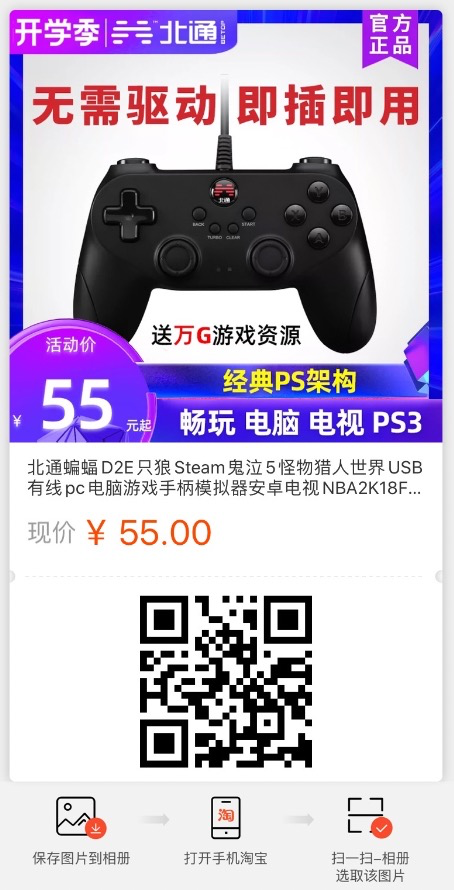

大家好，我是薛勤，终于到了周末，今天我来分享点好玩的！先看视频！

没错，我是在用游戏手柄玩 MacBook 上的魂斗罗游戏。除了游戏手柄花了 50 多块钱买的其余通通免费，游戏环境搭建步骤非常简单，所需资源包下载链接我也都会放在文末！你只需要有一台 Mac 笔记本。

首先，下载文末的资源包，一共有三个 zip 压缩包文件，如图所示。

nestopia：即 nes 游戏模拟器。下载解压运行 Nestopia.app 即可。官网：http://nestopia.sourceforge.net/

Emulator Enhancer：游戏手柄驱动包。下载解压后，将解压后的 rtf 文件和 Emulator Enhancer 文件夹全部移动到 `~/Library/Application Support` 目录下。官网：https://www.bannister.org/software/ee.htm

最后一个压缩包就是我分享给大家的 nes 游戏合集，运行  Nestopia.app 后就可以玩啦。

初次运行 Nestopia.app 记得点击左上角的 Preferences 打开设置面板，选择 input 选项卡，设置下游戏按键，支持键盘和游戏手柄键位设置。如图所示。Keyboard 是键盘按键，Device 是游戏手柄，先选择要设置的 Name，然后按下键盘就OK啦。

最后，给大家分享一款超级好用的游戏手柄，不需要安装任何驱动，即插即玩，支持 Win、Mac、Android 设备，而且价钱实惠。

>  资源包链接: https://pan.baidu.com/s/1zedBktaeZA0A3cq0DbVChQ  密码: 0jpp

