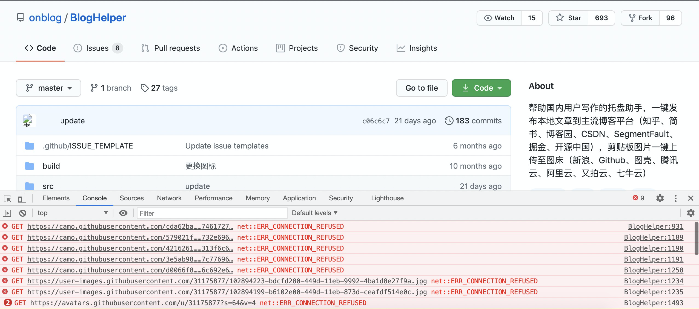
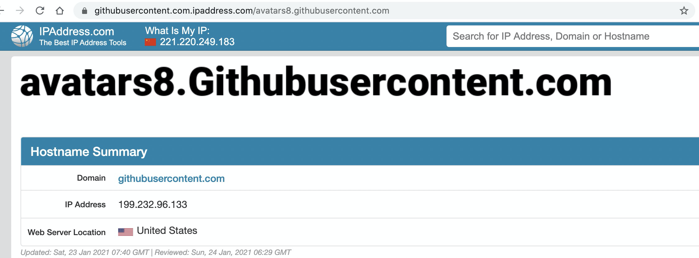
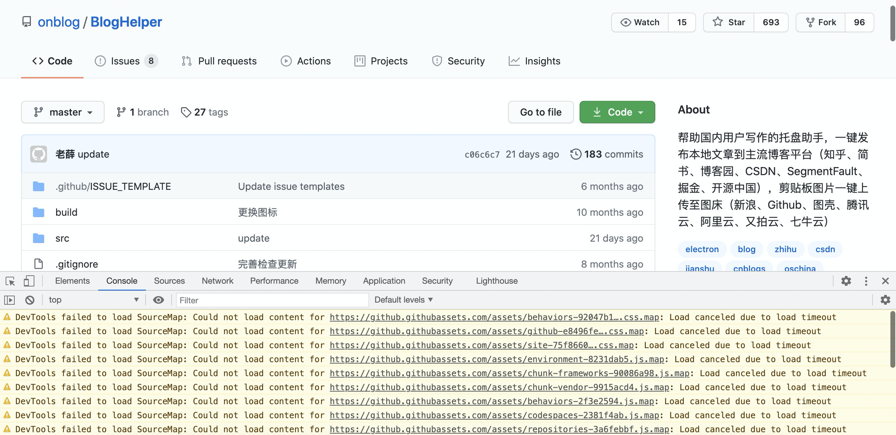

## 问题

不知道小伙伴们有没有遇到和我同样的问题，不知道从什么时候开始，访问Github再也看不到自己的头像了，也加载不出来README里的图片。

我考虑过是图片服务器被墙了，但是Github都没被墙，图片也不太可能。

于是我尝试着打控制台查看：



发现报错输出全是`ERR_CONNECTION_REFUSED`。

## 解决

于是，我进行了接下来的这几步神操作。

复制图片链接的网址，粘贴到<www.ipaddress.com>这个网站，查看到对应的ip地址：



将IP地址复制，修改本地hosts文件即可。

最后，再次访问Github，可以看到控制台已经没有红色的报错了。



## 成果

小伙伴们只需要把我下面整理好的复制到自己电脑hosts文件就可以。

```
151.101.184.133    assets-cdn.github.com
151.101.184.133    raw.githubusercontent.com
151.101.184.133    gist.githubusercontent.com
151.101.184.133    cloud.githubusercontent.com
151.101.184.133    camo.githubusercontent.com
151.101.184.133    avatars.githubusercontent.com
151.101.184.133    avatars0.githubusercontent.com
199.232.68.133     avatars0.githubusercontent.com
199.232.28.133     avatars1.githubusercontent.com
151.101.184.133    avatars1.githubusercontent.com
151.101.184.133    avatars2.githubusercontent.com
199.232.28.133     avatars2.githubusercontent.com
151.101.184.133    avatars3.githubusercontent.com
199.232.68.133     avatars3.githubusercontent.com
151.101.184.133    avatars4.githubusercontent.com
199.232.68.133     avatars4.githubusercontent.com
151.101.184.133    avatars5.githubusercontent.com
199.232.68.133     avatars5.githubusercontent.com
151.101.184.133    avatars6.githubusercontent.com
199.232.68.133     avatars6.githubusercontent.com
151.101.184.133    avatars7.githubusercontent.com
199.232.68.133     avatars7.githubusercontent.com
151.101.184.133    avatars8.githubusercontent.com
199.232.68.133     avatars8.githubusercontent.com
151.101.184.133    user-images.githubusercontent.com
```


