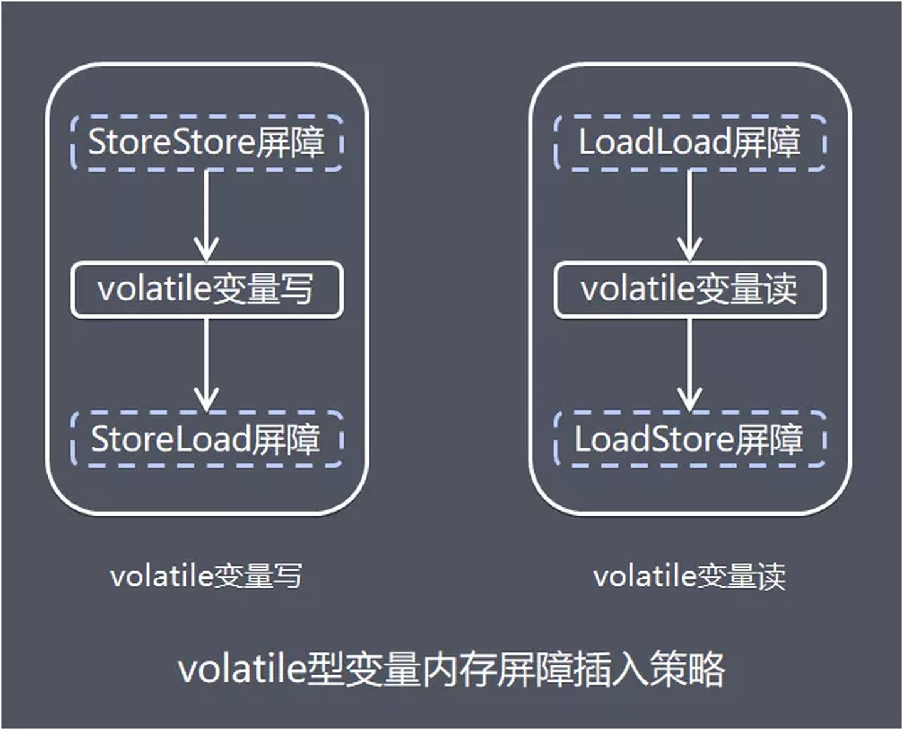

```
---
layout: post
title: 深入理解Java内存模型原理
date: 2021-02-07 16:00:00
author: 薛师兄
tags: Java,JVM
---
```

## 一、前言

“请说下你对 Java 的内存模型的了解”

这是一道非常容易答偏的问题。

因为很多人会回答为 Java 内存区域（即 Java 内存管理机制），然后把程序计数器、虚拟机栈、本地方法栈、Java堆和方法区等部分详细说一遍。

虽然网上很多文章也会出现笔误，但是幸运的你看到了这篇文章，以后再看到这种错误，就可以做到心里有数了。

言归正传，Java 内存模型究竟是啥？

## 二、内存模型产生的背景

### 2.1 缓存一致性问题

CPU处理器的运算速度很快，但是计算机内存的读写速度相比之下就很低。所以，在CPU处理器与内存之间不得不加一层读写速度尽可能接近处理器运算速度的高速缓存 （Cache）来作为内存与处理器之间的缓冲。

加了高速缓存之后，CPU就可以将运算使用到的数据复制到缓存中，当运算结束后再从缓存同步到内存，这样CPU处理器就无须等待缓慢的内存读写了。

如下图所示：


缓存的出现主要是为了解决CPU运算速度与内存读写速度不匹配的矛盾，但同时也增加了计算机系统的复杂度。它带来了一个非常明显的问题，就是“缓存一致性”。

从上面的图中可以看到，在多处理器系统中，每个处理器都有自己的高速缓存，而它们又共享同一主内存，如果多个处理器正在处理同一块主内存区域，那么同步到主内存时以谁的缓存数据为准呢？

为了解决“缓存一致性”问题，就需要各个处理器访问缓存时遵循一套协议，在读写时根据协议来进行操作。**所谓的 “Java 内存模型“ 中的内存模型就可以理解为对特定的内存或高速缓存进行读写访问的过程抽象。**

### 2.2 指令重排序问题

为了使得处理器内部的运算单元尽量被充分利用，提高运算效率，处理器可能会对输入的代码进行乱序执行（Out-Of-Order Execution）优化。

处理器会在计算之后将乱序执行的结果重组，乱序优化可以保证在单线程下该执行结果与顺序执行的结果是一致的，但不保证程序中各个语句计算的先后顺序与输入代码中的顺序一致。


乱序执行技术是处理器为提高运算速度而做出违背代码原有顺序的优化。在单核时代，处理器保证做出的优化不会导致执行结果远离预期目标，但在多核环境下却并非如此。

在多核环境下， 如果存在一个核的计算任务依赖另一个核计算任务的中间结果。

而且对相关数据读写没做任何防护措施，那么其顺序性并不能靠代码的先后顺序来保证，处理器最终得出的结果和我们逻辑得到的结果可能会大不相同。


以上图为例进行说明，CPU 的 core2 中的逻辑 B 依赖 core1 中的逻辑 A 先执行：

- 正常情况下，逻辑 A 执行完之后再执行逻辑 B。
- 在处理器乱序执行优化情况下，有可能导致 flag 提前被设置为 true，导致逻辑 B 先于逻辑 A 执行。

## 三、Java内存模型

**Java 虚拟机规范中试图定义一种 Java 内存模型（Java Memory Model, JMM）来屏蔽掉各种硬件和操作系统的内存访问差异，以实现让 Java 程序在各种平台下都能达到一致的内存访问效果。**

仔细品读这句话，我们可以知道，不同硬件和操作系统的内存访问存在差异，以往主流程序语言（如C/C++等）直接使用物理硬件和操作系统的内存模型，这就有可能导致程序在一套平台上并发完全正常，而在另外一套平台上并发访问却经常出错。

而 Java 要想实现跨平台特性就需要在此之上抽象出 Java 内存模型。程序员只需要面向 Java内存模型（也可以理解为 Java虚拟机）进行并发程序编写，而不需要考虑不同物理机的差异。

作为 Java 程序员，我们在编写程序时，根本不考虑操作系统是 Windows 还是 Linux 或 Mac。在刚接触 Java 时，听到最多的广告词就是编写一处、处处运行。那么 Java 是如何做的呢？其实是因为 Java 运行在虚拟机中，我们是面向虚拟机进行开发，而不是物理机。所以，对于物理机中的高速缓存、内存，在 Java 虚拟机中又是另一套说辞。

### 3.1 主内存和工作内存

**Java内存模型由主内存和工作内存组成，主要目标是定义程序中各个变量的访问规则，即在虚拟机中将变量存储到内存和从内存中取出变量这样的底层细节。**

此处的变量（Variables）与 Java 编程中所说的变量有所区别，它包括了实例字段、静态字段和构成数值对象的元素，但不包括局部变量与方法参数，因为后者是线程私有的，不存在并发问题。

**主内存**

Java 内存模型规定了所有变量都存储在主内存（Main Memory）中（此处的主内存与介绍物理硬件的主内存名字一样，两者可以互相类比，但此处仅是虚拟机内存的一部分）。

**工作内存**

每条线程都有自己的工作内存（Working Memory，又称本地内存，工作内存优先存储于寄存器和高速缓存中），线程的工作内存中保存了被该线程使用到的变量的主内存副本拷贝。

线程对变量的所有操作（读取、赋值等）都必须在工作内存中进行，而不能直接读写主内存中的变量。 不同的线程之间也无法直接访问对方工作内存中的变量，线程间变量值的传递均需要通过主内存来完成，线程、主内存、工作内存三者的交互关系如图：


### 3.2 内存间交互操作

#### 3.2.1 交互操作流程

为了更好理解内存的交互操作，以线程通信为例，我们看看具体如何进行线程间值的同步：


线程 1 和线程 2 都有主内存中共享变量 x 的副本，初始时，这 3 个内存中 x 的值都为 0。

线程 1 中更新 x 的值为 1 之后同步到线程 2 主要涉及两个步骤：

- 线程 1 把线程工作内存中更新过的 x 的值刷新到主内存中。
- 线程 2 到主内存中读取线程 1 之前已更新过的 x 变量。

从整体上看，这两个步骤是线程 1 在向线程 2 发消息，这个通信过程必须经过主内存。

JMM 通过控制主内存与每个线程本地内存之间的交互，来为各个线程提供共享变量的可见性。

#### 3.2.2 内存交互的基本操作

关于主内存与工作内存之间的具体交互协议，即一个变量如何从主内存拷贝到工作内存、如何从工作内存同步回主内存之类的实现细节，Java 内存模型中定义了下面 8 种操作来完成。

虚拟机实现时必须保证下面介绍的每种操作都是原子的，不可再分的（对于 double 和 long 型的变量来说，load、store、read、和 write 操作在某些平台上允许有例外）。


**8 种基本操作，如下图：**

- **lock (锁定) ，**作用于主内存的变量，它把一个变量标识为一条线程独占的状态。
- **unlock (解锁) ，**作用于主内存的变量，它把一个处于锁定状态的变量释放出来，释放后的变量才可以被其他线程锁定。
- **read (读取) ，**作用于主内存的变量，它把一个变量的值从主内存传输到线程的工作内存中，以便随后的 load 动作使用。
- **load (载入) ，**作用于工作内存的变量，它把 read 操作从主内存中得到的变量值放入工作内存的变量副本中。
- **use (使用) ，**作用于工作内存的变量，它把工作内存中一个变量的值传递给执行引擎，每当虚拟机遇到一个需要使用到变量的值的字节码指令时就会执行这个操作。
- **assign (赋值) ，**作用于工作内存的变量，它把一个从执行引擎接收到的值赋给工作内存的变量，每当虚拟机遇到一个给变量赋值的字节码指令时执行这个操作。
- **store (存储) ，**作用于工作内存的变量，它把工作内存中一个变量的值传送到主内存中，以便随后 write 操作使用。
- **write (写入) ，**作用于主内存的变量，它把 Store 操作从工作内存中得到的变量的值放入主内存的变量中。

#### 3.2.3 8种基本操作规则

Java内存模型还规定了在执行上述8种基本操作时必须满足如下规则：

- **规则 1：**如果要把一个变量从主内存中复制到工作内存，就需要按顺序的执行 read 和 load 操作，如果把变量从工作内存中同步回主内存中，就要按顺序的执行 store 和 write 操作。
  但 Java 内存模型只要求上述操作必须按顺序执行，而没有保证必须是连续执行。
- **规则 2：**不允许 read 和 load、store 和 write 操作之一单独出现。
- **规则 3：**不允许一个线程丢弃它的最近 assign 的操作，即变量在工作内存中改变了之后必须同步到主内存中。
- **规则 4：**不允许一个线程无原因的（没有发生过任何 assign 操作）把数据从工作内存同步回主内存中。
- **规则 5：**一个新的变量只能在主内存中诞生，不允许在工作内存中直接使用一个未被初始化（load 或 assign ）的变量。
  即对一个变量实施 use 和 store 操作之前，必须先执行过了 load 或 assign 操作。
- **规则 6：**一个变量在同一个时刻只允许一条线程对其进行 lock 操作，但 lock 操作可以被同一条线程重复执行多次，多次执行 lock 后，只有执行相同次数的 unlock 操作，变量才会被解锁。所以 lock 和 unlock 必须成对出现。
- **规则 7：**如果对一个变量执行 lock 操作，将会清空工作内存中此变量的值，在执行引擎使用这个变量前需要重新执行 load 或 assign 操作初始化变量的值。
- **规则 8：**如果一个变量事先没有被 lock 操作锁定，则不允许对它执行 unlock 操作；也不允许去 unlock 一个被其他线程锁定的变量。
- **规则 9：**对一个变量执行 unlock 操作之前，必须先把此变量同步到主内存中（执行 store 和 write 操作）。

### 3.3 Java内存模型的三大特性

Java内存模型是围绕着在并发过程中如何处理原子性、可见性和有序性这3个特征来建立的。

**原子性**

原子性，即一个操作或者多个操作要么全部执行并且执行的过程不会被任何因素打断，要么就都不执行。

即使在多个线程一起执行的时候，一个操作一旦开始，就不会被其他线程所干扰。

**可见性**

可见性是指当一个线程修改了共享变量的值，其他线程能够立即 得知这个修改。

Java内存模型是通过在变量修改后将新值同步回主内存，在变量读取前从主内存刷新变量值这种依赖主内存作为传递媒介的方式来实现可见性的。

**有序性**

Java 程序中天然的有序性可以总结为一句话：如果在本线程内观察，所有的操作都是有序的；如果在一个线程中观察另一个线程，所有的操作都是无序的。

Java 语言提供了 volatile 和 synchronized 两个关键字来保证线程之间操作的有序性，volatile 关键字本身就包含了禁止指令重排序的语义，而synchronized则是由“一个变量在同一个时刻 只允许一条线程对其进行lock操作”这条规则获得的，这条规则决定了持有同一个锁的两个同 步块只能串行地进入。

### 3.4 先行发生原则 happens-before

先行发生是Java内存模型中定义的两项操作之间的偏序关系，如果说操作A先行发生于操作B，其实就是说在发生操作B之前，操作A产 生的影响能被操作B观察到，“影响”包括修改了内存中共享变量的值、发送了消息、调用了方法等。

happens-before 关系的分析需要分为单线程和多线程的情况：

- **单线程下的 happens-before，**字节码的先后顺序天然包含 happens-before 关系：因为单线程内共享一份工作内存，不存在数据一致性的问题。
  在程序控制流路径中靠前的字节码 happens-before 靠后的字节码，即靠前的字节码执行完之后操作结果对靠后的字节码可见。但是并不代表前者一定在后者之前执行。因为如果后者不依赖前者的运行结果，那么它们可能会被重排序。
- **多线程下的 happens-before，**多线程由于每个线程有共享变量的副本，如果没有对共享变量做同步处理，线程 1 更新执行操作 A 共享变量的值之后，线程 2 开始执行操作 B，此时操作 A 产生的结果对操作 B 不一定可见。

为了方便程序开发，Java 内存模型实现了下述支持 happens-before 关系的操作：

- **程序次序规则，**一个线程内，按照代码顺序，书写在前面的操作 happens-before 书写在后面的操作。
- **锁定规则，**一个 unLock 操作 happens-before 后面对同一个锁的 lock 操作。
- **volatile 变量规则，**对一个变量的写操作 happens-before 后面对这个变量的读操作。
- **传递规则，**如果操作 A happens-before 操作 B，而操作 B 又 happens-before 操作 C，则可以得出操作 A happens-before 操作 C。
- **线程启动规则，**Thread 对象的 start() 方法 happens-before 此线程的每个一个动作。
- **线程中断规则，**对线程 interrupt() 方法的调用 happens-before 被中断线程的代码检测到中断事件的发生。
- **线程终结规则，**线程中所有的操作都 happens-before 线程的终止检测，我们可以通过 Thread.join() 方法结束、Thread.isAlive() 的返回值手段检测到线程已经终止执行。
- **对象终结规则，**一个对象的初始化完成 happens-before 它的 finalize() 方法的开始。

### 3.5 内存屏障

Java 中如何保证底层操作的有序性和可见性？可以通过内存屏障。

举个例子说明：

```
Store1; 
Store2;   
Load1;   
StoreLoad;  //内存屏障
Store3;   
Load2;   
Load3;
```

对于上面的一组 CPU 指令（Store 表示写入指令，Load 表示读取指令，StoreLoad 代表写读内存屏障），StoreLoad 屏障之前的 Store 指令无法与 StoreLoad 屏障之后的 Load 指令进行交换位置，即重排序。

但是 StoreLoad 屏障之前和之后的指令是可以互换位置的，即 Store1 可以和 Store2 互换，Load2 可以和 Load3 互换。

**常见有 4 种屏障：**

- **LoadLoad 屏障：**对于这样的语句 Load1；LoadLoad；Load2，在 Load2 及后续读取操作要读取的数据被访问前，保证 Load1 要读取的数据被读取完毕。
- **StoreStore 屏障：**对于这样的语句 Store1；StoreStore；Store2，在 Store2 及后续写入操作执行前，保证 Store1 的写入操作对其他处理器可见。
- **LoadStore 屏障：**对于这样的语句 Load1；LoadStore；Store2，在 Store2 及后续写入操作被执行前，保证 Load1 要读取的数据被读取完毕。
- **StoreLoad 屏障：**对于这样的语句 Store1；StoreLoad；Load2，在 Load2 及后续所有读取操作执行前，保证 Store1 的写入对所有处理器可见。它的开销是四种屏障中最大的（冲刷写缓冲器，清空无效化队列）。在大多数处理器的实现中，这个屏障是个万能屏障，兼具其他三种内存屏障的功能。

### 3.6 对volatile型变量的特殊规则

volatile 主要有下面 2 种语义：

- **保证可见性**
- **禁止进行指令重排序**

保证可见性，保证了不同线程对该变量操作的内存可见性。具体一点解释：

- 线程对变量进行修改之后，要立刻回写到主内存。
- 线程对变量读取的时候，要从主内存中读，而不是从线程的工作内存。

如果多个线程同时把更新后的变量值同时刷新回主内存，可能导致得到的值不是预期结果。

禁止进行指令重排序，具体一点解释，禁止重排序的规则如下：

- 当程序执行到 volatile 变量的读操作或者写操作时，在其前面的操作的更改肯定全部已经进行，且结果已经对后面的操作可见；在其后面的操作肯定还没有进行。
- 在进行指令优化时，不能将 volatile 变量前面的语句放在其后面执行，也不能把 volatile 变量后面的语句放到其前面执行。

**volatile 型变量实现原理**



具体实现方式是在编译期生成字节码时，会在指令序列中增加内存屏障来保证，下面是基于保守策略的 JMM 内存屏障插入策略：

- **在每个 volatile 写操作的前面插入一个 StoreStore 屏障。**该屏障除了保证了屏障之前的写操作和该屏障之后的写操作不能重排序，还会保证了 volatile 写操作之前，任何的读写操作都会先于 volatile 被提交。
- **在每个volatile 写操作的后面插入一个 StoreLoad 屏障。**该屏障除了使 volatile 写操作不会与之后的读操作重排序外，还会刷新处理器缓存，使 volatile 变量的写更新对其他线程可见。
- **在每个 volatile 读操作的后面插入一个 LoadLoad 屏障。**该屏障除了使 volatile 读操作不会与之前的写操作发生重排序外，还会刷新处理器缓存，使 volatile 变量读取的为最新值。
- **在每个 volatile 读操作的后面插入一个 LoadStore 屏障。**该屏障除了禁止了 volatile 读操作与其之后的任何写操作进行重排序，还会刷新处理器缓存，使其他线程 volatile 变量的写更新对 volatile 读操作的线程可见。

### 3.7 对于long和double型变量的特殊规则

Java 内存模型要求 lock、unlock、read、load、assign、use、store、write 这 8 种操作都具有原子性。

但是对于 64 位的数据类型(long 和 double)，在模型中特别定义相对宽松的规定：允许虚拟机将没有被 volatile 修饰的 64 位数据的读写操作分为 2 次 32 位的操作来进行。

也就是说虚拟机可选择不保证 64 位数据类型的 load、store、read 和 write 这 4 个操作的原子性。

由于这种非原子性，有可能导致其他线程读到同步未完成的“32 位的半个变量”的值。

不过实际开发中，Java 内存模型强烈建议虚拟机把 64 位数据的读写实现为具有原子性。

目前各种平台下的商用虚拟机都选择把 64 位数据的读写操作作为原子操作来对待，因此我们在编写代码时一般不需要把用到的 long 和 double 变量专门声明为 volatile。

## 四、总结

记得在学习 Java 虚拟机的时候，对于 Java 内存模型没有细看，后面继续学习 Java 并发编程，了解了 volatile、synchronized，但是不明白为什么会有这些规则，导致后面在面试时吃了很多亏。

## 参考

- 《深入理解Java虚拟机》周志明
- 《Java内存模型原理，你真的理解吗？》 陈彩华