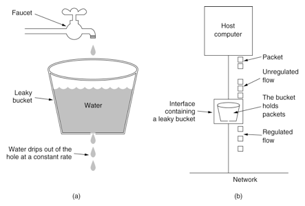

## 前言

“讲一下你对限流的了解”

面试遇到限流的问题，很多人会千篇一律的回答“令牌桶”、“漏桶”算法，但是真正研究过限流的人可不会对你这种回答满意。今天薛师兄就带你飞，教你如何在回答“限流”问题上脱颖而出！

## 限流算法分析

### 漏桶算法

漏桶算法思路很简单，水（请求）先进入到漏桶里，漏桶以一定的速度出水，当水流入速度过大会直接溢出，可以看出漏桶算法能强行限制数据的传输速率。

但是这种算法的弊端是不支持某种程度上的流量突发情况，所以更多时候我们是选择“令牌桶算法”。

### 令牌桶算法

令牌桶算法的原理是系统会以一个恒定的速度往桶里放入令牌，而如果请求需要被处理，则需要先从桶里获取一个令牌，当桶里没有令牌可取时，则拒绝服务。

### 固定时间窗口算法

以统计 QPM （每分钟查询率）为例，我们设置每分钟允许通过的请求次数为 60 ，那么每 60 秒的时间窗口最大只能接收 60 个请求，如下图所示：

这是一种最简单的统计方式，即统计每一个时间窗口的**计数**，但这种方式的缺点是什么？

如果在 50 秒到 60 秒之间来了 60 个请求，在 60 秒到 110 秒之间又来了 60 个请求，那么在 50 秒到 110 秒这 1 分钟的时间段就会允许  120 个请求通过，这根本不满足我们定义的规则：即每分钟允许通过 60 个请求。该过程如下图所示：

### 滑动时间窗口算法

如何解决固定时间窗口算法的临界问题？

我们可以将一个时间窗口分割为多个时间窗口，使窗口指针随着时间往后移动。

如上图所示，我们将 1 分钟大小的时间窗口分割为 2 个窗口，每个时间窗口各占 30 秒。其中一个指针指向当前时间所属的时间窗口， 另一个指针指向下一个时间窗口。

初始时，w1 指向 [0，30) 时间窗口，w2 指向 [30, 60) 时间窗口。时间不断往后走，过了 30 秒后，w2 依旧指向 [30, 60) 时间窗口，w1 的计数清零，重新指向 [60, 90) 时间窗口。以此往复，以实现窗口滑动。用 w1 + w2 两个时间窗口的计数之和进行限流次数统计，这样就解决了固定时间窗口的临界流量问题。

## 课后作业

在学习了四种限流算法的原理后，亲爱的读者们有没有兴趣实现一下代码呢！

